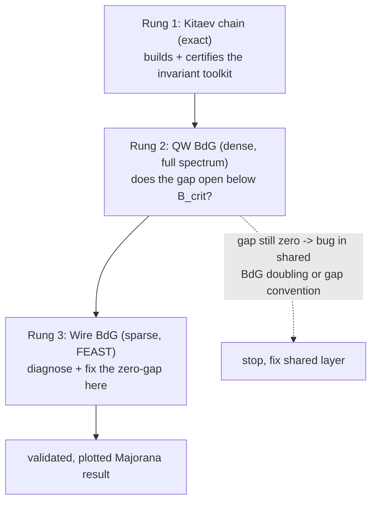

# BdG/Majorana ground-up validation and observable coverage

## Summary

A ground-up validation and observable-coverage pass on the BdG/Majorana subsystem, run as a three-rung ladder — Kitaev chain, dense QW BdG path, sparse Rashba wire — each certified by analytical closed-forms plus internal invariants we build along the way (Pfaffian Majorana number, Majorana polarization). It culminates in a revamped topological-superconductivity lecture that replaces the silently-broken benchmark claims with corrected, plotted, validated results and the new observables.

---

## Problem Frame

The BdG/Majorana machinery is assembled and unit-tested for matrix structure — dimension doubling, Hermiticity, ±E particle-hole pairing — but the headline Majorana result is silently broken. The figure the lecture marks "PASS, B_crit≈1.22 T" has an identically zero minigap for every field from 0 to 10 T (`docs/lecture/figures/rashba_majorana_phase_diagram.txt`); the gap never opens or closes, and three different B_crit values circulate across the docs. The unit tests pass because they check matrix structure, not physics outcome.

Two structural gaps explain why nothing catches this. The class-D BdG/Majorana path has no real topological invariant (the class-AII QSHE path already has a proper Fu-Kane parity invariant this effort must not displace); the "Z2" in the code is gap-closing-counting heuristics, not Kitaev's Majorana number. And the two BdG builders construct the hole block differently, a physics-sign inconsistency that is itself a candidate cause of the zero gap. (A second candidate — a strain-omission bug in the wire BdG/spectral paths — was fixed on the implementation branch by the `strain-aware wire setup type` change after this doc was written; the headline artifact predates that fix and must be re-characterized against the current tree.) Beyond correctness, the canonical Majorana observables a researcher expects — Majorana polarization, a BdG spectral function, a BdG LDOS showing the zero-energy peak, a phase diagram from a true invariant — are absent or run on the normal-state Hamiltonian rather than BdG.

The cost shape: the topological track is the codebase's stated differentiator, and its flagship result cannot currently be trusted or demonstrated. Most of this effort closes verification items (BCS gap, PHS check, Rashba phase boundary, localization length) that the original design doc scoped but never enforced on landing; the Pfaffian invariant is the one genuinely new piece.

---

## Key Decisions

- **Ground-up ladder, dense before sparse.** Validate on the exactly-solvable Kitaev chain first, then the dense QW path, then the sparse/FEAST wire path. The dense-before-sparse ordering doubles as a diagnostic bisection of the zero-gap failure.
- **Medium verification bar.** Certify each rung with analytical closed-forms plus the newly-built internal invariants as independent witnesses, rather than extending the kdotpy pipeline to BdG. Self-contained; relies on multiple witnesses agreeing.
- **Lecture 13 as the acceptance surface.** The topological-superconductivity lecture companion script is this project's integration-test vehicle, so the revamp is where corrected results and new observables land and get asserted — not a separate documentation task.
- **Hole-block convention derived from the physical PHS definition.** Resolve the inconsistency by deriving the hole block from the correct particle-hole-conjugation operator for the 8-band basis — fixed by the BdG particle-hole-symmetry constraint `C H_BdG C⁻¹ = −H_BdG`, with `C` built from the existing Kramers pairing — applied identically in both builders and verified by a symmetry test, not by assuming a textbook form. Physical time-reversal is broken by the Zeeman field in the topological regime (class D); the constraint that fixes the hole block is PHS, which is intrinsic to BdG.

---

## Requirements

### Correctness toolkit

R1. Implement Kitaev's Majorana number — the Pfaffian-based Z2 topological invariant evaluated at particle-hole-invariant momenta — as the real topological invariant for the class-D BdG path (leaving the existing class-AII Fu-Kane parity invariant for QSHE untouched), replacing the gap-closing-counting heuristics currently labelled "Z2".

R2. Implement Majorana polarization (the electron/hole sector imbalance of a near-zero mode) to distinguish true Majorana zero modes from generic near-zero states.

R3. Derive the BdG hole block from the correct particle-hole-conjugation operator for the 8-band basis, fixed by the particle-hole-symmetry constraint, and apply it identically in the wire and QW builders — closing the convention divergence between them rather than assuming a textbook form.

**Status (2026-06-27):** Reprioritized by U1 (2026-06-15). R3 is real but tertiary — the wire builder's `-H0^T` and QW builder's `-conjg(H(-k))` both claim PHS via different mechanisms, and a numerical cross-check (`test_bdg_phs_at_finite_bx`) confirms PHS holds at finite Bx. R3 verification gap closed by PR40 C8.

R4. Add a cross-builder consistency check (the CSR and dense hole blocks yield identical spectra for the same input — the genuine gap, since each builder already has its own per-builder particle-hole-symmetry test) and verify `C H_BdG C⁻¹ = −H_BdG` numerically with and without Zeeman and Peierls.

### Validation ladder

R5. Build a minimal spinless p-wave Kitaev-chain harness, separate from the 8-band s-wave builder, and certify the toolkit against closed-form results (Majorana number, gap, phase boundary |μ|=2t, localization length).

R6. Certify the dense QW BdG path: ±E particle-hole pairing, minigap opening below B_crit, Pfaffian flip at the transition, and edge-localized MZMs with polarization near unity.

R7. Diagnose and fix the zero-gap failure on the sparse wire path, using the dense QW rung as the bisection control — this rung presupposes that R3 and R6 have landed and passed AE4 on both builders, so the dense path is a certified control — then certify the wire BdG spectrum across the phase transition.

### Observable coverage

R8. Compute the BdG spectral function A(k,E) and BdG LDOS on the BdG Hamiltonian (not the normal-state one), exposing the zero-energy Majorana peak.

R9. Compute the bulk minigap as a minimum over the BZ and produce the (B, μ) phase diagram from the Pfaffian invariant, driving the existing `wire_bdg`/`qw_fukane` sweep paths (which run today on the gap-closing heuristic) with the real invariant.

### Documentation and verification

R10. Revamp the topological-superconductivity lecture (doc, companion script, figures) to present the corrected, validated results and the new observables, replacing the false benchmark claims, and reconcile every B_crit occurrence across the repo (lecture 13, the QW summary, the archived verification spec) against the single validated value.

R11. Make the companion script's PASS/FAIL assertions the acceptance gate for the corrected analytical results — with the lecture status table regenerated from the script's machine-readable output rather than hand-edited, so the drift that produced the false PASS cannot recur — and add `# COVERAGE:` annotations, the corresponding cells in `tests/integration/validation_universe.yml`, and unit and integration tests for every new observable.

---

## Acceptance Examples

- AE1. Kitaev chain, μ swept across the phase boundary.
  - **Covers R1, R5.**
  - **When |μ| < 2t:** Majorana number M = −1 (topological), gap = |Δ|, two end-localized MZMs.
  - **When |μ| > 2t:** M = +1 (trivial), no end modes, gap open.
- AE2. QW/wire, B swept across B_crit.
  - **Covers R6, R7, R9.**
  - **Below B_crit:** trivial, M = +1, gap open, no MZMs.
  - **At B_crit:** minigap closes to zero, M flips sign.
  - **Above B_crit:** topological, M = −1, gap reopens, end-localized MZMs with polarization ≈ 1.
- AE3. The Rashba wire phase-diagram data after the fix.
  - **Covers R7.**
  - **Before:** min_gap = 0 for all B (identically broken).
  - **After:** min_gap traces an open → close → reopen curve, nonzero away from B_crit.
- AE4. The rebuilt BdG Hamiltonian, both builders, with and without Zeeman and Peierls.
  - **Covers R3, R4.**
  - **PHS constraint:** `C H_BdG C⁻¹ = −H_BdG` holds to numerical precision.
  - **Consequence:** the wire and QW hole blocks are constructed identically.

---

## Success Criteria

- Each rung reproduces its analytical closed-form within a stated tolerance.
- The rebuilt BdG Hamiltonian satisfies the PHS constraint `C H_BdG C⁻¹ = −H_BdG` to numerical precision for both builders, with and without Zeeman and Peierls.
- At every phase transition, the internal witnesses agree: minigap closes, Pfaffian flips, MZMs localize, polarization tends to unity.
- The all-zero Rashba phase-diagram data is gone — the stale artifact regenerated in the fix commit, with a regression test asserting a non-zero minigap below B_crit so the all-zero failure cannot silently return — and the lecture benchmark table reports an honest validated B_crit.
- Every new observable carries a unit test and an integration or lecture assertion with a `# COVERAGE:` annotation.

---

## Scope Boundaries

### Deferred for later

- Zero-bias tunneling conductance (dI/dV) and fractional Josephson 4π — canonical experimental Majorana signatures, but they need transport infrastructure (multi-channel Landauer / BTK; junction geometry) beyond this round.
- kdotpy BdG cross-validation — the existing 12-test pipeline does not cover BdG; deliberately not extended at the Medium bar.

### Outside this effort's identity

- Self-consistent gap Δ, p-wave pairing, Floquet, Keldysh, disorder, multi-terminal Josephson, and Landau levels — all already listed out of scope in the original design (`docs/plans/archive/2026-04-27-bdg-topological-superconductivity-design.md`). Landau levels remain blocked on Peierls-in-bulk, a separate pending issue.
- The other 14 lectures stay untouched; the revamp is lecture 13 only.

---

## Dependencies and Assumptions

- The all-zero gap is a bug to fix, not an accepted result; the checked-in "PASS" is treated as invalid.
- Plotting follows project convention: Fortran writes `.dat`, Python plots.
- The Kitaev rung is a separate minimal harness because the 8-band s-wave builder cannot express spinless p-wave.
- The normal-state QW and wire Hamiltonian paths are trusted as the H₀ input (cross-validated against kdotpy elsewhere); the suspect is the BdG doubling and the observable layer.
- The hole-block derivation touches approval-gated Hamiltonian-construction code and needs explicit sign-off; the convention is fixed by the PHS constraint and its symmetry test, not chosen a priori.
- Before the ladder design is locked, run the sparse wire BdG matrix through a dense eigensolver at one B point and compare to FEAST: if dense returns a finite minigap and FEAST returns zeros, the root cause is the eigensolve/energy-window and the premise (suspect = BdG doubling) must be revised; if both return zeros, the BdG-doubling premise holds.

---

## Outstanding Questions

### Deferred to planning

- How to integrate the Kitaev harness — a standalone test module versus a new config-driven mode.
- The concrete representation of the particle-hole operator `C` and the resulting hole-block formula, which fall out of the R3 derivation and are pinned by the R4 symmetry test.
- The FEAST energy-window strategy for the sparse wire path, a prime zero-gap suspect.
- The per-rung figure inventory and which new observable plots the lecture renders.
- External/second-code BdG cross-validation as the follow-on needed to convert these validated results into the published-validation metric STRATEGY.md tracks (kdotpy has no BdG API; a literature anchor or a second code is the gap the Medium bar leaves).

---

## Sources and Research

Code, verified against the current tree:

- All-zero headline data: `docs/lecture/figures/rashba_majorana_phase_diagram.txt`.
- False "PASS, B_crit≈1.22 T": `docs/lecture/13-topological-superconductivity.md`.
- BdG assembly and hole-block inconsistency (wire no-conjugation vs QW `-conjg(H(-k))`): `src/physics/bdg_hamiltonian.f90`.
- Heuristic "Z2" and the `bhz_analytic`-only restriction in `compute_z2_gap_sweep` (`stop 1` for other models): `src/physics/topological_analysis.f90`; the `wire_bdg`/`qw_fukane` sweep paths themselves are implemented in `src/apps/main_topology.f90` (`compute_qw_fukane_gap_sweep`, `compute_wire_bdg_gap_sweep`, `eval_wire_bdg_gap_app`) but drive the heuristic invariant.
- Spectral function and LDOS running on the normal-state Hamiltonian: `src/physics/green_functions.f90`.
- Hardcoded `0.001·δ₀` MZM threshold: `src/apps/main_topology.f90`.
- Design intent and out-of-scope list: `docs/plans/archive/2026-04-27-bdg-topological-superconductivity-design.md`.
- Nambu and pairing contract: `src/physics/AGENTS.md`.

Physics references:

- Kitaev 2001 — Majorana number / Pfaffian invariant.
- Sticlet et al. 2014 — Majorana polarization.
- Lutchyn–Oreg — Rashba-wire topological phase criterion and B_crit.
- Altland–Zirnbauer symmetry classes (class D) — the BdG particle-hole-symmetry constraint that fixes the hole block.
