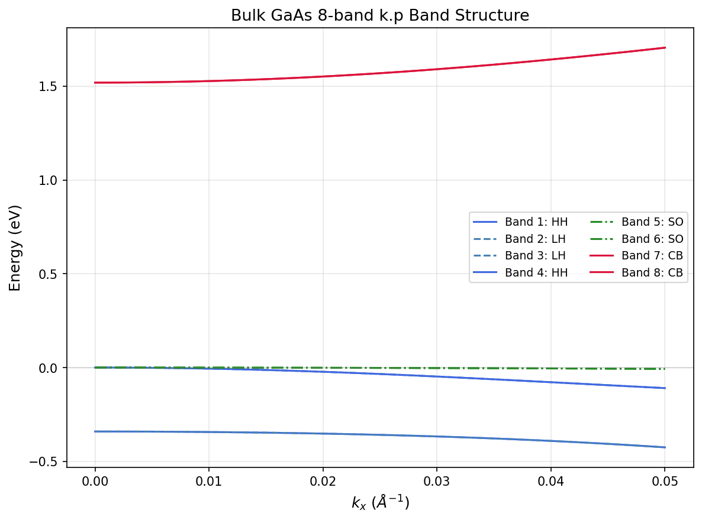

# Chapter 00: Quickstart Guide

This chapter gets you from zero to your first calculations in under five
minutes. We build the code, run a bulk GaAs band-structure sweep and a
g-factor calculation, and walk through every line of output so you know
exactly what the numbers mean.

If you hit a snag, jump straight to [Section 7: Common Issues](#7-common-issues).

---

## 1. Prerequisites

| Package | Minimum version | How to check |
|---|---|---|
| GNU Fortran (`gfortran`) | 9.x | `gfortran --version` |
| Intel MKL | 2019 or later | `ls $MKLROOT/lib/cmake/mkl` |
| CMake | 3.15 | `cmake --version` |
| Ninja (optional) | any | `ninja --version` |
| FFTW3 | 3.x | `pkg-config --cflags fftw3` |

### Environment setup

MKL must be discoverable via the `MKLROOT` environment variable. If you use
Intel's `setvars.sh` or oneAPI installer, `MKLROOT` is set automatically.
Otherwise, export it yourself:

```bash
export MKLROOT=/opt/intel/oneapi/mkl/latest    # adjust path to your install
```

FFTW3 headers are needed at compile time only. On Debian/Ubuntu:

```bash
sudo apt install libfftw3-dev
```

On Arch/Manjaro:

```bash
sudo pacman -S fftw
```

---

## 2. Clone and Build

Three commands:

```bash
git clone <repository-url> 8bandkp-fdm
cd 8bandkp-fdm
cmake -G Ninja -B build -DMKL_DIR=$MKLROOT/lib/cmake/mkl
cmake --build build
```

If you prefer Makefiles over Ninja, drop the `-G Ninja` flag.

When the build succeeds you will find two executables:

```
build/src/bandStructure        # band-structure sweeps
build/src/gfactorCalculation   # Landau g-factor at Gamma
```

Both read the same `input.toml` format (TOML). We will use `bandStructure` in
Section 3 and `gfactorCalculation` in Section 4. For the full input schema, see [`docs/reference/input-reference.md`](../reference/input-reference.md).

---

## 3. First Run: Bulk GaAs

The program reads its input from a file called `input.toml` in the project root.
Create it with the following contents:

```toml
confinement = "bulk"
FDorder = 2
fd_step = 101

[wave_vector]
mode = "kx"
max = 0.1
nsteps = 11

[bands]
num_cb = 2
num_vb = 6

[[material]]
name = "GaAs"
```

**What this input means:**

| Parameter | Value | Meaning |
|---|---|---|
| `confinement` | `"bulk"` | Bulk mode: 8x8 Hamiltonian |
| `fd_step` | `101` | Ignored in bulk; code forces it to 1; used by the grid system for QW mode |
| `FDorder` | `2` | Finite-difference order (irrelevant for bulk) |
| `[wave_vector] mode` | `"kx"` | Sweep along the [100] direction |
| `[wave_vector] max` | `0.1` | Maximum k in 1/Angstrom |
| `[wave_vector] nsteps` | `11` | Number of k-points (including k=0) |
| `[bands] num_cb` | `2` | Request 2 conduction-band eigenvalues |
| `[bands] num_vb` | `6` | Request 6 valence-band eigenvalues |
| `[[material]] name` | `"GaAs"` | Gallium arsenide from the built-in database |

Now run the program:

```bash
./build/src/bandStructure
```

### 3.1 Standard output

The program prints a summary of parsed parameters followed by the material
database entry for GaAs. The material parameters block shows the Kane energy
$E_P = 28.8$ eV, the interband momentum matrix element $P = \sqrt{E_P \cdot \hbar^2/(2m_0)}
\approx 10.48$ eV-Angstrom, and the Luttinger parameters $\gamma_1$, $\gamma_2$,
$\gamma_3$. These are the Vurgaftman 2001 values for GaAs.

The "Warning" about `fdStep` is harmless: bulk mode solves an 8x8 matrix at
each k-point and does not use finite differences, so the grid system returns
1 point regardless of the `fd_step` value. Output file: `output/eigenvalues.dat`

The program writes eigenvalues to `output/eigenvalues.dat`. The first few lines
look like this:

```
 #k, values
    0.00000      -0.341000      -0.341000       -0.00000       -0.00000       -0.00000       -0.00000        1.51900        1.51900
   0.100000E-01  -0.343693      -0.343693      -0.585596E-02  -0.585596E-02  -0.286000E-03  -0.286000E-03    1.52723        1.52723
   0.200000E-01  -0.352123      -0.352123      -0.226020E-01  -0.226020E-01  -0.114400E-02  -0.114400E-02    1.55146        1.55146
```

**Column format:**

| Column | Content |
|---|---|
| 1 | Wave vector $k$ in 1/Angstrom |
| 2--9 | Eight eigenvalues in eV, sorted from lowest to highest |

The file has 12 rows: a header line (`#k, values`) plus 11 k-points (the
`waveVectorStep` value).

---

## 4. Second Run: Bulk GaAs g-Factor

The second executable, `gfactorCalculation`, computes Landau g-factors at the
Gamma point ($\mathbf{k} = 0$) using second-order Lowdin partitioning. It reads
the same `input.toml` format with two extra parameters.

Replace the contents of `input.toml` with:

```toml
confinement = "bulk"
FDorder = 2
fd_step = 1
which_band = 0
band_idx = 1

[wave_vector]
mode = "k0"
max = 0.0
nsteps = 1

[bands]
num_cb = 2
num_vb = 6

[[material]]
name = "GaAs"
```

**New parameters:**

| Parameter | Value | Meaning |
|---|---|---|
| `[wave_vector] mode` | `"k0"` | Fixed at the Gamma point |
| `[wave_vector] nsteps` | `1` | No sweep -- single-point calculation |
| `which_band` | `0` | Conduction band (1 = valence) |
| `band_idx` | `1` | First conduction subband |

Run:

```bash
./build/src/gfactorCalculation
```

### 4.1 Output

The program prints the spin matrices, a $2 \times 2$ g-tensor for each
Cartesian direction, and the resulting g-factor eigenvalues:

```
 tensor
   0.0000   -0.0000   0.1575   -0.0000
   0.1575   -0.0000   0.0000   -0.0000

   0.0000   -0.0000   0.0000    0.1575
   0.0000   -0.1575   0.0000   -0.0000

   0.1575   -0.0000   0.0000   -0.0000
   0.0000   -0.0000  -0.1575   -0.0000
 gx
   0.0000000000000000
  -0.31500390136823286
 gy
   0.0000000000000000
  -0.31500390136823286
 gz
   0.0000000000000000
  -0.31500390136822709
```

The file `output/gfactor.dat` contains three values — the g-factor along $x$,
$y$, and $z$:

```
 -0.31500390136823286      -0.31500390136823286      -0.31500390136822709
```

All three components are equal ($g^* \approx -0.315$) because bulk GaAs has
cubic symmetry. This is the 8-band k.p result; the experimental value of
$g^* = -0.44$ includes remote-band contributions beyond the 8-band model.

---

## 5. Interpreting the Output

### 5.1 Eigenvalues at the Gamma point (k = 0)

Focusing on the first data row (k = 0):

| Band index | Eigenvalue (eV) | Identity |
|---|---|---|
| 1 | -0.341 | Split-off hole (SO), spin down |
| 2 | -0.341 | Split-off hole (SO), spin up |
| 3 | 0.000 | Heavy hole (HH), spin up |
| 4 | 0.000 | Light hole (LH), spin up |
| 5 | 0.000 | Light hole (LH), spin down |
| 6 | 0.000 | Heavy hole (HH), spin down |
| 7 | +1.519 | Conduction band (CB), spin down |
| 8 | +1.519 | Conduction band (CB), spin up |

Three features to notice:

1. **Band gap.** The valence-band top (HH/LH at 0.000 eV) and the conduction-band
   bottom (CB at +1.519 eV) are separated by exactly the GaAs band gap
   $E_g = 1.519$ eV. This confirms the code is using Vurgaftman's published
   value.

2. **Spin-orbit splitting.** The split-off bands sit at $-0.341$ eV, which is
   $\Delta_{\text{SO}} = 0.341$ eV below the valence-band edge. Again, this is
   the accepted GaAs value.

3. **HH/LH degeneracy at Gamma.** The four valence bands (HH and LH, both spins)
   are all exactly degenerate at k = 0. This is a consequence of the
   $\Gamma_8$ irreducible representation of the zincblende point group. The
   degeneracy lifts as soon as k departs from zero.

### 5.2 The full dispersion

The following figure shows all eight bands across the full k-range:


*Figure 1: Bulk GaAs 8-band E(k) dispersion along [100], computed with the
input above. The conduction band (upper curve) has a small effective mass
($m^* \approx 0.067\,m_0$), so it curves gently. The heavy-hole band is
nearly flat (large effective mass). The light-hole band has a much smaller
effective mass and bends away more quickly.*

---

## 6. Next Steps

Now that you have a working build and understand the output format, you can
explore further:

| If you want to... | Read... |
|---|---|
| Understand the 8-band Hamiltonian and why the bands look like this | [Chapter 01: Bulk Band Structure](01-bulk-band-structure.md) |
| Simulate a quantum well with confinement and subbands | [Chapter 02: Quantum Well](02-quantum-well.md) |
| Visualize wavefunctions and probability densities | [Chapter 03: Wavefunctions](03-wavefunctions.md) |
| Simulate a quantum wire with 2D confinement | [Chapter 08: Quantum Wire](08-quantum-wire.md) |
| Add a self-consistent Schrodinger-Poisson loop | [Chapter 07: Self-Consistent SP](07-self-consistent-sp.md) |
| Compute Landau g-factors | [Chapter 05: g-Factor](05-gfactor.md) |
| Understand the finite-difference machinery | [Chapter 09: Numerical Methods](09-numerical-methods.md) |

The remaining input files in `tests/regression/configs/` are ready-to-run
examples for quantum wells, quantum wires, g-factors, self-consistent calculations, and more.
Copy any of them to `input.toml` and re-run `./build/src/bandStructure`.

---

## 7. Common Issues

### Stale `.mod` files

If you see type-mismatch errors like `Symbol 'some_type' at (1) has no IMPLICIT
type`, old `.mod` files in the project root may be shadowing the fresh ones in
`build/`. Fix:

```bash
rm -f *.mod
cmake --build build
```

### MKL not found

CMake error: `Could not find MKL`. Make sure `MKLROOT` points to a valid MKL
installation and pass the cmake hint:

```bash
cmake -G Ninja -B build -DMKL_DIR=$MKLROOT/lib/cmake/mkl
```

If you do not have Intel MKL installed, see Intel's oneAPI documentation for
your distribution.

### OMP library not found

CMake error: `OMP_LIBRARY has an invalid value "OMP_LIBRARY-NOTFOUND"`. This
occurs when MKL is configured for `intel_thread` threading but Intel's OpenMP
runtime (`libiomp5`) is not installed. If you use gfortran without the Intel
compiler suite, switch MKL to sequential threading:

```bash
cmake -G Ninja -B build -DMKL_DIR=$MKLROOT/lib/cmake/mkl -DMKL_THREADING=sequential
```

### FFTW3 missing

CMake error: `Could not find FFTW3`. Install the development headers:

```bash
# Debian / Ubuntu
sudo apt install libfftw3-dev

# Arch / Manjaro
sudo pacman -S fftw

# Fedora
sudo dnf install fftw-devel
```

### Build directory is stale

If you switch compilers or change the MKL path, a clean reconfigure is safest:

```bash
rm -rf build
cmake -G Ninja -B build -DMKL_DIR=$MKLROOT/lib/cmake/mkl
cmake --build build
```

### Wrong number of eigenvalues

The code returns `num_cb + num_vb` eigenvalues. For bulk (8-band), the maximum
is 8. Requesting `num_cb = 2, num_vb = 6` gives all eight bands. Requesting fewer
(e.g., `num_cb = 1, num_vb = 3`) returns only the four lowest eigenvalues. If you
need all bands, keep the sum at 8.

### No `output/` directory

The program creates `output/` automatically on first run. If for some reason it
does not (permissions issue), create it manually:

```bash
mkdir -p output
```

---

## Verification

This lecture's derivations can be verified by running the executable lecture-test pair:

```bash
make lecture-00
```

or directly:

```bash
python3 scripts/lecture_00_quickstart.py
```

### Code-Output Anchors

Running `bulk_gaas_k0.toml` produces:
- **8 eigenvalues**: 2x SO at -0.341 eV, 4x HH/LH at 0 eV, 2x CB at 1.519 eV (matches Vurgaftman parameters exactly)
- **Band gap**: Eg = 1.519 eV; **Spin-orbit splitting**: Delta_SO = 0.341 eV


