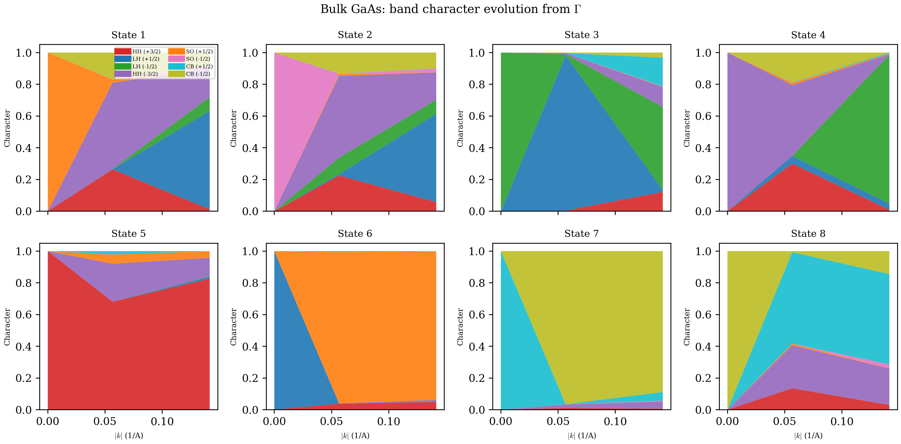

# Chapter 01: Bulk Band Structure with the 8-Band k.p Method

## 1. Theory

### 1.1 Bloch's Theorem and the Crystal Lattice

In a perfect semiconductor crystal, the potential experienced by an electron is
periodic with the lattice. Bloch's theorem tells us that the eigenstates of the
single-particle Hamiltonian in such a periodic potential can be written as

$$
\psi_{n\mathbf{k}}(\mathbf{r}) = e^{i\mathbf{k}\cdot\mathbf{r}} \, u_{n\mathbf{k}}(\mathbf{r}),
$$

where $n$ is the band index, $\mathbf{k}$ is a wave vector in the first
Brillouin zone, and $u_{n\mathbf{k}}(\mathbf{r})$ has the periodicity of the
lattice: $u_{n\mathbf{k}}(\mathbf{r}+\mathbf{R}) = u_{n\mathbf{k}}(\mathbf{r})$
for any lattice vector $\mathbf{R}$.

The full electronic band structure $E_n(\mathbf{k})$ requires solving this
eigenvalue problem across the entire Brillouin zone. For most device physics
applications, however, we only need the band structure near the **zone center**
(the $\Gamma$ point, $\mathbf{k}=0$). This is where the **k.p method** becomes
powerful.

### 1.2 The k.p Perturbation Expansion

The central idea of the k.p method is to treat the $\mathbf{k}$-dependent part
of the crystal Hamiltonian as a perturbation around $\mathbf{k}=0$. Starting
from the $\mathbf{k}\cdot\mathbf{p}$ Hamiltonian (see, e.g., Kane 1957 or
Winkler 2003), we write:

$$
H_{\mathbf{k}} = H_0 + H_{\mathbf{k}\cdot\mathbf{p}},
$$

where $H_0$ is the $\Gamma$-point Hamiltonian (diagonal in the band basis) and
$H_{\mathbf{k}\cdot\mathbf{p}}$ couples different bands via the momentum
operator $\mathbf{p} = -i\hbar\nabla$.

We work in the basis of zone-center Bloch functions $\{u_j\}$ (often called the
**Kane basis**). The matrix elements of $H_{\mathbf{k}}$ in this basis give us a
finite-dimensional eigenvalue problem:

$$
\sum_{j'} H_{jj'}(\mathbf{k}) \, c_{j'} = E \, c_j,
$$

where $H_{jj'}(\mathbf{k})$ is the $(j,j')$ matrix element and $c_j$ are the
expansion coefficients of $u_{n\mathbf{k}}$ in terms of the zone-center basis.

The accuracy of this approach depends on how many bands we include in the basis
and how far from $\Gamma$ we venture in $\mathbf{k}$-space.

### 1.3 The 8-Band Basis for Zincblende Semiconductors

For zincblende (ZB) III-V semiconductors (GaAs, InAs, InSb, and their alloys),
the bands near the $\Gamma$ point are well described by an 8-band basis
spanning three irreducible representations of the $T_d$ point group:

| Representation | States | Atomic character | Bands |
|---|---|---|---|
| $\Gamma_6$ | $|S{\uparrow}\rangle$, $|S{\downarrow}\rangle$ | s-like | Conduction band (CB) |
| $\Gamma_8$ | $|X{\uparrow}\rangle$, $|Y{\uparrow}\rangle$, $|Z{\uparrow}\rangle$ and spin-orbit partners | p-like | Heavy hole (HH), Light hole (LH) |
| $\Gamma_7$ | Spin-orbit split-off partners of $\Gamma_8$ | p-like | Split-off (SO) |

The $\Gamma_8$ states are 4-fold degenerate (including spin) at $\Gamma$ and
split into the heavy-hole and light-hole bands away from the zone center. The
$\Gamma_7$ states are split off from $\Gamma_8$ by the spin-orbit coupling
energy $\Delta_{\mathrm{SO}}$.

#### Basis Function Table

In the total angular momentum basis $|J, m_J\rangle$, the eight basis states are
organized by their total angular momentum $J$ and projection $m_J$:

| Index | Band | $|J, m_J\rangle$ |
|---|---|---|
| 1 | HH | $\left|\frac{3}{2}, +\frac{3}{2}\right\rangle$ |
| 2 | LH | $\left|\frac{3}{2}, +\frac{1}{2}\right\rangle$ |
| 3 | LH | $\left|\frac{3}{2}, -\frac{1}{2}\right\rangle$ |
| 4 | HH | $\left|\frac{3}{2}, -\frac{3}{2}\right\rangle$ |
| 5 | SO | $\left|\frac{1}{2}, +\frac{1}{2}\right\rangle$ |
| 6 | SO | $\left|\frac{1}{2}, -\frac{1}{2}\right\rangle$ |
| 7 | CB | $\left|\frac{1}{2}, +\frac{1}{2}\right\rangle_s$ |
| 8 | CB | $\left|\frac{1}{2}, -\frac{1}{2}\right\rangle_s$ |

The heavy-hole states have $|m_J| = 3/2$, the light-hole states have
$|m_J| = 1/2$ (both in the $J=3/2$ manifold), and the split-off states have
$J=1/2$. The conduction band states carry the subscript $s$ to indicate their
origin from the $s$-like $\Gamma_6$ representation, distinguishing them from the
$p$-like $J=1/2$ split-off states.

#### Basis Ordering in This Code

The code uses the following **fixed basis ordering**, which is critical to
understand when reading the Hamiltonian construction:

| Index | Band | Label | Spin |
|---|---|---|---|
| 1 | Valence | Heavy hole (HH) | $\uparrow$ |
| 2 | Valence | Light hole (LH) | $\uparrow$ |
| 3 | Valence | Light hole (LH) | $\downarrow$ |
| 4 | Valence | Heavy hole (HH) | $\downarrow$ |
| 5 | Split-off | SO | $\uparrow$ |
| 6 | Split-off | SO | $\downarrow$ |
| 7 | Conduction | CB | $\uparrow$ |
| 8 | Conduction | CB | $\downarrow$ |

**This ordering is hardcoded throughout the entire codebase and must never be
changed.** Bands 1--4 are the valence bands (HH, LH, LH, HH), bands 5--6 are
the split-off bands, and bands 7--8 are the conduction bands.

### 1.4 Material Parameters

The 8-band Hamiltonian is parameterized by material-specific quantities. For a
zincblende semiconductor, the primary parameters are:

| Parameter | Symbol | Meaning | GaAs value |
|---|---|---|---|
| $E_g$ | Band gap at $\Gamma$ | $E_C - E_V$ | 1.519 eV |
| $\Delta_{\mathrm{SO}}$ | Spin-orbit splitting | Split-off offset from VB top | 0.341 eV |
| $E_P$ | Kane energy | Conduction-valence coupling strength | 28.8 eV |
| $\gamma_1, \gamma_2, \gamma_3$ | Luttinger parameters | Valence band curvature | 6.98, 2.06, 2.93 |
| $E_V$ | Valence band edge | Absolute VB maximum | -0.8 eV |
| $E_C$ | Conduction band edge | $E_V + E_g$ | 0.719 eV |
| $m^*/m_0$ | Effective mass | CB curvature | 0.067 |

Two additional derived quantities are computed by the code:

$$
P = \sqrt{E_P \cdot C_0}, \qquad A = \frac{1}{m^*/m_0},
$$

where $C_0 = \hbar^2/(2m_0) \approx 3.810$ eV$\cdot$\AA$^2$ is the free-electron
kinetic energy constant (defined as `const` in `defs.f90`).

The parameter $P$ (with units of eV$\cdot$\AA) is the **interband momentum
matrix element** and controls the strength of the conduction-valence coupling.
The parameter $A = m_0/m^*$ is the inverse effective mass ratio for the
conduction band.

#### Comparison of Key Materials

| Parameter | GaAs | InAs | InSb |
|---|---|---|---|
| $E_g$ (eV) | 1.519 | 0.417 | 0.235 |
| $\Delta_{\mathrm{SO}}$ (eV) | 0.341 | 0.390 | 0.810 |
| $E_P$ (eV) | 28.8 | 21.5 | 23.3 |
| $m^*/m_0$ | 0.067 | 0.026 | 0.0135 |
| $\gamma_1$ | 6.98 | 20.0 | 34.8 |

**Parameter sources.** The code uses two families of parameters:

- **Vurgaftman parameters** (materials without the "W" suffix): taken from
  Vurgaftman, Meyer, and Ram-Mohan, *J. Appl. Phys.* **89**, 5815 (2001).
  These use the standard $E_P$ convention.
- **Winkler parameters** (materials with the "W" suffix, e.g. `GaAsW`,
  `InAsW`): taken from Winkler, *Spin-Orbit Coupling Effects in Two-Dimensional
  Electron and Hole Systems* (Springer, 2003). These use InSb as the $E_V=0$
  reference and a different parameterization of $E_P$.

### 1.5 The Kane Matrix Elements

The 8-band Hamiltonian is built from several **k-dependent matrix elements**
that couple the basis states. These are conventionally labeled $Q$, $R$, $S$,
$T$, and $P$ (not to be confused with the momentum parameter $P$). For a bulk
semiconductor, where all material parameters are spatially uniform, these become
algebraic functions of $\mathbf{k} = (k_x, k_y, k_z)$:

**Valence-valence kinetic terms** (Luttinger parameters):

$$
Q = -\left[(\gamma_1 + \gamma_2)(k_x^2 + k_y^2) + (\gamma_1 - 2\gamma_2)k_z^2\right],
$$

$$
T = -\left[(\gamma_1 - \gamma_2)(k_x^2 + k_y^2) + (\gamma_1 + 2\gamma_2)k_z^2\right],
$$

**Valence-valence off-diagonal terms**:

$$
S = i \, 2\sqrt{3} \, \gamma_3 \, (k_x - ik_y) k_z,
$$

$$
\bar{S} = -i \, 2\sqrt{3} \, \gamma_3 \, (k_x + ik_y) k_z,
$$

$$
R = -\sqrt{3} \left[\gamma_2 (k_x^2 - k_y^2) - 2i\gamma_3 k_x k_y\right],
$$

$$
\bar{R} = -\sqrt{3} \left[\gamma_2 (k_x^2 - k_y^2) + 2i\gamma_3 k_x k_y\right].
$$

The terms $S$ and $\bar{S}$ mix HH and LH states, while $R$ and $\bar{R}$ are
responsible for the **warping** of the valence bands (see Section 3.3).

**Conduction-valence coupling** (Kane momentum matrix element $P$):

$$
P_+ = \frac{P}{\sqrt{2}}(k_x + ik_y), \qquad
P_- = \frac{P}{\sqrt{2}}(k_x - ik_y), \qquad
P_z = P \, k_z.
$$

**Conduction band kinetic term**:

$$
A \, k^2 = A \, (k_x^2 + k_y^2 + k_z^2),
$$

where $A = m_0/m^*$ and $k^2 = |\mathbf{k}|^2$.

### 1.6 The Full 8x8 Hamiltonian Matrix

Assembling all the Kane matrix elements into the 8-band basis, the zincblende
bulk Hamiltonian at wave vector $\mathbf{k}$ reads:

$$
H_{\mathrm{ZB}}(\mathbf{k}) =
\begin{pmatrix}
Q & \bar{S} & \bar{R} & 0 & -\frac{i}{\sqrt{2}}\bar{S} & i\sqrt{2}\bar{R} & iP_+ & 0 \\
S & T & 0 & \bar{R} & \frac{i}{\sqrt{2}}(Q{-}T) & -i\sqrt{\frac{3}{2}}\bar{S} & \sqrt{\frac{2}{3}}P_z & -\frac{1}{\sqrt{3}}P_+ \\
R & 0 & T & -\bar{S} & i\sqrt{\frac{3}{2}}S & \frac{i}{\sqrt{2}}(Q{-}T) & \frac{i}{\sqrt{3}}P_- & i\sqrt{\frac{2}{3}}P_z \\
0 & R & -S & Q & i\sqrt{2}R & \frac{i}{\sqrt{2}}S & 0 & -P_- \\
\frac{i}{\sqrt{2}}S & -\frac{i}{\sqrt{2}}(Q{-}T) & -i\sqrt{\frac{3}{2}}\bar{S} & -i\sqrt{2}\bar{R} & \frac{Q+T}{2}{-}\Delta & 0 & \frac{i}{\sqrt{3}}P_z & i\sqrt{\frac{2}{3}}P_+ \\
-i\sqrt{2}R & i\sqrt{\frac{3}{2}}S & -\frac{i}{\sqrt{2}}(Q{-}T) & -\frac{i}{\sqrt{2}}\bar{S} & 0 & \frac{Q+T}{2}{-}\Delta & \sqrt{\frac{2}{3}}P_- & -\frac{1}{\sqrt{3}}P_z \\
-iP_- & \sqrt{\frac{2}{3}}P_z & -\frac{i}{\sqrt{3}}P_+ & 0 & -\frac{i}{\sqrt{3}}P_z & \sqrt{\frac{2}{3}}P_+ & Ak^2{+}E_g & 0 \\
0 & -\frac{1}{\sqrt{3}}P_+ & -i\sqrt{\frac{2}{3}}P_z & -P_+ & -i\sqrt{\frac{2}{3}}P_- & -\frac{1}{\sqrt{3}}P_z & 0 & Ak^2{+}E_g
\end{pmatrix}
$$

At $\mathbf{k}=0$, all off-diagonal elements vanish and the diagonal gives us
the band edges:

- Bands 1--4 (valence): $E_V$ (HH/LH degenerate at $\Gamma$)
- Bands 5--6 (split-off): $E_V - \Delta_{\mathrm{SO}}$
- Bands 7--8 (conduction): $E_V + E_g = E_C$

### 1.7 The Bir-Pikus Strain Hamiltonian

When a semiconductor film is grown pseudomorphically on a substrate with a
different lattice constant, the film experiences **biaxial strain**. For the
common case of [001]-oriented growth, the strain tensor is:

$$
\epsilon_{xx} = \epsilon_{yy} = \frac{a_{\mathrm{sub}} - a_0}{a_0}, \qquad
\epsilon_{zz} = -\frac{2C_{12}}{C_{11}} \epsilon_{xx}, \qquad
\epsilon_{xy} = \epsilon_{xz} = \epsilon_{yz} = 0,
$$

where $a_0$ is the film lattice constant, $a_{\mathrm{sub}}$ is the substrate
lattice constant, and $C_{11}$, $C_{12}$ are elastic constants.

The strain enters the 8-band Hamiltonian via the **Bir-Pikus** formalism, which
has the same matrix structure as the k-dependent terms but with strain
components replacing products of wave vector components. The diagonal shifts are:

$$
\delta E_C = a_c \, \mathrm{Tr}(\epsilon),
$$

$$
\delta E_{\mathrm{HH}} = -P_\epsilon + Q_\epsilon, \qquad
\delta E_{\mathrm{LH}} = -P_\epsilon - Q_\epsilon, \qquad
\delta E_{\mathrm{SO}} = -P_\epsilon,
$$

where $a_c$ is the CB deformation potential and:

$$
P_\epsilon = -a_v \, \mathrm{Tr}(\epsilon), \qquad
Q_\epsilon = \frac{b}{2}\left(\epsilon_{zz} - \frac{\epsilon_{xx}+\epsilon_{yy}}{2}\right),
$$

with $a_v$ the VB hydrostatic deformation potential and $b$ the shear
deformation potential. The off-diagonal strain terms follow the same pattern as
the k-dependent $R$, $S$ terms, with deformation potentials $b$ and $d$
replacing $\gamma_2$ and $\gamma_3$:

$$
R_\epsilon = -\sqrt{3}\left[\frac{b}{2}(\epsilon_{xx}-\epsilon_{yy}) - i\,d\,\epsilon_{xy}\right],
$$

$$
S_\epsilon = i\,2\sqrt{3}\,d\,(\epsilon_{xz} - i\,\epsilon_{yz}).
$$

For [001] biaxial strain, $R_\epsilon = S_\epsilon = 0$ (the shear components
vanish), so only the diagonal $Q_\epsilon$ splitting remains. However, the
off-diagonal terms coupling LH to SO survive through $(Q_\epsilon - T_\epsilon)$
even for [001] biaxial strain.

#### Strain Parameters for GaAs

| Parameter | Symbol | Value |
|---|---|---|
| Lattice constant | $a_0$ | 5.653 \AA |
| CB deformation potential | $a_c$ | -7.17 eV |
| VB hydrostatic potential | $a_v$ | 1.16 eV |
| Shear deformation potential | $b$ | -2.0 eV |
| Shear deformation potential | $d$ | -4.8 eV |
| Elastic constant $C_{11}$ | | 1221 GPa |
| Elastic constant $C_{12}$ | | 566 GPa |

### 1.8 Solving the Eigenvalue Problem

For each wave vector $\mathbf{k}$, the band energies $E_n(\mathbf{k})$ are
found by diagonalizing the $8\times 8$ Hermitian matrix:

$$
H_{\mathrm{ZB}}(\mathbf{k}) \, \mathbf{c}_n = E_n \, \mathbf{c}_n, \qquad n = 1, \ldots, 8.
$$

This yields 8 eigenvalues at each $\mathbf{k}$ point: 2 conduction bands
(CB$\uparrow$, CB$\downarrow$, degenerate without magnetic field), 2 split-off
bands, and 4 valence bands (2 HH + 2 LH, degenerate at $\Gamma$).

By sweeping $\mathbf{k}$ along a chosen direction (e.g., $k_x$ from 0 to
$k_{\max}$), we obtain the **bulk band structure** $E_n(k)$ along that
direction.

---

## 2. In the Code

### 2.1 Module Map

The bulk band structure calculation involves four key source files:

| File | Module | Role |
|---|---|---|
| `src/core/defs.f90` | `definitions` | Precision kinds (`dp`), physical constants, basis ordering, `paramStruct` with strain fields |
| `src/core/parameters.f90` | `parameters` | Material database (`paramDatabase`), strain parameters ($a_c$, $a_v$, $b$, $d$, $C_{ij}$, $a_0$) |
| `src/physics/hamiltonianConstructor.f90` | `hamiltonianConstructor` | `ZB8bandBulk`: builds 8x8 Hamiltonian including Bir-Pikus strain |
| `src/io/outputFunctions.f90` | `outputFunctions` | Eigenvalue/eigenfunction I/O, multi-block `parts.dat` format |

The main program `src/apps/main.f90` (`program kpfdm`) orchestrates the
calculation: it reads the input configuration, calls `paramDatabase` to load
material parameters, constructs the $\mathbf{k}$-vector sweep, calls
`ZB8bandBulk` for each $\mathbf{k}$, and diagonalizes with LAPACK's `zheevx`.

### 2.2 The `ZB8bandBulk` Subroutine

The subroutine `ZB8bandBulk` in `hamiltonianConstructor.f90` is the core of the
bulk calculation. Its signature is:

```fortran
subroutine ZB8bandBulk(HT, wv, params, g)
  complex(kind=dp), intent(inout), dimension(:,:) :: HT  ! 8x8 Hamiltonian
  type(wavevector),  intent(in)    :: wv                  ! (kx, ky, kz)
  type(paramStruct), intent(in)    :: params(1)           ! material parameters
  character(len=1),  intent(in), optional :: g             ! g-factor mode flag
```

The algorithm proceeds as follows:

1. **Extract wave vector components** and compute compound wave vectors
   $k_\pm = k_x \pm ik_y$, $k_{\pm z} = (k_x \pm ik_y)k_z$.

2. **Compute the Kane matrix elements** $Q$, $T$, $S$, $\bar{S}$, $R$,
   $\bar{R}$, $P_+$, $P_-$, $P_z$ from the Luttinger parameters and momentum
   matrix element.

3. **Fill the 8x8 Hamiltonian** `HT` following the matrix layout shown in
   Section 1.6.

4. **Add the spin-orbit splitting** and band gap:

```fortran
HT(5,5) = HT(5,5) - params(1)%DeltaSO
HT(6,6) = HT(6,6) - params(1)%DeltaSO
HT(7,7) = HT(7,7) + params(1)%Eg
HT(8,8) = HT(8,8) + params(1)%Eg
```

5. **Add Bir-Pikus strain** if `params(1)%strainSubstrate > 0`:

```fortran
! Biaxial [001] strain tensor
eps_xx = (params(1)%strainSubstrate - a0) / a0
eps_zz = -2.0 * C12/C11 * eps_xx
! CB: hydrostatic shift
HT(7,7) += ac * Tr(eps)
! HH: P_eps + Q_eps;  LH: P_eps - Q_eps;  SO: P_eps
! Plus full off-diagonal VB and VB-SO strain coupling
```

Note that the valence band edge $E_V$ is **not** added in the bulk subroutine
itself -- for bulk the eigenvalues are referenced to the internal energy zero
where $E_V = 0$.

### 2.3 Wave Vector Sweep Directions

The `waveVector` field in `input.cfg` supports seven sweep modes:

| Value | Direction | Description |
|---|---|---|
| `kx` | [100] | $k_y = k_z = 0$, sweep $k_x$ |
| `ky` | [010] | $k_x = k_z = 0$, sweep $k_y$ |
| `kz` | [001] | $k_x = k_y = 0$, sweep $k_z$ |
| `kxky` | [110] | $k_x = k_y = k$, $k_z = 0$ |
| `kxkz` | [101] | $k_x = k_z = k$, $k_y = 0$ |
| `kykz` | [011] | $k_y = k_z = k$, $k_x = 0$ |
| `k0` | $\Gamma$ only | Single k-point at $k=0$ |

The diagonal directions (`kxky`, `kxkz`, `kykz`) are essential for revealing
valence band warping (see Section 3.3).

### 2.4 Strain Input

Bulk strain is activated by adding a `strainSubstrate` line to `input.cfg`:

```
strainSubstrate: 5.869
```

This specifies the substrate lattice constant in Angstroms. When nonzero, the
code computes uniform biaxial strain relative to the film's native lattice
constant $a_0$ and applies the full Bir-Pikus Hamiltonian. When absent or zero,
no strain is applied.

### 2.5 Diagonalization Flow

For bulk mode (`confinement=0`), the main program:

1. Allocates an 8x8 complex matrix `HT` and workspace `HTmp`.
2. For each $\mathbf{k}$ point in the sweep:
   - Calls `ZB8bandBulk(HT, smallk(k), cfg%params(1))` to fill the Hamiltonian.
   - Diagonalizes with LAPACK's `zheevx` (upper triangle, computes eigenvectors).
   - Stores eigenvalues and eigenvectors.
3. Writes eigenvalues to `output/eigenvalues.dat`.
4. Writes eigenvector band decomposition to `output/parts.dat` in multi-block
   gnuplot format (one block per k-point, separated by `# k =` headers).

---

## 3. Computed Examples

### 3.1 Unstrained GaAs along [100]

The following `input.cfg` computes the bulk GaAs band structure along the [100]
direction ($k_x$) from 0 to 0.1 \AA$^{-1}$:

```
waveVector: kx
waveVectorMax: 0.1
waveVectorStep: 11
confinement:  0
FDstep: 101
FDorder: 2
numLayers:  1
material1: GaAs
numcb: 2
numvb: 6
ExternalField: 0  EF
EFParams: 0.0005
```

**Eigenvalues at representative k-points** (energies in eV, $E_V = 0$):

| $k$ (\AA$^{-1}$) | SO (eV) | HH (eV) | LH (eV) | CB (eV) |
|---|---|---|---|---|
| 0.00 | -0.341 | 0.000 | 0.000 | 1.519 |
| 0.05 | -0.426 | -0.163 | -0.014 | 1.857 |
| 0.10 | -0.767 | -0.215 | -0.029 | 2.129 |

At $\Gamma$, the full set of 8 eigenvalues is:

| Band | Energy (eV) | Degeneracy |
|---|---|---|
| HH (bands 1, 4) | 0.000 | 2-fold |
| LH (bands 2, 3) | 0.000 | 2-fold |
| SO (bands 5, 6) | -0.341 | 2-fold |
| CB (bands 7, 8) | 1.519 | 2-fold |


*Figure 1: Bulk GaAs 8-band E(k) dispersion along [100], computed with
`bulk_gaas_kx.cfg`. Left panel: full energy range. Right panel: zoom near
$\Gamma$ showing the band gap $E_g = 1.519$ eV and spin-orbit splitting
$\Delta_{\mathrm{SO}} = 0.341$ eV.*

### 3.2 GaAs along [110]: Diagonal Sweep

Changing the sweep direction to [110] (`waveVector: kxky`) reveals important
differences in the valence band dispersion. Along [110], the wave vector has
$k_x = k_y = k$, $k_z = 0$, which activates different combinations of the
Luttinger parameters:

$$
Q_{[110]} = -2(\gamma_1 + \gamma_2)k^2, \qquad
T_{[110]} = -2(\gamma_1 - \gamma_2)k^2.
$$

Compare with [100] where $Q_{[100]} = -(\gamma_1 + \gamma_2)k^2$: the
diagonal direction produces twice the kinetic energy for the same $|k|$.

![Bulk GaAs E(k) along [110]](../figures/bulk_gaas_bands_110.png)

*Figure 2: Bulk GaAs E(k) along [110]. The valence band curvature differs
from [100] due to the cubic anisotropy of the zincblende lattice.*

### 3.3 Valence Band Warping: [100] vs [110]

The difference between the [100] and [110] valence dispersions directly reveals
the **cubic anisotropy** of the zincblende lattice. This warping arises because
the Luttinger parameters satisfy $\gamma_2 \neq \gamma_3$ in all real
materials (for GaAs: $\gamma_2 = 2.06$, $\gamma_3 = 2.93$). If $\gamma_2 =
\gamma_3$ (the spherical approximation), the valence bands would be isotropic
and [100] would be identical to [110].

The $R$ matrix element is the primary source of warping:

$$
R_{[100]} = -\sqrt{3}\,\gamma_2\,k^2 \qquad (\text{only } \gamma_2),
$$

$$
R_{[110]} = -\sqrt{3}\left[\gamma_2 \cdot 0 - 2i\gamma_3 k^2\right] = 2i\sqrt{3}\,\gamma_3\,k^2
\qquad (\text{only } \gamma_3).
$$

Along [100], $R$ depends on $\gamma_2$ only; along [110], it depends on
$\gamma_3$ only. The difference in HH effective mass between the two directions
is a direct measure of the $\gamma_2/\gamma_3$ anisotropy.

![Valence band warping: [100] vs [110]](../figures/bulk_gaas_warping.png)

*Figure 3: Comparison of GaAs band structure along [100] (solid) and [110]
(dashed). Left: full energy range. Right: zoom on valence bands showing the
warping effect -- the HH and LH dispersions differ between the two directions.*

### 3.4 Strained GaAs on InP Substrate

A classic test case is GaAs pseudomorphically strained to an InP substrate
($a_{\mathrm{sub}} = 5.869$ \AA, GaAs $a_0 = 5.653$ \AA). The resulting
strain is:

$$
\epsilon_{xx} = \frac{5.869 - 5.653}{5.653} = +0.0382 \quad (\text{tensile}),
$$

$$
\epsilon_{zz} = -\frac{2 \times 566}{1221} \times 0.0382 = -0.0354,
$$

$$
\mathrm{Tr}(\epsilon) = 2(0.0382) + (-0.0354) = 0.0410.
$$

The expected energy shifts are:

$$
\delta E_C = a_c \cdot \mathrm{Tr}(\epsilon) = -7.17 \times 0.0410 = -0.294 \text{ eV},
$$

$$
-P_\epsilon = a_v \cdot \mathrm{Tr}(\epsilon) = 1.16 \times 0.0410 = +0.048 \text{ eV},
$$

$$
Q_\epsilon = \frac{b}{2}(\epsilon_{zz} - \epsilon_{xx}) = \frac{-2.0}{2}(-0.0354 - 0.0382) = +0.074 \text{ eV}.
$$

The computed eigenvalues at $\Gamma$ confirm these shifts:

| Band | Unstrained (eV) | Strained (eV) | Shift (eV) |
|---|---|---|---|
| HH (1, 4) | 0.000 | +0.121 | +0.121 |
| LH (2, 3) | 0.000 | +0.010 | +0.010 |
| SO (5, 6) | -0.341 | -0.329 | +0.012 |
| CB (7, 8) | 1.519 | 1.225 | -0.294 |

The CB shift of -0.294 eV matches the analytical prediction exactly. The HH/LH
splitting of 0.111 eV at $\Gamma$ is the hallmark of biaxial strain: the heavy
holes move up (tensile strain pushes HH above LH) while light holes move up much less.
Note that the SO eigenvalue differs from the simple diagonal prediction
($-P_\epsilon = +0.048$) because the full off-diagonal Bir-Pikus Hamiltonian
couples LH and SO bands through the $(Q_\epsilon - T_\epsilon)$ terms.

**Configuration for strained bulk GaAs:**

```
waveVector: kxky
waveVectorMax: 0.1
waveVectorStep: 11
confinement:  0
FDstep: 101
FDorder: 2
numLayers:  1
material1: GaAs
numcb: 2
numvb: 6
ExternalField: 0  EF
EFParams: 0.0005
whichBand: 0
bandIdx: 1
SC: 0
strainSubstrate: 5.869
```


*Figure 4: GaAs strained on InP substrate ($a_{\mathrm{sub}} = 5.869$ \AA).
The HH/LH splitting at $\Gamma$ is clearly visible: heavy holes move up while
light holes move down, producing a 111 meV splitting.*


*Figure 5: Comparison of unstrained (dashed) vs strained (solid) GaAs band
structure. Right panel: zoom on valence bands showing the pronounced HH/LH
splitting induced by the biaxial tensile strain.*

### 3.5 Band Decomposition at $\Gamma$

At $k = 0$, the Hamiltonian is purely diagonal and the eigenvectors are
one-hot vectors in the basis: each eigenstate is 100% a single band character.
This is confirmed by the band decomposition computed from the eigenvector
projection onto each basis state:

| Eigenstate | Band Character |
|---|---|
| 1 | 100% SO ($J=1/2, m_J=+1/2$) |
| 2 | 100% SO ($J=1/2, m_J=-1/2$) |
| 3 | 100% LH ($J=3/2, m_J=+1/2$) |
| 4 | 100% LH ($J=3/2, m_J=-1/2$) |
| 5 | 100% HH ($J=3/2, m_J=-3/2$) |
| 6 | 100% HH ($J=3/2, m_J=+3/2$) |
| 7 | 100% CB ($J=1/2, m_J=+1/2$, s-like) |
| 8 | 100% CB ($J=1/2, m_J=-1/2$, s-like) |

Note that the eigenstate ordering (by ascending energy) does not follow the
basis ordering. The SO states (lowest energy at $\Gamma$) come first, then the
valence states, then CB states (highest). This is expected from LAPACK's
`zheevx` which returns eigenvalues in ascending order.

At finite $k$, the off-diagonal matrix elements mix the basis states. The HH
states acquire LH character and vice versa; the CB states develop a small
valence admixture from the $P$-coupling. This mixing increases with $|k|$ and is
qualitatively different along [100] vs [110] because the warping terms ($R$,
$\bar{R}$) depend on the direction.


*Figure 6: Band decomposition of each eigenstate at $\Gamma$ ($k=0$). Each
state is 100% pure in a single band character, confirming the diagonal nature
of the Hamiltonian at the zone center.*



*Figure 7: Evolution of band character from pure states at $\Gamma$ to mixed
states at finite $k$, along [110]. Eigenstates are ordered by ascending energy:
states 1--2 are split-off, states 3--6 are valence (LH then HH), states 7--8
are conduction. The top-left panels show the SO and LH states mixing as $k$
increases. States 7--8 (CB) remain nearly pure at small $k$ but acquire
increasing valence admixture from the $P$-coupling.*

### 3.6 InAs: Narrower Gap, Stronger Nonparabolicity

Running the same calculation for InAs illustrates the dramatic effect of a
narrower band gap:

**InAs eigenvalues:**

| $k$ (\AA$^{-1}$) | SO (eV) | HH (eV) | LH (eV) | CB (eV) |
|---|---|---|---|---|
| 0.00 | -0.390 | 0.000 | 0.000 | 0.417 |
| 0.05 | -0.497 | -0.145 | -0.005 | 0.639 |
| 0.10 | -0.999 | -0.250 | -0.024 | 1.126 |

Key observations:

- **Much narrower gap:** $E_g = 0.417$ eV vs 1.519 eV for GaAs.
- **Stronger nonparabolicity:** At $k = 0.10$ \AA$^{-1}$, the CB relative
  shift is $0.709/0.417 = 170\%$ for InAs vs $0.610/1.519 = 40\%$ for GaAs.
- **Larger Luttinger parameters:** $\gamma_1 = 20.0$ produces flatter valence
  bands (heavier holes).


*Figure 8: Bulk InAs 8-band E(k) dispersion along [100]. The narrower gap
(0.417 eV) produces dramatically stronger conduction band nonparabolicity.*

### 3.7 Effective Mass Extraction

Near $\Gamma$, the conduction band dispersion is approximately parabolic:

$$
E_{\mathrm{CB}}(k) = E_g + C_0 \cdot A \cdot k^2,
$$

From the GaAs parameter database, $A = 14.93$, giving $m^*/m_0 = 0.0670$.

At $k = 0.05$ \AA$^{-1}$, the CB energy is $E_{\mathrm{CB}} = 1.857$ eV, a
shift of $\Delta E = 0.338$ eV from $\Gamma$. The parabolic prediction gives
$\Delta E = C_0 \cdot A \cdot k^2 = 3.810 \times 14.93 \times 0.05^2 = 0.142$
eV. The actual shift is larger because the 8-band coupling introduces
nonparabolic corrections. This highlights the advantage of the full 8-band
model over a single-band effective mass approximation.

### 3.8 Parameter Stability: Vurgaftman vs Winkler Sets

The codebase provides two parameter sets for standard materials: the standard
**Vurgaftman** parameters (e.g., `GaAs`) and the **Winkler** parameters
(e.g., `GaAsW`). While both parameterizations enforce the identical fundamental
band gap ($E_g=1.519$ eV) and spin-orbit splitting ($\Delta_{\mathrm{SO}}=0.341$ eV),
they have slightly different Kane energies and Luttinger parameters:

| Material | $E_P$ (eV) | $\gamma_1$ | $\gamma_2$ | $\gamma_3$ |
|---|---|---|---|---|
| `GaAs` | 28.80 | 6.98 | 2.06 | 2.93 |
| `GaAsW`| 28.89 | 6.85 | 2.10 | 2.90 |

Because of these differences, the finite-$\mathbf{k}$ dispersion varies slightly.
For instance, at $k=0.10$ \AA$^{-1}$ along [100]:
- **GaAs**: CB is at 2.129 eV, HH is at -0.215 eV.
- **GaAsW**: CB is at 2.131 eV, HH is at -0.213 eV.

This built-in redundancy allows you to easily test the robustness of your
calculated quantities (such as effective masses or optical matrix elements)
against standard variations in the literature parameter sets.

---

## 4. Validation Against nextnano

### 4.1 The nextnano Tutorial

The [nextnano bulk GaAs tutorial](https://www.nextnano.com/docu/nextnanoplus/latest/tutorials/1D_kp_dispersion_bulk_GaAs.html)
provides an independent reference for the 8-band k.p bulk calculation. It shows:

- Band structure along [100] and [110] for unstrained GaAs
- Eigenvector decomposition at $\Gamma$ showing pure states
- Strained GaAs on InP substrate with HH/LH splitting

### 4.2 Unstrained GaAs Comparison

Our code reproduces the nextnano results exactly:

| Quantity | This code | nextnano |
|---|---|---|
| $E_g$ at $\Gamma$ | 1.519 eV | 1.519 eV |
| $\Delta_{\mathrm{SO}}$ | 0.341 eV | 0.341 eV |
| CB effective mass | 0.067 $m_0$ | 0.067 $m_0$ |

The eigenvector decomposition at $\Gamma$ matches the nextnano tutorial: CB
states are 100% $|S\rangle$ (s-like), valence states are 100% HH or LH, and
SO states are 100% split-off.

### 4.3 Strained GaAs Comparison

The nextnano tutorial also shows GaAs strained on InP. Our strain implementation
produces:

- CB shift of $-0.294$ eV (hydrostatic compression of the gap)
- HH/LH splitting of 111 meV at $\Gamma$
- Qualitatively identical band structure to the nextnano output

The full Bir-Pikus off-diagonal coupling (LH-SO mixing) is included in our
implementation even for [001] biaxial strain where the $R_\epsilon$ and
$S_\epsilon$ terms are zero. This ensures physics consistency and produces the
correct SO eigenvalues that differ from the simple diagonal prediction.

### 4.4 Quantitative Benchmarks (Automated)

The bulk eigenvalue benchmarks are checked automatically in the regression
test suite (`tests/integration/verify_bulk_benchmarks.py`). The following
values are verified at $\Gamma$ against published references:

**Table 1.1:** Bulk benchmark values (k = 0, unstrained).

| Material | $E_g$ (eV) | $\Delta_{\mathrm{SO}}$ (eV) | $m_e^*/m_0$ | Source |
|---|---|---|---|---|
| GaAs | 1.519 | 0.341 | 0.067 | Vurgaftman 2001 |
| InAs | 0.417 | 0.390 | 0.026 | Vurgaftman 2001 / Winkler 2003 |

The $E_g$ and $\Delta_{\mathrm{SO}}$ values are reproduced exactly (0% error)
because the 8-band Hamiltonian diagonal contains the parameterized gaps. The
effective mass is checked from the CB dispersion at the smallest available
$k$-point; at finite $k$, the 8-band non-parabolicity causes the apparent mass
to be 25--30% lighter than the parabolic limit, which is expected physics.

---

## 5. Discussion

### 5.1 Strengths of the 8-Band Model

- **Band coupling:** The $P$-coupling naturally produces the correct
  nonparabolicity of the conduction band, critical for narrow-gap materials.
- **Spin-orbit effects:** The split-off band is included explicitly, giving the
  correct HH/LH splitting and enabling g-factor calculations (Chapter 05).
- **Strain:** The Bir-Pikus formalism integrates seamlessly into the same
  Hamiltonian structure, requiring only deformation potential parameters.
- **Computational efficiency:** For bulk, the problem is an $8\times 8$
  eigenvalue problem at each $\mathbf{k}$ point.

### 5.2 Limitations

- **Validity range:** The k.p expansion loses accuracy far from $\Gamma$.
  Reliable up to about $k \approx 0.15$ \AA$^{-1}$ for GaAs.
- **Parameter sensitivity:** Different parameter sets that agree at $\Gamma$ can
  diverge significantly at finite $\mathbf{k}$ (Bastos et al., Section 4.4
  of the original paper).
- **Zincblende assumption:** The Hamiltonian assumes $T_d$ point group symmetry.
  Wurtzite materials require a different Hamiltonian structure.
- **No excited conduction bands:** Cannot describe $L$-point or $X$-point
  conduction minima.

### 5.3 Connection to Quantum Wells and Wires

The bulk Hamiltonian is the foundation upon which quantum well and quantum wire
calculations are built:

- **Quantum well** (Chapter 02): $k_z$ is replaced by a finite-difference
  derivative $\partial/\partial z$, producing an $8N \times 8N$ block
  tridiagonal matrix.
- **Quantum wire** (Chapter 08): Both transverse directions are discretized,
  producing a sparse Hamiltonian solved with iterative eigensolvers.

In both cases, the bulk Kane matrix elements ($Q$, $R$, $S$, $T$, $P$ terms)
are re-used as building blocks, with position-dependent material parameters
and derivative operators replacing the simple algebraic $\mathbf{k}$-dependence.

### 5.4 Further Reading

- **E. O. Kane**, *J. Phys. Chem. Solids* **1**, 249 (1957). The original
  k.p paper.
- **R. Winkler**, *Spin-Orbit Coupling Effects in Two-Dimensional Electron and
  Hole Systems*, Springer (2003). Comprehensive treatment of the 8-band model.
- **I. Vurgaftman, J. R. Meyer, and L. R. Ram-Mohan**, *J. Appl. Phys.* **89**,
  5815 (2001). Standard reference for zincblende III-V parameters.
- **C. M. O. Bastos et al.**, *Phys. Rev. B* **94**, 125108 (2016).
  Parameter stability analysis.
- **nextnano tutorial**: [1D k.p dispersion bulk GaAs](https://www.nextnano.com/docu/nextnanoplus/latest/tutorials/1D_kp_dispersion_bulk_GaAs.html).
