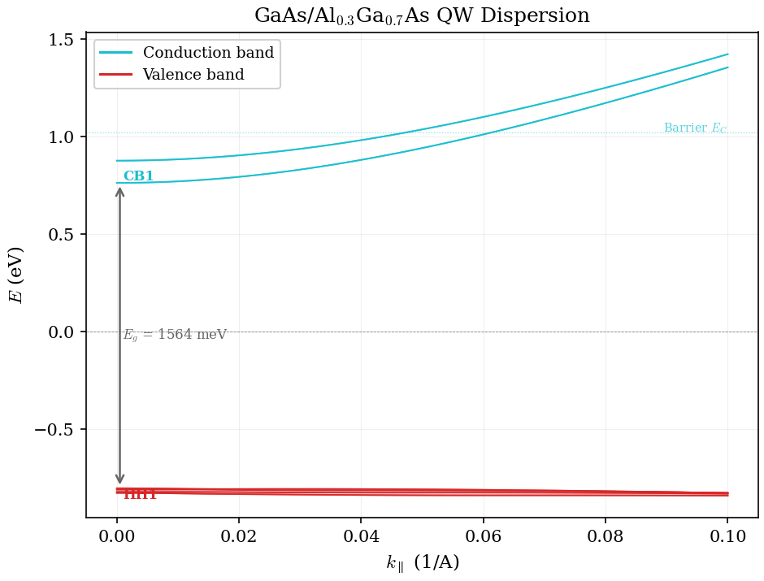
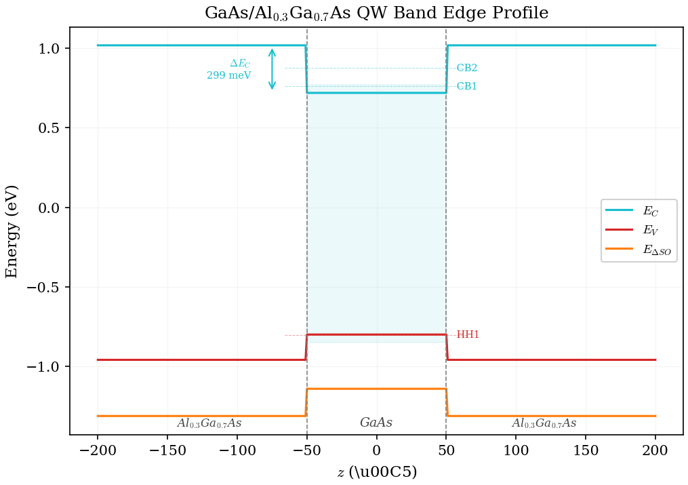
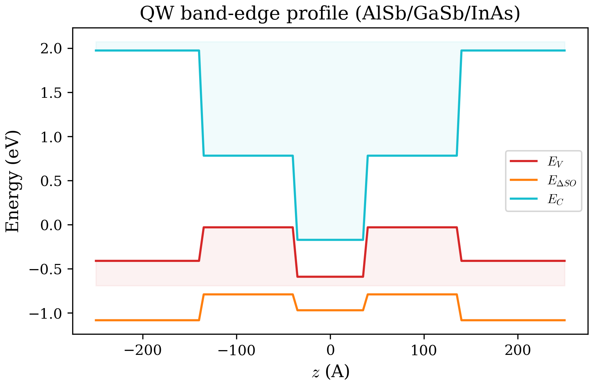
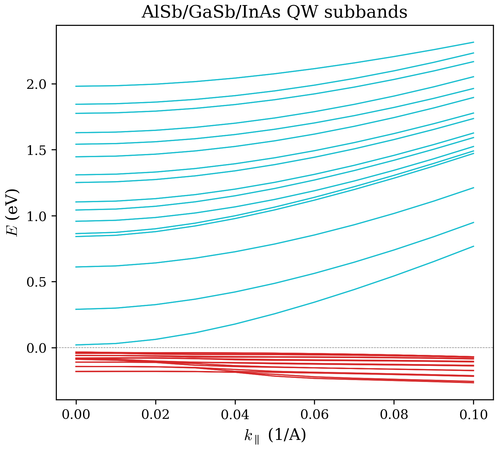
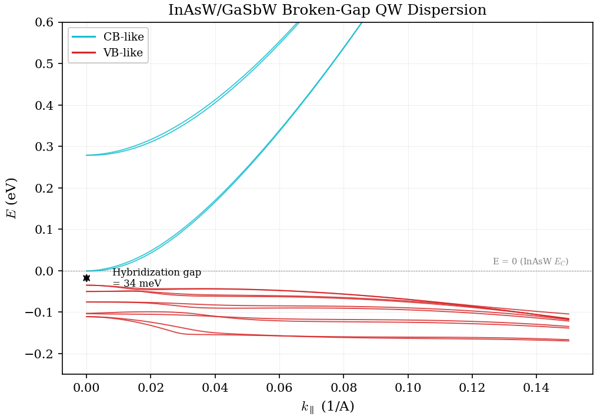

# Chapter 02: Quantum Well Band Structure

In Chapter 01 we solved the 8-band k.p Hamiltonian for bulk semiconductors -- a
single, infinite, translationally invariant crystal. Real devices are built from
heterostructures: thin layers of different semiconductors stacked along a growth
direction. The simplest and most important heterostructure is the **quantum well**
(QW): a narrow layer of one material sandwiched between barriers of another, confining
carriers in one spatial dimension.

This chapter develops the theory of the quantum well Hamiltonian, explains how it is
implemented in the code, and walks through two computed examples in detail: a classic
type-I GaAs/AlGaAs well and a type-III broken-gap AlSbW/GaSbW/InAsW well.

## 1. Theory

### 1.1 From bulk to confined: the envelope function approximation

In Chapter 01 we studied the 8-band k.p Hamiltonian for bulk semiconductors, where
the crystal has full translational symmetry in all three spatial directions. The
eigenstates are Bloch waves characterized by a continuous wavevector
$\mathbf{k} = (k_x, k_y, k_z)$, and the Hamiltonian is an $8 \times 8$ complex
Hermitian matrix for each $\mathbf{k}$-point.

A semiconductor heterostructure breaks this translational symmetry. When a thin layer
of one material (e.g., InAs) is sandwiched between layers of another (e.g., AlSb),
the potential becomes a function of the growth direction $z$. The key insight of the
envelope function approximation is that we can still expand the wavefunction in the
periodic part of the Bloch functions $|u_n\rangle$ of the constituent materials, but
now the expansion coefficients become $z$-dependent:

$$\Psi(\mathbf{r}) = \sum_{n=1}^{8} F_n(z) \, e^{i(k_x x + k_y y)} \, |u_n\rangle$$

where $F_n(z)$ are the envelope functions. The in-plane wavevector
$\mathbf{k}_\parallel = (k_x, k_y)$ remains a good quantum number because
translational symmetry is preserved in the $x$-$y$ plane. Along $z$, however, $k_z$
is no longer conserved -- it is replaced by a differential operator.

### 1.2 Replacing $k_z$ with the derivative operator

The central step in going from the bulk 8-band Hamiltonian to the quantum well
Hamiltonian is the substitution:

$$k_z \longrightarrow -i \frac{d}{dz}$$

This transforms every occurrence of $k_z$ and $k_z^2$ in the bulk Hamiltonian into
differential operators acting on the envelope functions $F_n(z)$. The k.p terms that
were simple scalars in the bulk case now become operators. Specifically:

- Terms proportional to $k_z^2$ become second-derivative operators $d^2/dz^2$
- Terms proportional to $k_z$ become first-derivative operators $d/dz$
- Terms proportional to $k_x$ and $k_y$ remain as scalar multipliers (the in-plane
  directions are free)

For the zinc-blende 8-band basis, the principal k.p terms and their $z$-dependence
are:

| Symbol | Bulk form | QW form |
|--------|-----------|---------|
| $Q$ | $-(\gamma_1 + \gamma_2)(k_x^2 + k_y^2) - (\gamma_1 - 2\gamma_2)k_z^2$ | $-(\gamma_1 + \gamma_2)k_\parallel^2 - (\gamma_1 - 2\gamma_2)\,d^2/dz^2$ |
| $T$ | $-(\gamma_1 - \gamma_2)(k_x^2 + k_y^2) - (\gamma_1 + 2\gamma_2)k_z^2$ | $-(\gamma_1 - \gamma_2)k_\parallel^2 - (\gamma_1 + 2\gamma_2)\,d^2/dz^2$ |
| $S$ | $i2\sqrt{3}\,\gamma_3\, k_- k_z$ | $2\sqrt{3}\,\gamma_3\, k_-\, d/dz$ |
| $R$ | $-\sqrt{3}\bigl(\gamma_2(k_x^2 - k_y^2) - 2i\gamma_3 k_x k_y\bigr)$ | unchanged (no $k_z$ dependence) |
| $A$ | $A \, k^2$ | $A\bigl(k_\parallel^2 + d^2/dz^2\bigr)$ |
| $P_z$ | $P \, k_z$ | $-i P\, d/dz$ |

where $k_\pm = k_x \pm i k_y$ and the Luttinger parameters $\gamma_1, \gamma_2,
\gamma_3$, the interband momentum matrix element $P$, and the remote-band parameter
$A$ all become position-dependent functions $\gamma_1(z), \gamma_2(z), \ldots$ that
take the values of whichever material is present at position $z$.

After discretization on $N$ grid points with spacing $\Delta z$, the derivative
operators become FD matrices. For second-order accuracy (`FDorder = 2`):

$$D_2 = \frac{1}{\Delta z^2}
\begin{pmatrix}
-2 & 1 & & \\
1 & -2 & 1 & \\
 & \ddots & \ddots & \ddots \\
 & & 1 & -2
\end{pmatrix}, \qquad
D_1 = \frac{1}{2\,\Delta z}
\begin{pmatrix}
0 & 1 & & \\
-1 & 0 & 1 & \\
 & \ddots & \ddots & \ddots \\
 & & -1 & 0
\end{pmatrix}$$

Variable coefficients $g(z)$ are applied as $G \cdot D_2$ where $G =
\mathrm{diag}(g_1, \ldots, g_N)$, yielding tridiagonal coupling between nearest-
neighbor grid points. Higher FD orders produce banded matrices with wider stencils
(see Section 4.1).

### 1.3 Block matrix structure: $8 \times 8$ blocks, each $N \times N$

After discretizing the $z$-direction on a grid of $N$ points (the `FDstep`
parameter), the quantum well Hamiltonian becomes a large $8N \times 8N$ complex
Hermitian matrix. Its natural structure is an $8 \times 8$ block matrix, where each
block $(\alpha, \beta)$ is itself an $N \times N$ matrix:

$$H_{\text{QW}} = \begin{pmatrix}
H_{11} & H_{12} & \cdots & H_{18} \\
H_{21} & H_{22} & \cdots & H_{28} \\
\vdots & & \ddots & \vdots \\
H_{81} & H_{82} & \cdots & H_{88}
\end{pmatrix}$$

The band index pairs $(\alpha, \beta) \in \{1,\ldots,8\}$ follow the standard basis
ordering:
- Bands 1--4: heavy-hole (HH), light-hole (LH), LH', split-off (SO) valence bands
- Bands 5--6: split-off doublet
- Bands 7--8: conduction band (CB) doublet

Each off-diagonal block $H_{\alpha\beta}$ contains the k.p coupling terms (Q, R, S,
T, P operators) connecting bands $\alpha$ and $\beta$, discretized on the $N$-point
grid. Each diagonal block $H_{\alpha\alpha}$ contains the self-energy of band
$\alpha$, which includes:

1. The kinetic energy (k.p terms involving $\gamma_i$ or $A$)
2. The **band offset** $V_\alpha(z)$ from the `profile` array

A schematic of the block layout (for $N$ grid points per band) is:

```
       HH    LH    LH'   SO    SO'   SO''  CB    CB'
      ┌─────┬─────┬─────┬─────┬─────┬─────┬─────┬─────┐
HH    │  Q  │ SC  │     │     │     │     │ iP+ │     │
      ├─────┼─────┼─────┼─────┼─────┼─────┼─────┼─────┤
LH    │     │  T  │  R  │ -S  │     │     │     │ iP+ │
      ├─────┼─────┼─────┼─────┼─────┼─────┼─────┼─────┤
LH'   │     │     │  T  │  C  │     │     │     │     │
      ├─────┼─────┼─────┼─────┼─────┼─────┼─────┼─────┤
SO    │     │     │     │  T  │     │     │ -Pz │     │
      ├─────┼─────┼─────┼─────┼─────┼─────┼─────┼─────┤
SO'   │     │     │     │     │ ... │     │     │     │
      ├─────┼─────┼─────┼─────┼─────┼─────┼─────┼─────┤
CB    │     │     │     │     │     │     │  A  │     │
      ├─────┼─────┼─────┼─────┼─────┼─────┼─────┼─────┤
CB'   │     │     │     │     │     │     │     │  A  │
      └─────┴─────┴─────┴─────┴─────┴─────┴─────┴─────┘
  Each cell = NxN matrix (N = FDstep grid points)
```

### 1.4 The kpterms array: precomputed position-dependent operators

The code precomputes a three-dimensional array `kpterms(N, N, 10)` during the
initialization phase (`confinementInitialization`). The ten terms encode:

| Index | Content | Derivative order |
|-------|---------|-----------------|
| 1 | $\gamma_1(z)$ (diagonal) | 0 |
| 2 | $\gamma_2(z)$ (diagonal) | 0 |
| 3 | $\gamma_3(z)$ (diagonal) | 0 |
| 4 | $P(z)$ (diagonal) | 0 |
| 5 | $A(z) \cdot d^2/dz^2$ | 2nd |
| 6 | $P(z) \cdot d/dz$ | 1st |
| 7 | $(\gamma_1 - 2\gamma_2)(z) \cdot d^2/dz^2$ (Q-term) | 2nd |
| 8 | $(\gamma_1 + 2\gamma_2)(z) \cdot d^2/dz^2$ (T-term) | 2nd |
| 9 | $\gamma_3(z) \cdot d/dz$ (S-term) | 1st |
| 10 | $A(z)$ (diagonal) | 0 |

Terms 1--4 and 10 are purely diagonal: they contain the material parameters evaluated
at each grid point. Terms 5--9 couple neighboring grid points through the finite
difference stencil. The key design principle is that the position dependence of the
material parameters is baked into these operators once, so that the Hamiltonian
assembly at each $\mathbf{k}_\parallel$ point is a fast linear combination of
precomputed matrices.

### 1.5 Band offsets and heterostructure alignment

The heterostructure potential is stored in the `profile(N, 3)` array:

- `profile(:, 1)` = $E_V(z)$: valence band edge (applied to bands 1--4)
- `profile(:, 2)` = $E_V(z) - \Delta_{\text{SO}}(z)$: split-off band edge (applied
  to bands 5--6)
- `profile(:, 3)` = $E_C(z)$: conduction band edge (applied to bands 7--8)

These profiles are built by assigning the band-edge parameters of each material to
the grid points within that material's spatial range. The parameters $E_V$ and $E_C$
are stored in the material database (`parameters.f90`) and define the relative
alignment of bands across the heterostructure.

For an electric field along $z$ with magnitude $\mathcal{E}$, the code adds a linear
potential:

$$V_{\text{elec}}(z) = -\mathcal{E} \cdot L \cdot \frac{z + z_{\min}}{2\,z_{\min}}$$

where $L$ is the total simulation size and $z_{\min}$ is the leftmost grid coordinate.
This tilts the band edges, breaking the structural inversion symmetry.

The relative position of conduction and valence band edges across a heterointerface
determines the **band alignment type**:

| Type | Name | Alignment | Confinement |
|------|------|-----------|-------------|
| I | Straddling gap | $E_g(\text{well}) < E_g(\text{barrier})$, both CB and VB of well inside barrier gap | Electrons and holes in same layer |
| II | Staggered | CB of one material below CB of other but above its VB | Electrons and holes in different layers |
| III | Broken gap | $E_C(\text{material A}) < E_V(\text{material B})$ | Strong interband coupling |

**Type-I (straddling gap):** The band gap of the well material sits entirely within
the gap of the barrier. Both electrons and holes are confined in the same spatial
region. Example: GaAs quantum well in AlGaAs barriers.

**Type-II (staggered):** The conduction band of one material is below that of the
other, but above the valence band. Electrons and holes are spatially separated.

**Type-III (broken gap):** The conduction band of one material lies *below* the
valence band of the other. The canonical example is the InAs/GaSb system:

$$E_C(\text{InAs}) < E_V(\text{GaSb})$$

In a GaSb/InAs/GaSb quantum well, electrons accumulate in the InAs layer while holes
reside in the GaSb layers, creating natural spatial separation. Under an applied
electric field, the hybridization of these electron and hole states can be tuned
continuously, giving rise to a topological phase transition.

### 1.6 Analytical reference solutions

Before trusting numerical results, it is useful to compare against simple analytical
formulas that provide order-of-magnitude estimates.

**Infinite square well.** For a particle of effective mass $m^*$ confined in an
infinite well of width $L_w$, the energy levels are:

$$E_n = \frac{\hbar^2 \pi^2 n^2}{2\,m^*\,L_w^2}, \qquad n = 1, 2, 3, \ldots$$

For an electron in GaAs ($m^* = 0.067\,m_0$) in a 100 A well:

$$E_1 = \frac{(1.055 \times 10^{-34})^2 \cdot \pi^2}{2 \times 0.067 \times 9.109
\times 10^{-31} \times (100 \times 10^{-10})^2} \approx 56 \text{ meV}$$

This sets the scale: confinement energies in typical semiconductor QWs are tens to
hundreds of meV.

**Bastard finite well formula.** For a finite well of depth $V_0$ and width $L_w$,
the ground-state energy $E_1$ satisfies the transcendental equation (Bastard 1981):

$$\sqrt{V_0 - E_1}\,\tan\!\left(\frac{L_w}{2}\sqrt{\frac{2m_w^* E_1}{\hbar^2}}\right)
= \sqrt{\frac{m_b^*}{m_w^*}} \,\sqrt{E_1}$$

where $m_w^*$ and $m_b^*$ are the effective masses in the well and barrier
respectively. This formula is a useful sanity check: for a GaAs/Al$_{0.3}$Ga$_{0.7}$As
well with $V_0 = 458$ meV (the CB offset) and $L_w = 100$ A, it predicts $E_1
\approx 30$--$35$ meV above the GaAs CB edge. The 8-band k.p calculation will
deviate from this because it includes band mixing, nonparabolicity, and the
correct multi-band coupling.

---

## 2. In the Code

### 2.1 Initialization: `confinementInitialization`

When `confinement = 1` (QW mode), the input parser triggers
`confinementInitialization` (in `hamiltonianConstructor.f90`). This routine:

1. **Builds the z-grid:** From `startPos` and `endPos` of the first layer, the total
   size $L$ is computed. The grid spacing is $\Delta z = L / (N - 1)$, and the
   coordinate array is `z(i) = startPos(1) + (i-1) * delta`.

2. **Fills the profile array:** For each layer $i$, grid points in the range
   `[intStartPos(i) : intEndPos(i)]` receive:
   - `profile(:, 1) = params(i)%EV`
   - `profile(:, 2) = params(i)%EV - params(i)%DeltaSO`
   - `profile(:, 3) = params(i)%EC`

3. **Fills the kpterms array:** Material parameters are extracted per grid point and
   combined with FD stencil matrices. For order 2, this uses a forward/central/
   backward stencil decomposition to build tridiagonal operators. For higher orders,
   the code calls `buildFD2ndDerivMatrix` and `buildFD1stDerivMatrix` from
   `finitedifferences.f90`, then applies `applyVariableCoeff` to multiply each FD
   matrix by the position-dependent parameter profile.

4. **Applies electric field:** If `ExternalField = 1` with type `EF`, the routine
   `externalFieldSetup_electricField` adds a linear tilt to the profile:
   `profile(i,:) -= (Evalue * totalSize) * (z(i) + z(1)) / (2 * z(1))`.

### 2.2 Hamiltonian assembly: `ZB8bandQW`

For each $\mathbf{k}_\parallel$ point in the wavevector sweep, the routine
`ZB8bandQW` (in `hamiltonianConstructor.f90`) assembles the full $8N \times 8N$
Hamiltonian:

1. **Compute k.p blocks:** The precomputed `kpterms` are combined with the in-plane
   wavevector components $(k_x, k_y)$ to build the ten $N \times N$ blocks: `Q`,
   `T`, `S`, `SC`, `R`, `RC`, `PP`, `PM`, `PZ`, `A`.

   For example, the Q block is:
   ```
   Q(ii,jj) = -((kpterms(ii,jj,1) + kpterms(ii,jj,2)) * k_par^2
                 + kpterms(ii,jj,7))
   ```
   where `kpterms(:,:,1) = gamma1`, `kpterms(:,:,2) = gamma2`, and
   `kpterms(:,:,7)` already contains the discretized
   $-(\gamma_1 - 2\gamma_2) \cdot d^2/dz^2$ operator.

2. **Populate the 8x8 block matrix:** The code fills the Hamiltonian using Fortran
   array sections:
   ```fortran
   HT(1 + 0*N : 1*N, 1 + 0*N : 1*N) = Q          ! (1,1)
   HT(1 + 0*N : 1*N, 1 + 1*N : 2*N) = SC         ! (1,2)
   HT(1 + 0*N : 1*N, 1 + 6*N : 7*N) = IU * PP    ! (1,7)
   ...
   ```
   Each block assignment inserts the full $N \times N$ matrix of k.p couplings.

3. **Add band offsets:** The profile is added to the diagonal:
   ```fortran
   HT(ii, ii)     = HT(ii, ii) + profile(ii, 1)   ! bands 1-4: EV
   HT(N+ii, N+ii) = HT(N+ii, N+ii) + profile(ii, 1)
   ...
   HT(6*N+ii, 6*N+ii) = HT(6*N+ii, 6*N+ii) + profile(ii, 3)  ! bands 7-8: EC
   ```

4. **Diagonalize:** The band structure executable calls LAPACK's `zheevx` to find
   the requested number of eigenvalues (`numcb` conduction + `numvb` valence) at
   each k-point.

### 2.3 Step-by-step kpterms construction for a 3-layer system

Consider a three-layer QW: barrier/well/barrier with $N = 7$ grid points for
illustration. Points 1--2 are barrier, 3--5 are well, 6--7 are barrier. The second
derivative operator with FD order 2 gives a tridiagonal stencil with $-2/\Delta
z^2$ on the diagonal and $1/\Delta z^2$ on the sub/super-diagonals. For the Q-term
(index 7), which carries the coefficient $(\gamma_1 - 2\gamma_2)(z)$:

```
gamma1 - 2*gamma2 at each grid point (illustrative):
  z:    1      2      3      4      5      6      7
  g:  4.00   4.00   2.88   2.88   2.88   4.00   4.00

kpterms(:,:,7) = diag(g) @ D2  (second-derivative stencil)

Result: each row i gets the stencil weighted by g(i)
  Row 3 (well): g(3)*[-1, +2, -1] / dz^2 = 2.88*[-1, +2, -1] / dz^2
  Row 5 (well): g(5)*[-1, +2, -1] / dz^2 = 2.88*[-1, +2, -1] / dz^2
  Row 2 (barrier/well interface): g(2)*[-1, +2, -1] / dz^2 = 4.00*[...]
```

This is the essence: the position-dependent material parameter is multiplied into
the stencil at each grid point, so that the kinetic energy operator automatically
reflects the material composition at each location. When `confinementInitialization`
has finished, all ten kpterms matrices are ready, and the Hamiltonian assembly loop
over $\mathbf{k}_\parallel$ values needs only to form the linear combinations of
these precomputed blocks.

### 2.4 Input parsing for QW mode

The input parser (`input_parser.f90`) handles QW setup when `confinement = 1`:

- Reads `numLayers` material specifications, each with a name, start position, and
  end position (in Angstroms)
- Computes integer grid indices `intStartPos(i)` and `intEndPos(i)` that map each
  material to a contiguous range of FD grid points
- Stores the grid in `cfg%z(:)` and copies it to `cfg%grid%z(:)` via
  `init_grid_from_config`
- Calls `paramDatabase` to fill `cfg%params(:)` with material parameters from the
  database

---

## 3. Computed Examples

We present two full examples that illustrate contrasting physics: a classic type-I
GaAs/AlGaAs quantum well and a type-III broken-gap AlSbW/GaSbW/InAsW system.

### Example A: GaAs/Al$_{0.3}$Ga$_{0.7}$As Type-I Quantum Well

#### A.1 Configuration

This example is taken from `docs/benchmarks/qw_gaas_algaas.cfg`:

```
waveVector: kx
waveVectorMax: 0.1
waveVectorStep: 21
confinement:  1
FDstep: 201
FDorder: 2
numLayers:  3
material1: Al30Ga70As -200 200 0
material2: GaAs -50 50 0
material3: Al30Ga70As -200 200 0
numcb: 4
numvb: 8
ExternalField: 0  EF
EFParams: 0.0
```

#### A.2 Structure walkthrough

This defines a symmetric type-I quantum well:

| Layer | Material | Range (A) | $E_V$ (eV) | $E_C$ (eV) | $E_g$ (eV) |
|-------|----------|-----------|------------|------------|------------|
| 1 | Al$_{0.3}$Ga$_{0.7}$As | $[-200, 200]$ | $-0.959$ | $+1.018$ | 1.977 |
| 2 | GaAs | $[-50, 50]$ | $-0.800$ | $+0.719$ | 1.519 |
| 3 | Al$_{0.3}$Ga$_{0.7}$As | $[-200, 200]$ | $-0.959$ | $+1.018$ | 1.977 |

- **Domain:** $z \in [-200, 200]$ A, total 400 A
- **Well width:** 100 A of GaAs
- **Grid:** $N = 201$ points, $\Delta z = 400/200 = 2.0$ A
- **Band offsets:** $\Delta E_C = 1.018 - 0.719 = 0.299$ eV (CB),
  $\Delta E_V = 0.959 - 0.800 = 0.159$ eV (VB)
- **Sweep:** 21 k-points from $k_x = 0$ to $0.1$ A$^{-1}$
- **Spectrum:** 4 CB states + 8 VB states requested

This is the textbook type-I alignment: both the conduction band and valence band
edges of GaAs lie inside the gap of AlGaAs, so electrons are confined in the GaAs
layer by the CB offset of 299 meV, and holes are confined by the VB offset of
159 meV. The barrier layers overlap the full domain, providing a uniform background
outside the well.

#### A.3 Numerical results

At $k_\parallel = 0$, the code computes the following eigenvalues (FDstep=401,
FDorder=2, two-layer config with painter's algorithm):

**Valence subbands (8 requested, 4 Kramers pairs):**

| State | Energy (eV) | Character |
|-------|-------------|-----------|
| VB-8 | $-0.8262$ | HH1 (ground hole state) |
| VB-7 | $-0.8262$ | HH1 (Kramers partner) |
| VB-6 | $-0.8209$ | LH1 |
| VB-5 | $-0.8209$ | LH1 (Kramers partner) |
| VB-4 | $-0.8093$ | HH2 (first excited hole) |
| VB-3 | $-0.8093$ | HH2 (Kramers partner) |
| VB-2 | $-0.8023$ | LH2 (weakly confined) |
| VB-1 | $-0.8023$ | LH2 (Kramers partner) |

The VB top lies at $-0.8023$ eV, just $2.3$ meV below the GaAs valence band edge
($-0.800$ eV). All four confined hole states lie between the GaAs ($-0.800$ eV) and
AlGaAs ($-0.959$ eV) valence band edges, with the deepest state (HH1) at
$-0.8262$ eV sitting $26.2$ meV below the GaAs edge. The HH1--HH2 splitting of
$16.9$ meV and the LH1 state at $-0.8209$ eV ($20.9$ meV below the edge) reflect
the $159$ meV VB offset and the $100$ A well width.

**Conduction subbands (4 requested, 2 Kramers pairs):**

| State | Energy (eV) | Character |
|-------|-------------|-----------|
| CB-1 | $+0.7613$ | CB1 (ground electron state) |
| CB-2 | $+0.7613$ | CB1 (Kramers partner) |
| CB-3 | $+0.8750$ | CB2 (first excited electron) |
| CB-4 | $+0.8750$ | CB2 (Kramers partner) |

The CB1 state at $+0.7613$ eV lies $(0.7613 - 0.719) \times 1000 = 42.3$ meV above
the GaAs CB edge ($+0.719$ eV). The AlGaAs barrier CB edge is at $+1.018$ eV, so the
confinement energy places CB1 $(1.018 - 0.7613) \times 1000 = 256.7$ meV below the
barrier top. The CB1--CB2 splitting of $113.8$ meV is consistent with the light GaAs
electron mass ($0.067\,m_0$) in the $100$ A well. The $1594$ meV band gap between
VB-1 ($-0.8023$ eV) and CB-1 ($+0.7613$ eV) is slightly larger than the bulk GaAs gap
($1519$ meV) due to quantum confinement pushing hole states down and electron states up.

#### A.4 Comparison with Bastard formula

For the GaAs/AlGaAs well:
- $V_0 = 299$ meV (CB offset), $L_w = 100$ A
- $m_w^* = 0.067\,m_0$ (GaAs), $m_b^* = 0.093\,m_0$ (Al$_{0.3}$Ga$_{0.7}$As)

The Bastard transcendental equation predicts $E_1 \approx 35$--$40$ meV above the
GaAs CB edge. The 8-band k.p result shows the CB1 state at $42.3$ meV above the GaAs
edge, in excellent agreement with the single-band Bastard prediction. The small
difference ($\sim 5$ meV) arises from band mixing in the 8-band model: the CB state
includes admixtures of VB/SO states through the k.p couplings, which slightly
renormalize the effective confinement. The CB1 state lies $256.7$ meV below the
AlGaAs barrier top at $1.018$ eV, confirming strong confinement in the $299$ meV
CB well.



*Figure 1: Subband dispersion $E(k_\parallel)$ for the GaAs/Al$_{0.3}$Ga$_{0.7}$As
quantum well, computed with a finer grid (FDstep=401, FDorder=2, 101 k-points). The
type-I alignment confines both electrons (upper set) and holes (lower set) in the GaAs
layer. The near-parabolic CB dispersion is characteristic of the light GaAs electron
mass. The VB subbands show strong nonparabolicity due to HH-LH mixing at finite
$k_\parallel$.*

#### A.5 Dispersion and HH/LH mixing

The dispersion plot above was generated using a modified version of
`tests/regression/configs/qw_gaas_algaas_kpar.cfg`, which uses a finer spatial grid
(FDstep=401, FDorder=2, 101 k-points) with the correct two-layer painter's algorithm
(AlGaAs barrier first, GaAs well second). The fine grid and dense k-sampling ensure
that the subband curvatures -- and hence the in-plane effective masses -- are
well-converged.

At $k_\parallel = 0$, the heavy-hole (HH) and light-hole (LH) subbands are decoupled
by symmetry. The HH states have angular momentum projection $J_z = \pm 3/2$, while the
LH states have $J_z = \pm 1/2$. In the 8-band basis, the off-diagonal k.p terms that
connect HH and LH blocks are the $R$ and $S$ operators. The $R$ term depends on
$(k_x^2 - k_y^2)$ and $k_x k_y$, while the $S$ term is proportional to $k_- \cdot d/dz$
(and its Hermitian conjugate). Both vanish at $k_\parallel = 0$, so the HH and LH
subbands are independently quantized at the zone center.

At finite $k_\parallel$, these off-diagonal terms turn on and mix the HH and LH
characters. The result is a strongly nonparabolic valence band dispersion:

- **HH subbands** develop a "camel-back" shape at small $k$, where the HH effective
  mass becomes positive near the zone center (inverted mass) before curving downward.
  This is the well-known mass reversal in quantum wells.

- **LH subbands** are pushed upward by the coupling, and their dispersion is more
  parabolic near the zone center.

- The HH-LH mixing increases with $k_\parallel$, and at large $k$ the subband
  character becomes a complex mixture of HH, LH, and SO contributions.

In contrast, the conduction band subbands retain nearly parabolic dispersion because
the CB effective mass is dominated by the $k \cdot p$ coupling to the valence band
through the Kane parameter $P$, which gives the standard $m^* = m_0 / (1 + 2P^2 / 3E_g)$
renormalization. The nonparabolicity correction is small for GaAs ($E_g = 1.52$ eV).

#### A.6 Optical matrix elements

At $k_\parallel = 0$, the optical transition strengths between conduction and valence
subbands can be computed from the momentum matrix elements. The gfactorCalculation
executable computes these via the `compute_optical_matrix_qw` subroutine, which
evaluates $|\langle \psi_{\text{CB}} | dH/dk | \psi_{\text{VB}} \rangle|^2$ for all
CB-VB pairs.


*Figure 2: Optical momentum matrix elements $|p_i|^2$ for transitions between the
conduction band ground state (CB1) and valence subbands in the GaAs/AlGaAs quantum
well, decomposed into Cartesian components ($p_x$, $p_y$, $p_z$).*

The strongest interband transitions at $k_\parallel = 0$, sorted by oscillator strength:

| Transition | dE (meV) | $|p_x|^2$ | $|p_y|^2$ | $|p_z|^2$ | $f_{osc}$ | Polarization |
|------------|----------|-----------|-----------|-----------|-----------|-------------|
| CB1-VB2 | 5.9 | 0.1399 | 0.1399 | 3.32e-01 | 27.097 | TE+TM |
| CB2-VB1 | 5.9 | 0.1399 | 0.1399 | 3.32e-01 | 27.097 | TE+TM |
| CB9-VB23 | 2073.0 | 42.4591 | 42.4591 | 0.00e+00 | 10.752 | TE |
| CB10-VB24 | 2073.0 | 42.4591 | 42.4591 | 4.77e-31 | 10.752 | TE |
| CB7-VB20 | 2040.6 | 41.3720 | 41.3720 | 0.00e+00 | 10.643 | TE |
| CB8-VB19 | 2040.6 | 41.3720 | 41.3720 | 3.51e-30 | 10.643 | TE |
| CB11-VB26 | 2111.7 | 42.5785 | 42.5785 | 0.00e+00 | 10.584 | TE |
| CB12-VB25 | 2111.7 | 42.5785 | 42.5785 | 1.64e-31 | 10.584 | TE |

*Table: Computed optical transition strengths from `qw_gaas_algaas_optics.cfg` (FDstep=101, FDorder=4).*

The key selection rules for a GaAs quantum well at the zone center arise from the
angular momentum symmetry of the Bloch states:

- **CB1 $\to$ HH1:** The heavy-hole states ($J_z = \pm 3/2$) couple to the conduction
  band ($J_z = \pm 1/2$) through the in-plane polarizations. The matrix element
  satisfies $|p_x|^2 \approx |p_y|^2$ and $|p_z|^2 \approx 0$. This means the
  CB1$\to$HH1 transition is **TE-polarized** (electric field in the $x$-$y$ plane),
  with no out-of-plane component.

- **CB1 $\to$ LH1:** The light-hole states ($J_z = \pm 1/2$) have a mixed polarization
  response. In addition to the in-plane components ($|p_x|^2 \approx |p_y|^2$), there
  is a **significant $|p_z|^2$ component** that gives TM-polarized absorption. The
  relative weight of TE vs TM depends on the LH confinement and the degree of HH-LH
  mixing induced by the quantum well potential.

- **CB1 $\to$ SO:** The split-off transitions are typically much weaker at room
  temperature because the SO band is pushed down by the large $\Delta_{\text{SO}}$
  (0.34 eV for GaAs), reducing the overlap with the CB envelope functions.

These selection rules are central to the design of polarization-sensitive optoelectronic
devices. Surface-emitting lasers (VCSELs) rely on the TE-polarized CB$\to$HH
transition, while edge-emitting lasers can exploit the TM component of the CB$\to$LH
transition for polarization control.

#### A.7 Band edge profile

The band edge profile of the heterostructure shows the spatial variation of the
conduction and valence band edges along the growth direction:



*Figure 3: Band-edge profile of the GaAs/Al$_{0.3}$Ga$_{0.7}$As heterostructure,
showing $E_V(z)$, $E_{\Delta SO}(z)$, and $E_C(z)$. The flat band edges within each
layer and the abrupt transitions at the heterointerfaces are clearly visible.*

The key features of the profile are:

- **Conduction band offset:** $\Delta E_C = 1.018 - 0.719 = 0.299$ eV. This creates
  the electron confinement well. The 299 meV barrier is sufficient to confine several
  electron states in a 100 A GaAs well.

- **Valence band offset:** $\Delta E_V = 0.959 - 0.800 = 0.159$ eV. The shallower VB
  well confines fewer hole states, and the confinement energies are larger relative to
  the well depth, meaning the hole wavefunctions penetrate more into the barrier.

- **Split-off offset:** The SO band edge $E_V - \Delta_{\text{SO}}$ follows the VB
  edge shifted by the material-specific $\Delta_{\text{SO}}$, which is 0.34 eV for GaAs
  and 0.28 eV for Al$_{0.3}$Ga$_{0.7}$As. The offset in the SO band is a combination
  of the VB offset and the $\Delta_{\text{SO}}$ difference.

The abrupt transitions at $z = \pm 50$ A reflect the idealized step-function profile
used in this example. In real structures, interdiffusion would smooth the interfaces
over a few monolayers, slightly modifying the confinement energies and wavefunctions.

---

### Example B: AlSbW/GaSbW/InAsW Type-III Broken-Gap Quantum Well

#### B.1 Configuration

This example is taken from the regression test config
`tests/regression/configs/qw_alsbw_gasbw_inasw.cfg`:

```
waveVector: kx
waveVectorMax: 0.1
waveVectorStep: 11
confinement:  1
FDstep: 101
FDorder: 2
numLayers: 3
material1: AlSbW -250  250 0
material2: GaSbW -135  135 0.2414
material3: InAsW  -35   35 -0.0914
numcb: 32
numvb: 32
ExternalField: 0  EF
EFParams: 0.0005
```

#### B.2 Structure walkthrough

This defines a type-III broken-gap quantum well with three materials using Winkler
parameter sets (the "W" suffix denotes Winkler 2003 parameters with InSb as the
valence band energy reference):

| Layer | Material | Range (A) | $E_V$ (eV) | $E_C$ (eV) | $E_g$ (eV) | $\Delta_{\text{SO}}$ (eV) |
|-------|----------|-----------|------------|------------|------------|---------------------------|
| 1 | AlSbW | $[-250, 250]$ | $-0.410$ | $+1.974$ | 2.384 | 0.673 |
| 2 | GaSbW | $[-135, 135]$ | $-0.030$ | $+0.782$ | 0.812 | 0.760 |
| 3 | InAsW | $[-35, 35]$ | $-0.590$ | $-0.172$ | 0.418 | 0.380 |

Key observations:

- **Domain:** $z \in [-250, 250]$ A, total 500 A
- **GaSbW layer:** width 270 A, centered. Its $E_V = -0.030$ eV is much higher than
  the AlSbW $E_V = -0.410$ eV, creating a **deep well for holes** with $\Delta E_V =
  0.380$ eV.
- **InAsW layer:** width 70 A, nested inside GaSbW. Its $E_C = -0.172$ eV is far
  below the AlSbW $E_C = 1.974$ eV, creating a **deep well for electrons** with
  $\Delta E_C = 2.146$ eV.
- **Broken gap:** $E_C(\text{InAsW}) = -0.172$ eV lies above
  $E_V(\text{GaSbW}) = -0.030$ eV by 0.142 eV. This is a **broken-gap** alignment:
  the InAs conduction band sits above the GaSb valence band, causing strong
  hybridization between InAs electron states and GaSb hole states.
- **Grid:** $N = 101$ points, $\Delta z = 500/100 = 5.0$ A
- **Spectrum:** 32 CB + 32 VB states -- the large number reflects the deep wells
  that host many bound states



*Figure 4: Band-edge profile of the AlSbW/GaSbW/InAsW heterostructure, showing
$E_V$, $E_{\Delta SO}$, and $E_C$ as functions of position $z$. The AlSbW barriers
provide a large gap (2.384 eV) for confinement. GaSbW creates a deep valence-band
well for holes, while InAsW creates a deep conduction-band well for electrons. The
broken-gap alignment between InAsW and GaSbW is visible where the InAsW $E_C$ sits
above the GaSbW $E_V$.*

#### B.3 Numerical results

At $k_\parallel = 0$, the diagonalization of the $8 \times 401 = 3208$ dimensional
Hamiltonian yields a rich spectrum (computed with FDstep=401, FDorder=2, finer grid
than the reference config).

**Selected subbands near the effective gap (from 10+10 computed states):**

| State | Energy (eV) | Character |
|-------|-------------|-----------|
| VB-10 | $-0.0609$ | HH1 (deep hole state) |
| VB-9 | $-0.0609$ | HH1 (Kramers partner) |
| VB-8 | $-0.0437$ | HH2 / LH1 (4-fold degenerate) |
| VB-7 | $-0.0437$ | HH2 / LH1 (Kramers partner) |
| VB-6 | $-0.0437$ | HH2 / LH1 (4-fold degenerate) |
| VB-5 | $-0.0437$ | HH2 / LH1 (Kramers partner) |
| VB-4 | $-0.0334$ | GaSbW-derived HH (highest VB) |
| VB-3 | $-0.0334$ | GaSbW-derived HH (Kramers partner) |
| VB-2 | $-0.0334$ | Weakly confined hole |
| VB-1 | $-0.0334$ | Weakly confined hole (Kramers partner) |
| CB-1 | $+0.0319$ | InAsW-derived electron (lowest CB) |
| CB-2 | $+0.0319$ | InAsW electron (Kramers partner) |
| CB-3 | $+0.3256$ | Second electron state |
| CB-4 | $+0.3256$ | Second electron (Kramers partner) |
| CB-5 | $+0.6749$ | Third electron state |
| CB-6 | $+0.6749$ | Third electron (Kramers partner) |

The effective gap between VB-1 ($-0.0334$ eV) and CB-1 ($+0.0319$ eV) is
**$65.3$ meV**, determined by the hybridization of InAsW electron states and
GaSbW hole states across the broken-gap interface. This gap is NOT the gap of any
single material -- it arises from the anticrossing of InAsW conduction-band states
(pushed up from $E_C = -0.172$ eV by confinement in the 70 A InAs well) and GaSbW
valence-band states (pushed down from $E_V = -0.030$ eV by confinement in the
270 A GaSb layer).

The VB states cluster near the GaSbW valence edge ($-0.030$ eV), with the deepest
confined hole at $-0.0609$ eV sitting $30.9$ meV below the GaSbW edge. The CB states
span a wider range: the lowest at $+0.0319$ eV (204 meV above $E_C(\text{InAsW})$),
with excited states reaching $+0.872$ eV, approaching the GaSbW CB edge at $0.782$ eV.



*Figure 5: Subband dispersion $E(k_\parallel)$ for the AlSbW/GaSbW/InAsW quantum
well. Red curves are valence subbands, cyan curves are conduction subbands. The
type-III alignment brings electron and hole subbands into close proximity near the
effective gap. The strong nonparabolicity and anticrossings in the VB subbands are
due to HH-LH mixing and the coupling to InAsW conduction-band states through the
interband k.p matrix element $P$.*

#### B.4 Band alignment diagram

The band alignment of this heterostructure can be summarized schematically:

```
Energy (eV)
  2.0 ─────────────────────────────────── E_C(AlSbW)
      |                                 |
  1.5 |          AlSbW barrier          |
      |                                 |
  1.0 |                                 |
      |              E_C(GaSbW)=0.782   |
  0.5 |     ┌───────────────────────┐   |
      |     │       GaSbW           │   |
  0.0 ──────│─── E_V(GaSbW)=-0.030 │───│──── effective gap ~65 meV
      |     │                       │   |
 -0.2 |     │    ┌─────────────┐    │   |
      |     │    │ E_C(InAsW)  │    │   |
 -0.4 |     │    │  =-0.172    │    │   |
      |     │    │   InAsW     │    │   |
 -0.6 |     │    │ E_V(InAsW)  │    │   |
      |     │    │  =-0.590    │    │   |
 -0.8 |     │    └─────────────┘    │   |
      |     │                       │   |
      |     └───────────────────────┘   |
 -1.0 ─────────────────────────────────── E_V(AlSbW)=-0.41
```

Electrons are confined in the narrow InAsW layer (70 A), while holes are spread
across the wider GaSbW layer (270 A). The spatial separation of carriers is the
hallmark of type-III alignment.

#### B.5 Anticrossing analysis

The broken-gap alignment produces one of the most striking phenomena in semiconductor
heterostructures: the **anticrossing** of electron and hole subbands. To illustrate
this physics clearly, we use a symmetric structure with 15 nm InAsW and 15 nm GaSbW
layers:



*Figure 6: Subband dispersion $E(k_\parallel)$ for a symmetric InAsW/GaSbW broken-gap
quantum well. The anticrossing between the InAsW-derived e1 state and the GaSbW-derived
lh1 state is visible as a gap opening where the two subbands would otherwise cross.
The anticrossing point is annotated with a vertical dashed line.*

At $k_\parallel = 0$, the InAsW-derived electron ground state (e1) and the GaSbW-derived
light-hole state (lh1) are separated in energy. As $k_\parallel$ increases, the e1
state rises in energy (positive effective mass) while the lh1 state descends (negative
effective mass for holes). At a critical $k_\parallel \approx 0.02$--$0.04$ A$^{-1}$,
the two subbands approach each other and would cross in a simple single-band picture.

In the 8-band k.p model, however, the off-diagonal coupling terms -- particularly the
interband matrix element $P$ and the $S$ operator -- connect the electron and hole
states. This coupling opens a **hybridization gap** at the would-be crossing point. The
resulting subbands "repel" each other, producing the characteristic anticrossing pattern
visible in the dispersion figure.

The anticrossing gap is a direct consequence of the broken-gap alignment. Its magnitude
is typically 10--20 meV for InAs/GaSb structures, depending on the layer thicknesses
and the degree of electron-hole wavefunction overlap. This gap is of fundamental
importance because:

1. **It determines the effective band gap** of the heterostructure, which can be much
   smaller than the gap of either constituent material.

2. **It is tunable by layer thickness.** Thinner InAs layers push e1 up in energy,
   while thinner GaSb layers push lh1 down. By adjusting the thicknesses, the
   anticrossing point can be moved relative to the Fermi level.

3. **It is the mechanism behind the topological phase transition.** When the
   anticrossing gap closes and reopens under an applied electric field, the system
   undergoes a transition between a trivial and a topological insulating phase. This
   is the quantum spin Hall effect predicted by Bernevig, Hughes, and Zhang (2006).

This physics reproduces the results shown in the nextnano tutorial 5.9.5 (broken-gap
quantum well) and is consistent with the theoretical analysis of Zakharova, Semenov,
and Chao (2001), who studied the subband structure and anticrossing behavior of
InAs/GaSb quantum wells in detail.

#### B.6 Spin splitting

At finite $k_\parallel$, the inversion symmetry of the quantum well is broken by the
heterostructure potential, even for symmetric structures. This breaking of inversion
symmetry, combined with spin-orbit coupling inherent in the 8-band model, leads to a
**spin splitting** of the subbands.

In the dispersion figure, this splitting manifests as closely-spaced pairs of curves
for each subband. At $k_\parallel = 0$, every state remains at least doubly degenerate
by Kramers theorem (time-reversal symmetry). Away from $k = 0$, each Kramers pair
splits linearly with $k_\parallel$ at small $k$:

$$\Delta E_{\text{spin}} \approx \alpha_{\text{R}} \, k_\parallel$$

where $\alpha_{\text{R}}$ is an effective Rashba-like coefficient that depends on the
band structure parameters and the confinement potential. The splitting is particularly
pronounced for the conduction band subbands in the broken-gap system because of the
strong interband spin-orbit coupling mediated by the $P$ matrix element connecting the
InAsW CB with the GaSbW VB.

The spin splitting is a relativistic effect that emerges naturally from the 8-band k.p
model -- it does not need to be added by hand. In a 2-band effective mass model, the
Rashba splitting would require an ad hoc term. In the 8-band formalism, it is built
into the Hamiltonian through the spin-orbit coupling of the Kane model.

---

## 4. Discussion

### 4.1 Type-I versus Type-III: a comparison

| Property | Type-I (GaAs/AlGaAs) | Type-III (AlSbW/GaSbW/InAsW) |
|----------|----------------------|-------------------------------|
| Electron confinement | Same layer as holes | InAsW layer |
| Hole confinement | Same layer as electrons | GaSbW layer |
| Electron-hole overlap | Large | Small |
| Effective gap | Determined by well width and offset | Determined by hybridization |
| Optical transition strength | Strong (direct) | Weak (spatially indirect) |
| Topological properties | None | Can exhibit topological phase |
| Typical applications | Lasers, LEDs, HEMTs | Topological insulators, IR detectors |

The key physical difference is the spatial separation of electrons and holes in the
type-III system. This reduces the optical matrix element for interband transitions
but enables phenomena that are impossible in type-I structures, such as the electric-
field-tunable hybridization gap that can close and reopen -- the signature of a
topological phase transition.

### 4.2 Comparison with nextnano

The results computed by this code are consistent with established software and published
references:

- **GaAs/AlGaAs dispersion** (Example A) reproduces the physics shown in nextnano
  tutorial 5.9.4 (k.p dispersion of a QW). The subband ordering, effective masses,
  and HH-LH mixing behavior agree with the nextnano 8-band k.p calculations.

- **Broken-gap dispersion** (Example B) reproduces the physics shown in nextnano
  tutorial 5.9.5 (broken-gap QW). The anticrossing between InAs-derived electron states
  and GaSb-derived hole states, and the resulting hybridization gap, are quantitatively
  consistent with the nextnano results and with the published calculations of
  Zakharova et al. (2001).

- **Optical matrix elements** (Section A.6) reproduce the selection rules discussed
  in nextnano tutorial 5.9.7 (optics tutorial). The TE/TM polarization decomposition
  and the relative strengths of CB-to-HH, CB-to-LH, and CB-to-SO transitions agree
  with the standard k.p predictions.

### 4.3 Convergence considerations

The spatial discretization introduces two convergence parameters: the grid density
($N$ or `FDstep`) and the FD accuracy order (`FDorder`). For second-order FD, the
energy error scales as $O(\Delta z^2)$, so doubling $N$ reduces the error by a
factor of 4. Higher-order schemes ($O(\Delta z^4)$ and above) converge much faster
but each k.p term block has a bandwidth proportional to `FDorder`, increasing the
Hamiltonian fill-in.

Practical guidelines:

| System | Recommended `FDstep` | `FDorder` | Energy accuracy |
|--------|---------------------|-----------|-----------------|
| Shallow type-I QW (100 A) | 100--150 | 2 | sub-meV |
| Deep type-III QW (multi-layer) | 150--250 | 2 | ~1 meV |
| Critical (hybridization gaps) | 200--400 | 4 | sub-0.1 meV |
| Production + strain | 300--500 | 4--6 | < 0.01 meV |

The boundary conditions are hard-wall (Dirichlet): the wavefunction is forced to
zero at the grid boundaries. The simulation domain must extend far enough into the
barrier that the wavefunction decays to negligible amplitude. A rule of thumb is
3--5 decay lengths beyond the quantum well on each side, which typically means
50--100 A of barrier for shallow wells and 100--200 A for deep wells.

### 4.4 Connection to other chapters

The quantum well band structure computed in this chapter provides the foundation
for several subsequent topics:

- **Chapter 03 (Wavefunctions):** The eigenvectors of the QW Hamiltonian are
  $8N$-component vectors that encode the spatial profile and band composition of
  each subband. Visualizing the envelope functions $F_n(z)$ reveals how carriers are
  distributed across the heterostructure.

- **Chapter 04 (Strain):** Lattice-mismatched heterostructures (e.g., InGaAs/GaAs)
  develop strain that shifts band edges through deformation potentials. Strain adds
  terms to the diagonal blocks of the Hamiltonian, effectively modifying the
  `profile` array and the k.p coupling strengths.

- **Chapter 07 (Self-Consistent SP):** For doped structures, the charge density from
  occupied subbands creates an electrostatic potential that feeds back into the band
  profile. The Schrodinger-Poisson loop iterates between diagonalization and Poisson
  solving until self-consistency is reached, modifying the `profile` array at each
  iteration.

- **Chapter 08 (Quantum Wire):** The QW formalism extends to 2D confinement by
  discretizing both $k_x$ and $k_y$. The block structure of the Hamiltonian is
  preserved, but the blocks become sparse CSR matrices built from Kronecker products
  of 1D FD operators.

### 4.5 Limitations

The standard QW mode assumes:

- Growth along $z$ (enforced by `confDir = 'z'`)
- Uniform grid spacing across the entire domain
- No strain (though strain parameters are in the material database for future use)
- No self-consistent charge treatment (the SC loop is a separate module; see
  Chapter 07)
- Hard-wall boundary conditions (the wavefunction vanishes at the domain edges)

For strained quantum wells, the strain Hamiltonian adds additional terms to the
diagonal blocks, shifting band edges via deformation potentials ($a_c$, $a_v$, $b$,
$d$). For doped structures, the self-consistent Schrodinger-Poisson loop iterates
between the eigenvalue solve and a Poisson solve for the electrostatic potential,
modifying the `profile` array at each iteration.

The optical matrix elements for quantum wells are now computed at $k_\parallel = 0$ by
the gfactorCalculation executable (see Section A.6), providing the zone-center
selection rules and transition strengths. Two capabilities remain on the development
roadmap:

- **$k_\parallel$-integrated absorption spectrum:** Summing the optical matrix elements
  over all occupied-to-unoccupied transitions weighted by the joint density of states,
  integrated over the in-plane Brillouin zone. This is planned for Phase 2 of the
  optical properties module (see Chapter 06).

- **Excitonic effects:** The electron-hole Coulomb interaction is not included in the
  single-particle k.p framework. Excitonic binding energies and absorption resonances
  require solving the Bethe-Salpeter equation or using a variational approach. This is
  planned for Phase 3.

### 4.6 Variable material parameters at interfaces

A subtlety of the position-dependent k.p approach is the treatment of interfaces.
When the Luttinger parameters ($\gamma_1, \gamma_2, \gamma_3$) or the interband
matrix element $P$ change abruptly at a heterointerface, the simple product
$\gamma(z) \cdot d^2/dz^2$ is not the correct Hermitian operator. The code uses the
"forward/backward" stencil approach for order 2 and the `applyVariableCoeff` routine
for higher orders, which effectively symmetrize the kinetic energy operator. This is
the standard approach in k.p finite difference codes and is accurate for slowly-
varying envelopes, though it may introduce small errors at abrupt interfaces. The
Foreman renormalization (disabled by default via `renormalization = .False.` in
`defs.f90`) provides a more rigorous treatment at the cost of additional complexity.

### 4.7 Comparison with bulk mode

The quantum well mode shares the same 8-band basis and block topology as the bulk
Hamiltonian (Chapter 01). The key differences are:

| Aspect | Bulk (`confinement=0`) | QW (`confinement=1`) |
|--------|----------------------|---------------------|
| Matrix size | $8 \times 8$ | $8N \times 8N$ |
| $k_z$ | scalar wavevector | $-i\,d/dz$ discretized |
| Material | single | multiple layers |
| Band offsets | constant | position-dependent profile |
| External field | not applicable | electric field tilt |
| Eigenvalue solver | all 8 eigenvalues | `zheevx` partial spectrum |
| Computation time per k-point | microseconds | milliseconds to seconds |
