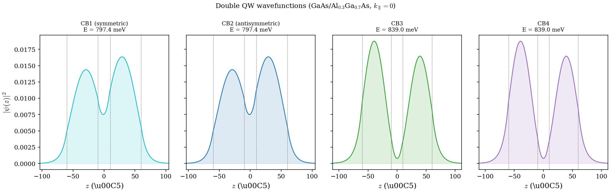

# Chapter 3: Eigenstates and Wavefunctions

## 1. From Eigenvalues to Eigenvectors

In Chapter 2 we constructed the Hamiltonian matrix $H(\mathbf{k})$ and diagonalized it to obtain the energy eigenvalues $E_n(\mathbf{k})$. The diagonalization routine (LAPACK's `zheevx` for dense matrices, or MKL sparse eigensolvers for large sparse problems) returns not only the eigenvalues but also the corresponding eigenvectors. These eigenvectors are the wavefunctions of the system, and they carry far richer physical information than the eigenvalues alone.

For a quantum well with $N$ finite-difference grid points, the Hamiltonian is an $8N \times 8N$ Hermitian matrix. Its eigenvectors are column vectors of dimension $8N$ with complex entries. Each eigenvector $\mathbf{c}^{(n)}$ describes one electronic state:

$$
H(\mathbf{k})\, \mathbf{c}^{(n)} = E_n(\mathbf{k})\, \mathbf{c}^{(n)}, \qquad n = 1, 2, \ldots, 8N.
$$

The question we address in this chapter is: **what do these $8N$ complex numbers mean physically, and how do we extract spatial and band-resolved information from them?**

## 2. The Block Structure of Eigenvectors

### 2.1 The 8-band basis

Recall that the 8-band Kane basis for zinc-blende semiconductors comprises:

| Band index | Label | Character |
|---|---|---|
| 1 | $|J=3/2,\, m_J=+3/2\rangle$ | Heavy hole (HH1) |
| 2 | $|J=3/2,\, m_J=+1/2\rangle$ | Light hole (LH1) |
| 3 | $|J=3/2,\, m_J=-1/2\rangle$ | Light hole (LH2) |
| 4 | $|J=3/2,\, m_J=-3/2\rangle$ | Heavy hole (HH2) |
| 5 | $|J=1/2,\, m_J=+1/2\rangle$ | Split-off (SO1) |
| 6 | $|J=1/2,\, m_J=-1/2\rangle$ | Split-off (SO2) |
| 7 | $|\Gamma_6,\, \uparrow\rangle$ | Conduction band (CB1) |
| 8 | $|\Gamma_6,\, \downarrow\rangle$ | Conduction band (CB2) |

This ordering is fixed throughout the code (bands 1--4 are valence, 5--6 are split-off, 7--8 are conduction) and must never be changed.

### 2.2 Spatial decomposition: the band-block structure

The $8N$-dimensional eigenvector is organized into 8 contiguous blocks of $N$ entries each. Entry $i$ of the $b$-th block corresponds to the amplitude of band $b$ at the $i$-th grid point $z_i$:

$$
\mathbf{c}^{(n)} = \begin{pmatrix} \psi_1^{(n)}(z_1) \\ \vdots \\ \psi_1^{(n)}(z_N) \\ \psi_2^{(n)}(z_1) \\ \vdots \\ \psi_2^{(n)}(z_N) \\ \vdots \\ \psi_8^{(n)}(z_1) \\ \vdots \\ \psi_8^{(n)}(z_N) \end{pmatrix}
$$

where $\psi_b^{(n)}(z_i)$ is the complex amplitude of band $b$ in eigenstate $n$ at grid point $z_i$. The flat index for band $b$ at spatial point $i$ is:

$$
\text{flat\_idx}(b, i) = (b - 1) \times N + i, \qquad b = 1, \ldots, 8, \quad i = 1, \ldots, N.
$$

{ width=85% }

This mapping is implemented directly in the code's `get_eigenvector_component` subroutine, which extracts the $N$-element spatial profile for a given band from the full eigenvector:

```fortran
base_idx = (band_index - 1) * fdstep + i
component(i) = abs(eigenvectors(base_idx, eigenstate_index))
```

The full multi-component wavefunction is thus a sum over bands:

$$
\Psi^{(n)}(\mathbf{r}) = \sum_{b=1}^{8} \psi_b^{(n)}(z)\, |b\rangle,
$$

where $|b\rangle$ denotes the basis kets listed in the table above, and $\psi_b^{(n)}(z)$ is obtained by interpolating the discrete values $\psi_b^{(n)}(z_i)$.

### 2.3 Bulk eigenvectors (no spatial dependence)

For bulk semiconductors ($N = 1$, no confinement), the Hamiltonian is only $8 \times 8$, and each eigenvector has exactly 8 complex components. There is no spatial profile -- the wavefunction is a plane wave extended throughout the crystal. The output code handles this case by writing only the 8 complex amplitudes:

$$
\mathbf{c}^{(n)}_{\text{bulk}} = \begin{pmatrix} c_1^{(n)} \\ c_2^{(n)} \\ \vdots \\ c_8^{(n)} \end{pmatrix}.
$$

The "parts" (band-resolved probability) are computed trivially as $|c_b^{(n)}|^2$.

## 3. Band-Resolved Probability Density

### 3.1 Per-band spatial density

For a quantum well eigenstate $n$, the probability density contributed by band $b$ at position $z$ is:

$$
\rho_b^{(n)}(z) = |\psi_b^{(n)}(z)|^2.
$$

The code computes and writes this quantity directly. In `writeEigenfunctions`, for each eigenstate and each of the 8 bands, the absolute value of the complex amplitude is extracted at every grid point:

```fortran
do m = 1, 8
  call get_eigenvector_component(A, j, m, fdstep, N, component)
  eigv_abs(:,m) = abs(component)
end do
```

The output file `eigenfunctions_k_XXXXX_ev_YYYYY.dat` contains $N$ rows (one per grid point), each with 9 columns: the $z$-coordinate followed by $|\psi_b^{(n)}(z_i)|$ for $b = 1, \ldots, 8$.

{ width=95% }

### 3.2 Total probability density

The total probability density at position $z$ is the sum over all bands:

$$
\rho^{(n)}(z) = \sum_{b=1}^{8} |\psi_b^{(n)}(z)|^2.
$$

Normalization of the eigenvector (as returned by LAPACK) means:

$$
\sum_{b=1}^{8} \int |\psi_b^{(n)}(z)|^2\, dz = \sum_{b=1}^{8} \sum_{i=1}^{N} |\psi_b^{(n)}(z_i)|^2 \approx 1.
$$

This is not the same as saying each band individually integrates to unity -- quite the contrary. The distribution across bands is precisely the information that tells us about the state's character.

## 4. Band Character: The Parts File

### 4.1 Definition

The **integrated band probability** (called "parts" in the code) quantifies how much of eigenstate $n$ resides in each of the 8 bands:

$$
P_b^{(n)} = \int |\psi_b^{(n)}(z)|^2\, dz \approx \Delta z \sum_{i=1}^{N} |\psi_b^{(n)}(z_i)|^2,
$$

where $\Delta z$ is the uniform grid spacing. The code implements this as a simple rectangular quadrature:

```fortran
do m = 1, 8
  call get_eigenvector_component(A, j, m, fdstep, N, component)
  eigv_abs(:,m) = abs(component)
  parts(j,m) = sum(eigv_abs(:,m)**2) * (z(2) - z(1))
end do
```

The output file `parts.dat` contains `evnum` rows (one per eigenstate) with 8 columns, giving the raw quadrature weights $P_b^{(n)}$ for each band. In the current implementation the eigensolver normalizes the discrete vector in Euclidean norm, so the row sum scales with the cell measure rather than being forced to unity:

$$
\sum_{b=1}^{8} P_b^{(n)} \approx \Delta z \qquad \text{(QW raw output)}.
$$

**Important: wire vs QW normalization.** In QW mode, `parts.dat` writes the raw quadrature weights described above, and the row sums scale with the grid spacing. In wire mode (2D confinement), the code normalizes each row to sum to unity before writing: $\sum_b P_b^{(n)} = 1$. This difference means wire `parts.dat` values can be read directly as band fractions, while QW values must first be divided by the row sum.

For physics interpretation we therefore use the normalized fractions

$$
\widetilde{P}_b^{(n)} = \frac{P_b^{(n)}}{\sum_{m=1}^{8} P_m^{(n)}},
$$

which do sum to 1 and are the quantities quoted below when we refer to HH, LH,
SO, or CB character fractions.

### 4.2 Physical interpretation

The parts vector $(P_1^{(n)}, P_2^{(n)}, \ldots, P_8^{(n)})$ tells you the **character** of eigenstate $n$:

- **Conduction band state**: $P_7^{(n)} + P_8^{(n)} \approx 1$, with bands 1--6 having negligible weight.
- **Heavy-hole state**: $P_1^{(n)} + P_4^{(n)} \approx 1$ (the two HH bands with $m_J = \pm 3/2$).
- **Light-hole state**: $P_2^{(n)} + P_3^{(n)} \approx 1$ (the two LH bands with $m_J = \pm 1/2$).
- **Split-off state**: $P_5^{(n)} + P_6^{(n)} \approx 1$.

In practice, at finite in-plane wavevector $\mathbf{k}_\parallel = (k_x, k_y)$, the bands couple and no eigenstate is purely of one character. The parts vector provides a quantitative measure of this **band mixing**.

## 5. Heavy-Hole vs Light-Hole Mixing

### 5.1 Mixing at finite in-plane wavevector

At the zone center ($\mathbf{k}_\parallel = 0$), the quantum well eigenstates have definite angular momentum character. The HH bands ($b = 1, 4$) and LH bands ($b = 2, 3$) decouple in the diagonal blocks $Q$ and $T$ of the Hamiltonian. However, the off-diagonal terms $S$, $R$, and their conjugates couple HH and LH at finite $k_\parallel$.

Consider the kp-term $S$, which appears in the Hamiltonian block structure as:

$$
S = 2\sqrt{3}\, k_{-}\, \gamma_3(z)\, \frac{d}{dz}, \qquad k_{-} = k_x - ik_y.
$$

This term couples HH1 (band 1) to LH1 (band 2) and appears in the off-diagonal block $H_{1,2}$. Similarly, $R$ couples HH to LH through the $k_x^2 - k_y^2$ dependence:

$$
R = -\sqrt{3}\left[\gamma_2(k_x^2 - k_y^2) - 2i\gamma_3 k_x k_y\right].
$$

The consequence is that at any finite $k_\parallel$, a nominally "heavy-hole" eigenstate acquires light-hole admixture, and vice versa. The degree of mixing depends on:

1. **The magnitude of $k_\parallel$**: larger $k$ means stronger coupling.
2. **The well width**: narrow wells push HH and LH subbands further apart (quantum confinement energy scales as $1/L^2$), reducing mixing.
3. **The Luttinger parameters** $\gamma_2$ and $\gamma_3$: materials with larger $\gamma_2/\gamma_3$ anisotropy show stronger mixing.
4. **The direction of $\mathbf{k}_\parallel$**: the mixing is anisotropic because $R$ depends on the angle $\phi = \arctan(k_y/k_x)$ in the $k_x$-$k_y$ plane.

### 5.2 Quantifying the mixing

The parts vector provides the simplest quantification. Define the **HH fraction** and **LH fraction** of eigenstate $n$:

$$
f_{\text{HH}}^{(n)} = P_1^{(n)} + P_4^{(n)}, \qquad f_{\text{LH}}^{(n)} = P_2^{(n)} + P_3^{(n)}.
$$

At $k_\parallel = 0$, a ground-state heavy hole will have $f_{\text{HH}} \approx 1$ and $f_{\text{LH}} \approx 0$. At finite $k_\parallel$, $f_{\text{HH}}$ decreases and $f_{\text{LH}}$ increases. The crossover point where $f_{\text{HH}} = f_{\text{LH}}$ is an important feature in the valence band dispersion and is directly related to the change in effective mass and optical polarization selection rules.

The conduction band states (bands 7--8) also acquire valence band character at large $k$ through the interband coupling term $P$ (the Kane momentum matrix element). This non-parabolicity effect is encoded in the parts as small but nonzero $P_1^{(n)}, \ldots, P_6^{(n)}$ for nominally CB states.

{ width=80% }

## 6. Implementation: How the Code Writes Wavefunctions

### 6.1 The writeEigenfunctions subroutine

The output pipeline is:

1. **Loop over eigenstates** ($j = 1$ to `evnum`): For each state, open a file named `eigenfunctions_k_XXXXX_ev_YYYYY.dat`.

2. **Extract band components**: For each of the 8 bands, call `get_eigenvector_component` to obtain the $N$-element spatial profile using the flat-index mapping $\text{flat\_idx} = (b-1) \times N + i$.

3. **Write spatial data**: For bulk, write 8 absolute amplitudes. For QW, write 9 columns: $z$ followed by $|\psi_b(z_i)|$ for $b = 1, \ldots, 8$.

4. **Compute parts**: Integrate $|\psi_b(z)|^2$ over $z$ using the rectangle rule with spacing $\Delta z = z_2 - z_1$, and write all eigenstates to a single `parts.dat` file.

### 6.2 The 2D wire case

For quantum wires (confinement mode 2), the code uses `writeEigenfunctions2d`. The eigenvector layout is analogous but now the spatial grid is 2D:

$$
\text{flat\_idx}(b, i_x, i_y) = (b - 1) \times N_{\text{grid}} + (i_y - 1) \times n_x + i_x,
$$

where $N_{\text{grid}} = n_x \times n_y$ is the total number of spatial grid points. The probability density at each grid point is summed over all 8 bands:

$$
\rho^{(n)}(x, y) = \sum_{b=1}^{8} |c^{(n)}_{\text{flat\_idx}(b, i_x, i_y)}|^2.
$$

The output format is three columns ($x$, $y$, $\rho$) with blank lines separating $y$-rows, directly plottable with `gnuplot splot`. The band-resolved parts are also computed, integrating over the 2D area element $dA = \Delta x \times \Delta y$.

### 6.3 Spin degeneracy and Kramers theorem

For systems without magnetic fields or structural inversion asymmetry, every eigenstate has a Kramers partner: a state at the same energy with opposite spin. In the output, this manifests as pairs of states with nearly identical parts vectors (e.g., $P_7 \approx P_8$ for CB states, or $P_1 \approx P_4$ for HH states at $k_\parallel = 0$). At finite $k_\parallel$ in asymmetric structures (e.g., under an external electric field), this degeneracy can be lifted and the parts vectors of the two spin partners may differ.

## 7. Computed Example: AlSbW/GaSbW/InAsW Quantum Well

To illustrate the concepts above with real data, we use the type-II AlSbW/GaSbW/InAsW quantum well. This structure is interesting because the conduction band electron is confined in the narrow InAs layer ($|z| \leq 35$ A) while the valence band holes reside mainly in the wider GaSb layer ($|z| \leq 135$ A), a hallmark of the broken-gap band alignment.

### 7.1 The input configuration

The configuration file `tests/regression/configs/qw_alsbw_gasbw_inasw.cfg` reads:

```
waveVector: kx
waveVectorMax: 0.1
waveVectorStep: 51
confinement:  1
FDstep: 401
FDorder: 4
numLayers:  3
material1: AlSbW -250  250 0
material2: GaSbW -135  135 0.2414
material3: InAsW  -35   35 -0.0914
numcb: 10
numvb: 10
ExternalField: 0  EF
EFParams: 0.0005
```

Key parameters: $N = 401$ grid points over $z \in [-250, 250]$ A (spacing $\Delta z = 1.25$ A), 3 material layers with AlSbW barriers, GaSbW as the main well, and a narrow InAsW insert. The code computes $10 + 10 = 20$ eigenvalues at each of 51 k-steps. This uses a finer grid than the reference regression config (FDstep=101, FDorder=2) for improved accuracy.

### 7.2 Reading an eigenfunction file

After running the code, the file `output/eigenfunctions_k_00001_ev_00011.dat` contains the ground-state conduction band wavefunction (eigenvalue $E_{11} = +0.0319$ eV). The first few lines look like this:

```
  -250.000       0.00000      0.279473E-08  0.351572E-07  0.983496E-47  0.831683E-09  0.104624E-07  0.197153E-08  0.248015E-07
  -248.750       0.00000      0.341641E-08  0.429728E-07  0.474887E-47  0.101516E-08  0.127637E-07  0.240864E-08  0.302937E-07
  -247.500       0.00000      0.417649E-08  0.525256E-07  0.229423E-47  0.123828E-08  0.155618E-07  0.294337E-08  0.370020E-07
  -246.250       0.00000      0.510497E-08  0.641997E-07  0.110837E-47  0.150985E-08  0.189772E-07  0.359532E-08  0.452024E-07
  -245.000       0.00000      0.624004E-08  0.784589E-07  0.535557E-48  0.184043E-08  0.231312E-07  0.439098E-08  0.552105E-07
```

Each row has 9 columns. The first column is the $z$-coordinate in Angstroms. Columns 2 through 9 give $|\psi_b(z_i)|$ for bands $b = 1, \ldots, 8$:

| Column | Band | Label |
|---|---|---|
| 1 | -- | $z$ position (A) |
| 2 | 1 | HH1: $|3/2, +3/2\rangle$ |
| 3 | 2 | LH1: $|3/2, +1/2\rangle$ |
| 4 | 3 | LH2: $|3/2, -1/2\rangle$ |
| 5 | 4 | HH2: $|3/2, -3/2\rangle$ |
| 6 | 5 | SO1: $|1/2, +1/2\rangle$ |
| 7 | 6 | SO2: $|1/2, -1/2\rangle$ |
| 8 | 7 | CB1: $|\Gamma_6, \uparrow\rangle$ |
| 9 | 8 | CB2: $|\Gamma_6, \downarrow\rangle$ |

**Important**: the values written are $|\psi_b(z_i)|$ (the absolute amplitudes), not $|\psi_b(z_i)|^2$ (the probability density). To obtain the probability density, you must square the values.

### 7.3 The CB1 ground-state wavefunction

For the current broken-gap configuration the first 32 extracted eigenstates are
valence-like and the first conduction-like Kramers pair is **state 33/34**, not
state 11/12. The corresponding `perband_density.png` panel therefore uses state
33 as CB1.

At $k_{\parallel}=0$, the normalized grouped character of state 33 is

$$
(\widetilde{P}_{\mathrm{HH}},\widetilde{P}_{\mathrm{LH}},\widetilde{P}_{\mathrm{SO}},\widetilde{P}_{\mathrm{CB}})
\approx (0.098,\ 0.047,\ 0.043,\ 0.812).
$$

So the lowest electron state is conduction-dominated, but it still carries
about 19% valence-band admixture because of the broken-gap InAs/GaSb coupling.
Its probability density is localized in the narrow InAs insert around
$|z| \le 35$ A and decays strongly into the AlSb barriers. The degenerate
partner state 34 has the same total envelope density but exchanges the two spin
components within the Kramers pair.

### 7.4 Computing the total probability density

To plot the total probability density, square each band amplitude and sum:

```gnuplot
plot 'output/eigenfunctions_k_00001_ev_00011.dat' \
  using 1:(($2**2)+($3**2)+($4**2)+($5**2)+($6**2)+($7**2)+($8**2)+($9**2)) \
  with lines title '|psi(z)|^2'
```

For the band-resolved density (conduction band only):

```gnuplot
plot 'output/eigenfunctions_k_00001_ev_00011.dat' \
  using 1:($8**2+$9**2) with lines title 'CB character'
```

For the present `qw_alsbw_gasbw_inasw.cfg` run, replace `00011` by `00033` if
you want the lowest conduction-like state.

### 7.5 Band-resolved parts: the full picture

The raw `parts.dat` rows for QW mode must be normalized before they are read as
band fractions. For this 101-point, 500 A domain run the row sums are
approximately 5 A, consistent with $\Delta z = 5$ A. The figure generator
therefore renormalizes each row before plotting `qw_parts.png`.

At $k_{\parallel}=0$, the first conduction-like pair appears at states 33/34:

| State | $E$ (eV) | $\widetilde{P}_{\mathrm{HH}}$ | $\widetilde{P}_{\mathrm{LH}}$ | $\widetilde{P}_{\mathrm{SO}}$ | $\widetilde{P}_{\mathrm{CB}}$ | Character |
|---|---|---|---|---|---|---|
| 1 | -0.1807 | 0.812 | 0.181 | 0.005 | 0.002 | HH-like |
| 7 | -0.1429 | 0.769 | 0.219 | 0.008 | 0.004 | HH-like |
| 29 | -0.0333 | 0.320 | 0.680 | 0.000 | 0.000 | LH-like |
| **33** | **+0.0205** | **0.098** | **0.047** | **0.043** | **0.812** | **CB1** |
| **35** | **+0.2903** | **0.079** | **0.063** | **0.041** | **0.817** | **CB2** |

Several features are worth noting:

1. **The state offset matters.** With `numvb: 32`, states 1--32 are the
   valence-like manifold and the first conduction-like state is state 33.
2. **Kramers pairs remain degenerate at $k=0$.** States 33/34 and 35/36 form
   nearly identical pairs in energy and total envelope density, differing only
   in the distribution between spin-resolved basis components.
3. **Broken-gap mixing is real but modest.** Even the lowest electron state is
   only about 81% conduction-like, with the remaining weight split across HH,
   LH, and SO sectors.

### 7.6 Spatial profiles


*Figure 1: Probability density $|\psi(z)|^2$ for the first four
conduction-like eigenstates of the AlSbW/GaSbW/InAsW quantum well at
$k_\parallel = 0$. For this configuration they are states 33--36, not states
1--4.*

The spatial profiles reveal the type-II nature of this structure. The
conduction-like states are localized within the narrow InAs insert
($|z| < 35$ A), while the valence-like states occupy the wider GaSb region
($|z| < 135$ A). The wavefunction decays exponentially into the AlSb barriers,
with a decay length that depends on the energy difference between the eigenvalue
and the barrier band edge.


*Figure 2: Band character decomposition (integrated parts) for the eigenstates of the AlSbW/GaSbW/InAsW QW. The conduction-band states (cyan) show ~18% valence-band admixture, reflecting the broken-gap alignment. The valence-band states show significant HH--LH mixing at finite $k_\parallel$ (see Section 7c).*

## 7b. Computed Example: GaAs/Al$_{0.3}$Ga$_{0.7}$As Type-I Quantum Well

For comparison with the broken-gap system above, we examine the wavefunctions
of the type-I GaAs/Al$_{0.3}$Ga$_{0.7}$As quantum well from Chapter 02,
Example A. This system has a 100 Å GaAs well sandwiched between AlGaAs barriers,
with a conduction band offset of 299 meV and a valence band offset of 159 meV.

### 7b.1 Configuration

```
waveVector: kx
waveVectorMax: 0.1
waveVectorStep: 21
confinement:  1
FDstep: 401
FDorder: 4
numLayers:  2
material1: Al30Ga70As -200 200 0
material2: GaAs -50 50 0
numcb: 4
numvb: 8
ExternalField: 0  EF
EFParams: 0.0
```

Domain: $z \in [-200, 200]$ Å with $N = 401$ grid points ($\Delta z = 1.0$ Å).
Two material layers: AlGaAs barrier covering the full domain, GaAs well occupying
$[-50, 50]$ Å. The code computes $4 + 8 = 12$ eigenvalues at each k-point.

### 7b.2 CB1 ground-state wavefunction

The ground-state electron (state 9, $E = +0.7613$ eV) is localized in the GaAs
well. Its spatial profile shows the characteristic half-sine envelope of a
confined state:

| $z$ (Å) | Region | $|\psi_7|$ (CB↑) | $|\psi_8|$ (CB↓) | $\rho_{\text{CB}}$ (Å$^{-1}$) |
|---|---|---|---|---|
| -200 | AlGaAs barrier | $5.2 \times 10^{-6}$ | $3.6 \times 10^{-6}$ | $4.0 \times 10^{-11}$ |
| -100 | AlGaAs barrier | $1.8 \times 10^{-3}$ | $1.3 \times 10^{-3}$ | $5.0 \times 10^{-6}$ |
| -60 | AlGaAs/GaAs interface | $2.2 \times 10^{-2}$ | $1.5 \times 10^{-2}$ | $7.0 \times 10^{-4}$ |
| -50 | GaAs well edge | $4.1 \times 10^{-2}$ | $2.8 \times 10^{-2}$ | $2.5 \times 10^{-3}$ |
| -25 | GaAs well | $8.2 \times 10^{-2}$ | $5.7 \times 10^{-2}$ | $1.0 \times 10^{-2}$ |
| 0 | Well center | $9.8 \times 10^{-2}$ | $6.8 \times 10^{-2}$ | $1.4 \times 10^{-2}$ |
| +50 | GaAs well edge | $4.1 \times 10^{-2}$ | $2.8 \times 10^{-2}$ | $2.5 \times 10^{-3}$ |
| +100 | AlGaAs barrier | $1.8 \times 10^{-3}$ | $1.3 \times 10^{-3}$ | $5.0 \times 10^{-6}$ |
| +200 | AlGaAs barrier | $5.2 \times 10^{-6}$ | $3.6 \times 10^{-6}$ | $4.0 \times 10^{-6}$ |

The wavefunction is symmetric about $z = 0$ and peaks at the well center with
$\rho_{\text{CB}}(0) = 1.4 \times 10^{-2}$ Å$^{-1}$. The CB↑ ($|\psi_7|$) and
CB↓ ($|\psi_8|$) components are comparable in magnitude, reflecting the spin
degeneracy at $k_\parallel = 0$. The exponential decay into the barrier spans
$\sim 10^{-2}$ to $\sim 10^{-11}$ Å$^{-1}$, a factor of $10^9$.

{ width=95% }

### 7b.3 Band-resolved parts

The integrated band character reveals important differences from the broken-gap
system:

| State | $E$ (eV) | $P_{\text{HH}}$ | $P_{\text{LH}}$ | $P_{\text{SO}}$ | $P_{\text{CB}}$ | Character |
|---|---|---|---|---|---|---|
| 1 | $-0.8262$ | 0.590 | 0.400 | 0.010 | 0.000 | HH1 |
| 2 | $-0.8262$ | 0.590 | 0.400 | 0.010 | 0.000 | HH1' |
| 3 | $-0.8209$ | 0.478 | 0.516 | 0.006 | 0.000 | LH1 |
| 4 | $-0.8209$ | 0.478 | 0.516 | 0.006 | 0.000 | LH1' |
| 7 | $-0.8023$ | 0.440 | 0.556 | 0.003 | 0.000 | LH2 |
| 8 | $-0.8023$ | 0.440 | 0.556 | 0.003 | 0.000 | LH2' |
| **9** | **$+0.7613$** | **0.086** | **0.033** | **0.044** | **0.837** | **CB1** |
| **10** | **$+0.7613$** | **0.086** | **0.033** | **0.044** | **0.837** | **CB1'** |
| **11** | **$+0.8750$** | **0.078** | **0.040** | **0.044** | **0.839** | **CB2** |
| **12** | **$+0.8750$** | **0.078** | **0.040** | **0.044** | **0.839** | **CB2'** |

Several features stand out:

1. **VB states are not pure HH.** The deepest hole state
   (HH1) has $P_{\text{HH}} = 0.590$ — it is 59% heavy-hole and 40% light-hole.
   This HH-LH mixing arises at finite $k_\parallel$ through the off-diagonal $S$ operator (proportional to
   $k_- d/dz$), which couples the HH and LH blocks.

2. **CB1 is 84% conduction-band.** The type-I CB1 has $P_{\text{CB}} = 0.837$,
   with 16% total valence-band admixture (9% HH, 3% LH, 4% SO). This is
   significantly more pure than the broken-gap CB1 ($P_{\text{CB}} = 0.812$ with
   18% VB admixture), but the difference is modest — even in a wide-gap type-I
   system, the 8-band coupling introduces non-negligible VB character.

3. **CB purity does not increase with energy.** CB1 ($P_{\text{CB}} = 0.837$)
   and CB2 ($P_{\text{CB}} = 0.839$) have nearly identical purity. In the
   type-I system, the coupling strength is relatively uniform across the
   confined CB states.

{ width=90% }

### 7b.4 Comparison: Type-I vs. Type-III

| Property | Type-I (GaAs/AlGaAs) | Type-III (AlSbW/GaSbW/InAsW) |
|---|---|---|
| CB1 $P_{\text{CB}}$ | 0.837 | 0.812 |
| CB1 VB admixture | 16% (9% HH, 3% LH, 4% SO) | 18% (10% HH, 5% LH, 4% SO) |
| CB1 energy above well edge | 42 meV | 204 meV |
| HH1 $P_{\text{HH}}$ | 0.590 | 0.267 |
| HH1 LH admixture | 40% | 46% |
| Wavefunction localization | CB and HH in same layer | CB in InAs, HH in GaSb |
| Band gap type | Straddling (type-I) | Broken gap (type-III) |

The most striking difference is not in the CB purity (which is similar at ~82-84%)
but in the **spatial separation** of carriers. In the type-I system, both CB1
and HH1 are localized in the same GaAs layer, giving large electron-hole overlap.
In the type-III system, CB1 is confined in the narrow InAs layer while HH1
spreads across the wider GaSb layer, reducing the overlap and hence the optical
matrix element for interband transitions.

A subtler difference is the VB state purity: type-I HH1 has $P_{\text{HH}} = 0.59$
(41% LH admixture), while type-III HH1 has $P_{\text{HH}} = 0.27$ (73% LH+other
admixture). The stronger mixing in the type-III system reflects the deeper wells
and larger Luttinger parameters of InAs and GaSb compared to GaAs.

## 7b-2. Coupled Quantum Well Wavefunctions

When two identical quantum wells are separated by a thin barrier, each confined state of the single well splits into a symmetric (bonding) and antisymmetric (antibonding) combination. This is the solid-state analogue of the molecular orbital picture: the double quantum well acts like a "diatomic molecule" for electrons.



*Figure 3b: Probability densities $|\psi(z)|^2$ for the first four conduction-band eigenstates of a double GaAs/Al$_{0.3}$Ga$_{0.7}$As quantum well at $k_{\parallel} = 0$. Two 50 A GaAs wells are separated by a 20 A AlGaAs coupling barrier.*

**CB1 (symmetric/bonding):** The ground state has nonzero amplitude in both wells with the same sign. There is no node at the barrier center ($z = 0$) -- the wavefunction tunnels through the thin barrier, maintaining a positive envelope across the entire structure. This is the bonding combination $\psi_{\text{CB1}} \propto \psi_L + \psi_R$, where $\psi_L$ and $\psi_R$ are the ground states of the left and right wells.

**CB2 (antisymmetric/antibonding):** The first excited state also has amplitude in both wells but with opposite sign. It has a node at the barrier center ($z = 0$). This is the antibonding combination $\psi_{\text{CB2}} \propto \psi_L - \psi_R$. The energy splitting between CB1 and CB2 equals twice the tunnel coupling matrix element: $\Delta_{\text{SAS}} = E_{\text{CB2}} - E_{\text{CB1}} = 2t$, where $t$ is the overlap integral of the evanescent tails in the barrier region. For the 20 A AlGaAs barrier, this splitting is approximately 42 meV.

Higher states (CB3, CB4) follow the same alternating pattern: each single-well excited state produces a symmetric-antisymmetric pair. The wavefunctions of these higher pairs penetrate less into the barrier because their oscillatory structure reduces the amplitude at the well edges.

## 7c. Band Character Evolution with In-Plane Wavevector

The band character of each eigenstate evolves with $k_\parallel$ due to the
off-diagonal coupling terms in the Hamiltonian. In QW mode the code rewrites
`parts.dat` for the selected output k-points, so k-resolved tracking requires
either integrating the per-state eigenfunction files or extending the output
format. Below we discuss the qualitative trends for the broken-gap
AlSbW/GaSbW/InAsW structure.

### 7c.1 Conduction band evolution

The first conduction-like Kramers pair starts at states 33/34 for this run, and
the `cb_parts_evolution.png` figure should be read with that offset in mind.
The qualitative trends are:

1. **The electron state becomes more conduction-like with increasing $k$.**
   Its energy rises away from the GaSb valence edge, reducing the strength of
   the broken-gap hybridization.
2. **HH weight appears only away from the zone center.** At $k=0$, symmetry
   strongly suppresses the HH coupling into the lowest electron state; finite
   in-plane wavevector activates the off-diagonal terms that admix HH
   components.
3. **The state never becomes purely conduction-band.** Even at larger
   $k_{\parallel}$ the broken-gap interface keeps a visible LH/SO tail.

{ width=80% }

### 7c.2 Valence band evolution

The VB states undergo an even more dramatic transformation:

| $k_\parallel$ (Å$^{-1}$) | State 1 (HH1) $P_{\text{HH}}$ | State 1 $P_{\text{LH}}$ | State 7 $P_{\text{HH}}$ | State 7 $P_{\text{LH}}$ |
|---|---|---|---|---|
| 0.00 | 1.000 | 0.000 | 1.000 | 0.000 |
| 0.04 | 0.803 | 0.194 | 0.519 | 0.480 |
| 0.10 | 0.534 | 0.464 | 0.328 | 0.672 |

At $k_\parallel = 0$, the HH block (bands 1, 4 with $m_J = \pm 3/2$) is completely decoupled from the LH/SO/CB block ($m_J = \pm 1/2$) in the Hamiltonian. All 10 computed VB states are purely HH. The LH and SO subbands exist but are not among the 10 lowest eigenstates returned by `zheevx`.

At finite $k$, the off-diagonal terms $S$ and $R$ couple HH and LH, and the mixing grows rapidly. By $k = 0.10$ Å$^{-1}$, state 7 has flipped from 100% HH to 67% LH -- it has become a predominantly light-hole state. State 1 retains majority HH character (53%) but with substantial LH admixture (46%). This HH--LH crossover is a general feature of QW valence bands and has important consequences for optical polarization selection rules and the density of states near the band edge.

### 7c.3 Why parts.dat only captures the last k-point

The code writes `parts.dat` with `status='replace'` in QW mode each time
`writeEigenfunctions` is called, so only the most recently written QW block is
preserved. To obtain k-resolved parts, one must either:

1. **Integrate the eigenfunction files** at each k-step (as done above), using $P_b = \Delta z \sum_i |\psi_b(z_i)|^2$.
2. **Modify the output routine** to append rather than replace, or write a separate parts file per k-step.

The eigenfunction files are written at only three k-points --- the first, middle, and last step of the sweep --- so option 1 is available only at those k-steps. If you need k-resolved parts at intermediate k-points, you must modify the output routine to write eigenfunctions at additional k-steps (or at every k-step).

## 7d. Quantum-Confined Stark Effect

The wavefunction profiles discussed so far were computed at zero external electric
field. Applying a uniform electric field $F$ along the growth direction $z$ adds a
linear potential $V_F(z) = -eFz$ that tilts the band edges. In a bulk semiconductor
this simply shifts all states uniformly (the Wannier-Stark ladder), but in a
quantum well the confinement potential prevents the electron from escaping, and the
field distorts the envelope function inside the well. This is the **quantum-confined
Stark effect** (QCSE).

The field is activated through the `ExternalField` input parameter:

```
ExternalField: 1  EF
EFParams: -0.007    ! Electric field in eV/Angstrom
```

A positive `EFParams` value corresponds to a field pointing in the $+z$ direction,
which shifts the conduction band edge downward on the right side of the well and
upward on the left. The code adds this linear potential directly to the diagonal
of the Hamiltonian before diagonalization, so all wavefunctions and parts are
computed self-consistently with the tilted profile.

### 7d.1 Band-edge distortion and subband shifts

The figure below compares the GaAs/Al$_{0.2}$Ga$_{0.8}$As QW at zero field and
at $F = -7 \times 10^{-3}$ eV/A (corresponding to approximately $-70$ kV/cm). The
left panel shows the band-edge profiles: under zero field the conduction and valence
band edges are flat within each layer; under the applied field they tilt linearly,
preserving the well shape but breaking the inversion symmetry. The right panel shows
the resulting subband energy shifts as horizontal lines, with annotated Stark shifts
in meV.

{ width=95% }

The Stark shift $\Delta E_n = E_n(F) - E_n(0)$ is negative for the electron
ground state (CB1 shifts to lower energy) because the field pushes the wavefunction
toward one side of the well, reducing its kinetic energy. The shift is quadratic in
the field for small fields, $\Delta E_n \propto -\alpha_n F^2$, where $\alpha_n$ is
the static polarizability of subband $n$. For the first excited state, the shift can
be positive or negative depending on the field direction and the symmetry of the
state.

### 7d.2 Wavefunction distortion

Under the applied field, the wavefunctions lose their inversion symmetry. The CB1
ground state, which is an even function centered at $z = 0$ at zero field, shifts its
peak toward the downhill side of the tilted potential. This has two important
consequences:

1. **Reduced overlap.** In a type-I QW, the electron and hole wavefunctions are both
   pushed toward the same side of the well, but by different amounts because their
   effective masses and confinement energies differ. The electron-hole overlap
   integral $\int \psi_e(z)\,\psi_h(z)\, dz$ decreases, reducing the oscillator
   strength of the interband transition. This is the basis of QCSE electro-absorption
   modulators.

2. **Broken-gap asymmetry.** In the type-III AlSbW/GaSbW/InAsW structure, the
   electron and hole are already spatially separated (CB in InAs, VB in GaSb). An
   applied field can either increase or decrease the electron-hole overlap depending
   on the field direction, providing an electrically tunable optical matrix element.

The QCSE connects directly to the `ExternalField` and `EFParams` input parameters.
By sweeping `EFParams` from 0 to some maximum value and recomputing the wavefunctions
and parts, one can trace the full evolution from a symmetric state to a strongly
asymmetric, field-polarized state. The parts vector provides a complementary
view: as the field increases, the band character of each state can change because the
wavefunction samples different material regions at different energies.

## 8. Discussion

### 8.1 Physical interpretation of wavefunction shapes

The shapes of the eigenfunctions encode the physics of quantum confinement. In a single-band effective-mass picture, the ground state would be a simple half-sine wave with no nodes inside the well. The 8-band k.p result differs in three important ways:

1. **Multi-component structure**: The wavefunction has 8 components, each with its own spatial profile. The CB1 state is not purely conduction-band but contains significant HH, LH, and SO admixture (18% total), as shown by the parts analysis.

2. **Material-dependent penetration**: The wavefunction decays at different rates in different layers. In the AlSb barrier, the decay is governed by the largest energy barrier. In the GaSb layer between the InAs well and the AlSb barrier, the wavefunction has a different effective mass and different decay length than in the barrier.

3. **Broken-gap mixing**: In this particular structure, the InAs conduction band edge lies below the GaSb valence band edge, so the "conduction band electron" is actually a mixture of InAs CB and GaSb VB states. This is visible in the 18% total VB admixture of the CB1 state (10% HH, 5% LH, 4% SO), and in the spatial overlap of CB and VB wavefunctions near the GaSb/InAs interfaces.

### 8.2 Connection to selection rules (Chapter 6)

The band character of each eigenstate directly determines the optical transition matrix elements. A transition between eigenstates $n$ and $m$ has a matrix element proportional to:

$$
M_{nm} \propto \sum_{b,b'} \int \psi_b^{(n)*}(z)\, \hat{e} \cdot \mathbf{p}_{bb'}\, \psi_{b'}^{(m)}(z)\, dz,
$$

where $\mathbf{p}_{bb'}$ are the momentum matrix elements between bands $b$ and $b'$. The parts vector provides a quick estimate: if state $n$ is mostly CB ($P_7 + P_8 > 0.8$) and state $m$ is mostly HH ($P_1 + P_4 > 0.5$), the transition will be dominated by the $\Gamma_6$--$\Gamma_8$ matrix element and will be strongly polarization-dependent. The VB admixture in the CB1 state of the broken-gap QW means that transitions involving this state have contributions from multiple band-to-band matrix elements, which we explore in Chapter 6.

### 8.3 Tips for plotting and analysis

**Quick identification of state character**: Read `parts.dat` and look at which columns dominate:

- Columns 7--8 large: conduction band state
- Columns 1, 4 large: heavy hole state
- Columns 2, 3 large: light hole state
- Columns 5--6 large: split-off state

**Plotting wavefunctions with material layers**: Overlay the layer boundaries as vertical lines:

```gnuplot
set arrow from -35, graph 0 to -35, graph 1 nohead lt -1
set arrow from  35, graph 0 to  35, graph 1 nohead lt -1
set arrow from -135, graph 0 to -135, graph 1 nohead lt -1
set arrow from  135, graph 0 to  135, graph 1 nohead lt -1
plot 'output/eigenfunctions_k_00001_ev_00011.dat' \
  using 1:(($2**2)+($3**2)+($4**2)+($5**2)+($6**2)+($7**2)+($8**2)+($9**2)) \
  with lines title 'CB1 total |psi|^2'
```

**Tracking band mixing with k**: The eigenfunction files are written at each k-step. By plotting the parts as a function of $k$, you can visualize the evolution from pure HH character at $k = 0$ to mixed HH/LH character at finite $k$, and identify anticrossings where two states swap character.

**Cross-referencing with eigenvalues**: The file `eigenvalues.dat` contains `waveVectorStep` rows with $|\mathbf{k}|$ in the first column and the sorted eigenvalues in the remaining columns. By matching eigenvalue indices to the parts file, you can track which subband each eigenstate belongs to across the Brillouin zone.

### 8.4 The Phase Information Pitfall

A common pitfall when analyzing the code's output is attempting to use the `eigenfunctions_k_XXXXX_ev_YYYYY.dat` files to compute interference effects or transition matrix elements. **You cannot do this.**

As discussed in Section 3.1, the code writes the *absolute values* $|\psi_b(z)|$ of the complex wavefunction components. The global phase of an eigenstate is arbitrary, but the *relative* phase between the 8 band components $\psi_b(z)$ and $\psi_{b'}(z)$ encodes the crucial orbital mixing physics. By taking the absolute value before writing to disk, this relative phase information is lost. 

The output files are designed strictly for visualizing the probability density $\rho(z)$. If you need to compute optical matrix elements or other observables that depend on the relative phases, you must do so internally within the Fortran code (as done by the `gfactorCalculation` executable) before the phase is discarded.

## 9. Summary

The eigenvectors of the 8-band k.p Hamiltonian encode the full multi-component wavefunction of each electronic state. By decomposing the $8N$-component vector into 8 spatial profiles, we obtain:

- **Band-resolved probability densities** $|\psi_b(z)|^2$ showing how the wavefunction distributes across the HH, LH, SO, and CB manifolds.
- **Integrated parts** $P_b^{(n)}$ quantifying the band character of each eigenstate.
- **Heavy-hole/light-hole mixing** that evolves with in-plane wavevector and determines the optical and spin properties of the system.

The AlSbW/GaSbW/InAsW example demonstrates that in broken-gap structures, the CB1 electron retains about 18% valence band character (HH, LH, and SO combined), far from the simple single-band picture. The HH--LH mixing in the VB states themselves is also pronounced, with no purely HH or LH states at the zone center. This mixing has direct consequences for optical transitions (Chapter 6), g-factors (Chapter 5), and the accuracy of effective-mass approximations.

These quantities are computed directly by the code's `writeEigenfunctions` subroutine using the flat-index mapping $\text{flat\_idx} = (b-1) \times N + i$, and are written to per-eigenstate data files and the aggregated `parts.dat` file. Understanding and visualizing these outputs is essential for interpreting the physics of quantum well and quantum wire structures simulated by the code.
