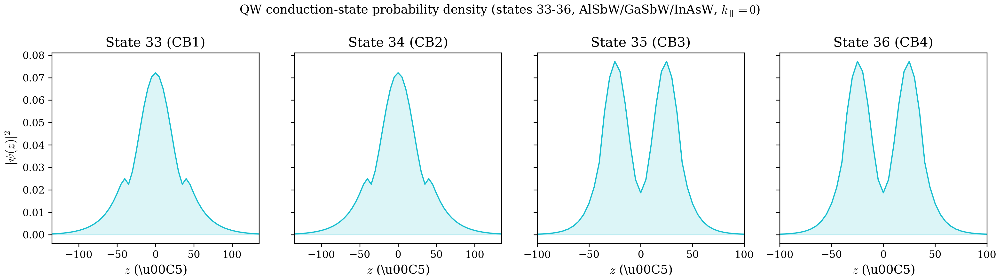
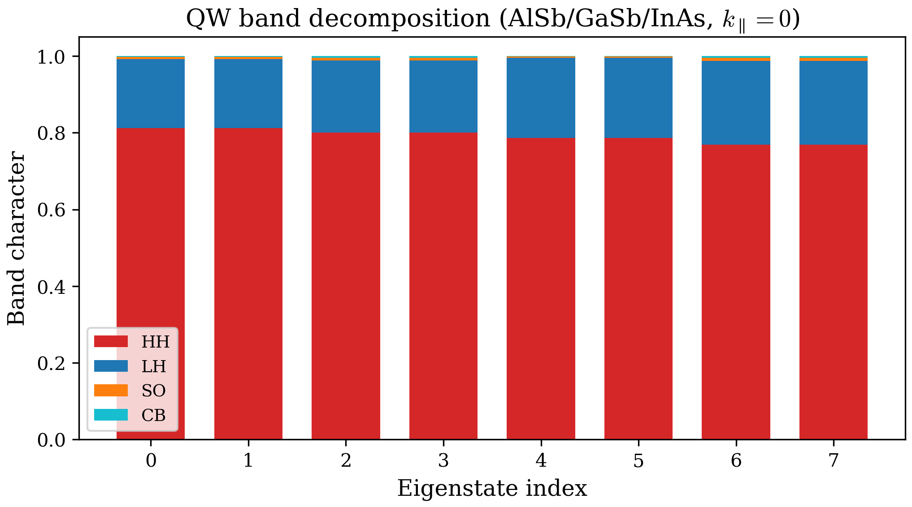

# Chapter 3: Eigenstates and Wavefunctions

## 1. From Eigenvalues to Eigenvectors

In Chapter 2 we constructed the Hamiltonian matrix $H(\mathbf{k})$ and diagonalized it to obtain the energy eigenvalues $E_n(\mathbf{k})$. The diagonalization routine (LAPACK's `zheevx` for dense matrices, or MKL sparse eigensolvers for large sparse problems) returns not only the eigenvalues but also the corresponding eigenvectors. These eigenvectors are the wavefunctions of the system, and they carry far richer physical information than the eigenvalues alone.

For a quantum well with $N$ finite-difference grid points, the Hamiltonian is an $8N \times 8N$ Hermitian matrix. Its eigenvectors are column vectors of dimension $8N$ with complex entries. Each eigenvector $\mathbf{c}^{(n)}$ describes one electronic state:

$$
H(\mathbf{k})\, \mathbf{c}^{(n)} = E_n(\mathbf{k})\, \mathbf{c}^{(n)}, \qquad n = 1, 2, \ldots, 8N.
$$

The question we address in this chapter is: **what do these $8N$ complex numbers mean physically, and how do we extract spatial and band-resolved information from them?**

## 2. The Block Structure of Eigenvectors

### 2.1 The 8-band basis

Recall that the 8-band Kane basis for zinc-blende semiconductors comprises:

| Band index | Label | Character |
|---|---|---|
| 1 | $|J=3/2,\, m_J=+3/2\rangle$ | Heavy hole (HH1) |
| 2 | $|J=3/2,\, m_J=+1/2\rangle$ | Light hole (LH1) |
| 3 | $|J=3/2,\, m_J=-1/2\rangle$ | Light hole (LH2) |
| 4 | $|J=3/2,\, m_J=-3/2\rangle$ | Heavy hole (HH2) |
| 5 | $|J=1/2,\, m_J=+1/2\rangle$ | Split-off (SO1) |
| 6 | $|J=1/2,\, m_J=-1/2\rangle$ | Split-off (SO2) |
| 7 | $|\Gamma_6,\, \uparrow\rangle$ | Conduction band (CB1) |
| 8 | $|\Gamma_6,\, \downarrow\rangle$ | Conduction band (CB2) |

This ordering is fixed throughout the code (bands 1--4 are valence, 5--6 are split-off, 7--8 are conduction) and must never be changed.

### 2.2 Spatial decomposition: the band-block structure

The $8N$-dimensional eigenvector is organized into 8 contiguous blocks of $N$ entries each. Entry $i$ of the $b$-th block corresponds to the amplitude of band $b$ at the $i$-th grid point $z_i$:

$$
\mathbf{c}^{(n)} = \begin{pmatrix} \psi_1^{(n)}(z_1) \\ \vdots \\ \psi_1^{(n)}(z_N) \\ \psi_2^{(n)}(z_1) \\ \vdots \\ \psi_2^{(n)}(z_N) \\ \vdots \\ \psi_8^{(n)}(z_1) \\ \vdots \\ \psi_8^{(n)}(z_N) \end{pmatrix}
$$

where $\psi_b^{(n)}(z_i)$ is the complex amplitude of band $b$ in eigenstate $n$ at grid point $z_i$. The flat index for band $b$ at spatial point $i$ is:

$$
\text{flat\_idx}(b, i) = (b - 1) \times N + i, \qquad b = 1, \ldots, 8, \quad i = 1, \ldots, N.
$$

This mapping is implemented directly in the code's `get_eigenvector_component` subroutine, which extracts the $N$-element spatial profile for a given band from the full eigenvector:

```fortran
base_idx = (band_index - 1) * fdstep + i
component(i) = abs(eigenvectors(base_idx, eigenstate_index))
```

The full multi-component wavefunction is thus a sum over bands:

$$
\Psi^{(n)}(\mathbf{r}) = \sum_{b=1}^{8} \psi_b^{(n)}(z)\, |b\rangle,
$$

where $|b\rangle$ denotes the basis kets listed in the table above, and $\psi_b^{(n)}(z)$ is obtained by interpolating the discrete values $\psi_b^{(n)}(z_i)$.

### 2.3 Bulk eigenvectors (no spatial dependence)

For bulk semiconductors ($N = 1$, no confinement), the Hamiltonian is only $8 \times 8$, and each eigenvector has exactly 8 complex components. There is no spatial profile -- the wavefunction is a plane wave extended throughout the crystal. The output code handles this case by writing only the 8 complex amplitudes:

$$
\mathbf{c}^{(n)}_{\text{bulk}} = \begin{pmatrix} c_1^{(n)} \\ c_2^{(n)} \\ \vdots \\ c_8^{(n)} \end{pmatrix}.
$$

The "parts" (band-resolved probability) are computed trivially as $|c_b^{(n)}|^2$.

## 3. Band-Resolved Probability Density

### 3.1 Per-band spatial density

For a quantum well eigenstate $n$, the probability density contributed by band $b$ at position $z$ is:

$$
\rho_b^{(n)}(z) = |\psi_b^{(n)}(z)|^2.
$$

The code computes and writes this quantity directly. In `writeEigenfunctions`, for each eigenstate and each of the 8 bands, the absolute value of the complex amplitude is extracted at every grid point:

```fortran
do m = 1, 8
  call get_eigenvector_component(A, j, m, fdstep, N, component)
  eigv_abs(:,m) = abs(component)
end do
```

The output file `eigenfunctions_k_XXXXX_ev_YYYYY.dat` contains $N$ rows (one per grid point), each with 9 columns: the $z$-coordinate followed by $|\psi_b^{(n)}(z_i)|$ for $b = 1, \ldots, 8$.

### 3.2 Total probability density

The total probability density at position $z$ is the sum over all bands:

$$
\rho^{(n)}(z) = \sum_{b=1}^{8} |\psi_b^{(n)}(z)|^2.
$$

Normalization of the eigenvector (as returned by LAPACK) means:

$$
\sum_{b=1}^{8} \int |\psi_b^{(n)}(z)|^2\, dz = \sum_{b=1}^{8} \sum_{i=1}^{N} |\psi_b^{(n)}(z_i)|^2 \approx 1.
$$

This is not the same as saying each band individually integrates to unity -- quite the contrary. The distribution across bands is precisely the information that tells us about the state's character.

## 4. Band Character: The Parts File

### 4.1 Definition

The **integrated band probability** (called "parts" in the code) quantifies how much of eigenstate $n$ resides in each of the 8 bands:

$$
P_b^{(n)} = \int |\psi_b^{(n)}(z)|^2\, dz \approx \Delta z \sum_{i=1}^{N} |\psi_b^{(n)}(z_i)|^2,
$$

where $\Delta z$ is the uniform grid spacing. The code implements this as a simple rectangular quadrature:

```fortran
do m = 1, 8
  call get_eigenvector_component(A, j, m, fdstep, N, component)
  eigv_abs(:,m) = abs(component)
  parts(j,m) = sum(eigv_abs(:,m)**2) * (z(2) - z(1))
end do
```

The output file `parts.dat` contains `evnum` rows (one per eigenstate) with 8 columns, giving $P_b^{(n)}$ for each band. By construction:

$$
\sum_{b=1}^{8} P_b^{(n)} = 1 \qquad \text{(normalization)}.
$$

### 4.2 Physical interpretation

The parts vector $(P_1^{(n)}, P_2^{(n)}, \ldots, P_8^{(n)})$ tells you the **character** of eigenstate $n$:

- **Conduction band state**: $P_7^{(n)} + P_8^{(n)} \approx 1$, with bands 1--6 having negligible weight.
- **Heavy-hole state**: $P_1^{(n)} + P_4^{(n)} \approx 1$ (the two HH bands with $m_J = \pm 3/2$).
- **Light-hole state**: $P_2^{(n)} + P_3^{(n)} \approx 1$ (the two LH bands with $m_J = \pm 1/2$).
- **Split-off state**: $P_5^{(n)} + P_6^{(n)} \approx 1$.

In practice, at finite in-plane wavevector $\mathbf{k}_\parallel = (k_x, k_y)$, the bands couple and no eigenstate is purely of one character. The parts vector provides a quantitative measure of this **band mixing**.

## 5. Heavy-Hole vs Light-Hole Mixing

### 5.1 Mixing at finite in-plane wavevector

At the zone center ($\mathbf{k}_\parallel = 0$), the quantum well eigenstates have definite angular momentum character. The HH bands ($b = 1, 4$) and LH bands ($b = 2, 3$) decouple in the diagonal blocks $Q$ and $T$ of the Hamiltonian. However, the off-diagonal terms $S$, $R$, and their conjugates couple HH and LH at finite $k_\parallel$.

Consider the kp-term $S$, which appears in the Hamiltonian block structure as:

$$
S = 2\sqrt{3}\, k_{-}\, \gamma_3(z)\, \frac{d}{dz}, \qquad k_{-} = k_x - ik_y.
$$

This term couples HH1 (band 1) to LH1 (band 2) and appears in the off-diagonal block $H_{1,2}$. Similarly, $R$ couples HH to LH through the $k_x^2 - k_y^2$ dependence:

$$
R = -\sqrt{3}\left[\gamma_2(k_x^2 - k_y^2) - 2i\gamma_3 k_x k_y\right].
$$

The consequence is that at any finite $k_\parallel$, a nominally "heavy-hole" eigenstate acquires light-hole admixture, and vice versa. The degree of mixing depends on:

1. **The magnitude of $k_\parallel$**: larger $k$ means stronger coupling.
2. **The well width**: narrow wells push HH and LH subbands further apart (quantum confinement energy scales as $1/L^2$), reducing mixing.
3. **The Luttinger parameters** $\gamma_2$ and $\gamma_3$: materials with larger $\gamma_2/\gamma_3$ anisotropy show stronger mixing.
4. **The direction of $\mathbf{k}_\parallel$**: the mixing is anisotropic because $R$ depends on the angle $\phi = \arctan(k_y/k_x)$ in the $k_x$-$k_y$ plane.

### 5.2 Quantifying the mixing

The parts vector provides the simplest quantification. Define the **HH fraction** and **LH fraction** of eigenstate $n$:

$$
f_{\text{HH}}^{(n)} = P_1^{(n)} + P_4^{(n)}, \qquad f_{\text{LH}}^{(n)} = P_2^{(n)} + P_3^{(n)}.
$$

At $k_\parallel = 0$, a ground-state heavy hole will have $f_{\text{HH}} \approx 1$ and $f_{\text{LH}} \approx 0$. At finite $k_\parallel$, $f_{\text{HH}}$ decreases and $f_{\text{LH}}$ increases. The crossover point where $f_{\text{HH}} = f_{\text{LH}}$ is an important feature in the valence band dispersion and is directly related to the change in effective mass and optical polarization selection rules.

The conduction band states (bands 7--8) also acquire valence band character at large $k$ through the interband coupling term $P$ (the Kane momentum matrix element). This non-parabolicity effect is encoded in the parts as small but nonzero $P_1^{(n)}, \ldots, P_6^{(n)}$ for nominally CB states.

## 6. Implementation: How the Code Writes Wavefunctions

### 6.1 The writeEigenfunctions subroutine

The output pipeline is:

1. **Loop over eigenstates** ($j = 1$ to `evnum`): For each state, open a file named `eigenfunctions_k_XXXXX_ev_YYYYY.dat`.

2. **Extract band components**: For each of the 8 bands, call `get_eigenvector_component` to obtain the $N$-element spatial profile using the flat-index mapping $\text{flat\_idx} = (b-1) \times N + i$.

3. **Write spatial data**: For bulk, write 8 absolute amplitudes. For QW, write 9 columns: $z$ followed by $|\psi_b(z_i)|$ for $b = 1, \ldots, 8$.

4. **Compute parts**: Integrate $|\psi_b(z)|^2$ over $z$ using the rectangle rule with spacing $\Delta z = z_2 - z_1$, and write all eigenstates to a single `parts.dat` file.

### 6.2 The 2D wire case

For quantum wires (confinement mode 2), the code uses `writeEigenfunctions2d`. The eigenvector layout is analogous but now the spatial grid is 2D:

$$
\text{flat\_idx}(b, i_x, i_y) = (b - 1) \times N_{\text{grid}} + (i_y - 1) \times n_x + i_x,
$$

where $N_{\text{grid}} = n_x \times n_y$ is the total number of spatial grid points. The probability density at each grid point is summed over all 8 bands:

$$
\rho^{(n)}(x, y) = \sum_{b=1}^{8} |c^{(n)}_{\text{flat\_idx}(b, i_x, i_y)}|^2.
$$

The output format is three columns ($x$, $y$, $\rho$) with blank lines separating $y$-rows, directly plottable with `gnuplot splot`. The band-resolved parts are also computed, integrating over the 2D area element $dA = \Delta x \times \Delta y$.

### 6.3 Spin degeneracy and Kramers theorem

For systems without magnetic fields or structural inversion asymmetry, every eigenstate has a Kramers partner: a state at the same energy with opposite spin. In the output, this manifests as pairs of states with nearly identical parts vectors (e.g., $P_7 \approx P_8$ for CB states, or $P_1 \approx P_4$ for HH states at $k_\parallel = 0$). At finite $k_\parallel$ in asymmetric structures (e.g., under an external electric field), this degeneracy can be lifted and the parts vectors of the two spin partners may differ.

## 7. Computed Example: AlSbW/GaSbW/InAsW Quantum Well

To illustrate the concepts above with real data, we use the type-II AlSbW/GaSbW/InAsW quantum well. This structure is interesting because the conduction band electron is confined in the narrow InAs layer ($|z| \leq 35$ A) while the valence band holes reside mainly in the wider GaSb layer ($|z| \leq 135$ A), a hallmark of the broken-gap band alignment.

### 7.1 The input configuration

The configuration file `tests/regression/configs/qw_alsbw_gasbw_inasw.cfg` reads:

```
waveVector: kx
waveVectorMax: 0.1
waveVectorStep: 51
confinement:  1
FDstep: 401
FDorder: 4
numLayers:  3
material1: AlSbW -250  250 0
material2: GaSbW -135  135 0.2414
material3: InAsW  -35   35 -0.0914
numcb: 10
numvb: 10
ExternalField: 0  EF
EFParams: 0.0005
```

Key parameters: $N = 401$ grid points over $z \in [-250, 250]$ A (spacing $\Delta z = 1.25$ A), 3 material layers with AlSbW barriers, GaSbW as the main well, and a narrow InAsW insert. The code computes $10 + 10 = 20$ eigenvalues at each of 51 k-steps. This uses a finer grid than the reference regression config (FDstep=101, FDorder=2) for improved accuracy.

### 7.2 Reading an eigenfunction file

After running the code, the file `output/eigenfunctions_k_00001_ev_00011.dat` contains the ground-state conduction band wavefunction (eigenvalue $E_{11} = +0.0319$ eV). The first few lines look like this:

```
  -250.000       0.00000      0.279473E-08  0.351572E-07  0.983496E-47  0.831683E-09  0.104624E-07  0.197153E-08  0.248015E-07
  -248.750       0.00000      0.341641E-08  0.429728E-07  0.474887E-47  0.101516E-08  0.127637E-07  0.240864E-08  0.302937E-07
  -247.500       0.00000      0.417649E-08  0.525256E-07  0.229423E-47  0.123828E-08  0.155618E-07  0.294337E-08  0.370020E-07
  -246.250       0.00000      0.510497E-08  0.641997E-07  0.110837E-47  0.150985E-08  0.189772E-07  0.359532E-08  0.452024E-07
  -245.000       0.00000      0.624004E-08  0.784589E-07  0.535557E-48  0.184043E-08  0.231312E-07  0.439098E-08  0.552105E-07
```

Each row has 9 columns. The first column is the $z$-coordinate in Angstroms. Columns 2 through 9 give $|\psi_b(z_i)|$ for bands $b = 1, \ldots, 8$:

| Column | Band | Label |
|---|---|---|
| 1 | -- | $z$ position (A) |
| 2 | 1 | HH1: $|3/2, +3/2\rangle$ |
| 3 | 2 | LH1: $|3/2, +1/2\rangle$ |
| 4 | 3 | LH2: $|3/2, -1/2\rangle$ |
| 5 | 4 | HH2: $|3/2, -3/2\rangle$ |
| 6 | 5 | SO1: $|1/2, +1/2\rangle$ |
| 7 | 6 | SO2: $|1/2, -1/2\rangle$ |
| 8 | 7 | CB1: $|\Gamma_6, \uparrow\rangle$ |
| 9 | 8 | CB2: $|\Gamma_6, \downarrow\rangle$ |

**Important**: the values written are $|\psi_b(z_i)|$ (the absolute amplitudes), not $|\psi_b(z_i)|^2$ (the probability density). To obtain the probability density, you must square the values.

### 7.3 The CB1 ground-state wavefunction

The following table shows the CB1 wavefunction at selected positions along the growth axis. We list $|\psi_b(z)|$ for the dominant bands and the total probability density $\rho(z) = \sum_b |\psi_b(z)|^2$:

| $z$ (A) | Region | $|\psi_8|$ (CB2) | $|\psi_7|$ (CB1) | $|\psi_3|$ (LH2) | $|\psi_6|$ (SO2) | $\rho(z)$ |
|---|---|---|---|---|---|---|
| -250 | AlSb barrier | 2.5e-8 | 2.0e-9 | 3.5e-8 | 1.1e-8 | 2.0e-15 |
| -150 | GaSb well | 5.6e-4 | 4.4e-5 | 1.2e-3 | 3.1e-4 | 1.7e-6 |
| -40 | GaSb/InAs interface | 2.4e-2 | 1.9e-3 | 7.4e-2 | 7.2e-3 | 6.2e-3 |
| -35 | InAs layer edge | 4.3e-2 | 3.4e-3 | 6.2e-2 | 1.8e-2 | 6.1e-3 |
| -10 | InAs well center | 1.3e-1 | 1.0e-2 | 2.0e-2 | 8.7e-3 | 1.7e-2 |
| 0 | Well center | 1.4e-1 | 1.1e-2 | ~0 | ~0 | 1.9e-2 |
| +10 | InAs well center | 1.3e-1 | 1.0e-2 | 2.0e-2 | 8.7e-3 | 1.7e-2 |
| +35 | InAs layer edge | 4.3e-2 | 3.4e-3 | 6.2e-2 | 1.8e-2 | 6.1e-3 |
| +150 | GaSb well | 5.6e-4 | 4.4e-5 | 1.2e-3 | 3.1e-4 | 1.7e-6 |
| +250 | AlSb barrier | 2.5e-8 | 2.0e-9 | 3.5e-8 | 1.1e-8 | 2.0e-15 |

The wavefunction peaks at $z = 0$ (the center of the InAs layer) with $\rho(0) = 1.9 \times 10^{-2}$ A$^{-1}$. The CB2 component $|\psi_8|$ (spin-down conduction band) is the dominant contributor, reaching 0.137 at the center. The CB1 component $|\psi_7|$ (spin-up) reaches 0.011. This large asymmetry between $P_7$ and $P_8$ ($P_7 = 0.810$ vs $P_8 = 0.001$ for state 11) is a consequence of the Kramers structure: state 11 is predominantly spin-up CB, and its partner state 12 is predominantly spin-down CB with $P_8 = 0.810$ vs $P_7 = 0.001$.

The exponential decay into the AlSb barrier is clearly visible: $\rho$ drops from $O(10^{-2})$ inside the well to $O(10^{-15})$ at the barrier boundary, a factor of $10^{13}$.

### 7.4 Computing the total probability density

To plot the total probability density, square each band amplitude and sum:

```gnuplot
plot 'output/eigenfunctions_k_00001_ev_00011.dat' \
  using 1:(($2**2)+($3**2)+($4**2)+($5**2)+($6**2)+($7**2)+($8**2)+($9**2)) \
  with lines title '|psi(z)|^2'
```

For the band-resolved density (conduction band only):

```gnuplot
plot 'output/eigenfunctions_k_00001_ev_00011.dat' \
  using 1:($8**2+$9**2) with lines title 'CB character'
```

### 7.5 Band-resolved parts: the full picture

The integrated band probabilities (normalized to sum to 1) reveal the character of each eigenstate. For the AlSbW/GaSbW/InAsW structure at $k_\parallel = 0$, computed with FDstep=401 and FDorder=4:

**Valence band states** (states 1--10, energies negative):

| State | $E$ (eV) | $P_1$ (HH1) | $P_2$ (LH1) | $P_3$ (LH2) | $P_4$ (HH2) | $P_5$ (SO1) | $P_6$ (SO2) | $P_7$ (CB1) | $P_8$ (CB2) | Character |
|---|---|---|---|---|---|---|---|---|---|---|
| 1 | -0.0609 | 0.2667 | 0.2320 | 0.2321 | 0.2667 | 0.0010 | 0.0010 | 0.0002 | 0.0002 | HH1+LH |
| 2 | -0.0609 | 0.2667 | 0.2321 | 0.2320 | 0.2667 | 0.0010 | 0.0010 | 0.0002 | 0.0002 | HH1'+LH |
| 7 | -0.0334 | 0.1638 | 0.3361 | 0.3361 | 0.1638 | 0.0001 | 0.0001 | 0.0000 | 0.0000 | LH+HH |
| 8 | -0.0334 | 0.1638 | 0.3361 | 0.3361 | 0.1638 | 0.0001 | 0.0001 | 0.0000 | 0.0000 | LH'+HH |

**Conduction band states** (states 11--20, energies positive):

| State | $E$ (eV) | $P_1$ (HH1) | $P_2$ (LH1) | $P_3$ (LH2) | $P_4$ (HH2) | $P_5$ (SO1) | $P_6$ (SO2) | $P_7$ (CB1) | $P_8$ (CB2) | Character |
|---|---|---|---|---|---|---|---|---|---|---|
| **11** | **+0.0319** | **0.0972** | **0.0149** | **0.0331** | **0.0002** | **0.0046** | **0.0381** | **0.8104** | **0.0014** | **CB1** |
| **12** | **+0.0319** | **0.0002** | **0.0331** | **0.0149** | **0.0972** | **0.0381** | **0.0046** | **0.0014** | **0.8104** | **CB1'** |
| 13 | +0.3254 | 0.0758 | 0.0370 | 0.0277 | 0.0020 | 0.0124 | 0.0285 | 0.7955 | 0.0211 | CB2 |
| 14 | +0.3254 | 0.0020 | 0.0277 | 0.0370 | 0.0758 | 0.0285 | 0.0124 | 0.0211 | 0.7955 | CB2' |
| 17 | +0.8507 | 0.0117 | 0.0311 | 0.0120 | 0.0901 | 0.0276 | 0.0058 | 0.0944 | 0.7273 | CB4 |
| 18 | +0.8507 | 0.0901 | 0.0120 | 0.0311 | 0.0117 | 0.0058 | 0.0276 | 0.7273 | 0.0944 | CB4' |

Several features are worth noting:

1. **Spin degeneracy (Kramers pairs)**: States 11 and 12 are degenerate at $E = +0.0319$ eV and have swapped parts: state 11 has $P_7 = 0.8104$ (CB1-dominant) while state 12 has $P_8 = 0.8104$ (CB2-dominant). The Kramers partner structure at $k_\parallel = 0$ exchanges $P_1 \leftrightarrow P_4$, $P_2 \leftrightarrow P_3$, $P_5 \leftrightarrow P_6$, and $P_7 \leftrightarrow P_8$.

2. **Valence band admixture in CB1**: The ground-state electron has $P_1 = 0.0972$ (HH), $P_3 = 0.0331$ (LH), and $P_6 = 0.0381$ (SO), totaling 18% valence band character. The broken-gap alignment between InAs and GaSb creates this interband mixing, but it is less dramatic than the coarse-grid result (FDstep=101) which overestimated the admixture. The fine grid reveals that CB1 is predominantly conduction-band (82%).

3. **Higher CB states maintain similar purity**: State 17 ($E = 0.8507$ eV) has $P_7 + P_8 = 0.822$, comparable to CB1. Unlike a simple type-I QW where higher states become purer, in this broken-gap structure the higher CB states remain coupled to the valence band through the type-II interface, maintaining about 18% VB admixture across the entire CB manifold.

4. **Mixed VB states at the valence band edge**: Unlike a type-I QW where VB states are purely HH or LH at $k = 0$, the broken-gap alignment creates strong HH--LH mixing even at the zone center. State 1 has $f_{\text{HH}} = 0.534$ and $f_{\text{LH}} = 0.464$, while state 7 has $f_{\text{HH}} = 0.328$ and $f_{\text{LH}} = 0.672$. This mixing is a hallmark of the broken-gap system.

### 7.6 Spatial profiles



*Figure 1: Probability density $|\psi(z)|^2$ for the first four conduction-band eigenstates of the AlSbW/GaSbW/InAsW quantum well at $k_\parallel = 0$. State 11 (CB1) is the ground-state electron localized in the InAs layer. Higher states show increasing energy and more extended wavefunctions.*

The spatial profiles reveal the type-II nature of this structure. The CB states (11--20) are localized within the narrow InAs insert ($|z| < 35$ A), while the VB states (1--10) are spread across the wider GaSb well ($|z| < 135$ A). The wavefunction decays exponentially into the AlSb barriers, with a decay length that depends on the energy difference between the eigenvalue and the band edge in the barrier material.



*Figure 2: Band character decomposition (integrated parts) for the eigenstates of the AlSbW/GaSbW/InAsW QW at $k_\parallel = 0$. The conduction-band states (cyan) show ~18% valence-band admixture, reflecting the broken-gap alignment. The valence-band states show significant HH--LH mixing, a hallmark of the type-II band alignment.*

## 8. Discussion

### 8.1 Physical interpretation of wavefunction shapes

The shapes of the eigenfunctions encode the physics of quantum confinement. In a single-band effective-mass picture, the ground state would be a simple half-sine wave with no nodes inside the well. The 8-band k.p result differs in three important ways:

1. **Multi-component structure**: The wavefunction has 8 components, each with its own spatial profile. The CB1 state is not purely conduction-band but contains significant HH, LH, and SO admixture (18% total), as shown by the parts analysis.

2. **Material-dependent penetration**: The wavefunction decays at different rates in different layers. In the AlSb barrier, the decay is governed by the largest energy barrier. In the GaSb layer between the InAs well and the AlSb barrier, the wavefunction has a different effective mass and different decay length than in the barrier.

3. **Broken-gap mixing**: In this particular structure, the InAs conduction band edge lies below the GaSb valence band edge, so the "conduction band electron" is actually a mixture of InAs CB and GaSb VB states. This is visible in the 18% total VB admixture of the CB1 state (10% HH, 5% LH, 4% SO), and in the spatial overlap of CB and VB wavefunctions near the GaSb/InAs interfaces.

### 8.2 Connection to selection rules (Chapter 6)

The band character of each eigenstate directly determines the optical transition matrix elements. A transition between eigenstates $n$ and $m$ has a matrix element proportional to:

$$
M_{nm} \propto \sum_{b,b'} \int \psi_b^{(n)*}(z)\, \hat{e} \cdot \mathbf{p}_{bb'}\, \psi_{b'}^{(m)}(z)\, dz,
$$

where $\mathbf{p}_{bb'}$ are the momentum matrix elements between bands $b$ and $b'$. The parts vector provides a quick estimate: if state $n$ is mostly CB ($P_7 + P_8 > 0.8$) and state $m$ is mostly HH ($P_1 + P_4 > 0.5$), the transition will be dominated by the $\Gamma_6$--$\Gamma_8$ matrix element and will be strongly polarization-dependent. The VB admixture in the CB1 state of the broken-gap QW means that transitions involving this state have contributions from multiple band-to-band matrix elements, which we explore in Chapter 6.

### 8.3 Tips for plotting and analysis

**Quick identification of state character**: Read `parts.dat` and look at which columns dominate:

- Columns 7--8 large: conduction band state
- Columns 1, 4 large: heavy hole state
- Columns 2, 3 large: light hole state
- Columns 5--6 large: split-off state

**Plotting wavefunctions with material layers**: Overlay the layer boundaries as vertical lines:

```gnuplot
set arrow from -35, graph 0 to -35, graph 1 nohead lt -1
set arrow from  35, graph 0 to  35, graph 1 nohead lt -1
set arrow from -135, graph 0 to -135, graph 1 nohead lt -1
set arrow from  135, graph 0 to  135, graph 1 nohead lt -1
plot 'output/eigenfunctions_k_00001_ev_00011.dat' \
  using 1:(($2**2)+($3**2)+($4**2)+($5**2)+($6**2)+($7**2)+($8**2)+($9**2)) \
  with lines title 'CB1 total |psi|^2'
```

**Tracking band mixing with k**: The eigenfunction files are written at each k-step. By plotting the parts as a function of $k$, you can visualize the evolution from pure HH character at $k = 0$ to mixed HH/LH character at finite $k$, and identify anticrossings where two states swap character.

**Cross-referencing with eigenvalues**: The file `eigenvalues.dat` contains `waveVectorStep` rows with $|\mathbf{k}|$ in the first column and the sorted eigenvalues in the remaining columns. By matching eigenvalue indices to the parts file, you can track which subband each eigenstate belongs to across the Brillouin zone.

## 9. Summary

The eigenvectors of the 8-band k.p Hamiltonian encode the full multi-component wavefunction of each electronic state. By decomposing the $8N$-component vector into 8 spatial profiles, we obtain:

- **Band-resolved probability densities** $|\psi_b(z)|^2$ showing how the wavefunction distributes across the HH, LH, SO, and CB manifolds.
- **Integrated parts** $P_b^{(n)}$ quantifying the band character of each eigenstate.
- **Heavy-hole/light-hole mixing** that evolves with in-plane wavevector and determines the optical and spin properties of the system.

The AlSbW/GaSbW/InAsW example demonstrates that in broken-gap structures, the CB1 electron retains about 18% valence band character (HH, LH, and SO combined), far from the simple single-band picture. The HH--LH mixing in the VB states themselves is also pronounced, with no purely HH or LH states at the zone center. This mixing has direct consequences for optical transitions (Chapter 6), g-factors (Chapter 5), and the accuracy of effective-mass approximations.

These quantities are computed directly by the code's `writeEigenfunctions` subroutine using the flat-index mapping $\text{flat\_idx} = (b-1) \times N + i$, and are written to per-eigenstate data files and the aggregated `parts.dat` file. Understanding and visualizing these outputs is essential for interpreting the physics of quantum well and quantum wire structures simulated by the code.
