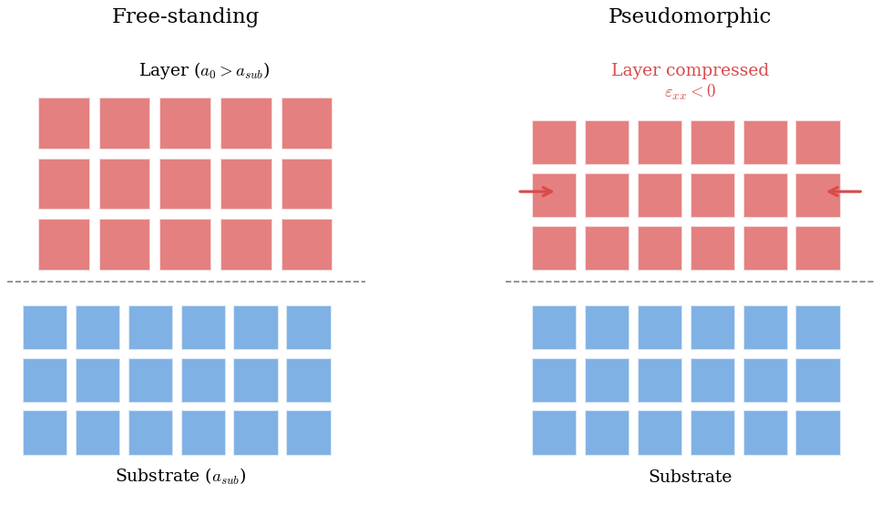
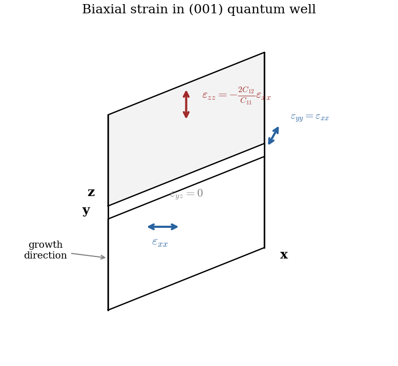
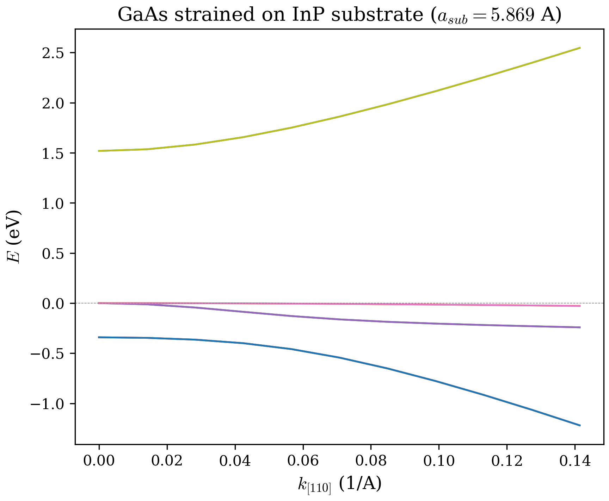
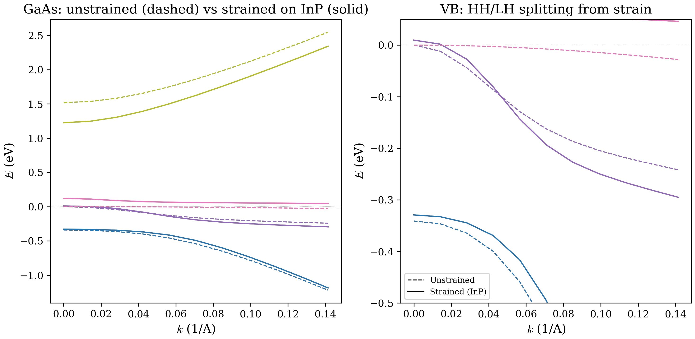

# Chapter 04: Strain Effects in Semiconductor Heterostructures

## Overview

When two semiconductors with different lattice constants are grown epitaxially --
one on top of the other -- the mismatch forces the deposited layer to stretch or
compress to match the in-plane periodicity of the substrate.  This mechanical
deformation, called **heteroepitaxial strain**, profoundly alters the electronic
band structure: it shifts band edges, splits degeneracies, and modifies effective
masses and optical matrix elements.  Strain engineering is one of the most
powerful knobs available to device designers.

This chapter derives the strain tensor for lattice-mismatched quantum wells (1D)
and nanowires (2D), introduces the **Bir--Pikus** deformation-potential
Hamiltonian that couples strain to the k.p band edges, and shows how the code
computes and applies these corrections.

---

## 1. Lattice Mismatch and Epitaxial Strain

### 1.1 Substrate vs. layer lattice constants

Every crystalline semiconductor has an equilibrium lattice constant $a_0$.
Consider a thin layer of material B (lattice constant $a_B$) grown on a thick
substrate of material A (lattice constant $a_A$).  If $a_B \neq a_A$, the layer
must deform to match the in-plane lattice spacing of the substrate.  The
**lattice mismatch** is quantified by

$$
f = \frac{a_B - a_A}{a_A}\,.
$$

When $|f|$ is small enough (typically a few percent), the layer deforms
elastically rather than forming misfit dislocations.  This is the
**pseudomorphic growth** regime, and it is the regime assumed throughout the
code.

{ width=90% }

### 1.2 Sign convention

The convention matters for interpreting results:

- **Compressive strain** ($a_B > a_A$, i.e.\ the layer "wants to be larger"):
  the in-plane lattice is compressed, so $\varepsilon_{xx} = \varepsilon_{yy} < 0$.

- **Tensile strain** ($a_B < a_A$, i.e.\ the layer "wants to be smaller"):
  the in-plane lattice is stretched, so $\varepsilon_{xx} = \varepsilon_{yy} > 0$.

In the code, the reference lattice constant is taken from the **substrate**
material, which is determined by the `strain_config%reference` field (default:
`'substrate'`).  All grid points whose material has $a_0 \neq a_0^{\text{ref}}$
contribute a non-zero strain.

---

## 2. Biaxial Strain Tensor for Quantum Wells

### 2.1 In-plane components

For a quantum well grown along $z$ on a (001)-oriented substrate, the symmetry
is simple.  The in-plane directions ($x$ and $y$) are equivalent, and the layer
is forced to adopt the substrate lattice constant in those directions.  The
in-plane strain components are therefore identical:

$$
\boxed{\varepsilon_{xx} = \varepsilon_{yy} = \frac{a_{\text{sub}} - a_{\text{layer}}}{a_{\text{layer}}}\,.}
$$

This is implemented in `compute_strain_qw` in `src/physics/strain_solver.f90`:

```fortran
eps_0 = (a0_ref - a0_mat) / a0_mat
strain_out%eps_xx(ij) = eps_0
strain_out%eps_yy(ij) = eps_0
```

Note the sign: if $a_0^{\text{mat}} > a_0^{\text{ref}}$ (e.g., InAs on GaAs substrate),
then $\varepsilon_0 < 0$ — the layer is compressed.  The formula
$(a_{\text{ref}} - a_0^{\text{mat}})/a_0^{\text{mat}}$ is equivalent to the
textbook expression $(a_{\text{sub}} - a_{\text{layer}})/a_{\text{layer}}$
since $a_0^{\text{ref}} = a_{\text{sub}}$ and $a_0^{\text{mat}} = a_{\text{layer}}$.

### 2.2 Poisson response along the growth axis

The in-plane compression (or tension) induces a response along the free growth
direction $z$.  This is governed by the **Poisson ratio** of the cubic crystal.
For a zinc-blende material with elastic stiffness constants $C_{11}$ and
$C_{12}$, mechanical equilibrium under biaxial stress gives

$$
\boxed{\varepsilon_{zz} = -\frac{2\,C_{12}}{C_{11}}\;\varepsilon_{xx}\,.}
$$

The negative sign means that compressive in-plane strain produces tensile
out-of-plane strain, and vice versa.  This follows from the cubic stress--strain
relation $\sigma_{zz} = 0$ (free surface):

$$
\sigma_{zz} = C_{12}(\varepsilon_{xx} + \varepsilon_{yy}) + C_{11}\,\varepsilon_{zz} = 0
\quad\Longrightarrow\quad
\varepsilon_{zz} = -\frac{2\,C_{12}}{C_{11}}\,\varepsilon_{xx}\,.
$$

For GaAs ($C_{11} = 1221$ GPa, $C_{12} = 566$ GPa), the Poisson ratio factor is
$2 C_{12}/C_{11} = 0.927$, meaning the out-of-plane response is almost as large
as the in-plane strain.

### 2.3 Shear components

For a (001)-oriented biaxially strained layer, the off-diagonal strain
components vanish by symmetry:

$$
\varepsilon_{xy} = \varepsilon_{xz} = \varepsilon_{yz} = 0\,.
$$

The code explicitly sets `eps_yz = 0.0_dp` in the QW path.  (Shear strain does
appear in the wire geometry, discussed in Section 6.)

### 2.4 The complete biaxial strain tensor

Collecting all components, the biaxial strain tensor for a (001) QW reads:

$$
\varepsilon_{ij} =
\begin{pmatrix}
\varepsilon_{xx} & 0 & 0 \\
0 & \varepsilon_{xx} & 0 \\
0 & 0 & -\dfrac{2C_{12}}{C_{11}}\,\varepsilon_{xx}
\end{pmatrix}\,.
$$

{ width=70% }

### 2.5 Numerical example: InAs on GaAs

Consider a thin InAs layer ($a_0 = 6.0583$ A) grown pseudomorphically on a GaAs
substrate ($a_0 = 5.65325$ A):

$$
\varepsilon_{xx} = \frac{5.65325 - 6.0583}{6.0583} = -0.0669 \approx -6.7\%\,.
$$

This is compressive: the InAs is squeezed in-plane by nearly 7%.  With InAs
elastic constants ($C_{11} = 832.9$ GPa, $C_{12} = 452.6$ GPa):

$$
\varepsilon_{zz} = -\frac{2 \times 452.6}{832.9}\times(-0.0669) = +0.0728 \approx +7.3\%\,.
$$

The InAs expands along $z$ to partially compensate the in-plane compression.
The trace of the strain tensor is:

$$
\mathrm{Tr}(\varepsilon) = 2\varepsilon_{xx} + \varepsilon_{zz}
= 2(-0.0669) + 0.0728 = -0.0610\,.
$$

The hydrostatic component (volume change) is negative: the unit cell shrinks.

---

## 3. The Bir--Pikus Strain Hamiltonian

### 3.1 Coupling strain to the band edges

Strain modifies the crystal potential, which shifts every band edge.  Bir and
Pikus showed that for a cubic semiconductor under strain, the shifts of the
conduction band, heavy-hole, light-hole, and split-off band edges can be
expressed in terms of three **deformation potentials**: $a_c$, $a_v$, and $b$.

The Bir--Pikus Hamiltonian adds diagonal correction terms to the k.p
Hamiltonian.  For the 8-band basis used in this code, the key quantities are:

**Hydrostatic shift** (volume change affects all bands):

$$
P_\varepsilon = -a_v\;\mathrm{Tr}(\varepsilon)\,,
$$

**Shear (uniaxial) splitting** (breaks cubic symmetry, splits HH from LH):

$$
Q_\varepsilon = \frac{b}{2}\left(\varepsilon_{zz} - \frac{\varepsilon_{xx} + \varepsilon_{yy}}{2}\right)\,.
$$

{ width=70% }

### 3.2 Band edge shifts

The resulting shifts of each band edge are:

**Conduction band** (bands 7--8, $\Gamma_6$):

$$
\boxed{\Delta E_c = a_c\;\mathrm{Tr}(\varepsilon)\,.}
$$

A negative $a_c$ (typical for III-Vs: $a_c \approx -5$ to $-8$ eV) combined
with a negative $\mathrm{Tr}(\varepsilon)$ (compressive biaxial strain) raises
the conduction band edge.

**Heavy-hole band** (bands 1 and 4, $\Gamma_8$):

$$
\boxed{\Delta E_{\text{HH}} = a_v\;\mathrm{Tr}(\varepsilon) + Q_\varepsilon = -P_\varepsilon + Q_\varepsilon\,.}
$$

**Light-hole band** (bands 2 and 3, $\Gamma_8$):

$$
\boxed{\Delta E_{\text{LH}} = a_v\;\mathrm{Tr}(\varepsilon) - Q_\varepsilon = -P_\varepsilon - Q_\varepsilon\,.}
$$

**Split-off band** (bands 5--6, $\Gamma_7$):

$$
\boxed{\Delta E_{\text{SO}} = a_v\;\mathrm{Tr}(\varepsilon) = -P_\varepsilon\,.}
$$

### 3.3 Heavy-hole / light-hole splitting

The shear term $Q_\varepsilon$ shifts the HH and LH band edges in opposite
directions, lifting their degeneracy at $\Gamma$.  The splitting is:

$$
\Delta E_{\text{HH-LH}} = \Delta E_{\text{HH}} - \Delta E_{\text{LH}} = 2\,Q_\varepsilon
= b\left(\varepsilon_{zz} - \frac{\varepsilon_{xx} + \varepsilon_{yy}}{2}\right)\,.
$$

Substituting the biaxial relation $\varepsilon_{zz} = -2C_{12}\varepsilon_{xx}/C_{11}$:

$$
\Delta E_{\text{HH-LH}} = b\left(-\frac{2C_{12}}{C_{11}} - 1\right)\varepsilon_{xx}
= -b\left(1 + \frac{2C_{12}}{C_{11}}\right)\varepsilon_{xx}\,.
$$

Since $b < 0$ for all III-V materials and $\varepsilon_{xx} < 0$ for
compressive strain, the product $-b\varepsilon_{xx} > 0$.  This means
compressive strain pushes the HH band up (toward the CB) and the LH band down
relative to the unstrained average.  For GaAs ($b = -2.0$ eV), the splitting is
substantial -- on the order of 100 meV for 1% strain.

{ width=90% }

### 3.4 Physical interpretation

The hydrostatic term ($\sim a_c$, $a_v$) shifts all band edges together and
modifies the band gap.  The shear term ($\sim b$) breaks the cubic symmetry and
splits the top of the valence band.  Two consequences are particularly
important for device physics:

1. **Strain-modified band gap.**  Under compressive biaxial strain
   ($\varepsilon_{xx} < 0$), the conduction band moves up ($a_c < 0$,
   $\mathrm{Tr}(\varepsilon) < 0$) and the top of the valence band (HH) also
   moves up ($a_v > 0$, $\mathrm{Tr}(\varepsilon) < 0$).  The net gap change is:
   $$
   \Delta E_g = \Delta E_c - \Delta E_{\text{HH}}
   = (a_c - a_v)\,\mathrm{Tr}(\varepsilon) - Q_\varepsilon\,.
   $$
   The gap typically increases under compressive strain.

2. **Valence band ordering.**  Under compressive biaxial strain, HH is above LH
   at $\Gamma$; under tensile strain, LH is above HH.  This switching changes
   the polarization selection rules and the dominant hole type in transport.

---

## 4. Deformation Potential Parameters

The deformation potentials are material-specific constants, stored in the
`paramStruct` type in `src/core/defs.f90`:

| Field | Symbol | Description | Units |
|---|---|---|---|
| `ac` | $a_c$ | Conduction band hydrostatic deformation potential | eV |
| `av` | $a_v$ | Valence band hydrostatic deformation potential (positive convention) | eV |
| `b_dp` | $b$ | Shear (tetragonal) deformation potential | eV |
| `d_dp` | $d$ | Shear (rhombohedral) deformation potential | eV |
| `C11` | $C_{11}$ | Elastic stiffness constant | GPa |
| `C12` | $C_{12}$ | Elastic stiffness constant | GPa |
| `C44` | $C_{44}$ | Elastic stiffness constant | GPa |
| `a0` | $a_0$ | Lattice constant | Angstrom |

**Sign convention for $a_v$.**  The code uses the positive convention:
$P_\varepsilon = -a_v\,\mathrm{Tr}(\varepsilon)$, where $a_v > 0$ for most
III-V materials.  This matches Vurgaftman (2001) and Winkler (2003), the two
primary parameter sources used in `parameters.f90`.

### 4.1 Parameter values for common materials

| Material | $a_0$ (A) | $C_{11}$ (GPa) | $C_{12}$ (GPa) | $a_c$ (eV) | $a_v$ (eV) | $b$ (eV) |
|---|---|---|---|---|---|---|
| GaAs | 5.65325 | 1221 | 566 | $-7.17$ | 1.16 | $-2.0$ |
| InAs | 6.0583 | 832.9 | 452.6 | $-5.08$ | 1.00 | $-1.8$ |
| InP | 5.8687 | 1011 | 561 | $-6.0$ | 0.6 | $-2.0$ |
| GaSb | 6.0959 | 884.2 | 402.4 | $-7.5$ | 0.8 | $-2.0$ |
| AlAs | 5.6611 | 1250 | 534 | $-5.64$ | 2.47 | $-2.3$ |
| AlSb | 6.1355 | 876.5 | 434.1 | $-4.5$ | 1.4 | $-1.35$ |
| InSb | 6.4794 | 684.7 | 373.5 | $-6.94$ | 0.36 | $-2.0$ |

All values are from Vurgaftman (2001) unless noted.  Alloy parameters (e.g.\
In$_x$Ga$_{1-x}$As, InAs$_y$Sb$_{1-y}$) are computed by linear interpolation
(Vegard's law) of the endpoint values, as seen in the parameter assignments for
alloy materials in `parameters.f90`.

---

## 5. Implementation in the Code

### 5.1 Strain computation flow

The strain solver is implemented in `src/physics/strain_solver.f90`.  The
top-level entry point is `compute_strain`, which dispatches based on the
dimensionality of the grid:

```
compute_strain
  |
  +-- ndim = 1 (QW):  compute_strain_qw      -- algebraic biaxial strain
  +-- ndim = 2 (wire): compute_strain_wire     -- Navier-Cauchy PDE solve
```

Before dispatching, `compute_strain` checks whether all materials are
lattice-matched to the reference.  If every grid point has $|a_0 - a_0^{\text{ref}}| < 10^{-12}$,
the routine returns zero strain immediately -- no unnecessary work.

### 5.2 Applying the Bir--Pikus shifts

After the strain tensor is computed, the `apply_pikus_bir` subroutine modifies
the band edge profile (`profile_2d`) in-place.  The profile array has three
columns:

| Column | Bands | Meaning |
|---|---|---|
| `profile_2d(:,1)` | 1--4 (HH, LH, LH, HH) | $E_V$ (valence band edge) |
| `profile_2d(:,2)` | 5--6 (SO) | $E_V - \Delta_{\text{SO}}$ |
| `profile_2d(:,3)` | 7--8 (CB) | $E_C$ (conduction band edge) |

The Bir--Pikus corrections are applied as:

```fortran
P_eps = -av * Tr_eps
Q_eps = b_dp * 0.5 * (eps_zz - 0.5 * (eps_yy + eps_xx))

delta_Ec  =  ac * Tr_eps
delta_EHH = -P_eps + Q_eps        ! = av*Tr_eps + Q_eps
delta_ESO = -P_eps                 ! = av*Tr_eps

profile_2d(ij, 1) = profile_2d(ij, 1) + delta_EHH   ! EV for HH
profile_2d(ij, 2) = profile_2d(ij, 2) + delta_ESO   ! EV - DeltaSO
profile_2d(ij, 3) = profile_2d(ij, 3) + delta_Ec    ! EC
```

Note that column 1 receives the **HH** shift.  The LH correction ($-Q_\varepsilon$
relative to HH) is a sub-band splitting handled by off-diagonal terms in the
k.p Hamiltonian, not by a separate profile column.  The four valence bands
(1--4) share a common profile value; the Hamiltonian itself resolves the HH/LH
splitting through the $k_\parallel$-dependent matrix elements.

### 5.3 Strain configuration

Strain is enabled via the `strain_config` type in `defs.f90`:

| Field | Default | Description |
|---|---|---|
| `enabled` | `.false.` | Enable strain computation |
| `reference` | `'substrate'` | Reference lattice (substrate = bottom layer) |
| `solver` | `'pardiso'` | Linear solver for wire PDE |
| `piezoelectric` | `.false.` | Piezoelectric polarization (not yet implemented) |

When strain is disabled, `compute_strain` returns zero arrays and
`apply_pikus_bir` exits early.

---

## 6. Two-Dimensional Strain for Wire Geometry

### 6.1 Beyond biaxial: the plane-strain problem

In a quantum wire, confinement occurs in two spatial directions (the
cross-section $yz$-plane), while the wire extends freely along the axial
direction $x$.  The strain can no longer be described by a simple algebraic
formula.  Instead, one must solve the **Navier--Cauchy elasticity equations** on
the 2D cross-section.

The wire is assumed to be long enough that the strain state does not vary along
$x$ (**plane strain** approximation).  However, the axial strain $\varepsilon_{xx}$
is non-zero at each point, determined by the local lattice mismatch:

$$
\varepsilon_{xx}(y,z) = \frac{a_0(y,z) - a_0^{\text{ref}}}{a_0^{\text{ref}}}\,.
$$

The unknowns are the in-plane displacements $u_y(y,z)$ and $u_z(y,z)$, from
which the strain components $\varepsilon_{yy}$, $\varepsilon_{zz}$, and
$\varepsilon_{yz}$ are derived.

### 6.2 The Navier--Cauchy equations

Mechanical equilibrium in the absence of body forces requires:

$$
\frac{\partial \sigma_{yy}}{\partial y} + \frac{\partial \sigma_{yz}}{\partial z} = 0\,,
\qquad
\frac{\partial \sigma_{yz}}{\partial y} + \frac{\partial \sigma_{zz}}{\partial z} = 0\,.
$$

For a cubic material, the stress--strain relations (Hooke's law with cubic
anisotropy) are:

$$
\sigma_{yy} = C_{11}\,\varepsilon_{yy} + C_{12}\,(\varepsilon_{zz} + \varepsilon_{xx})\,,
$$

$$
\sigma_{zz} = C_{11}\,\varepsilon_{zz} + C_{12}\,(\varepsilon_{yy} + \varepsilon_{xx})\,,
$$

$$
\sigma_{yz} = 2\,C_{44}\,\varepsilon_{yz}\,.
$$

Expressing strain in terms of displacements
($\varepsilon_{yy} = \partial u_y/\partial y$,
$\varepsilon_{zz} = \partial u_z/\partial z$,
$\varepsilon_{yz} = \frac{1}{2}(\partial u_y/\partial z + \partial u_z/\partial y)$)
and substituting into the equilibrium equations yields a coupled elliptic PDE
system for $(u_y, u_z)$.

### 6.3 Finite-difference discretization

The code discretizes the PDE on a regular 2D grid ($n_x \times n_y$) using a
5-point stencil.  Two degrees of freedom per grid point ($u_y$ and $u_z$) give
a total system size of $2\,n_x\,n_y$.  The stiffness matrix has at most 13
nonzeros per row (diagonal + 4 neighbor couplings per component + cross-derivative
coupling terms).

Interface handling between materials with different elastic constants uses
**face-fraction-weighted averages**: at a boundary between materials A and B, the
effective elastic constant for the flux through that face is the arithmetic mean
$\frac{1}{2}(C_A + C_B)$, scaled by the face fraction from the geometry module.
This ensures proper stress continuity at material interfaces.

### 6.4 Boundary conditions: stress-free surfaces

The wire surface is assumed **stress-free**: $\sigma \cdot \hat{n} = 0$ on the
boundary.  In the discrete setting, this is implemented by simply omitting
flux contributions from faces that lie outside the wire geometry (cells with
`cell_volume < 0.5` are inactive).  The face-fraction mechanism from the
geometry module handles partially-filled boundary cells (cut cells), providing a
first-order approximation to the stress-free condition on non-grid-aligned
surfaces.

### 6.5 Solving the linear system with PARDISO

The resulting sparse linear system $\mathbf{K}\,\mathbf{u} = \mathbf{f}$ is
solved using Intel MKL PARDISO (a direct sparse solver).  The matrix is
assembled in COO (coordinate) format, converted to CSR (compressed sparse row),
and passed to PARDISO with the real unsymmetric matrix type (`mtype = 11`).  The
unsymmetric type is necessary because the face-fraction-weighted averages at
material interfaces make the cross-derivative coupling terms asymmetric.

After solving for the displacements, the strain components are computed via
finite differences of the displacement field:

$$
\varepsilon_{yy} = \frac{\partial u_y}{\partial y}\,,
\qquad
\varepsilon_{zz} = \frac{\partial u_z}{\partial z}\,,
\qquad
\varepsilon_{yz} = \frac{1}{2}\left(\frac{\partial u_y}{\partial z} + \frac{\partial u_z}{\partial y}\right)\,.
$$

Central differences are used at interior points, one-sided differences at
boundaries.

### 6.6 The wire strain result

The full 3D strain state at each grid point in the wire cross-section is:

$$
\varepsilon_{ij}(y,z) =
\begin{pmatrix}
\varepsilon_{xx}(y,z) & 0 & 0 \\
0 & \varepsilon_{yy}(y,z) & \varepsilon_{yz}(y,z) \\
0 & \varepsilon_{yz}(y,z) & \varepsilon_{zz}(y,z)
\end{pmatrix}\,,
$$

where $\varepsilon_{xx}$ is the prescribed axial mismatch and the other three
components come from the PDE solution.  The shear strain $\varepsilon_{yz}$ is
generally non-zero in the wire geometry, reflecting the lower symmetry compared
to the biaxial QW case.

This strain tensor is then fed to `apply_pikus_bir` exactly as in the QW case.
The Bir--Pikus formulas are local: they depend only on the strain components at
each point, not on how those components were obtained.

---

## 7. Worked Examples

This section presents two detailed numerical calculations: first a
near-lattice-matched system from the code's regression tests, then a
large-mismatch system that illustrates the full magnitude of strain effects.
All deformation potentials and elastic constants are from Vurgaftman (2001) as
stored in `parameters.f90`.

### 7.1 Example A: AlSb/GaSb/InAs broken-gap quantum well

The type-II broken-gap AlSb/GaSb/InAs system is a near-lattice-matched
heterostructure used for mid-infrared devices.  The quantum well configuration
(from `tests/regression/configs/qw_alsb_gasb_inas.cfg`) consists of:

| Layer | Material | Range (A) | $a_0$ (A) |
|---|---|---|---|
| Barrier | AlSb | $-250$ to $+250$ | 6.1355 |
| Well (outer) | GaSb | $-135$ to $+135$ | 6.0959 |
| Well (inner) | InAs | $-35$ to $+35$ | 6.0583 |

The AlSb barrier has the largest lattice constant and serves as the substrate
reference.  Both GaSb and InAs have smaller lattice constants than AlSb, so
they are under **tensile** in-plane strain (forced to stretch to match the
larger substrate lattice).

**Step 1: In-plane strain.**  Using $\varepsilon_{xx} = (a_{\text{sub}} - a_{\text{layer}})/a_{\text{layer}}$:

$$
\varepsilon_{xx}^{\text{GaSb}} = \frac{6.1355 - 6.0959}{6.0959} = +0.00649 \approx +0.65\%\,,
$$

$$
\varepsilon_{xx}^{\text{InAs}} = \frac{6.1355 - 6.0583}{6.0583} = +0.01274 \approx +1.27\%\,.
$$

Both are positive, confirming tensile in-plane strain.

**Step 2: Out-of-plane strain (Poisson response).**

For GaSb ($C_{11} = 884.2$, $C_{12} = 402.4$ GPa):

$$
\varepsilon_{zz}^{\text{GaSb}} = -\frac{2 \times 402.4}{884.2} \times 0.00649 = -0.00591\,.
$$

For InAs ($C_{11} = 832.9$, $C_{12} = 452.6$ GPa):

$$
\varepsilon_{zz}^{\text{InAs}} = -\frac{2 \times 452.6}{832.9} \times 0.01274 = -0.01385\,.
$$

Tensile in-plane strain produces compressive out-of-plane strain, as expected
from the Poisson effect.

**Step 3: Bir--Pikus band edge shifts.**

Using the code's convention ($P_\varepsilon = -a_v\,\mathrm{Tr}(\varepsilon)$,
$\delta E_{\text{HH}} = -P_\varepsilon + Q_\varepsilon$):

For GaSb ($a_c = -7.5$, $a_v = 0.8$, $b = -2.0$ eV):

$$
\mathrm{Tr}^{\text{GaSb}} = 2 \times 0.00649 + (-0.00591) = +0.00708\,,
$$

$$
P_\varepsilon^{\text{GaSb}} = -0.8 \times 0.00708 = -5.66\;\text{meV}\,,
$$

$$
Q_\varepsilon^{\text{GaSb}} = \frac{-2.0}{2}\left(-0.00591 - \frac{0.00649 + 0.00649}{2}\right)
= -1.0 \times (-0.01240) = +12.40\;\text{meV}\,.
$$

For InAs ($a_c = -5.08$, $a_v = 1.00$, $b = -1.8$ eV):

$$
\mathrm{Tr}^{\text{InAs}} = 2 \times 0.01274 + (-0.01385) = +0.01163\,,
$$

$$
P_\varepsilon^{\text{InAs}} = -1.00 \times 0.01163 = -11.63\;\text{meV}\,,
$$

$$
Q_\varepsilon^{\text{InAs}} = \frac{-1.8}{2}\left(-0.01385 - \frac{0.01274 + 0.01274}{2}\right)
= -0.9 \times (-0.02659) = +23.93\;\text{meV}\,.
$$

**Step 4: Summary of strain-induced shifts.**

The table below collects all Bir--Pikus shifts for each strained layer.  The AlSb
barrier (reference layer) has zero strain and zero shift.  The shift formulas
follow the code convention:

$$
\delta E_c = a_c\,\mathrm{Tr}(\varepsilon)\,,\qquad
\delta E_{\text{HH}} = -P_\varepsilon + Q_\varepsilon\,,\qquad
\delta E_{\text{LH}} = -P_\varepsilon - Q_\varepsilon\,,\qquad
\delta E_{\text{SO}} = -P_\varepsilon\,.
$$

| Layer | $\varepsilon_{xx}$ | $\varepsilon_{zz}$ | $\mathrm{Tr}(\varepsilon)$ | $\Delta E_c$ (meV) | $\Delta E_{\text{HH}}$ (meV) | $\Delta E_{\text{LH}}$ (meV) | $\Delta E_{\text{SO}}$ (meV) | HH/LH split (meV) |
|---|---|---|---|---|---|---|---|---|
| AlSb (ref) | 0 | 0 | 0 | 0 | 0 | 0 | 0 | 0 |
| GaSb | $+0.65\%$ | $-0.59\%$ | $+0.71\%$ | $-53$ | $+18$ | $-7$ | $+6$ | $+25$ |
| InAs | $+1.27\%$ | $-1.39\%$ | $+1.16\%$ | $-59$ | $+36$ | $-12$ | $+12$ | $+48$ |

Values are rounded to the nearest meV.  Under tensile strain ($\varepsilon_{xx} >
0$), the HH/LH splitting reverses compared to compressive strain: the
**light-hole band moves upward** (toward the CB, $\Delta E_{\text{LH}} < 0$ in
our sign convention) while the heavy-hole band also moves upward but by a
larger amount ($\Delta E_{\text{HH}} > 0$).  The valence band maximum is HH.

### 7.2 Example B: InAs/GaAs quantum well -- large mismatch

For comparison, consider the classic InAs/GaAs system with a much larger
lattice mismatch.  An InAs quantum well (10 nm) is embedded in GaAs barriers.
The InAs layer is under strong compressive biaxial strain.

With $a_{\text{GaAs}} = 5.65325$ A and $a_{\text{InAs}} = 6.0583$ A:

$$
\varepsilon_{xx} = \frac{5.65325 - 6.0583}{6.0583} = -0.0669\,.
$$

Using InAs elastic constants ($C_{11} = 832.9$ GPa, $C_{12} = 452.6$ GPa):

$$
\varepsilon_{zz} = -\frac{2 \times 452.6}{832.9}\times(-0.0669) = +0.0728\,.
$$

Using InAs deformation potentials ($a_c = -5.08$ eV, $a_v = 1.00$ eV,
$b = -1.8$ eV):

$$
\mathrm{Tr}(\varepsilon) = 2(-0.0669) + 0.0728 = -0.0610\,,
$$

$$
P_\varepsilon = -1.00 \times (-0.0610) = +61.0\;\text{meV}\,,
$$

$$
Q_\varepsilon = \frac{-1.8}{2}\left(0.0728 - \frac{-0.0669 + (-0.0669)}{2}\right)
= \frac{-1.8}{2}(0.0728 + 0.0669) = -125.7\;\text{meV}\,.
$$

Band edge shifts (using the code's convention $\delta E = -P_\varepsilon + Q_\varepsilon$):

| Band | Shift formula | Value (eV) |
|---|---|---|
| CB | $\Delta E_c = a_c\,\mathrm{Tr}(\varepsilon) = (-5.08)(-0.0610)$ | $+0.310$ |
| HH | $\Delta E_{\text{HH}} = -P_\varepsilon + Q_\varepsilon = -61.0 - 125.7$ | $-0.187$ |
| LH | $\Delta E_{\text{LH}} = -P_\varepsilon - Q_\varepsilon = -61.0 + 125.7$ | $+0.065$ |
| SO | $\Delta E_{\text{SO}} = -P_\varepsilon = -61.0\;\text{meV}$ | $-0.061$ |

The HH/LH splitting is $2|Q_\varepsilon| = 251$ meV -- a very large effect.
Under compressive strain, the heavy-hole band moves upward (toward the CB,
$\Delta E_{\text{HH}} < 0$) while the light-hole band moves downward
($\Delta E_{\text{LH}} > 0$).  This is the well-known result that compressive
strain favors heavy-hole states at the valence band maximum.

### 7.3 Comparison: strained vs unstrained band gaps

The band gap change under strain is $\Delta E_g = \Delta E_c - \Delta
E_{\text{HH}}$ (difference between CB and HH-VB shifts).  The following table
compares the strain-induced gap changes for both example systems.

| System | Layer | $E_g^0$ (eV) | $\varepsilon_{xx}$ | $\Delta E_g$ (meV) | HH/LH split (meV) |
|---|---|---|---|---|---|
| AlSb/GaSb/InAs | GaSb on AlSb | 0.812 | $+0.65\%$ (tensile) | $-71$ | 25 |
| AlSb/GaSb/InAs | InAs on AlSb | 0.417 | $+1.27\%$ (tensile) | $-95$ | 48 |
| InAs/GaAs | InAs on GaAs | 0.417 | $-6.69\%$ (compressive) | $+497$ | 251 |

The InAs/GaAs system shows dramatically larger strain effects: the band gap
increases by 497 meV and the HH/LH splitting reaches 251 meV.  In practice,
such a large mismatch (~6.7%) exceeds the critical thickness for pseudomorphic
growth (typically a few monolayers for InAs on GaAs), so this system is of more
theoretical interest.  The AlSb/GaSb/InAs system, with mismatches below 1.3%,
is fully realizable in experiment and represents the regime where the code's
pseudomorphic strain model is directly applicable.

Note the sign difference: tensile strain decreases the HH gap (GaSb and InAs on
AlSb), while compressive strain increases it (InAs on GaAs).  This follows from
the hydrostatic component: tensile strain produces a positive Tr$(\varepsilon)$,
which lowers the CB edge (since $a_c < 0$) while the valence band shift depends
on the competition between the hydrostatic and shear terms.

### 7.4 HH/LH splitting as a function of lattice mismatch

The HH/LH splitting for biaxial strain on a (001) substrate is

$$
\Delta E_{\text{HH-LH}} = -b\left(1 + \frac{2C_{12}}{C_{11}}\right)\varepsilon_{xx}\,.
$$

The factor $1 + 2C_{12}/C_{11}$ is approximately 1.9 for most III-V materials,
so the splitting is roughly $1.9\,|b|\,|\varepsilon_{xx}|$.  The following
table shows how the splitting scales with mismatch for InAs under compressive
strain:

| $\varepsilon_{xx}$ (%) | $\Delta E_{\text{HH-LH}}$ (meV) | $\Delta E_c$ (meV) | $\Delta E_g$ (meV) |
|---|---|---|---|
| $-0.5$ | 19 | 23 | 37 |
| $-1.0$ | 38 | 46 | 74 |
| $-1.3$ | 49 | 60 | 97 |
| $-2.0$ | 75 | 93 | 149 |
| $-3.0$ | 113 | 139 | 223 |
| $-6.7$ | 252 | 311 | 498 |

The HH/LH splitting grows linearly with strain magnitude.  Even modest
mismatches of 1--2% produce splittings of 40--80 meV, comparable to $k_BT$
at room temperature (26 meV).  This is why strain engineering is such an
effective tool: small, controllable lattice mismatches produce band structure
changes that directly impact device performance.

---

## 8. Limitations and Extensions

### 8.1 Current assumptions

- **Pseudomorphic growth**: no plastic relaxation (no misfit dislocations).  The
  code does not compute critical thickness; the user must ensure the layer is
  thin enough.

- **Linear elasticity**: the strain--stress relation is linear (Hooke's law).
  Valid for strains up to a few percent.

- **No shear strain in QW**: the biaxial formula gives $\varepsilon_{yz} = 0$
  by symmetry.  This is exact for (001)-oriented zinc-blende structures.

- **No piezoelectric effect**: the `piezoelectric` flag exists in
  `strain_config` but is not yet implemented.  In polar semiconductors (GaAs,
  InAs, etc.), strain generates a piezoelectric polarization that adds an
  internal electric field.  This can be important for nitride and some III-V
  heterostructures.

### 8.2 Extending the strain model

- **Piezoelectric polarization**: add $P_{\text{piezo}} = e_{14}(\varepsilon_{xy} +
  \varepsilon_{yz} + \varepsilon_{zx})$ and solve Poisson with the resulting
  charge density.

- **General crystal orientations**: (110) or (111) substrates would require
  rotating the strain tensor and using different shear deformation potentials
  ($d$ instead of $b$).

- **Temperature dependence**: lattice constants and elastic constants vary with
  temperature.  The current implementation uses 0 K or room-temperature values
  (depending on the parameter source).

---

## 9. Code Reference

| Subroutine | File | Purpose |
|---|---|---|
| `compute_strain` | `src/physics/strain_solver.f90` | Top-level dispatcher: QW or wire |
| `compute_strain_qw` | `src/physics/strain_solver.f90` | Algebraic biaxial strain for 1D |
| `compute_strain_wire` | `src/physics/strain_solver.f90` | Navier--Cauchy PDE for 2D cross-section |
| `compute_bir_pikus_blocks` | `src/physics/strain_solver.f90` | Bir--Pikus shifts to structured output |
| `bir_pikus_blocks_free` | `src/physics/strain_solver.f90` | Free Bir--Pikus arrays |
| `compute_bp_scalar` | `src/physics/strain_solver.f90` | Pure function: BP shifts for single point |
| `strain_result` | `src/physics/strain_solver.f90` | Derived type: eps_xx, eps_yy, eps_zz, eps_yz |
| `strain_config` | `src/core/defs.f90` | Configuration: enabled, reference, solver |
| `paramStruct` | `src/core/defs.f90` | Deformation potentials: ac, av, b_dp, d_dp, C11, C12, C44, a0 |

### Key parameter sources

- **Vurgaftman, Meyer, and Ram-Mohan**, "Band parameters for III--V compound
  semiconductors and their alloys," *J. Appl. Phys.* **89**, 5815 (2001).
- **Winkler**, *Spin--Orbit Coupling Effects in Two-Dimensional Electron and
  Hole Systems*, Springer (2003).

---

## 10. Summary

Strain in semiconductor heterostructures arises from lattice mismatch between
epitaxial layers.  For quantum wells, the strain is biaxial and computed
analytically; for nanowires, the 2D plane-strain problem requires solving the
Navier--Cauchy elasticity equations on the cross-section.  The Bir--Pikus
deformation-potential formalism translates the strain tensor into band edge
shifts, with three key effects:

1. **Hydrostatic shift** ($\sim a_c, a_v$): changes the band gap.
2. **HH/LH splitting** ($\sim b$): lifts the valence band degeneracy.
3. **Shear strain** (wire only, $\varepsilon_{yz} \neq 0$): further modifies
   band mixing and optical properties.

The code handles both geometries transparently through `compute_strain` and
`apply_pikus_bir`, with the same Bir--Pikus formulas applied locally at each
grid point regardless of how the strain tensor was obtained.
