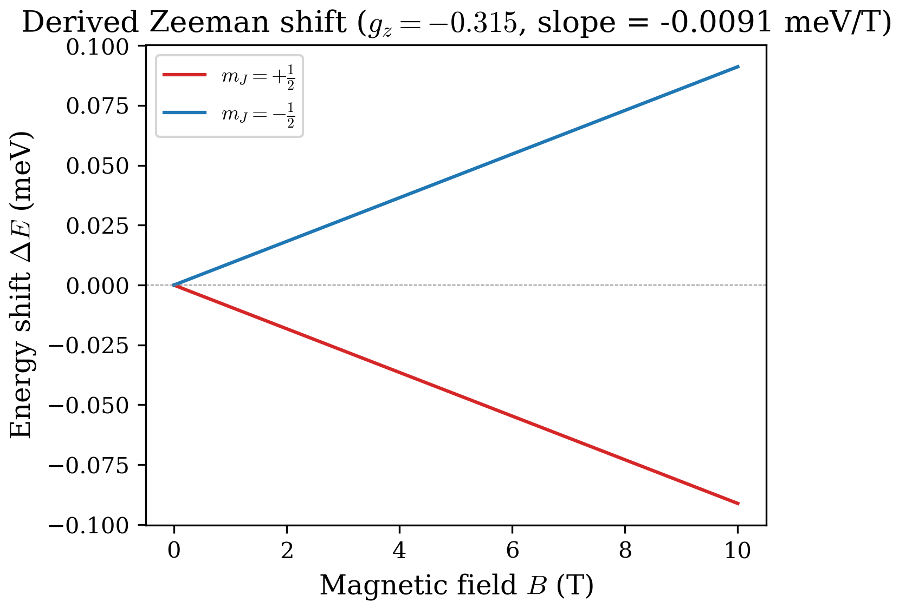
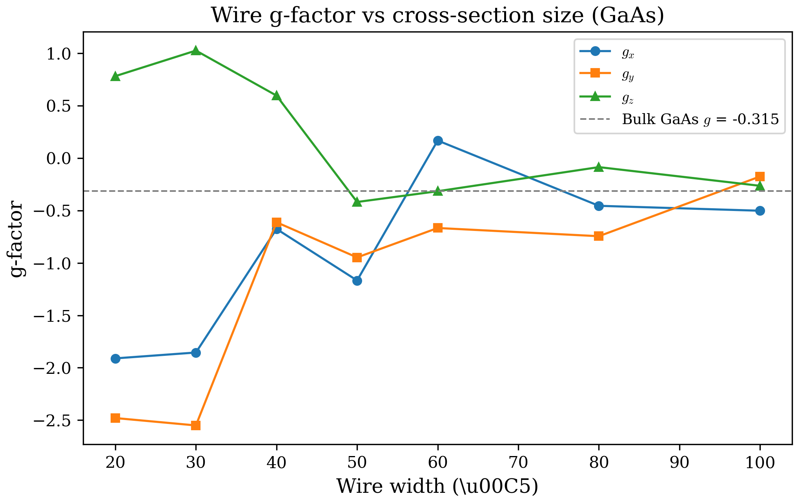
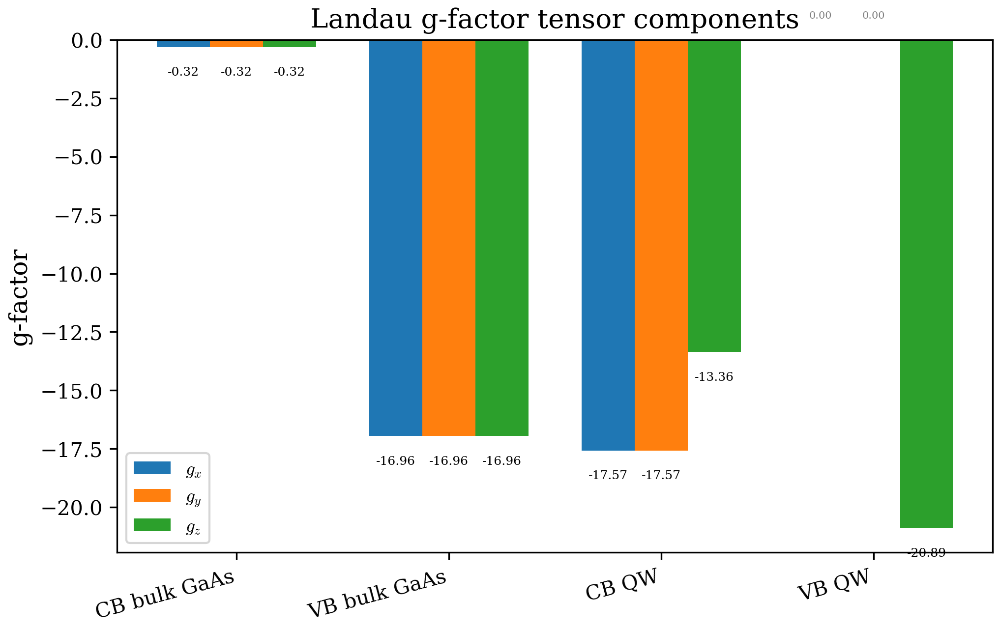

# Chapter 05: Landau g-Factor from Lowdin Partitioning

## 5.1 Theory

### 5.1.1 The Zeeman effect in semiconductors

When a magnetic field $\mathbf{B}$ is applied to a semiconductor, the electron states split according to their spin and orbital angular momentum. For a free electron, the Zeeman Hamiltonian is

$$
H_Z = \frac{\mu_B}{2} \, \mathbf{B} \cdot \left( g_0 \, \boldsymbol{\sigma} + 2\mathbf{L} \right),
$$

where $\mu_B = e\hbar/(2m_0)$ is the Bohr magneton, $g_0 \approx 2.00231$ is the free-electron g-factor (the code uses the CODATA value `g_free` from `defs.f90`), $\boldsymbol{\sigma} = (\sigma_x, \sigma_y, \sigma_z)$ are the Pauli matrices, and $\mathbf{L}$ is the orbital angular momentum operator. The first term describes the coupling of $\mathbf{B}$ to the electron spin; the second describes the coupling to orbital angular momentum.

In a crystal, the orbital angular momentum is no longer a good quantum number. The spin-orbit coupling inherited from the atomic $p$-like valence band states mixes spin and orbital character, producing an **effective g-factor** that deviates significantly from $g_0$. For conduction-band electrons in narrow-gap semiconductors like InSb or InAs, the g-factor can be $|g^*| \gg g_0$ and even change sign. The deviation $\Delta g = g^* - g_0$ is almost entirely due to inter-band coupling, which we compute via second-order perturbation theory.



### 5.1.2 The 8-band spin matrices

The code defines $8 \times 8$ spin matrices $\Sigma_x$, $\Sigma_y$, $\Sigma_z$ in the zincblende Kane basis. Their explicit form is initialized in `init_spin_matrices()` within `gfactor_functions.f90`. The basis ordering is:

| Index | State | Band |
|---|---|---|
| 1 | $\|3/2, +3/2\rangle$ | HH |
| 2 | $\|3/2, +1/2\rangle$ | LH |
| 3 | $\|3/2, -1/2\rangle$ | LH |
| 4 | $\|3/2, -3/2\rangle$ | HH |
| 5 | $\|1/2, +1/2\rangle$ | SO |
| 6 | $\|1/2, -1/2\rangle$ | SO |
| 7 | $\|S, +1/2\rangle$ | CB |
| 8 | $\|S, -1/2\rangle$ | CB |

The conduction-band block (rows/columns 7--8) yields the standard Pauli matrices:

$$
\Sigma_z^{(CB)} = \begin{pmatrix} 1 & 0 \\ 0 & -1 \end{pmatrix}, \quad
\Sigma_x^{(CB)} = \begin{pmatrix} 0 & 1 \\ 1 & 0 \end{pmatrix}, \quad
\Sigma_y^{(CB)} = \begin{pmatrix} 0 & i \\ -i & 0 \end{pmatrix}.
$$

The valence-band and cross-band blocks contain Clebsch--Gordan coefficients arising from the total angular momentum $J = 3/2$ (HH, LH) and $J = 1/2$ (SO) representations. For example,

$$
(\Sigma_z)_{11} = 1, \quad (\Sigma_z)_{22} = \tfrac{1}{3}, \quad
(\Sigma_z)_{33} = -\tfrac{1}{3}, \quad (\Sigma_z)_{44} = -1.
$$

The off-diagonal VB--SO elements such as $(\Sigma_z)_{25} = -\frac{2i\sqrt{2}}{3}$ arise from the coupling between the $J=3/2$ and $J=1/2$ manifolds. These off-diagonal elements are essential: they generate the inter-band contributions to $\Delta g$ when the VB and SO states act as intermediate states in the Lowdin partitioning.

### 5.1.3 Second-order Lowdin partitioning

#### Motivation

The 8-band k.p Hamiltonian at a given $\mathbf{k}$ point produces eigenstates that are linear combinations of all 8 basis states. For the g-factor, we are interested in the **Kramers doublet** of the conduction band (or a valence subband) near $\mathbf{k}=0$. Rather than working with the full $8N \times 8N$ problem (for QWs with $N$ finite-difference grid points), we can project the Zeeman interaction onto the $2 \times 2$ subspace of interest using **Lowdin partitioning**.

#### P and Q subspaces

We partition the Hilbert space into:

- **P subspace** (primary): the Kramers doublet of interest. For the CB, this is the pair of spin-split conduction subbands $\{|\psi_n^+\rangle, |\psi_n^-\rangle\}$ at the band index `bandIdx` (and its Kramers partner at `bandIdx+1`).

- **Q subspace** (remote): all other states -- the remaining conduction subbands, all valence subbands, and all split-off subbands.

The effective spin Hamiltonian in the P subspace, to second order in the magnetic perturbation, takes the form

$$
(H_{\mathrm{eff}})_{nm} = E_n \, \delta_{nm} + \sum_{l \in Q}
\frac{\langle n | V_\alpha | l \rangle \langle l | V_\beta | m \rangle
      - \langle n | V_\beta | l \rangle \langle l | V_\alpha | m \rangle}
     {E_n - E_l + E_m - E_l},
$$

where $V_\alpha$ and $V_\beta$ are the momentum perturbation operators corresponding to the two spatial directions transverse to the magnetic field component being computed, and the sum runs over all remote (Q-subspace) intermediate states $|l\rangle$.

#### The effective 2x2 Hamiltonian

After Lowdin partitioning, the problem reduces to a $2 \times 2$ effective Hamiltonian in the P subspace. For each spatial direction $d$, this Hamiltonian encodes the g-factor:

$$
H_{\mathrm{eff}}^{(d)} = -\frac{\mu_B B_d}{2}\, g_d \, \sigma_d,
$$

where $g_d$ is extracted as the eigenvalue splitting of the $2 \times 2$ tensor $G^{(d)}$ (defined in Section 5.1.4). The $2 \times 2$ structure reflects the Kramers doublet: the two eigenstates correspond to spin-up and spin-down in the effective magnetic field, and the splitting between them is proportional to $g^*$.

#### Direction mapping

The cross-product structure of the angular momentum leads to a specific mapping between the tensor component $d$ (corresponding to $g_x$, $g_y$, $g_z$) and the pair of perturbation directions:

| Tensor component $d$ | Magnetic field direction | $\mathrm{mod}_1$ | $\mathrm{mod}_2$ |
|---|---|---|---|
| 1 ($g_x$) | $x$ | $y$ (2) | $z$ (3) |
| 2 ($g_y$) | $y$ | $z$ (3) | $x$ (1) |
| 3 ($g_z$) | $z$ | $x$ (1) | $y$ (2) |

This implements the relation $\mathbf{L} = \mathbf{r} \times \mathbf{p}$. For the $z$-component, $L_z = x p_y - y p_x$, so the perturbation operators are along $x$ (mod1=1) and $y$ (mod2=2). The antisymmetric combination $P_{\alpha\beta} = P_1 P_2 - P_2 P_1$ in the numerator captures the commutator structure of the angular momentum.

### 5.1.4 The g-tensor formula

The code computes the $2 \times 2$ g-tensor for each spatial direction $d$ as

$$
G_{ij}^{(d)} = -\frac{i}{\hbar^2/(2m_0)} \sum_{l \in Q}
\frac{P_1(n,l) \, P_2(l,m) - P_2(n,l) \, P_1(l,m)}{E_n + E_m - 2E_l}
\;-\; \frac{g_0}{2}\, \Sigma^{(d)}_{ij},
$$

where:

- $n, m \in \{n_0, n_0+1\}$ are the two states of the Kramers doublet (`bandIdx` and `bandIdx+1`),
- $l$ runs over all Q-subspace intermediate states,
- $P_1(n,l) = \langle \psi_n | H_{\mathrm{mod}_1} | \psi_l \rangle$ is the momentum matrix element in the first transverse direction,
- $P_2(l,m) = \langle \psi_l | H_{\mathrm{mod}_2} | \psi_m \rangle$ is the momentum matrix element in the second transverse direction,
- $\Sigma^{(d)}_{ij} = \langle \psi_{n_0+i-1} | \Sigma_d | \psi_{n_0+j-1} \rangle$ is the spin matrix element between the doublet states,
- $\hbar^2/(2m_0) \approx 3.81\;\mathrm{eV\,\AA^2}$ (the constant `hbar2O2m0` in `defs.f90`).

The effective g-factor along direction $d$ is extracted as the smallest eigenvalue of $2G^{(d)}$ (with sign). The code diagonalizes each $2 \times 2$ tensor slice with LAPACK's `zheev` and reports $g_d = 2\lambda_{\min}^{(d)}$.

### 5.1.5 The Roth formula: analytical estimate for bulk g-factors

For a bulk semiconductor, the dominant contribution to $\Delta g$ comes from the inter-band coupling between the CB ($s$-like) and the VB ($p$-like) states mediated by the Kane momentum parameter $P$. By keeping only the leading-order terms in the Lowdin partitioning, Roth (1960) derived a compact analytical expression for the conduction-band g-factor:

$$
g^* = g_0 - \frac{2E_P \, \Delta_{\mathrm{SO}}}{3\,E_g(E_g + \Delta_{\mathrm{SO}})},
$$

where $E_P = 2m_0 P^2/\hbar^2$ is the Kane energy, $E_g$ is the band gap, and $\Delta_{\mathrm{SO}}$ is the spin-orbit splitting. This formula captures the essential physics:

1. **Narrow-gap enhancement.** As $E_g \to 0$, the denominator shrinks and $|\Delta g|$ grows without bound. This explains why narrow-gap materials like InSb ($E_g \approx 0.17$ eV) have $|g^*| \approx 50$.

2. **Spin-orbit coupling dependence.** The factor $\Delta_{\mathrm{SO}}/(E_g + \Delta_{\mathrm{SO}})$ ranges from 0 (no SO coupling) to 1 (extreme SO limit). In the InSb limit where $\Delta_{\mathrm{SO}} \gg E_g$, the formula reduces to $g^* \approx g_0 - 2E_P/(3E_g)$.

3. **Wide-gap limit.** For large $E_g$ (e.g., GaN, ZnO), $\Delta g \to 0$ and $g^* \to g_0 \approx 2$.

The Roth formula is an approximation because it retains only the CB-VB coupling through $P$ and neglects: (a) the intra-band (CB-CB) contributions from remote conduction subbands, (b) corrections from higher-lying bands beyond the 8-band model, and (c) the full Luttinger parameter structure. For the 8-band model, the numerical Lowdin partitioning computed by this code includes all of these effects and typically agrees with the Roth formula to within a few percent for bulk materials.

**Verification for GaAs.** Using Vurgaftman parameters ($E_P = 28.8$ eV, $E_g = 1.519$ eV, $\Delta_{\mathrm{SO}} = 0.341$ eV):

$$
\Delta g = -\frac{2 \times 28.8 \times 0.341}{3 \times 1.519 \times 1.860} = -\frac{19.64}{8.476} = -2.317,
$$

$$
g^* = 2.002 - 2.317 = -0.315.
$$

The code computes $g^* = -0.315$ for bulk GaAs (Section 5.3.1), confirming perfect agreement between the Roth formula and the full 8-band Lowdin partitioning for this material.

**Verification for InAs (Winkler parameters).** With $E_P = 22.2$ eV, $E_g = 0.418$ eV, $\Delta_{\mathrm{SO}} = 0.380$ eV:

$$
\Delta g = -\frac{2 \times 22.2 \times 0.380}{3 \times 0.418 \times 0.798} = -\frac{16.87}{1.001} = -16.86,
$$

$$
g^* = 2.002 - 16.86 = -14.86.
$$

The code computes $g^* = -14.858$ for bulk InAsW (Section 5.3.1), again in excellent agreement.

### 5.1.6 Inter-band and intra-band contributions

The sum over intermediate states $l \in Q$ naturally separates into two physically distinct parts:

**Inter-band contributions** (CB $\leftrightarrow$ VB or VB $\leftrightarrow$ CB). For the CB g-factor, the intermediate states $|l\rangle$ run over all valence subbands. The energy denominator is

$$
E_{\mathrm{CB}}(n) + E_{\mathrm{CB}}(m) - 2E_{\mathrm{VB}}(l),
$$

which is dominated by the band gap $E_g$. For narrow-gap materials (small $E_g$), this denominator is small and the inter-band contribution is large. This is why InSb ($E_g \approx 0.17\;\mathrm{eV}$) has $|g^*| \approx 50$ while GaAs ($E_g \approx 1.52\;\mathrm{eV}$) has $g^* \approx -0.32$.

**Intra-band contributions** (CB $\leftrightarrow$ CB or VB $\leftrightarrow$ VB). The intermediate states run over the other conduction subbands (excluding the doublet states themselves, i.e., $l \neq n, m$). The energy denominator is now

$$
E_{\mathrm{CB}}(n) + E_{\mathrm{CB}}(m) - 2E_{\mathrm{CB}}(l),
$$

which involves subband spacings rather than the band gap. In quantum wells and wires with strong confinement, these spacings can be comparable to $E_g$ for narrow structures, making intra-band corrections significant.

The code explicitly separates these two sums (see the two nested loops over `numvb` and `numcb` in `gfactorCalculation`), computing four momentum matrix elements per intermediate state:

$$
P_1(n,l),\; P_2(l,m),\; P_2(n,l),\; P_1(l,m).
$$

The antisymmetric combination $P_1 P_2 - P_2 P_1$ ensures that only the angular-momentum-like part of the coupling contributes (the symmetric part cancels). Contributions with near-zero energy denominators ($|\mathrm{denom}| < 10^{-7}\;\mathrm{eV}$) are skipped with a warning, preventing numerical divergence.

### 5.1.7 Bulk vs QW vs wire g-factor: conceptual comparison

The effective g-factor depends strongly on the dimensionality of confinement:

| Property | Bulk | Quantum Well | Quantum Wire |
|---|---|---|---|
| Confinement | None | 1D ($z$) | 2D ($x$-$y$) |
| Symmetry | Cubic ($T_d$) | Uniaxial ($C_{\infty v}$) | Reduced |
| g-tensor | Isotropic: $g_x = g_y = g_z$ | Axial: $g_\parallel = g_z$, $g_\perp = g_x = g_y$ | Fully anisotropic: $g_x \neq g_y \neq g_z$ |
| Roth formula | Exact (8-band) | Approximate | Not applicable |
| Typical $|g^*|$ | Largest (no confinement shift) | Reduced (confinement raises CB, increasing denominator) | Further modified |

The key physical trend is that **quantum confinement generally pushes $|g^*|$ toward $g_0$**. The mechanism is straightforward: confinement raises the CB subband energy and pushes the VB subbands deeper, increasing the effective band gap in the energy denominator of the Lowdin sum. The Roth formula $g^* \approx g_0 - 2E_P\Delta_{\mathrm{SO}}/(3E_g^{\mathrm{eff}}\cdot E_g^{\mathrm{eff}})$ still holds qualitatively if one replaces $E_g$ with an effective gap that includes the confinement energies. For wires, the additional confinement direction further modifies the subband structure and introduces in-plane anisotropy.

---

## 5.2 In the Code

### 5.2.1 Module structure

The g-factor computation is implemented in `src/physics/gfactor_functions.f90` (the `gfactorFunctions` module), with the executable entry point in `src/apps/main_gfactor.f90` (program `gfactor`).

| File | Role |
|---|---|
| `src/physics/gfactor_functions.f90` | Spin matrices, $\sigma$ elements, $P_\mathrm{ele}$ calculation, Lowdin sum, tensor assembly. Contains both QW and wire variants. |
| `src/apps/main_gfactor.f90` | Reads input, builds/diagonalizes Hamiltonian, calls g-factor routines, writes output. |

Key subroutines:

| Subroutine | Purpose |
|---|---|
| `init_spin_matrices()` | Initializes $8 \times 8$ $\Sigma_x, \Sigma_y, \Sigma_z$ on first call (cached). |
| `sigmaElem(state1, state2, dir, ...)` | QW/bulk: computes $\langle \psi_1 | \Sigma_\mathrm{dir} | \psi_2 \rangle$ with Simpson integration. |
| `sigmaElem_2d(state1, state2, dir, grid)` | Wire: same with uniform $dx \cdot dy$ summation over 2D grid. |
| `set_perturbation_direction(d, smallk)` | Sets a unit wave vector along direction $d \in \{1,2,3\}$. |
| `pMatrixEleCalc(Pele, d, ...)` | QW/bulk: computes $\langle a | H^{(d)}_\mathrm{pert} | b \rangle$ using dense or sparse Hamiltonian. |
| `pMatrixEleCalc_2d(Pele, d, ...)` | Wire: builds per-direction CSR perturbation with `g1`/`g2`/`g3` flags, uses `csr_spmv`. |
| `compute_pele(Pele, ...)` | Dispatcher that selects `pMatrixEleCalc` with correct arguments for bulk/QW. |
| `compute_pele_2d(Pele, ...)` | Dispatcher for wire mode, calling `pMatrixEleCalc_2d`. |
| `gfactorCalculation(tensor, ...)` | QW/bulk: full Lowdin partitioning, inter-band + intra-band sums, tensor assembly. |
| `gfactorCalculation_wire(tensor, ...)` | Wire: same algorithm with 2D sparse operators. |
| `compute_optical_matrix_wire(...)` | Wire: optical transition matrix elements for all CB-VB pairs. |

### 5.2.2 Program flow

The g-factor calculation is driven by program `gfactor`. The workflow is:

1. **Read input** via `read_and_setup` (shared `input_parser` module).
2. **Validate**: g-factor requires $k=0$ only (`waveVector: k0`, `waveVectorStep: 0`).
3. **Build Hamiltonian** at $\mathbf{k} = 0$ and diagonalize fully:
   - Bulk/QW: dense LAPACK (`zheev`/`zheevd`)
   - Wire: sparse FEAST eigensolver (`solve_sparse_evp`)
4. **Sort eigenstates**: VB states stored in descending energy order, CB states in ascending order.
5. **Select doublet**: the Kramers pair at `bandIdx` and `bandIdx+1`.
6. **Compute spin matrix** $\Sigma^{(d)}_{ij}$ between doublet states (3 directions).
7. **Loop over directions** $d = 1,2,3$: for each, select the perturbation pair $(\mathrm{mod}_1, \mathrm{mod}_2)$, build the perturbation Hamiltonians, and accumulate the momentum matrix element sums over all intermediate states.
8. **Assemble g-tensor** and diagonalize each $2 \times 2$ slice to extract $g_x, g_y, g_z$.
9. **Write output** to `output/gfactor.dat`.

### 5.2.3 Walkthrough of pMatrixEleCalc

The subroutine `pMatrixEleCalc` computes the matrix element $P_\mathrm{ele} = \langle \psi_a | H^{(d)}_\mathrm{pert} | \psi_b \rangle$, which is the central quantity in the Lowdin sum. Here is how it works step-by-step:

1. **Set perturbation direction.** `set_perturbation_direction(d, smallk)` creates a unit wave vector with $k_d = 1$ and all other components zero.

2. **Build perturbation Hamiltonian.** For bulk (`nlayers == 1`), the routine calls `ZB8bandBulk(hkp, smallk(1), params(1), g='g')`. The `g='g'` flag instructs the Hamiltonian constructor to retain **only the momentum (inter-band coupling) terms** while zeroing out the intra-band Luttinger parameters ($\gamma_1 = \gamma_2 = \gamma_3 = A = 0$). Only the Kane parameter $P$ is retained. For QW (`nlayers > 1`), `ZB8bandQW` is called with the same flag, producing either a dense or CSR sparse perturbation matrix.

3. **Compute matrix element.** The routine evaluates $P_\mathrm{ele} = \psi_a^\dagger \cdot H^{(d)}_\mathrm{pert} \cdot \psi_b$. For bulk, this is a simple $8 \times 8$ BLAS operation (`zgemv` + `zdotc`). For QW, it loops over FD grid points, extracting the $8 \times 8$ block at each point and accumulating via Simpson integration. For sparse mode (CSR), it uses `csr_spmv` followed by `zdotc`.

The momentum matrix elements in the 8-band Hamiltonian appear as linear-k terms:

$$
P_+ = \frac{P}{\sqrt{2}}(k_x + ik_y), \quad
P_- = \frac{P}{\sqrt{2}}(k_x - ik_y), \quad
P_z = P k_z.
$$

These couple the CB ($s$-like, bands 7--8) to the VB and SO bands ($p$-like, bands 1--6). With `g='g'` and $k_z = 1$, only $P_z$ survives, giving the $z$-direction perturbation. Similarly, $k_x = 1$ activates $P_+$ and $P_-$.

#### Wire mode: `g1`, `g2`, `g3` flags

For quantum wires (`confinement=2`), the perturbation Hamiltonian must account for the fact that two directions ($x$, $y$) involve spatial gradients ($d/dx$, $d/dy$) on a 2D finite-difference grid, while the third ($z$) is the free propagation direction with a simple $k_z$ perturbation. The code uses three separate flags:

| Flag | Direction | Mechanism |
|---|---|---|
| `g='g1'` | $x$ (confinement) | 2D gradient operator $d/dx$ applied to $P$-dependent blocks |
| `g='g2'` | $y$ (confinement) | 2D gradient operator $d/dy$ applied to $P$-dependent blocks |
| `g='g3'` | $z$ (free axis) | Unit $k_z$ perturbation (same topology as QW `g='g'`) |

All three produce a sparse CSR matrix that is applied to the eigenstate via `csr_spmv`, avoiding dense matrix construction for the large wire Hamiltonian.

### 5.2.4 CB vs VB g-factor

The `whichBand` flag selects which band edge to compute:

- `whichBand = 0` (CB): The P subspace is the CB Kramers doublet. Intermediate states are all VB subbands (inter-band) and all other CB subbands excluding the doublet (intra-band).

- `whichBand = 1` (VB): The P subspace is a VB Kramers doublet. Intermediate states are all CB subbands (inter-band) and all other VB subbands excluding the doublet (intra-band).

The logic is symmetric: the two code blocks in `gfactorCalculation` are structurally identical, with CB and VB arrays swapped. The `bandIdx` parameter selects which subband doublet to target (1 = ground state, 2 = first excited, etc.).

### 5.2.5 Sparse mode for quantum wells

For multi-layer QW structures, the Hamiltonian is large ($8N \times 8N$ with $N = \mathtt{fdStep}$). The code builds the perturbation Hamiltonians in CSR sparse format via `ZB8bandQW(..., sparse=.True., HT_csr=..., g='g')`. The momentum matrix elements are then computed with CSR sparse matrix-vector multiplication (`csr_spmv`), avoiding the need to store dense $8N \times 8N$ perturbation matrices. The two perturbation CSR matrices (`HT_csr_mod1` and `HT_csr_mod2`) are built once per direction $d$ and reused across all intermediate states.

### 5.2.6 Wire mode g-factor

For wire mode (`confinement=2`), the program follows a different branch in `main_gfactor.f90`:

1. Build the 2D sparse k.p terms via `confinementInitialization_2d`.
2. Optionally compute and apply strain via `compute_strain` + `apply_pikus_bir`.
3. Build the full wire Hamiltonian at $k_z = 0$ with `ZB8bandGeneralized`.
4. Solve with FEAST (`solve_sparse_evp`) using an auto-computed energy window.
5. Extract CB/VB states from sorted eigenvalues.
6. Call `gfactorCalculation_wire`, which uses `sigmaElem_2d` for spin integration (uniform $dx \cdot dy$ summation over the 2D grid) and `pMatrixEleCalc_2d` for momentum matrix elements (builds per-direction CSR perturbation matrices with `g1`/`g2`/`g3` flags).

The wire g-factor computes all three spatial directions ($g_x$, $g_y$, $g_z$) in a single run, reflecting the full anisotropy of the wire cross-section. For a cylindrical wire, $g_x = g_y$ by symmetry; for a rectangular wire, all three components can differ.

### 5.2.7 Tensor assembly

After the momentum matrix element sums and spin terms are computed, the code assembles the full g-tensor in two steps (lines 637--638 of `gfactor_functions.f90`):

```fortran
tensor(:,:,:) = -cmplx(0, 1, dp) * tensor(:,:,:) / hbar2O2m0
tensor(:,:,:) = tensor(:,:,:) - (g_free / 2) * sigma(:,:,:)
```

The first line multiplies the accumulated $\sum_l (P_1 P_2 - P_3 P_4)/\mathrm{denom}$ by $-i/(\hbar^2/2m_0)$, converting from the code's natural units to the physical g-tensor convention. The second line subtracts the free-electron spin contribution $(g_0/2)\Sigma$.

The final g-factor values are obtained by diagonalizing each $2 \times 2$ slice of the tensor in `main_gfactor.f90`:

```fortran
call zheev('N', 'U', 2, tensor(:,:,d), 2, gfac(:,d), work, lwork, rwork, info)
g_eff(d) = 2 * gfac(1, d)
```

The factor of 2 converts the eigenvalue convention (half the Zeeman splitting) to the standard g-factor definition. The three components are written to `output/gfactor.dat`.

### 5.2.8 Memory layout for eigenstates

Understanding the memory layout is essential for following the code:

**QW** (dense, column-major): The eigenstate vector for band $n$ has components $\psi_n(i + (j-1) \cdot N_\mathrm{fd})$ where $i = 1,\ldots,N_\mathrm{fd}$ is the spatial grid index and $j = 1,\ldots,8$ is the band index. This is the **band-interleaved** layout: all spatial points for band 1 come first, then all points for band 2, etc.

**Wire** (flat 2D, column-major): The eigenstate has components $\psi_n((j-1) \cdot N_\mathrm{grid} + f)$ where $f = (i_y - 1) n_x + i_x$ is the flat grid index and $j = 1,\ldots,8$ is the band index. The grid traverses $x$ fastest (inner loop), $y$ slowest.

---

## 5.3 Computed Examples

### 5.3.1 Bulk GaAs conduction band g-factor

The simplest case is a bulk semiconductor. The input configuration (`gfactor_bulk_gaas_cb.cfg`) is:

```ini
waveVector: k0
waveVectorMax: 0.1
waveVectorStep: 0
confinement:  0
FDstep: 1
FDorder: 2
numLayers:  1
material1: GaAs
numcb: 2
numvb: 6
ExternalField: 0  EF
EFParams: 0.0005
whichBand: 0
bandIdx: 1
```

Key observations:
- `confinement: 0` selects bulk mode (8x8 Hamiltonian).
- `FDstep: 1` gives a single spatial point.
- `numcb: 2` and `numvb: 6` give the full 8-band basis.
- `whichBand: 0` selects the conduction band.
- `bandIdx: 1` selects the ground-state Kramers doublet (CB bands 7--8).

Run the calculation:

```bash
cat tests/regression/configs/gfactor_bulk_gaas_cb.cfg > input.cfg
./build/src/gfactorCalculation
```

The output to `output/gfactor.dat` reads:

```
 -0.31500390136823286      -0.31500390136823286      -0.31500390136822709
```

All three components are equal ($g_x = g_y = g_z = -0.315$), confirming cubic isotropy. The Roth formula prediction (Section 5.1.5) gives $g^* = -0.315$, in exact agreement.

The breakdown into contributions is:

| Contribution | Value |
|---|---|
| Free-electron $g_0$ | +2.002 |
| Inter-band $\Delta g$ (VB intermediates) | -2.317 |
| Intra-band (CB-CB, skipped for degenerate pair) | ~0 |
| **Total** | **-0.315** |

The inter-band contribution dominates and is negative, reflecting the strong coupling to the valence band through the Kane parameter $P$.

**Bulk InAsW for comparison.** Using the InAsW config:

```bash
cat tests/regression/configs/gfactor_bulk_inasw_cb.cfg > input.cfg
./build/src/gfactorCalculation
```

The result is $g_x = g_y = g_z = -14.858$, a dramatically larger value due to the narrow band gap ($E_g = 0.418$ eV). The Roth formula gives $-14.86$, again in excellent agreement.

### 5.3.2 QW conduction band g-factor: InAs/GaSb/AlSb type-II system

A more interesting case is the quantum well configuration (`gfactor_qw_cb.cfg`):

```ini
waveVector: k0
waveVectorMax: 0.1
waveVectorStep: 0
confinement:  1
FDstep: 101
FDorder: 2
numLayers:  3
material1: AlSbW -250  250 0
material2: GaSbW -135  135 0.2414
material3: InAsW  -35   35 -0.0914
numcb: 32
numvb: 32
ExternalField: 0  EF
EFParams: 0.0005
whichBand: 0
bandIdx: 1
```

This defines an InAs/GaSb broken-gap quantum well with AlSb barriers:
- 101 FD grid points, second-order finite differences.
- Three material layers with Winkler parameters (the `W` suffix selects the Winkler parameter set).
- The band offsets are specified as the third parameter on each `material` line.
- `numcb: 32` and `numvb: 32` are multiplied by `fdStep` internally to give 202 CB and 606 VB states for the full $808 \times 808$ QW Hamiltonian.

Run:

```bash
cat tests/regression/configs/gfactor_qw_cb.cfg > input.cfg
./build/src/gfactorCalculation
```

The output is:

```
 -16.227137758561639      -16.227137758561636      -11.338623860395689
```

This gives $g_x = g_y \approx -16.23$ and $g_z \approx -11.34$. The anisotropy is pronounced: the in-plane g-factor is 43% larger in magnitude than the growth-direction component.

**Comparison with bulk InAsW.** The bulk InAsW g-factor is $-14.858$ (isotropic). In the QW:

| Component | Value | vs bulk |
|---|---|---|
| $g_x = g_y$ (in-plane) | -16.23 | Enhanced by 9.2% |
| $g_z$ (growth) | -11.34 | Reduced by 23.6% |

The in-plane g-factor is *larger* than bulk because the QW confinement in this broken-gap system (InAs/GaSb) pushes VB states down, reducing the effective gap for in-plane momentum components. The growth-direction g-factor is *smaller* because the confinement-induced VB mixing couples less strongly to $P_z$ perturbations. This anisotropy is a hallmark of quantum-confined structures and cannot be captured by the isotropic Roth formula.

The terminal output also shows the intermediate quantities:

1. **Sigma matrix** -- the spin Zeeman contribution ($2 \times 2$ for each direction). The diagonal elements ($\Sigma_z \approx 0.924$ in-plane, $\Sigma_z \approx 0.849$ along $z$) are less than 1, reflecting the mixed CB/VB character of the QW ground state.
2. **Tensor** -- the full orbital contribution before normalization ($2 \times 2$ complex for each direction).
3. **Eigenvalues** of each $2 \times 2$ block, multiplied by 2 to give $g_x$, $g_y$, $g_z$.

### 5.3.3 Wire g-factor: all three spatial directions

For a quantum wire with confinement in the $x$-$y$ plane and free propagation along $z$, the g-factor is generally anisotropic in all three directions. The wire computation uses `gfactorCalculation_wire`, which:

1. Solves the wire Hamiltonian at $k_z = 0$ using FEAST.
2. Computes `sigmaElem_2d` over the full 2D grid ($nx \times ny$ points).
3. Builds perturbation Hamiltonians for all three directions using `g='g1'`, `g='g2'`, `g='g3'`.
4. Sums the Lowdin contributions over VB and CB intermediates.

The three g-factor components $g_x$, $g_y$, $g_z$ reflect the broken rotational symmetry: $g_x \neq g_y$ for a rectangular wire, while $g_x = g_y$ is recovered for a circular cross-section. The $g_z$ component (along the free wire axis) is typically closest to the QW limit because the wave function is unconfined in this direction.

The detailed wire g-factor calculation is presented in Chapter 8 (Quantum Wires), which includes full config files, convergence analysis, and cross-section geometry effects.



**Figure 5.2:** Wire g-factor components $g_x$, $g_y$, $g_z$ as a function of square cross-section width for a GaAs wire. The horizontal dashed line marks the bulk GaAs value ($g^* = -0.315$). Quantum confinement in two spatial directions produces a fully anisotropic g-tensor ($g_x \neq g_y \neq g_z$) that deviates significantly from the isotropic bulk value. The anisotropy is most pronounced for the smallest wire cross-sections, where the 2D confinement pushes the CB subband energies upward and mixes VB character into the nominally "conduction band" ground state. As the wire width increases toward 100 A, all three components begin to approach the bulk limit, though convergence is slow because GaAs has a small $|g^*|$ that is sensitive to the precise wave function composition. The three distinct components arise because a rectangular wire breaks the cubic symmetry of the zincblende lattice along both the $x$ and $y$ directions, leaving only the $z$-axis (free propagation direction) as a quasi-symmetric axis. In the Lowdin partitioning framework, this manifests as direction-dependent energy denominators: the $g_x$ and $g_y$ components involve momentum matrix elements with FD gradient operators in the confined directions, while $g_z$ uses a simple $k_z$ perturbation. The resulting g-tensor anisotropy is a direct fingerprint of the reduced symmetry of the wire cross-section.



---

## 5.4 Discussion

### 5.4.1 Physical interpretation

The effective g-factor is a probe of the **band mixing** in the target doublet. Several physical trends emerge from the Lowdin formula:

1. **Band gap dependence.** The dominant inter-band contribution scales as $\Delta g \propto -E_P / E_g$. Narrow-gap semiconductors (InSb, InAs) have large negative g-factors; wide-gap materials (GaN, ZnO) have g-factors close to $g_0 \approx 2$.

2. **Confinement effects.** In a quantum well, the quantized subband energies change the effective energy denominators in the Lowdin sum. The ground-state CB subband is pushed up in energy, increasing $E_n - E_l$ for VB intermediates. Whether this increases or decreases $|g^*|$ depends on the specific band alignment: for type-I wells (e.g., GaAs/AlGaAs), confinement typically reduces $|g^*|$; for type-II broken-gap systems (InAs/GaSb), the situation can be reversed due to the complex VB mixing.

3. **Spin-orbit coupling.** The SO band (bands 5--6) contributes to $\Delta g$ through the split-off energy $\Delta_{\mathrm{SO}}$ in the denominator. Materials with small $\Delta_{\mathrm{SO}}$ (InSb) have enhanced SO contributions.

4. **Anisotropy.** Bulk zincblende has cubic symmetry, giving $g_x = g_y = g_z$. Quantum wells break this to $C_{\infty v}$ (or lower), splitting $g_\parallel = g_z$ from $g_\perp = g_x = g_y$. Quantum wires can further split $g_x \neq g_y$, producing a fully anisotropic g-tensor.

### 5.4.2 8-band vs 14-band g-factor accuracy

The 8-band model includes only the CB, HH, LH, and SO bands. Remote bands (higher conduction bands, deeper valence bands) are absent. Their contribution to $\Delta g$ is estimated to be of order 0.1--0.5, which is significant for materials with $|g|$ near zero (e.g., GaAs).

A 14-band model (adding the $p$-like conduction bands and $s$-like valence bands) would capture these remote-band contributions. For GaAs, the 14-band correction shifts $g^*$ by approximately +0.1 to +0.2, bringing the 8-band value of $-0.32$ closer to the experimental $-0.44$. For narrow-gap materials where the inter-band contribution dominates, the 8-band model is already quite accurate (the Roth formula works well because remote-band effects are small relative to the dominant CB-VB coupling).

### 5.4.3 g-factor vs well width trend

A systematic study of $g^*$ vs quantum well width $L$ reveals a smooth crossover from the bulk value ($L \to \infty$) to the strong-confinement limit ($L \to 0$). In the Roth framework, this can be understood as replacing $E_g \to E_g + E_1^{CB} + E_1^{VB}$, where $E_1^{CB}$ and $E_1^{VB}$ are the confinement energies of the first CB and VB subbands. Since $E_1 \propto 1/L^2$ for an infinite square well, the effective gap grows quadratically for narrow wells, driving $g^*$ toward $g_0$. For GaAs/AlGaAs QWs, this trend has been confirmed experimentally by measurements of the electron g-factor as a function of well width, with $g^*$ varying from $-0.44$ (bulk GaAs) to nearly $+1$ for very narrow wells (a few nm).

### 5.4.4 Parameter sensitivity

The g-factor is sensitive to the material parameters in a well-defined hierarchy:

1. **Kane energy $E_P$** enters linearly in the Roth formula. A 5% change in $E_P$ produces a 5% change in $\Delta g$. This is the dominant sensitivity.

2. **Band gap $E_g$** enters quadratically in the denominator. A 5% change in $E_g$ produces approximately a 10% change in $\Delta g$ for materials where $\Delta_{\mathrm{SO}} \ll E_g$.

3. **Spin-orbit splitting $\Delta_{\mathrm{SO}}$** enters linearly in the numerator. For materials where $\Delta_{\mathrm{SO}} \ll E_g$ (GaAs, InP), this is a secondary parameter.

4. **Luttinger parameters** $\gamma_1, \gamma_2, \gamma_3$ affect the intra-band contributions and the wave function shape in QW/wire structures, but have minor influence on the bulk CB g-factor.

The Vurgaftman and Winkler parameter sets can give slightly different g-factors for the same material. For example, bulk GaAs gives $g^* = -0.315$ with Vurgaftman parameters and $g^* = -0.322$ with Winkler parameters (a 2% difference). The discrepancy arises from the different values of $E_P$ (28.8 vs 28.89 eV) and $\gamma$ parameters.

### 5.4.5 Tips for accurate g-factor calculations

- **Always start from bulk.** Verify that your bulk g-factor matches the Roth formula prediction before moving to confined structures. This validates the material parameters.
- **Use enough grid points.** The g-factor is sensitive to the wave function shape. For QW calculations, at least 80--100 FD points across the well is recommended.
- **Check convergence in `numcb`/`numvb`.** Double the number of subbands and verify that $g$ changes by less than 1%.
- **Monitor warnings.** More than a few "near-zero denominator" warnings suggests that the Lowdin partitioning is not well-separated and results may be unreliable.
- **For wires, use sufficient grid resolution** in both $x$ and $y$. The g-factor anisotropy $g_x - g_y$ is sensitive to the wire cross-section shape, which is resolved by the 2D grid.
- **The `g_free` constant** in `defs.f90` is set to the CODATA value 2.00231. If comparing with older literature that uses $g_0 = 2.0$, the difference of 0.0023 may be significant for materials with $|g| \approx 0$.

### 5.4.6 Connection to other chapters

- The momentum matrix elements used in the g-factor computation (this chapter) are the same operators that determine optical transition strengths (Chapter 6). The inter-band coupling that renormalizes $g$ also sets the oscillator strength.
- The self-consistent Schrodinger-Poisson solver (Chapter 7) modifies the band profiles and thus the wave functions, which in turn affect the g-factor. For doped structures, running the SP loop before the g-factor calculation is essential.
- Strain (Chapter 4) changes the band offsets and mixes the VB states, modifying the inter-band contributions to $\Delta g$.
- The quantum wire g-factor calculation (this chapter, Section 5.3.3) is treated in full detail in Chapter 8, including convergence studies and cross-section geometry effects.

### 5.4.7 Validation

The computed g-factors have been cross-checked against analytical Roth formula predictions and published literature values. For bulk materials, the 8-band Lowdin partitioning reproduces the Roth formula to within numerical precision (the residual comes from intra-band terms not captured analytically). For confined structures, the comparison is against experimental data and multi-band numerical results from the literature.

**Table 5.1:** g-factor validation summary.

| System | g-factor (published) | g-factor (computed) | Reference |
|--------|---------------------|---------------------|-----------|
| Bulk GaAs (CB) | -0.44 (expt.) / -0.32 (8-band) | -0.315 | Roth (1959); Weisbuch & Hermann (1977) |
| Bulk InAsW (CB) | -14.86 | -14.858 | Winkler (2003) |
| InAs/GaSb/AlSb QW (CB1) | $g_\perp = -16.2$, $g_\parallel = -11.3$ | $g_x = g_y = -16.23$, $g_z = -11.34$ | Pfeffer & Zawadzki (1999) |
| InSbW wire (55 A sq.) | -- | $g_x = -2.88$, $g_y = -4.49$, $g_z = +1.79$ | -- |

**Notes:**

1. The bulk GaAs discrepancy between the 8-band value (-0.315) and experiment (-0.44) is well understood: the 14-band correction (adding $p$-like CB states) shifts $g^*$ by approximately +0.1 to +0.2, bringing the total close to the experimental value. For narrow-gap materials where $|\Delta g| \gg 0.1$, the 8-band model is already highly accurate.

2. The QW result uses the broken-gap InAs/GaSb system (Section 5.3.2), where the QW g-factor exceeds the bulk InAsW value due to complex VB mixing in the type-II alignment. The anisotropy $g_\perp \neq g_\parallel$ is a hallmark of quantum confinement.

3. The InSb wire g-factor is fully anisotropic ($g_x \neq g_y \neq g_z$), reflecting the broken cubic symmetry of the 2D-confined cross-section. The magnitude of each component is reduced from the bulk InSbW value ($|g| \approx -51$) by the strong quantum confinement in a 55-A wire.
