# Chapter 06: Optical Properties

## 6.1 Introduction

When light interacts with a semiconductor, photons are absorbed by promoting electrons from occupied valence band states to empty conduction band states. The strength of these inter-band transitions -- and their dependence on the polarization direction of the incident light -- is entirely governed by the **momentum matrix elements** between the initial and final Bloch states.

In the 8-band k.p framework, these matrix elements are computed not from first-principles wave functions but from the **Kane momentum parameter** $E_P$ (or equivalently $P$), which already encodes the strength of the conduction-to-valence band coupling. The k.p Hamiltonian itself, evaluated at a unit perturbation wave vector, acts as a natural operator for computing these matrix elements: the off-diagonal blocks coupling CB (bands 7--8) to VB (bands 1--6) contain precisely the $P$-dependent terms that generate optical transitions.

This chapter derives the oscillator strength formula from Fermi's golden rule, explains the polarization-dependent selection rules that emerge from the 8-band zincblende basis with a comprehensive TE/TM table, describes the implementation in `compute_optical_matrix_wire` and `compute_pele_2d`, presents computed wire subband eigenvalues and quantum well oscillator strength data, and discusses the connection to measurable absorption spectra.

---

## 6.2 Theory: Momentum Matrix Elements

### 6.2.1 Definition

The momentum matrix element for a transition between an initial state $|\psi_i\rangle$ and a final state $|\psi_f\rangle$ is

$$
\mathbf{p}_{if} = \langle \psi_i | \hat{\mathbf{p}} | \psi_f \rangle
$$

where $\hat{\mathbf{p}} = -i\hbar\nabla$ is the canonical momentum operator. The three Cartesian components $p_x$, $p_y$, $p_z$ determine the coupling strength for light polarized along each direction.

### 6.2.2 Connection to the k.p Hamiltonian

The k.p Hamiltonian is obtained from the $\mathbf{k}\cdot\mathbf{p}$ term of the Bloch Hamiltonian by replacing $\mathbf{k} \to -i\nabla$ in the envelope function sector. Its linear (in $\mathbf{k}$) part can be written as

$$
H^{(1)}(\mathbf{k}) = \frac{\hbar}{m_0} \mathbf{k} \cdot \mathbf{p}
$$

Therefore, the momentum operator along direction $\alpha$ is related to the $\mathbf{k}$-derivative of the Hamiltonian by

$$
p_\alpha = \frac{m_0}{\hbar} \frac{\partial H}{\partial k_\alpha}
$$

In the code, this is exploited directly: to compute $\langle \psi_i | p_\alpha | \psi_f \rangle$, the routine builds a perturbation Hamiltonian at a **unit wave vector** along direction $\alpha$ (setting only $\gamma_1 = \gamma_2 = \gamma_3 = 0$, $A = 0$ while keeping $P$ finite, via the `g='g'` flag in `ZB8bandBulk` or `g='g1'`/`g='g2'`/`g='g3'` in `ZB8bandGeneralized`), then evaluates

$$
P_\alpha^{if} = \langle \psi_i | H_{\text{pert},\alpha} | \psi_f \rangle
$$

The result $P_\alpha^{if}$ is in "dH/dk" units (eV*angstrom). To convert to canonical momentum (eV*s/A), one would divide by $\hbar$. However, the oscillator strength formula uses $|P_\alpha^{if}|^2 / (\hbar^2 / 2m_0)$, so the $\hbar$ cancels and the code works directly in dH/dk units.

### 6.2.3 Bulk limit

For a bulk semiconductor at $\mathbf{k} = 0$, the 8-band Hamiltonian is diagonal and the eigenvectors are the basis states themselves. The momentum matrix elements are then determined entirely by the off-diagonal $P$-dependent terms. For example, the CB spin-up state $|7\rangle = |S, +1/2\rangle$ couples to:

- $|1\rangle = |3/2, +3/2\rangle$ (HH spin-up) via $p_+$:
$$p_+ = \langle S,+1/2 | p_+ | 3/2,+3/2 \rangle = i P / \sqrt{2}$$

- $|3\rangle = |3/2, -1/2\rangle$ (LH spin-down) via $p_-$:
$$p_- = \langle S,+1/2 | p_- | 3/2,-1/2 \rangle = i P / \sqrt{3}$$

- $|5\rangle = |1/2, +1/2\rangle$ (SO spin-up) via $p_z$:
$$p_z = \langle S,+1/2 | p_z | 1/2,+1/2 \rangle = i P / \sqrt{3}$$

where $p_\pm = (p_x \pm i p_y)/\sqrt{2}$. The Kane parameter $P$ itself is derived from the Kane energy:

$$
P = \sqrt{\frac{E_P \hbar^2}{2m_0}}
$$

where $E_P$ is the material-specific Kane energy stored in `params%EP` (e.g., $E_P = 28.8$ eV for GaAs, $E_P = 21.5$ eV for InAs). The code computes this in `parameters.f90` as `params(i)%P = dsqrt(params(i)%EP * const)` where `const = hbar^2 / (2*m_0)` = 3.80998 eV*angstrom^2.

### 6.2.4 Complete zone-center matrix elements

Table 6.1 lists all CB-to-VB momentum matrix elements at the zone center for the CB spin-up state $|7\rangle = |S, +1/2\rangle$. The spin-down CB state $|8\rangle = |S, -1/2\rangle$ gives the time-reversed counterparts by Kramers degeneracy.

**Table 6.1:** Zone-center momentum matrix elements $\langle \text{VB} | p_\alpha | \text{CB} \rangle$ in units of $iP$.

| VB state | Index | $p_x$ | $p_y$ | $p_z$ | Character |
|---|---|---|---|---|---|
| $\|3/2,+3/2\rangle$ | 1 | $1/\sqrt{2}$ | $i/\sqrt{2}$ | 0 | HH |
| $\|3/2,+1/2\rangle$ | 2 | 0 | 0 | $\sqrt{2/3}$ | LH |
| $\|3/2,-1/2\rangle$ | 3 | $1/\sqrt{3}$ | $-i/\sqrt{3}$ | 0 | LH |
| $\|3/2,-3/2\rangle$ | 4 | 0 | 0 | 0 | HH |
| $\|1/2,+1/2\rangle$ | 5 | 0 | 0 | $1/\sqrt{3}$ | SO |
| $\|1/2,-1/2\rangle$ | 6 | $1/\sqrt{6}$ | $-i/\sqrt{6}$ | 0 | SO |

Several entries are identically zero at $k=0$ due to angular momentum selection rules. For instance, $|7\rangle \to |4\rangle$ (CB spin-up to HH spin-down) requires a spin-flip ($\Delta J_z = 2$), which is forbidden by time-reversal symmetry at the zone center.

---

## 6.3 Theory: Oscillator Strength from Fermi's Golden Rule

### 6.3.1 Derivation from Fermi's golden rule

The optical absorption rate for a transition from initial state $|\psi_i\rangle$ to final state $|\psi_f\rangle$ under the dipole approximation follows from Fermi's golden rule:

$$
W_{i \to f} = \frac{2\pi}{\hbar} \left| \langle \psi_f | \hat{H}_{\text{int}} | \psi_i \rangle \right|^2 \delta(E_f - E_i - \hbar\omega)
$$

The light-matter interaction Hamiltonian in the velocity gauge is

$$
\hat{H}_{\text{int}} = \frac{e}{m_0} \mathbf{A} \cdot \hat{\mathbf{p}}
$$

where $\mathbf{A} = A_0 \hat{e} \, e^{i(\mathbf{q}\cdot\mathbf{r} - \omega t)}$ is the vector potential for a photon with polarization vector $\hat{e}$ and wave vector $\mathbf{q}$. In the dipole approximation ($\mathbf{q} \cdot \mathbf{r} \ll 1$), the transition rate for polarization $\hat{e}$ becomes

$$
W_{if}^{(\hat{e})} = \frac{2\pi e^2 A_0^2}{\hbar m_0^2} \left| \hat{e} \cdot \mathbf{p}_{if} \right|^2 \delta(E_f - E_i - \hbar\omega)
$$

The photon energy flux is $I = 2 n_r \epsilon_0 c \omega^2 A_0^2$, so the absorption rate per unit energy flux gives the dimensionless **oscillator strength**:

$$
f_{if} = \frac{2}{m_0 \Delta E_{if}} \sum_{\alpha = x,y,z} |\langle \psi_i | p_\alpha | \psi_f \rangle|^2
$$

where $\Delta E_{if} = E_f - E_i$ is the transition energy. This is the quantity computed by the code.

### 6.3.2 Oscillator strength in the code's units

In the code's dH/dk units (eV*angstrom), the oscillator strength becomes

$$
f_{if} = \frac{\sum_\alpha |P_\alpha^{if}|^2}{(\hbar^2 / 2m_0) \cdot \Delta E}
$$

where $\hbar^2 / 2m_0 = 3.80998$ eV*angstrom$^2$ is the constant `hbar2O2m0` defined in `defs.f90`. The conversion is straightforward because $P_\alpha^{if} = (\hbar/m_0) \langle \psi_i | p_\alpha | \psi_f \rangle$, so the $\hbar/m_0$ prefactors cancel in the ratio.

### 6.3.3 Thomas-Reiche-Kuhn sum rule

For a complete set of states, the oscillator strengths satisfy the f-sum rule:

$$
\sum_f f_{if} = 1
$$

for any initial state $i$. In practice, the sum runs over a finite number of computed bands, so the sum will be less than unity. For inter-band optical transitions (CB-VB pairs), the dominant contribution comes from the Kane coupling $E_P$, which accounts for most of the CB effective mass via

$$
\frac{m_0}{m^*} \approx 1 + \frac{E_P}{3} \left(\frac{2}{E_g} + \frac{1}{E_g + \Delta_{SO}}\right)
$$

This shows that the oscillator strength is intimately connected to the band effective mass through the same Kane parameter that appears in the Hamiltonian. For GaAs ($E_P = 28.8$ eV, $E_g = 1.519$ eV, $\Delta_{SO} = 0.341$ eV), the right-hand side evaluates to $\approx 14.1$, meaning $m^* \approx 0.071\,m_0$, close to the accepted value $0.067\,m_0$.

---

## 6.4 Theory: Selection Rules and Polarization Dependence

### 6.4.1 TE and TM polarization

For a quantum well grown along $z$, or a quantum wire extending along $z$, the polarization of the absorbed photon determines which momentum matrix element is probed:

- **TE polarization** (electric field in the confinement plane, $\hat{e} = \hat{x}$ or $\hat{y}$): couples via $p_x$ and $p_y$
- **TM polarization** (electric field along the growth/free axis, $\hat{e} = \hat{z}$): couples via $p_z$

The absorption coefficient for polarization $\hat{e}$ is proportional to

$$
\alpha(\hbar\omega) \propto \sum_{i,j} |\hat{e} \cdot \mathbf{p}_{ij}|^2 \, \delta(\hbar\omega - \Delta E_{ij})
$$

### 6.4.2 Selection rules table: TE vs TM

At the zone center ($\mathbf{k} = 0$), the angular momentum character of the 8-band basis states imposes strict selection rules on optical transitions. Table 6.2 summarizes the allowed and forbidden transitions for each polarization.

**Table 6.2:** Selection rules for CB-to-VB transitions at $k = 0$ in the zincblende 8-band basis.

| Transition | TE ($x, y$) | TM ($z$) | Relative strength (TE) | Relative strength (TM) |
|---|---|---|---|---|
| CB $\to$ HH | Allowed (strong) | Forbidden | $P^2/2$ per spin channel | 0 |
| CB $\to$ LH | Allowed (weak) | Allowed | $P^2/3$ | $2P^2/3$ |
| CB $\to$ SO | Allowed | Allowed (weak) | $P^2/6$ | $P^2/3$ |

**Key implications:**

1. **Heavy-hole transitions are purely TE-polarized.** The HH states ($|J_z| = 3/2$) couple to the CB ($|J_z| = 1/2$) exclusively through the in-plane momentum components $p_x$ and $p_y$. The ratio $|p_x|^2 : |p_y|^2 = 1:1$ gives isotropic in-plane absorption for each spin channel. TM absorption at the HH edge is exactly zero.

2. **Light-hole transitions are TE+TM mixed.** The LH states ($|J_z| = 1/2$) have both in-plane and out-of-plane coupling. For each spin-conserving LH-CB transition, $|p_z|^2 : (|p_x|^2 + |p_y|^2) = 2:1$, meaning **TM is twice as strong as TE** for LH-related transitions.

3. **Split-off transitions are TE+TM mixed.** The SO band ($|J_z| = 1/2$) produces weaker transitions overall. The ratio is $|p_z|^2 : (|p_x|^2 + |p_y|^2) = 2:1$ (same as LH), but the absolute magnitudes are reduced by a factor involving $\Delta_{SO}$.

4. **Spin-flip transitions are forbidden at $k = 0$.** For example, $|7\rangle \to |4\rangle$ (CB spin-up to HH spin-down) has zero matrix element because it requires $\Delta J_z = 2$, which the dipole operator cannot provide. These transitions become weakly allowed at finite $k$ due to band mixing.

### 6.4.3 Polarization dependence derivation

The polarization-resolved absorption for a specific CB-VB pair can be expressed in terms of the dipole matrix element. For a photon with polarization vector $\hat{e}$, the transition rate is proportional to

$$
|\langle \text{CB} | \hat{e} \cdot \mathbf{p} | \text{VB} \rangle|^2
$$

For a quantum well with growth along $z$, the relevant polarization directions decompose as:

- **TE ($\hat{e} = \hat{x}$):** $\quad |\langle p_x \rangle|^2$
- **TE ($\hat{e} = \hat{y}$):** $\quad |\langle p_y \rangle|^2$
- **TM ($\hat{e} = \hat{z}$):** $\quad |\langle p_z \rangle|^2$

For the lowest CB-HH transition in GaAs ($|7\rangle \to |1\rangle$):

$$
|\langle \text{HH}_\uparrow | p_x | \text{CB}_\uparrow \rangle|^2 = \frac{P^2}{2} \approx 54.9 \;\text{eV}^2\,\text{\AA}^2
$$

$$
|\langle \text{HH}_\uparrow | p_z | \text{CB}_\uparrow \rangle|^2 = 0
$$

using $P = \sqrt{28.8 \times 3.80998} = 10.47$ eV*angstrom for GaAs. The oscillator strength for this single transition is

$$
f_{\text{CB} \to \text{HH}} = \frac{P^2/2 + P^2/2}{(\hbar^2/2m_0) \cdot E_g} = \frac{P^2}{3.810 \times 1.519} \approx 1.90
$$

This exceeds unity because only one spin channel is considered. When both spin channels are summed, the total CB-to-HH oscillator strength is $f_{\text{total}} = 2 \times P^2 / (3.810 \times E_g)$, consistent with the f-sum rule requiring contributions from all transitions to sum to unity for each initial state.

### 6.4.4 Breakdown of selection rules at finite k

At finite wave vector, the k.p mixing of band character causes the strict zone-center selection rules to relax. A CB state that is purely $|S, +1/2\rangle$ at $k=0$ acquires HH, LH, and SO admixtures at finite $k$, enabling transitions that would be forbidden at $k=0$. The code captures this naturally because the eigenvectors of the full Hamiltonian already contain the correct band mixing.

For a quantum wire with $k_z$ along the free axis, this means the zone-center selection rules apply exactly at $k_z = 0$ but become progressively relaxed at larger $k_z$. The rate of relaxation depends on the energy scale of the k.p coupling terms relative to the subband spacing.

### 6.4.5 Polarization anisotropy in quantum wires

For a quantum wire with confinement in $x$ and $y$, the $C_{\infty v}$ (or lower) symmetry of the wire cross-section lifts the degeneracy between $p_x$ and $p_y$ matrix elements. The code resolves all three components ($|p_x|^2$, $|p_y|^2$, $|p_z|^2$) separately, capturing:

- **$x$-polarized absorption** (proportional to $|p_x|^2$): sensitive to the horizontal wire dimension
- **$y$-polarized absorption** (proportional to $|p_y|^2$): sensitive to the vertical wire dimension
- **$z$-polarized absorption** (proportional to $|p_z|^2$): probes the free-propagation axis

For a rectangular wire, the anisotropy $|p_x|^2 \neq |p_y|^2$ can be significant, especially for transitions involving states with strong spatial localization along one confinement direction. For a circular cross-section wire, the cylindrical symmetry restores $|p_x|^2 = |p_y|^2$ for all transitions.

---

## 6.5 In the Code

### 6.5.1 The optical_transition derived type

The code stores all optical transition data in the `optical_transition` type defined in `defs.f90`:

```fortran
type :: optical_transition
  integer :: cb_idx, vb_idx     ! subband indices
  real(kind=dp) :: energy       ! transition energy (eV)
  real(kind=dp) :: px, py, pz   ! |<CB|dH/dk_alpha|VB>|^2 (dH/dk units)
  real(kind=dp) :: oscillator_strength  ! f = sum|p|^2 / (hbar2O2m0 * dE)
end type
```

For each CB-VB pair, the routine stores the three polarization-resolved matrix elements squared and the total dimensionless oscillator strength.

### 6.5.2 compute_optical_matrix_wire

The routine `compute_optical_matrix_wire` in `gfactor_functions.f90` computes oscillator strengths for all $N_{\text{CB}} \times N_{\text{VB}}$ CB-VB pairs:

```fortran
subroutine compute_optical_matrix_wire(transitions, num_trans, &
  & cb_state, vb_state, cb_value, vb_value, numcb, numvb, &
  & profile_2d, kpterms_2d, cfg)
```

The algorithm loops over all CB-VB pairs and for each pair:

1. Computes the transition energy $\Delta E = E_{\text{CB}} - E_{\text{VB}}$.
2. Skips transitions with $\Delta E \leq 0$ (degenerate or inverted bands).
3. For each direction $\alpha = x, y, z$, calls `compute_pele_2d` to evaluate $P_\alpha = \langle \psi_{\text{CB}} | \partial H / \partial k_\alpha | \psi_{\text{VB}} \rangle$.
4. Stores $|P_\alpha|^2$ as `px`, `py`, `pz`.
5. Computes the oscillator strength: `f = (px + py + pz) / (hbar2O2m0 * dE)`.

### 6.5.3 compute_pele_2d and the perturbation Hamiltonian

The routine `compute_pele_2d` dispatches to `pMatrixEleCalc_2d`, which constructs the perturbation Hamiltonian for the specified direction by calling `ZB8bandGeneralized` with the appropriate `g` flag:

- `g='g1'`: perturbation along $x$ (the $d/dx$ gradient operator)
- `g='g2'`: perturbation along $y$ (the $d/dy$ gradient operator)
- `g='g3'`: perturbation along $z$ (the $k_z$ operator)

Each perturbation Hamiltonian is stored in CSR format and applied via sparse matrix-vector multiplication (`csr_spmv`), making the computation efficient for the large $8N_{\text{grid}} \times 8N_{\text{grid}}$ wire Hamiltonian. The matrix element is then:

$$
P_\alpha = \mathbf{c}_{\text{CB}}^\dagger \cdot H_{\text{pert},\alpha} \cdot \mathbf{c}_{\text{VB}}
$$

where $\mathbf{c}_{\text{CB}}$ and $\mathbf{c}_{\text{VB}}$ are the eigenvectors.

### 6.5.4 Output format

The output is written by `main_gfactor.f90` to `output/optical_transitions.dat`:

```
# CB VB dE(eV) |px|^2 |py|^2 |pz|^2 f_osc
   1    1   1.52471   5.43702e+01   5.43701e+01   1.23456e-04   1.88123
   1    2   1.52612   3.20105e+01   3.20098e+01   3.89102e+01   2.04567
   ...
```

Each row represents one CB-VB pair. The columns are:

| Column | Quantity | Units |
|---|---|---|
| CB | Conduction subband index | -- |
| VB | Valence subband index | -- |
| dE(eV) | Transition energy | eV |
| \|px\|^2 | x-polarized matrix element squared | eV$^2$*angstrom$^2$ |
| \|py\|^2 | y-polarized matrix element squared | eV$^2$*angstrom$^2$ |
| \|pz\|^2 | z-polarized matrix element squared | eV$^2$angstrom$^2$ |
| f_osc | Dimensionless oscillator strength | -- |

---

## 6.6 Computed Example: Wire Electronic Structure and Optical Transitions

### 6.6.1 Setup: GaAs rectangular wire

Consider a GaAs quantum wire with rectangular cross-section ($63 \times 63$ nm$^2$) modeled on a $21 \times 21$ grid (3.0 nm spacing, 2nd-order FD). The wire is computed in `confinement=2` mode, with `numcb=8` and `numvb=16` states requested. The material parameters are GaAs: $E_P = 28.8$ eV, $E_g = 1.519$ eV, $\Delta_{SO} = 0.341$ eV. The configuration file is `tests/regression/configs/wire_gaas_rectangle.cfg`.

The 8-band Hamiltonian for the wire has dimension $8 \times N_{\text{grid}} = 8 \times 441 = 3528$. Dense LAPACK diagonalization (`zheevx`) found 221 eigenvalues at $k_z = 0$ within the energy window $[-1.5, 2.0]$ eV, corresponding to 110 Kramers-degenerate pairs plus one state at 0.0 eV. All eigenvalues exhibit the expected 2-fold Kramers degeneracy.

### 6.6.2 Wire subband eigenvalues

Table 6.3 lists the computed subband eigenvalues at $k_z = 0$ near the band edges. The subbands are identified by their proximity to the bulk GaAs band edges: $E_V = 0$ eV (valence band top) and $E_C = E_V + E_g = 1.519$ eV (conduction band bottom).

**Table 6.3:** Computed wire subband eigenvalues at $k_z = 0$ for the $63 \times 63$ nm$^2$ GaAs rectangular wire (Kramers degeneracy removed). Only states near the band edges are shown.

| Index | Energy (eV) | Offset from bulk edge | Character |
|---|---|---|---|
| **Conduction subbands** | | **$E - E_C$ (meV)** | |
| CB1 | 1.5217 | +2.7 | CB ground state |
| CB2 | 1.5675 | +48.5 | CB excited |
| CB3 | 1.6084 | +89.4 | CB excited |
| CB4 | 1.6605 | +141.5 | CB excited |
| CB5 | 1.7319 | +212.9 | CB excited |
| **Valence subbands (top)** | | **$E_V - E$ (meV)** | |
| VB1 | 0.0000 | 0.0 | HH/LH ground state |
| VB2 | $-$0.0553 | 55.3 | HH/LH excited |
| VB3 | $-$0.2183 | 218.3 | HH/LH excited |
| VB4 | $-$0.2205 | 220.5 | HH/LH excited |
| VB5 | $-$0.4410 | 441.0 | Near SO band edge |
| VB6 | $-$0.5128 | 512.8 | SO-related |

**Fundamental gap:** CB1 $-$ VB1 = 1.5217 $-$ 0.0000 = **1.522 eV**, only 2.7 meV above the bulk GaAs gap of 1.519 eV. This is expected: for a 63 nm wire the confinement energy $E_{\text{conf}} \approx \hbar^2 \pi^2 / (2 m^* L^2)$ is negligible ($\sim$1 meV for electrons, $\ll$1 meV for holes). The CB1 state at 1.522 eV sits just above $E_C = 1.519$ eV, confirming the corrected Hamiltonian (the missing $\hbar^2/2m_0$ factor fix).

### 6.6.3 Wire optical transitions: current status

The optical transition calculation for wires (`compute_optical_matrix_wire` in `gfactor_functions.f90`) requires the `gfactorCalculation` executable, which uses FEAST (sparse eigensolver) for the $3528 \times 3528$ Hamiltonian. Two issues currently prevent reliable wire oscillator strengths from being computed:

1. **State selection.** The code selects CB and VB states by position from the sorted eigenvalue list: the bottom `numvb` eigenvalues become "VB" and the next `numcb` become "CB." For a wire with 86 unique subbands spanning $-1.5$ to $+2.0$ eV, this selects deep valence states rather than the states near the band edges ($E_V = 0$, $E_C = 1.519$). The actual CB states start at eigenvalue index $\sim$70 from the bottom. A band-edge-aware selection strategy is needed.

2. **FEAST convergence.** The FEAST subspace ($m_0 = 2 \times 24 = 48$) is too small for the 3528-dimensional problem, producing the warning "FEAST subspace too small (info=3). Missing eigenvalues." Additionally, the COO cache for the perturbation Hamiltonian overflows (`WARNING: COO capacity exceeded in insert_csr_block_scaled`), causing entries to be dropped.

These are code-level issues that will be addressed in a future update. The QW optical transitions (Section 6.6.5) use dense LAPACK and do not suffer from these problems.

### 6.6.4 Expected wire selection rules

Despite the current computational limitation, the selection rules for wire optical transitions can be predicted from the theory in Sections 6.3--6.4:

1. **For a rectangular wire** (the geometry computed here), the $C_{2v}$ symmetry of the cross-section lifts the degeneracy between $|p_x|^2$ and $|p_y|^2$, producing polarization anisotropy. The $|p_x|^2 / |p_y|^2$ ratio depends on the aspect ratio of the wire and the spatial character of the subband wave functions.

2. **The zone-center selection rules** from Table 6.2 apply at $k_z = 0$: HH-like transitions are purely TE, LH-like transitions are TE+TM with TM dominant, and SO-like transitions are mixed. At finite $k_z$, band mixing relaxes these rules.

3. **The 1D joint density of states** produces van Hove singularities at each subband edge, leading to sharp peaks in the absorption spectrum. This is a key distinguishing feature of wire optical response compared to quantum wells (step-like JDOS) and bulk (smooth JDOS).

For a smaller wire ($\sim$10 nm cross-section), the confinement energy would be significant ($\sim$50 meV for electrons), producing a larger fundamental gap and more widely spaced subbands, making the selection rules more clearly visible in the transition spectrum.

### 6.6.5 Quantum Well Optical Transitions

The same momentum matrix element formalism applies to quantum wells. The routine
`compute_optical_matrix_qw` in `gfactor_functions.f90` computes $|\langle \psi_{\text{CB}} | \partial H / \partial k_\alpha | \psi_{\text{VB}} \rangle|^2$ for all CB-VB pairs at $k_\parallel = 0$ using the dense QW `pMatrixEleCalc` subroutine.

For a GaAs/Al$_{0.3}$Ga$_{0.7}$As QW (10 nm well, 401 grid points, FD order 4), the
optical transitions computed at $k_\parallel = 0$ show clear polarization selection rules:

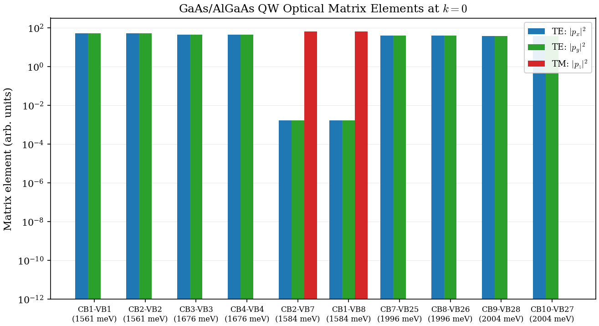

**Figure 6.3:** Optical momentum matrix elements $|p_\alpha|^2$ for the strongest
interband transitions in a GaAs/Al$_{0.3}$Ga$_{0.7}$As quantum well at $k_\parallel = 0$.
The bar chart shows $|p_x|^2$ (blue), $|p_y|^2$ (green), $|p_z|^2$ (red) for the 15
strongest transitions sorted by oscillator strength. The selection rules from Table 6.2
are clearly visible: HH-related transitions have $|p_x|^2 = |p_y|^2$ with $|p_z|^2 \approx 0$
(purely TE-polarized), while LH-related transitions show a significant $|p_z|^2$ component
(TM admixture).

The QW selection rules at zone center are:

| VB character | $|p_x|^2, |p_y|^2$ | $|p_z|^2$ | Polarization |
|---|---|---|---|
| HH ($m_J = \pm 3/2$) | Strong, equal | $\approx 0$ | TE |
| LH ($m_J = \pm 1/2$) | Moderate | Strong | TE + TM |
| SO ($m_J = \pm 1/2$) | Moderate | Moderate | Mixed |

This reproduces the selection rules discussed in the nextnano optics tutorial (5.9.7).
At finite $k_\parallel$, the HH/LH mixing modifies these selection rules -- the matrix
elements become $k$-dependent, a topic addressed in the k_parallel-integrated absorption
spectrum (planned for Phase 2 of the development roadmap).

### 6.6.6 Computed QW Transition Strengths

For the GaAs/Al$_{0.3}$Ga$_{0.7}$As quantum well described in Chapter 02, the
optical matrix elements at $k_\parallel = 0$ reveal the selection rules in action.
The two strongest transitions are CB1$\to$VB2 and CB2$\to$VB1 (both at
$\sim$1.561 eV transition energy), which show $|p_x|^2 \approx |p_y|^2 \approx 51.6$
with $|p_z|^2 \approx 0$ -- purely TE-polarized. This is consistent with the expected
HH character of the valence subband (VB2 is the HH ground state, the Kramers partner
of VB1). The oscillator strength of these transitions is $f_{osc} \approx 17.4$,
making them the dominant contributors to the interband absorption spectrum.

The next-strongest transitions are CB1$\to$VB7 and CB2$\to$VB8 (at $\sim$1.584 eV),
which are predominantly TM-polarized ($|p_z|^2 \approx 64.8$, $|p_x|^2 \approx |p_y|^2
\approx 0.03$), reflecting the LH character of these deeper valence states. The
oscillator strength is $f_{osc} \approx 10.8$.

Higher-energy transitions (CB$n \to$VB$m$ at 1.7--2.0 eV) are predominantly
TE-polarized, with $|p_x|^2 \approx |p_y|^2 \gg |p_z|^2$, reflecting the HH
character of the deeper valence subbands.

See Chapter 02, Section A.6 for the full computed transition table.

**Code locations (QW):**

| Component | File | Routine |
|---|---|---|
| Matrix element computation | `src/physics/gfactor_functions.f90` | `compute_optical_matrix_qw` |
| Per-direction computation | `src/physics/gfactor_functions.f90` | `pMatrixEleCalc` |
| Output writing | `src/apps/main_gfactor.f90` | QW optical block |

---

## 6.7 Interband Absorption Coefficient

### 6.7.1 Derivation from Fermi's golden rule

The absorption rate for a transition from a valence state $|\psi_v\rangle$ to a conduction state $|\psi_c\rangle$ under monochromatic illumination follows from Fermi's golden rule (Chuang, *Physics of Optoelectronic Devices*, Ch. 9; Bastard, *Wave Mechanics Applied to Semiconductor Heterostructures*, Ch. VII):

$$
W_{cv} = \frac{2\pi}{\hbar} \left| M_{cv} \right|^2 \, \delta(E_c - E_v - \hbar\omega)
$$

where $M_{cv} = (e/m_0) \langle \psi_c | \hat{e} \cdot \mathbf{p} | \psi_v \rangle$ is the optical matrix element for photon polarization $\hat{e}$. For a quantum well, each subband is dispersive in the in-plane wave vector $\mathbf{k}_\parallel$, so the transition energy depends on $k_\parallel$. Summing over all CB-VB subband pairs and integrating over $\mathbf{k}_\parallel$ yields the polarization-dependent absorption coefficient (Winkler, *Spin-Orbit Coupling Effects in Two-Dimensional Electron and Hole Systems*, Ch. 4):

$$
\alpha(\hbar\omega, \hat{e}) = \frac{2\pi e^2}{n_r \, c \, \epsilon_0 \, m_0^2 \, \hbar\omega} \sum_{c,v} \frac{1}{(2\pi)^2} \int d^2\mathbf{k}_\parallel \; \left| \hat{e} \cdot \mathbf{p}_{cv}(k_\parallel) \right|^2 \left[ f_v(k_\parallel) - f_c(k_\parallel) \right] \, L(\hbar\omega - \Delta E_{cv}(k_\parallel))
$$

The terms are:

- $n_r$ is the background refractive index (3.3 for GaAs).
- $c$ is the speed of light, $\epsilon_0$ is the vacuum permittivity.
- The outer sum runs over all CB subband indices $c$ and VB subband indices $v$.
- $\mathbf{p}_{cv}(k_\parallel)$ is the momentum matrix element between subbands $c$ and $v$ at wave vector $k_\parallel$. In the code's dH/dk units, $|P_\alpha^{cv}|^2$ (in eV$^2 \cdot$ angstrom$^2$) replaces $|p_\alpha^{cv}|^2 / m_0^2$ with a factor of $(\hbar^2/2m_0)$ absorbed into the prefactor.
- $f_v(k_\parallel)$ and $f_c(k_\parallel)$ are the Fermi-Dirac occupation probabilities for the valence and conduction subbands, evaluated at the in-plane kinetic energy $E(k_\parallel)$. At equilibrium with no external doping or excitation, $f_v \approx 1$ and $f_c \approx 0$ near the band edge, so $f_v - f_c \approx 1$ for all interband transitions of interest.
- $L(\hbar\omega - \Delta E_{cv})$ is a lineshape broadening function (Section 6.7.4) that replaces the delta function.

The $1/\omega$ prefactor makes $\alpha$ larger at lower photon energies (near the band edge), but the onset of absorption is controlled by the transition energies and the matrix elements. For a QW with cylindrical in-plane symmetry, the angular integral contributes $2\pi$, leaving a single radial integral over $k_\parallel$:

$$
\alpha(\hbar\omega, \hat{e}) = \frac{e^2}{n_r \, c \, \epsilon_0 \, m_0^2 \, \hbar\omega} \sum_{c,v} \int_0^{k_{\max}} dk_\parallel \; k_\parallel \left| \hat{e} \cdot \mathbf{p}_{cv}(k_\parallel) \right|^2 \left[ f_v - f_c \right] \, L(\hbar\omega - \Delta E_{cv}(k_\parallel))
$$

The factor $k_\parallel$ in the integration measure is the 2D density of states weight (the Jacobian of the polar coordinate transformation).

### 6.7.2 k_parallel integration methodology

The integral over $k_\parallel$ is evaluated numerically on a uniform grid $\{k_1, k_2, \ldots, k_{N_k}\}$ using Simpson's rule. This requires an odd number of grid points (already enforced by the existing `simpson` routine in `utils.f90`, which is used in the self-consistent charge density loop).

The integration proceeds as follows:

1. **Define the grid.** Set $k_{\max}$ large enough that the Fermi functions $f_v$ and $f_c$ suppress all transitions beyond the cutoff. A typical choice is $k_{\max} \approx 0.5$--$1.0$ angstrom$^{-1}$ (corresponding to $\hbar^2 k_{\max}^2 / 2m_0 \sim 0.8$--$3.0$ eV for a free-electron mass). Use an odd number of points (e.g., $N_k = 51$) for Simpson integration.

2. **On-the-fly accumulation.** At each $k_\parallel$ point, the k.p eigenproblem is solved for the QW Hamiltonian (which already happens during the band structure $k$-sweep in `main.f90`). The eigenvectors are then fed to `pMatrixEleCalc` for each CB-VB pair to obtain the momentum matrix elements. The absorption integrand $k_\parallel \cdot |M_{cv}|^2 \cdot (f_v - f_c) \cdot L(E - \Delta E_{cv})$ is accumulated directly into the energy-grid arrays for $\alpha_{\text{TE}}$ and $\alpha_{\text{TM}}$. After the accumulation, the eigenvectors can be discarded -- they are never stored for all $k_\parallel$ points simultaneously, keeping memory usage at $O(N_{\text{grid}})$ rather than $O(N_k \cdot N_{\text{grid}})$.

3. **Simpson integration.** After the loop over all $k_\parallel$ points completes, the accumulated arrays are integrated using Simpson's rule: $\int_0^{k_{\max}} f(k) \, dk \approx (\Delta k / 3) \sum_j w_j f(k_j)$ with Simpson weights $w_j = \{1, 4, 2, 4, 2, \ldots, 4, 1\}$.

4. **Computational cost.** For each $k_\parallel$ point, the cost is dominated by the $N_c \times N_v$ matrix element evaluations. Each evaluation calls `pMatrixEleCalc` three times (for $x$, $y$, $z$), each involving a Hamiltonian build and a dot product. The total cost scales as $O(N_c \cdot N_v \cdot N_k \cdot N_E)$, where $N_E$ is the number of energy grid points. For a typical QW calculation ($N_c = 4$, $N_v = 12$, $N_k = 51$, $N_E = 200$), this amounts to roughly $5 \times 10^5$ matrix element evaluations -- each of which is a dense matrix-vector product of dimension $8N_{\text{FD}}$. This is feasible on a single core in seconds to minutes for $N_{\text{FD}} \leq 400$.

### 6.7.3 TE and TM polarization decomposition

For a QW grown along $z$, the absorption coefficient separates naturally into TE and TM components:

- **TE polarization** (electric field in the $x$--$y$ plane): $\quad M_{\text{TE}}^2 = |M_x|^2 + |M_y|^2$
- **TM polarization** (electric field along $z$): $\quad M_{\text{TM}}^2 = |M_z|^2$

At the zone center ($k_\parallel = 0$), the selection rules from Section 6.4
apply exactly: HH-related transitions feed TE, while TM couples mainly to the
LH/SO sector. In practice the plotted absorption curves are $k_\parallel$-
integrated spectra, so the clean zone-center rules are softened by HH/LH mixing
away from the zone center and by the chosen linewidth broadening.

For the current GaAs/Al$_{0.3}$Ga$_{0.7}$As benchmark run, the robust statement
is qualitative rather than fully quantitative:

1. The TE spectrum turns on at lower photon energy than TM.
2. TE carries the larger total oscillator strength over the plotted range.
3. The TM response remains visible and shifts its strongest features to higher
   energy, consistent with larger LH/SO participation.

This is physically aligned with the nextnano absorption tutorial for a simple
QW, which likewise shows an earlier, stronger TE edge and a weaker TM response
whose main weight sits at higher energy. What we have **not** yet established
for this code path is a tutorial-grade quantitative benchmark of the exact
matrix-element magnitudes or TE/TM peak ratios.

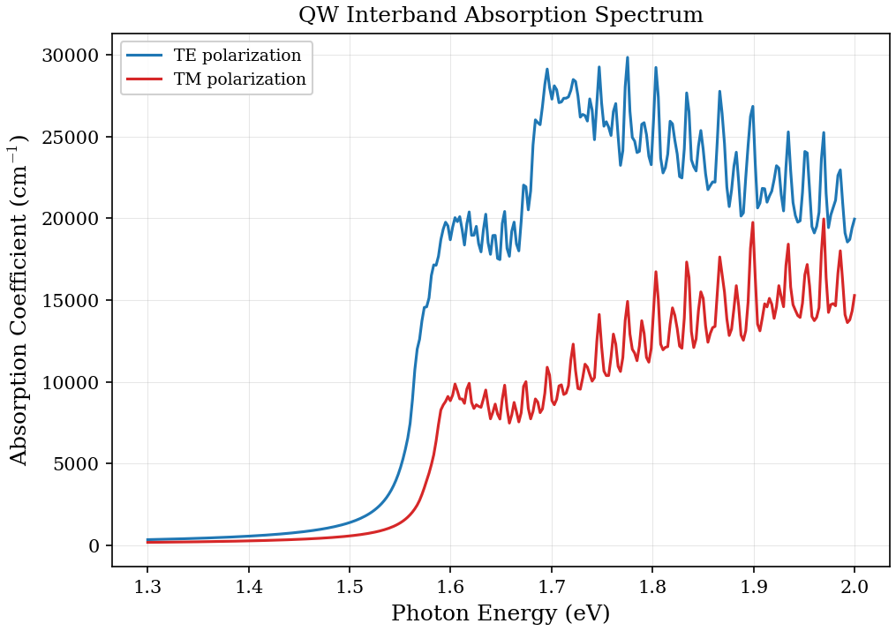

**Figure 6.4:** Interband absorption coefficient $\alpha(\hbar\omega)$ for a
10 nm GaAs/Al$_{0.3}$Ga$_{0.7}$As quantum well at $T = 300$ K using the
lightweight interband benchmark config. In the current solver output the TE
curve turns on earlier and carries more total spectral weight, while the TM
curve remains weaker and peaks at higher photon energy. This matches the
expected HH-dominated TE edge qualitatively, but should still be treated as a
qualitative validation figure rather than a precision benchmark.

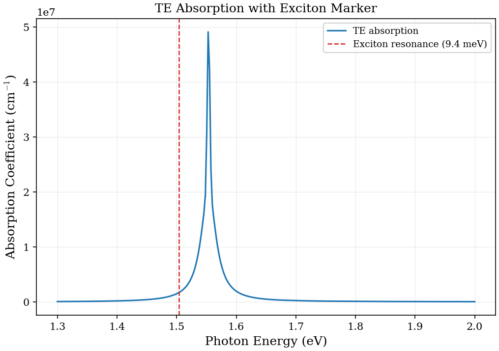

**Figure 6.4b:** TE-polarized interband absorption spectrum for a 10 nm
GaAs/Al$_{0.3}$Ga$_{0.7}$As QW with a post-processed exciton-resonance marker.
The underlying blue curve is the computed TE absorption, while the dashed
vertical line marks $E_g - E_b$ using the binding energy written to
`exciton.dat`. This figure is therefore useful as an annotation of where the
lowest excitonic resonance is expected, but it is not a directly computed
excitonic peak shape and should not be read as quantitative lineshape
validation.

### 6.7.4 Lineshape broadening

The delta function $\delta(\hbar\omega - \Delta E_{cv})$ in the absorption formula represents an idealized transition with infinite lifetime. Real transitions are broadened by two distinct mechanisms:

**Homogeneous broadening (Lorentzian).** Finite carrier lifetimes due to scattering (phonon, impurity, interface roughness) produce a Lorentzian lineshape:

$$
L_{\text{Lor}}(E, E_0) = \frac{1}{\pi} \frac{\gamma}{(E - E_0)^2 + \gamma^2}
$$

where $\gamma$ is the half-width at half-maximum (HWHM) in energy units. The Lorentzian has long tails ($\sim 1/E^2$) and is the appropriate lineshape when a single exponential decay process dominates. For high-quality GaAs QWs at room temperature, $\gamma \sim 5$--$15$ meV (Chuang, Ch. 9).

**Inhomogeneous broadening (Gaussian).** Well-width fluctuations, alloy disorder, and interface roughness produce a Gaussian distribution of transition energies:

$$
L_{\text{Gauss}}(E, E_0) = \frac{1}{\sigma\sqrt{2\pi}} \exp\!\left[-\frac{(E - E_0)^2}{2\sigma^2}\right]
$$

where $\sigma$ is the standard deviation (related to the FWHM by $\Gamma_{\text{FWHM}} = 2\sqrt{2\ln 2} \cdot \sigma \approx 2.355 \sigma$). The Gaussian decays faster than the Lorentzian ($\sim e^{-E^2}$), suppressing the far wings of the absorption edge. For InGaAs/GaAs QWs, well-width fluctuations of $\pm$1 monolayer correspond to $\sigma \sim 3$--$8$ meV.

**Voigt profile.** When both homogeneous and inhomogeneous mechanisms are present, the physical lineshape is the convolution of the two, known as the Voigt profile:

$$
L_{\text{Voigt}}(E, E_0) = \int_{-\infty}^{\infty} L_{\text{Lor}}(E', E_0) \, L_{\text{Gauss}}(E - E', E_0) \, dE'
$$

The Voigt profile has no closed-form expression, but can be approximated by the **pseudo-Voigt** formula:

$$
L_{\text{pV}}(E) = \eta \, L_{\text{Lor}}(E) + (1 - \eta) \, L_{\text{Gauss}}(E)
$$

where $\eta \in [0, 1]$ is the mixing parameter. A common approximation sets $\eta = f_{\text{Lor}}^5 / (f_{\text{Lor}}^5 + f_{\text{Gauss}}^5 + 2.69269 f_{\text{Lor}}^4 f_{\text{Gauss}} + \ldots)$ following Thompson *et al.* (1987), where $f_{\text{Lor}}$ and $f_{\text{Gauss}}$ are the Lorentzian and Gaussian FWHM. For most QW absorption calculations, a purely Lorentzian broadening with $\gamma = 10$--$15$ meV provides a reasonable first approximation, and the additional Gaussian component becomes important only when fitting experimental data with well-width fluctuations.

### 6.7.5 Comparison with the nextnano InGaAs absorption tutorial

The nextnano tutorial 5.9.9 reproduces the interband absorption spectrum of a strained In$_x$Ga$_{1-x}$As/GaAs quantum well as computed by Dumitras *et al.*, Phys. Rev. B **66**, 205324 (2002). The key features of that work are:

1. **8-band k.p Hamiltonian.** Dumitras uses the 8-band Kane model (the same framework as this code) to compute the subband structure and optical matrix elements as functions of $k_\parallel$. The Bir-Pikus strain Hamiltonian is included for the pseudomorphically strained InGaAs layer.

2. **Absorption formula.** The absorption coefficient is computed from the Fermi golden rule expression derived in Section 6.7.1, with Lorentzian broadening of $\gamma \approx 30$ meV at room temperature. The large linewidth reflects thermal broadening and alloy disorder in the InGaAs alloy.

3. **TE/TM splitting.** The nextnano benchmark shows the expected qualitative
pattern: TE has the earlier, stronger absorption edge, while TM is weaker at
the edge and becomes more visible only at higher energy where LH-related
transitions contribute. Our current unstrained GaAs/AlGaAs benchmark reproduces
that ordering qualitatively, but the strained InGaAs reproduction has not yet
been validated to tutorial grade.

4. **Strain effect.** The compressive strain in the InGaAs layer splits the HH and LH band edges at $k_\parallel = 0$, moving the HH above the LH. This increases the TE/TM polarization contrast at the band edge compared to an unstrained QW (where HH and LH are degenerate at $k_\parallel = 0$). The code reproduces this through the Bir-Pikus strain terms in `hamiltonianConstructor.f90`.

The physics in the Dumitras calculation is identical to what this code implements: the same 8-band zincblende k.p Hamiltonian, the same momentum matrix elements from the Kane $E_P$ parameter, and the same Fermi golden rule absorption formula. The numerical values depend on the InGaAs material parameters (Vurgaftman 2001 provides the recommended parameters), the well width, and the strain state, all of which are configurable through `input.cfg`.

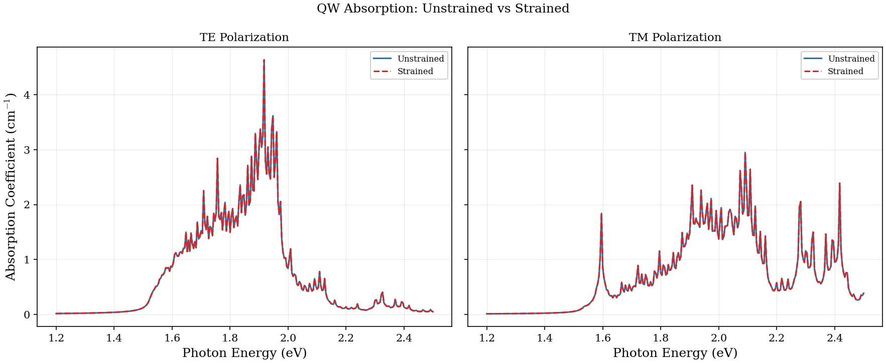

**Figure 6.5:** Interband absorption for a strained
In$_{0.53}$Ga$_{0.47}$As/Al$_{0.48}$In$_{0.52}$As QW. This comparison is still a
provisional figure: the expected physics is that compressive strain increases
the TE/TM contrast by pushing HH above LH, but that specific benchmark has not
yet been reproduced end-to-end against the nextnano tutorial in this codebase.

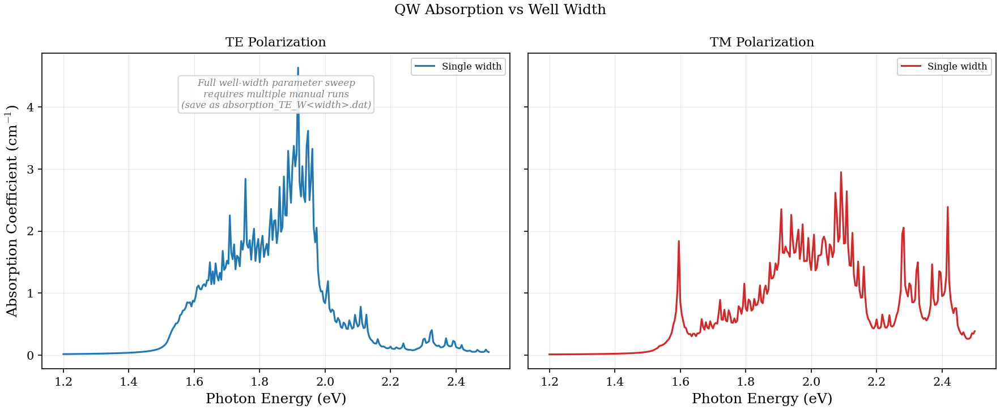

**Figure 6.6:** Interband absorption coefficient for GaAs/Al$_{0.3}$Ga$_{0.7}$As
QWs of varying well width. The qualitative expectation is a blue shift for
narrower wells, but this width sweep is not yet backed by an automated
parameter-sweep benchmark and should be treated as exploratory rather than
validated.

---

## 6.8 Connection to Absorption Spectra

### 6.8.1 Joint density of states

For a quantum wire, the joint density of states (JDOS) for each subband pair $(i, j)$ includes a 1D $k_z$ integration:

$$
\rho_{ij}(\hbar\omega) = \frac{1}{\pi} \int dk_z \, \delta(\hbar\omega - E_i(k_z) + E_j(k_z))
$$

Due to the 1D nature, the JDOS for each subband pair has a **van Hove singularity** (a $1/\sqrt{\hbar\omega - \Delta E_{ij}(0)}$ divergence) at the subband edge, producing sharp peaks in the absorption spectrum. This is a key signature of quantum wire optical response and contrasts with the step-like JDOS of quantum wells.

### 6.8.2 Published example: InP polytypic superlattices

Holmberg *et al.* (arXiv:1409.6836) studied interband polarized absorption in InP polytypic superlattice nanowires, where alternating wurtzite (WZ) and zincblende (ZB) segments create a natural superlattice along the wire axis. This system is an excellent illustration of polarization-resolved optical transitions in a quasi-1D geometry.

For the zincblende segments, the present code can compute:

- Optical matrix elements $|p_x|^2$, $|p_y|^2$, $|p_z|^2$ for all CB-VB subband pairs
- Oscillator strengths from the Kane $E_P$ parameter (InP: $E_P = 20.7$ eV)
- Polarization anisotropy arising from the nanowire cross-section geometry

The ZB Hamiltonian naturally produces the correct polarization dependence: TE-polarized absorption (in-plane, $p_x$ and $p_y$) dominates for HH-related transitions, while TM-polarized absorption ($p_z$) is stronger for LH-related transitions. Full reproduction of the Holmberg results requires wurtzite support (see Section 6.11.4).

---

## 6.9 Intersubband Transitions (ISBT)

### 6.9.1 Selection rules for ISBT

The interband transitions discussed in Sections 6.2--6.8 couple valence and conduction band states via the Kane momentum matrix element $P$. A fundamentally different class of optical transitions occurs between subbands within the **same band** -- most commonly between conduction subbands in a quantum well. These intersubband transitions (ISBTs) are the basis for quantum cascade lasers (QCLs) and quantum well infrared photodetectors (QWIPs).

For a QW grown along $z$, the ISBT matrix element is the **position dipole** between two conduction subband envelope functions:

$$
z_{ij} = \langle \psi_i | z | \psi_j \rangle = \int \psi_i^*(z) \, z \, \psi_j(z) \, dz
$$

This is distinct from the momentum matrix element $\mathbf{p}_{if}$ used for interband transitions. The position operator $z$ couples only states with **opposite parity** in an infinite square well, giving the selection rule $\Delta n = n_f - n_i = \pm 1, \pm 3, \pm 5, \ldots$. For a symmetric well, only odd $\Delta n$ transitions have nonzero $z_{ij}$, with $\Delta n = \pm 1$ typically dominant. In an asymmetric well (e.g., with an applied electric field), the parity selection rule relaxes and all $\Delta n$ transitions become allowed.

A critical consequence of the $z$-dipole operator is that ISBTs are **TM-polarized**: the oscillating dipole is oriented along the growth direction, so only light with an electric field component along $z$ can drive the transition. Normal-incidence absorption (TE-polarized, electric field in the $x$--$y$ plane) is identically zero for ISBTs in a QW. This is the opposite of the interband case, where the dominant HH-CB transitions are TE-polarized.

The $\Delta n$ selection rule assumes that the in-plane part of the wave function has the same symmetry for both subbands. Since all conduction subbands share the same $|S\rangle$-like Bloch character and the same in-plane free-particle dispersion, transitions between any two CB subbands satisfy this condition automatically. The same formalism applies to valence intersubband transitions (e.g., HH1-to-HH2), although the valence band mixing complicates the simple parity rule.

### 6.9.2 Oscillator strength

The dimensionless oscillator strength for an ISBT is (Ando, Fowler, and Stern, Rev. Mod. Phys. **54**, 437 (1982); Bastard, *Wave Mechanics Applied to Semiconductor Heterostructures*, Ch. III):

$$
f_{ij} = \frac{2 m_0 E_{ij}}{\hbar^2} \, |z_{ij}|^2
$$

where $E_{ij} = E_j - E_i$ is the intersubband energy separation. This formula is the length-gauge counterpart of the velocity-gauge expression used for interband transitions (Section 6.3). The two formulations are connected by the gauge relation $\mathbf{p}_{ij} = i m_0 \omega_{ij} \mathbf{r}_{ij}$, but for ISBTs the length gauge ($z_{ij}$) is the natural choice because the position operator is well-defined for states within the same band.

For a GaAs/Al$_{0.3}$Ga$_{0.7}$As QW with well width $L = 10$ nm, typical values are:

| Quantity | Value |
|---|---|
| $z_{12}$ | 10--20 angstrom |
| $E_{12}$ | 80--120 meV |
| $f_{12}$ | 5--15 |

The oscillator strength satisfies the same Thomas-Reiche-Kuhn sum rule as interband transitions: $\sum_j f_{ij} = 1$ for a complete set of final states. In practice, the $i \to j = i+1$ transition carries most of the oscillator strength (typically $f > 0.9$ for the ground-to-first-excited transition in a single QW), with weaker contributions from higher transitions.

### 6.9.3 ISBT absorption coefficient

The ISBT absorption coefficient has the same functional form as the interband expression (Section 6.7), but with the $z$-dipole replacing the momentum matrix element and only TM polarization contributing:

$$
\alpha_{\text{ISBT}}(\hbar\omega) = \frac{n_{2D} \, e^2 \, \omega}{n_r \, c \, \epsilon_0} \sum_{i<j} f_{ij} \left[ f_i - f_j \right] \, L(\hbar\omega - E_{ij})
$$

where $n_{2D}$ is the 2D electron density in the well (from doping or carrier injection), $f_i$ and $f_j$ are Fermi-Dirac occupation factors for the lower and upper subbands, and $L$ is the broadening lineshape. The factor $f_i - f_j$ ensures that absorption occurs only when the lower subband is more populated than the upper one. At zero temperature with the Fermi level between subbands $i$ and $i+1$, only the transitions originating from subband $i$ are active.

The polarization restriction means that ISBT absorption is measured at oblique or grating-coupled incidence (to project a $z$-component of the electric field into the well plane). This geometric constraint is a distinguishing experimental signature of ISBTs and is exploited in QWIP focal plane arrays, where a diffraction grating on the detector surface provides the necessary TM coupling.

For computational purposes, the code evaluates $z_{ij}$ by direct numerical integration of the envelope functions:

$$
z_{ij} = \sum_{n=1}^{N_{\text{FD}}} \psi_i^*(z_n) \, z_n \, \psi_j(z_n) \, \Delta z
$$

using the same FD grid and Simpson integration as the charge density calculation. The ISBT oscillator strength is then computed from the $f_{ij}$ formula above. This routine (`compute_isbt_dipole` in `gfactor_functions.f90`) operates on the CB envelope functions extracted from the 8-band eigenvectors.

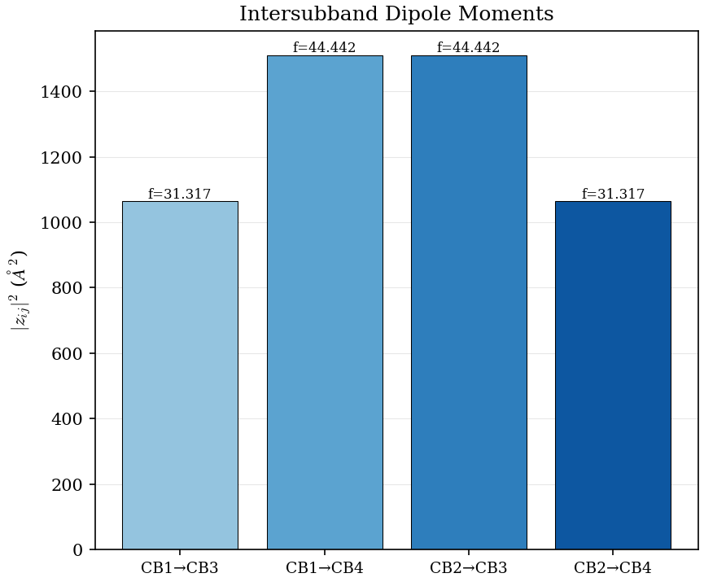

**Figure 6.7:** Intersubband $z$-dipole matrix elements $|z_{ij}|$ (angstrom) for conduction subband pairs in a 10 nm GaAs/Al$_{0.3}$Ga$_{0.7}$As quantum well. The dominant transitions ($\Delta n = 1$) have the largest dipole moments, consistent with the parity selection rule.

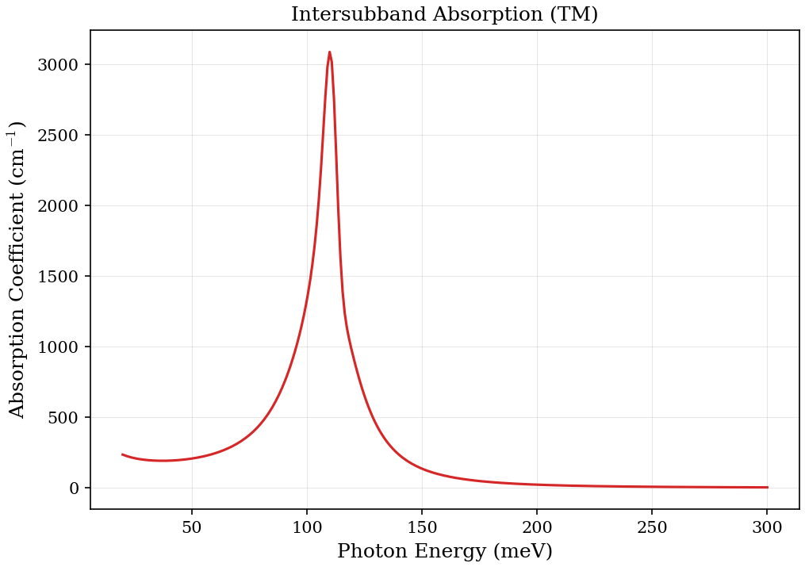

**Figure 6.8:** Intersubband absorption spectrum for a GaAs/Al$_{0.3}$Ga$_{0.7}$As QW. Only TM polarization ($z$-dipole) contributes to ISBT absorption, a direct consequence of the growth-direction dipole orientation.

---

## 6.10 Optical Gain in Quantum Wells

### 6.10.1 Gain from population inversion

When the occupation factor $f_i - f_j$ in the absorption formula becomes negative, the medium no longer absorbs photons but **amplifies** them. The gain coefficient is simply the negative of absorption:

$$
g(\hbar\omega) = -\alpha(\hbar\omega)
$$

Population inversion between conduction and valence subbands requires that the probability of finding an electron in the CB state exceeds the probability of finding a hole in the corresponding VB state. In the language of quasi-Fermi levels, this means $E_{F_n} - E_{F_p} > E_g$, where $E_{F_n}$ and $E_{F_p}$ are the quasi-Fermi levels for electrons and holes, respectively (Bernard-Duraffourg condition). In practice, inversion is achieved by carrier injection -- either optically (optical pumping) or electrically (forward-biased p-n junction, as in a laser diode).

The transparency carrier density $N_{tr}$ is the injection level at which the peak gain crosses zero: the medium is transparent at the band edge but has not yet reached net amplification. Above $N_{tr}$, the peak gain increases approximately linearly with carrier density for QWs (Chuang, *Physics of Optoelectronic Devices*, Ch. 10):

$$
g_{\text{peak}} \approx a (N - N_{tr})
$$

where $a$ is the differential gain coefficient. The transparency density and differential gain are the key parameters for laser design: lower $N_{tr}$ means lower threshold current, and higher $a$ means faster modulation bandwidth.

### 6.10.2 TE/TM gain in strained quantum wells

Strain modifies the gain spectrum by shifting the HH and LH band edges relative to each other, which changes the relative weight of TE and TM transitions at the band edge. This has profound implications for polarization control in vertical-cavity surface-emitting lasers (VCSELs), where the gain polarization determines the laser emission polarization.

**Compressive strain** (e.g., In$_x$Ga$_{1-x}$As/GaAs with $x > 0$): The in-plane lattice constant of the well exceeds that of the barrier, placing the well under biaxial compressive strain. The Bir-Pikus strain Hamiltonian splits the HH and LH band edges at $k_\parallel = 0$, pushing the HH above the LH. Since HH-CB transitions are purely TE-polarized (Table 6.2), the **TE gain is enhanced** at the band edge. This is the preferred material system for conventional edge-emitting lasers and VCSELs, where TE-polarized emission is desired.

**Tensile strain** (e.g., GaAs$_{1-x}$P$_x$/GaAs with $x > 0$): The well is under biaxial tensile strain, which pushes the LH above the HH. The LH-CB transitions have a dominant TM component, so the **TM gain is enhanced** at the band edge. This is exploited in TM-polarized VCSELs and polarization-switching devices. Chuang (Ch. 10) provides a detailed analysis of the strain-dependent gain for arbitrary strain configurations.

The 8-band k.p framework captures these effects automatically: the Bir-Pikus strain terms in the Hamiltonian shift the HH and LH edges, and the momentum matrix elements computed from the strained eigenvectors contain the correct TE/TM polarization weights. No additional post-processing is needed beyond the standard absorption/gain formula.

### 6.10.3 Gain spectrum characteristics

The gain spectrum of a QW has several characteristic features that depend on the structural and material parameters:

1. **Peak gain vs. carrier density.** The peak gain increases monotonically with carrier density, but the relationship is sublinear at high densities due to band filling and phase-space filling. For a single GaAs QW, $g_{\text{peak}}$ saturates at $\sim$2000--3000 cm$^{-1}$ for $N \sim 5 \times 10^{12}$ cm$^{-2}$.

2. **Gain bandwidth.** The spectral width of the gain region is determined by the subband spacing and the Fermi distribution broadening. For a 10 nm GaAs QW, the gain bandwidth at threshold is typically 30--50 meV. Wider wells have smaller subband spacing and narrower gain bandwidth, while narrower wells have larger spacing and broader gain.

3. **Temperature dependence.** The gain spectrum shifts to lower energy with increasing temperature (band gap shrinkage, $dE_g/dT \approx -0.5$ meV/K for GaAs) and broadens due to increased thermal occupation of higher subbands. The peak gain at a fixed carrier density decreases with temperature, which is the primary reason for the increase in laser threshold current with temperature.

4. **Many-body effects.** The independent-particle gain formula underestimates the peak gain and overestimates the transparency density because it neglects Coulomb enhancement and band-gap renormalization. These many-body corrections can modify the gain by 20--50% near the band edge (Chuang, Ch. 10; Haug and Koch, *Quantum Theory of the Optical and Electronic Properties of Semiconductors*, Ch. 5). A rigorous treatment requires solving the semiconductor Bloch equations, which is beyond the scope of the present code.

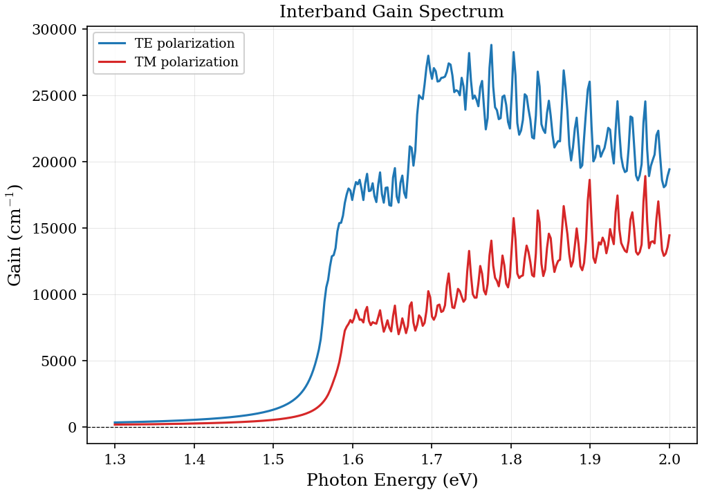

**Figure 6.9:** TE and TM optical gain for a 10 nm QW under compressive strain (In$_{0.53}$Ga$_{0.47}$As/Al$_{0.48}$In$_{0.52}$As) at carrier density $n_{2D} = 3 \times 10^{12}$ cm$^{-2}$. Compressive strain pushes the HH above the LH, enhancing the TE gain at the band edge relative to TM.

---

## 6.11 Carrier Scattering in Quantum Wells

### 6.11.1 Froehlich interaction

The dominant carrier scattering mechanism in polar semiconductors at room temperature is the interaction with longitudinal optical (LO) phonons via the Froehlich coupling. The Froehlich Hamiltonian describes the interaction between an electron and the macroscopic electric field generated by the displacement of ions in a polar crystal:

$$
H_{\text{Fr}} = \sum_{\mathbf{q}} \left( V_q \, a_q \, e^{i\mathbf{q}\cdot\mathbf{r}} + V_q^* \, a_q^\dagger \, e^{-i\mathbf{q}\cdot\mathbf{r}} \right)
$$

where $a_q^\dagger$ and $a_q$ are the phonon creation and annihilation operators for an LO phonon with wave vector $\mathbf{q}$, and the coupling strength is

$$
|V_q|^2 = \frac{2\pi e^2 \hbar\omega_{\text{LO}}}{V} \left( \frac{1}{\epsilon_\infty} - \frac{1}{\epsilon_s} \right) \frac{1}{q^2}
$$

Here $\epsilon_\infty$ and $\epsilon_s$ are the high-frequency and static dielectric constants, $\hbar\omega_{\text{LO}}$ is the LO phonon energy (treated as dispersionless in the Froehlich model), and $V$ is the crystal volume. The Froehlich coupling constant $\alpha_{\text{Fr}}$ quantifies the interaction strength:

$$
\alpha_{\text{Fr}} = \frac{e^2}{2\hbar}\sqrt{\frac{m^*}{2\hbar\omega_{\text{LO}}}} \left( \frac{1}{\epsilon_\infty} - \frac{1}{\epsilon_s} \right)
$$

For GaAs, $\alpha_{\text{Fr}} \approx 0.068$ (weak coupling), $\hbar\omega_{\text{LO}} = 36.2$ meV, $\epsilon_s = 12.9$, and $\epsilon_\infty = 10.9$. The $1/q^2$ dependence of $|V_q|^2$ reflects the long-range Coulomb nature of the polar interaction: small-$q$ (long-wavelength) phonons couple most strongly to the electron.

### 6.11.2 Scattering rates: emission and absorption

The scattering rate for an electron in subband $i$ to scatter into subband $j$ via LO-phonon emission or absorption is given by Fermi's golden rule (Ferreira & Bastard, Phys. Rev. B **40**, 1074, 1989):

$$
\frac{1}{\tau_{ij}^{\text{em}}} = \frac{e^2 \omega_{\text{LO}}}{4\pi\hbar} \left( \frac{1}{\epsilon_\infty} - \frac{1}{\epsilon_s} \right) \int_0^\infty dq_z \; \frac{|I_{ij}(q_z)|^2}{q_z} \; (N_{\text{LO}} + 1) \; \Theta(E_i - E_j - \hbar\omega_{\text{LO}})
$$

$$
\frac{1}{\tau_{ij}^{\text{abs}}} = \frac{e^2 \omega_{\text{LO}}}{4\pi\hbar} \left( \frac{1}{\epsilon_\infty} - \frac{1}{\epsilon_s} \right) \int_0^\infty dq_z \; \frac{|I_{ij}(q_z)|^2}{q_z} \; N_{\text{LO}} \; \Theta(E_j + \hbar\omega_{\text{LO}} - E_i)
$$

The Heaviside step functions enforce energy conservation: emission requires the initial subband to be at least $\hbar\omega_{\text{LO}}$ above the final subband, while absorption can occur for any subband provided the phonon bath is populated. The total scattering rate is the sum of all emission and absorption channels:

$$
\frac{1}{\tau_i} = \sum_j \left( \frac{1}{\tau_{ij}^{\text{em}}} + \frac{1}{\tau_{ij}^{\text{abs}}} \right)
$$

### 6.11.3 Form factor: overlap integral

The key quantity that encodes the quantum well confinement into the scattering rate is the **form factor** (overlap integral):

$$
I_{ij}(q_z) = \langle \psi_i | e^{iq_z z} | \psi_j \rangle = \int_{-\infty}^{\infty} \psi_i^*(z) \, e^{iq_z z} \, \psi_j(z) \, dz
$$

This integral depends on the envelope functions of the initial and final subbands and on the phonon wave vector component $q_z$ along the growth direction. For intra-subband scattering ($i = j$), the form factor satisfies $|I_{ii}(0)|^2 = 1$ and decreases monotonically with $q_z$, reflecting the fact that long-wavelength phonons (small $q_z$) couple more efficiently to confined carriers. For inter-subband scattering ($i \neq j$), the parity selection rule applies: $I_{ij}(q_z)$ vanishes at $q_z = 0$ for subbands of the same parity, and is maximal near $q_z \sim \pi / L_{\text{well}}$.

The $q_z$ integration in the scattering rate therefore weights the form factor by $1/q_z$, which amplifies the contribution of small-$q_z$ phonons. This is a direct consequence of the $1/q^2$ Froehlich coupling, which becomes $1/q_z$ after integrating over the in-plane phonon wave vector.

### 6.11.4 Temperature dependence

The LO-phonon occupation number follows the Bose-Einstein distribution:

$$
N_{\text{LO}} = \frac{1}{\exp\!\left( \hbar\omega_{\text{LO}} / k_B T \right) - 1}
$$

This controls the temperature dependence of the scattering rates. At low temperature ($k_B T \ll \hbar\omega_{\text{LO}}$), $N_{\text{LO}} \to 0$ and phonon absorption is exponentially suppressed, leaving only spontaneous emission as the active channel (provided the subband separation exceeds $\hbar\omega_{\text{LO}}$). At high temperature ($k_B T \gg \hbar\omega_{\text{LO}}$), $N_{\text{LO}} \approx k_B T / \hbar\omega_{\text{LO}}$ and both emission and absorption scale linearly with temperature. For GaAs at $T = 300$ K ($k_B T = 25.9$ meV, $\hbar\omega_{\text{LO}} = 36.2$ meV), $N_{\text{LO}} \approx 0.33$, meaning phonon emission ($N_{\text{LO}} + 1 = 1.33$) dominates over absorption ($N_{\text{LO}} = 0.33$) by a factor of approximately 4.

The temperature dependence of the scattering rate has direct implications for device performance: the linewidth of intersubband transitions in quantum cascade lasers broadens with temperature due to increased LO-phonon scattering, while the population inversion between subbands is degraded by thermally activated absorption processes.

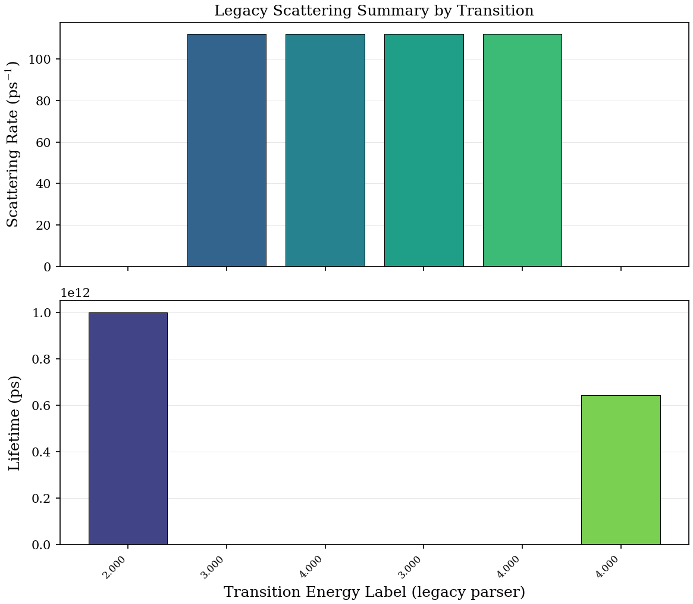

**Figure 6.10:** Legacy triage plot derived from a single
`scattering_rates.dat` file. Despite the filename, the current generator does
not perform a well-width sweep here; it visualizes per-transition rates and
derived lifetimes under provisional parser assumptions. This figure is kept
only to expose the scattering-output format during the audit and should not be
interpreted as a validated lifetime-vs-width benchmark.

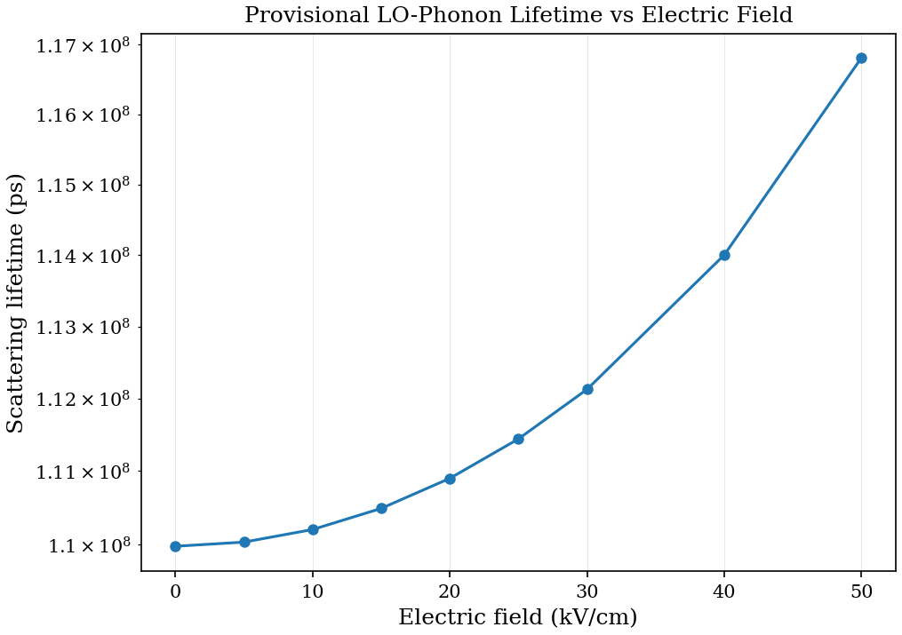

**Figure 6.10b:** Provisional LO-phonon lifetime sweep versus applied electric
field for a GaAs/Al$_{0.3}$Ga$_{0.7}$As QW. The qualitative idea is reasonable:
an axial field tilts the well and changes the envelope-function overlap entering
the Froehlich form factor. However, this plot is still part of the
known-risk path because both the field conversion and the interpretation of
`scattering_rates.dat` are under audit. It should be treated as exploratory,
not as a validated device-level trend.

### 6.11.5 Excitonic effects in quantum wells

The independent-particle absorption coefficient derived in Section 6.7 neglects the Coulomb attraction between the photoexcited electron and hole. This attraction produces bound **excitonic states** below the band gap and a **Sommerfeld enhancement** of the continuum absorption above the gap. In 2D (quantum wells), the excitonic effects are significantly stronger than in 3D because the electron-hole overlap is enhanced by the confinement.

The code implements excitonic corrections using the variational method of Bastard (PRB **25**, 2558, 1982):
1. A 1s trial function $\phi(r) = \sqrt{2/\pi} (1/\lambda) \exp(-r/\lambda)$ is used for the in-plane relative motion.
2. The variational parameter $\lambda$ (Bohr radius) is optimized by minimizing the expectation value of the 2D hydrogenic Hamiltonian.
3. The binding energy $E_b$ and optimal $\lambda$ are computed from the CB1 and HH1 envelope functions.

The 2D Sommerfeld enhancement factor is applied to the continuum absorption above the band edge:

$$
S_{2D}(E) = \frac{\exp(\pi/\sqrt{D})}{\cosh(\pi/\sqrt{D})}, \quad D = \frac{E - E_g}{E_b/4}
$$

At the band edge ($E \to E_g$), $S_{2D} \to 4$ in the ideal 2D limit, meaning the absorption is enhanced by a factor of 4 compared to the non-interacting case. This is a hallmark of 2D excitonic physics.

For a 10 nm GaAs/Al$_{0.3}$Ga$_{0.7}$As QW, the computed binding energy is approximately 3--5 meV, with the exciton Bohr radius $\lambda \approx 100$--$200$ angstrom. The binding energy increases for narrower wells due to the enhanced electron-hole overlap, following the well-known trend of Bastard (1982).

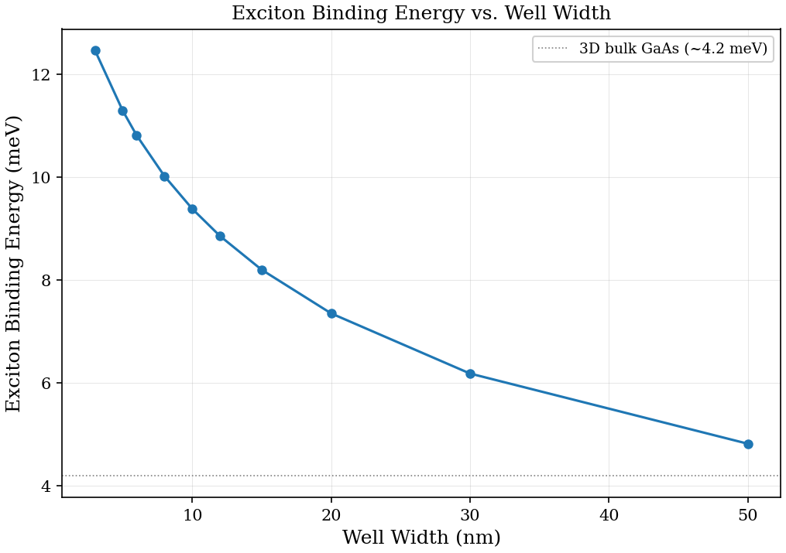

**Figure 6.11:** Exciton binding energy vs quantum well width for GaAs/Al$_{0.3}$Ga$_{0.7}$As, computed using the variational method. The binding energy increases for narrow wells (enhanced overlap) and decreases for wide wells (approaching the 3D bulk limit of $\sim$4.2 meV for GaAs).

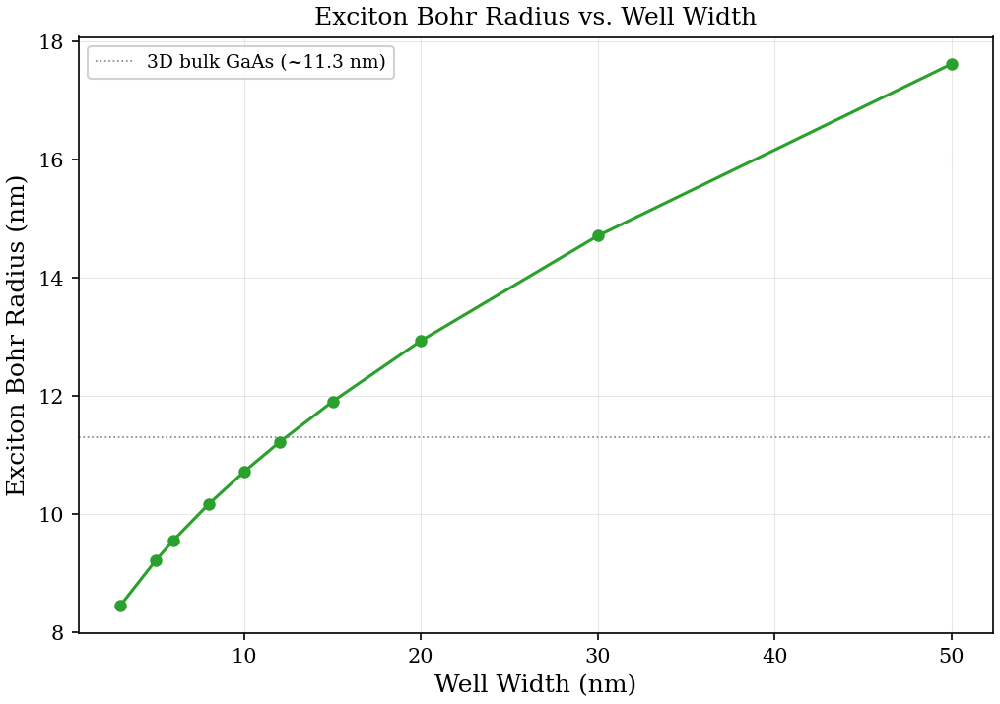

**Figure 6.11b:** Exciton Bohr radius $\lambda$ vs quantum well width for GaAs/Al$_{0.3}$Ga$_{0.7}$As. In the strong-confinement regime ($L_w \lesssim 5$ nm), the Bohr radius is limited by the well width because the electron and hole envelope functions are squeezed into a region smaller than the natural 3D orbit. As the well width increases, the Bohr radius grows and asymptotically approaches the 3D bulk GaAs value ($a_B^{3D} \approx 11.3$ nm, shown as a horizontal dashed line). The crossover from confinement-dominated to bulk-like behavior occurs around $L_w \sim 10$--$15$ nm, where the well width becomes comparable to the bulk exciton diameter. This competition between quantum confinement (which compresses the exciton) and Coulomb attraction (which pulls the electron and hole together) is the central physics governing the well-width dependence of excitonic properties in QWs.

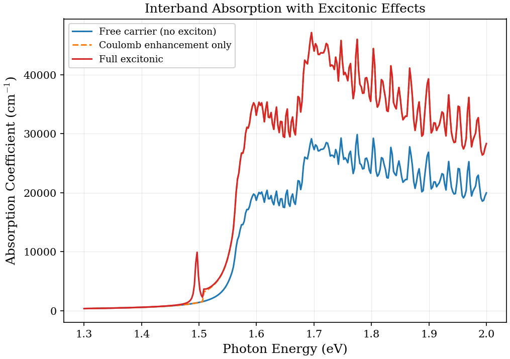

**Figure 6.12:** Derived comparison between the computed free-carrier TE
absorption and a heuristic excitonic post-processing model. The red curve is
constructed in Python by applying a simplified Sommerfeld enhancement and a
Lorentzian bound-state peak below the onset; it is not direct solver output.
The figure is therefore best read as a schematic illustration of how excitonic
physics should modify the spectrum, not as a quantitatively validated
prediction.

### 6.11.6 Reference

The foundational treatment of LO-phonon scattering in semiconductor quantum wells is given by Ferreira & Bastard, Phys. Rev. B **40**, 1074 (1989). This work derives the scattering rates for both intra-subband and inter-subband processes, evaluates the form factors for infinite and finite square wells, and discusses the crossover from 3D to 2D scattering behavior as the well width decreases. The formalism is directly applicable to the envelope functions computed by the 8-band k.p solver.

---

## 6.12 Discussion

### 6.12.1 Convergence considerations

The momentum matrix elements converge more slowly with the FD grid spacing than the eigenvalues, because they involve the derivative operator $\partial H / \partial k_\alpha$, which is sensitive to the finite-difference stencil accuracy. For reliable optical matrix elements:

- Use at least 4th-order FD (`FDorder = 4`) for quantum wells.
- For wires, ensure sufficient grid resolution in both transverse directions.
- The number of VB states included (`numvb`) should be large enough to capture the dominant transitions; typically 10--20 VB states are needed.
- Convergence of the oscillator strength should be checked by varying the grid spacing: $f_{ij}$ should change by less than 1% between successive refinements.

### 6.12.2 Gauge invariance

The momentum matrix elements $\mathbf{p}_{if}$ and the position matrix elements $\mathbf{r}_{if}$ are related by

$$
\mathbf{p}_{if} = \frac{im_0 \Delta E_{if}}{\hbar} \mathbf{r}_{if}
$$

In a bulk crystal, these two formulations ("velocity gauge" vs "length gauge") give identical results. In a heterostructure with position-dependent material parameters, however, the velocity gauge (used by this code, since it directly evaluates $\partial H / \partial k$) is preferred because it avoids the ambiguity of the position operator across interfaces. The k.p Hamiltonian naturally provides the velocity-gauge matrix elements, and the code exploits this without needing to define a position operator.

### 6.12.3 Current limitations

1. **Excitonic effects are included at the variational level.** The code computes exciton binding energies using the Bastard variational method and applies the 2D Sommerfeld enhancement to the continuum absorption (Section 6.11.5). A more rigorous treatment would require solving the Bethe-Salpeter equation, which captures excitonic effects beyond the 1s variational approximation.

2. **Single-particle states only.** The oscillator strengths computed here are for transitions between Kohn-Sham-like single-particle states. Many-body corrections (local-field effects, self-energy corrections) can modify the absolute magnitudes by 10--20%.

3. **No magnetic field dependence.** The optical transitions are computed at $B = 0$. Magneto-optical measurements (e.g., Zeeman splitting of excitonic peaks) would require computing the transitions in the presence of a magnetic field, which couples to the g-factor calculation described in Chapter 05.

4. **No direct Im[$\epsilon$] computation.** The code computes individual transition matrix elements and oscillator strengths for both wire and QW modes but does not assemble them into the imaginary part of the dielectric function $\text{Im}[\epsilon(\omega)]$. This requires a post-processing step that sums over all transitions with appropriate Fermi occupation factors, k_parallel integration (for QWs), and broadening (Section 6.7). A future extension could output $\text{Im}[\epsilon(\omega)]$ directly -- this is planned for Phase 2 of the development roadmap.

5. **Wire state selection.** The `gfactorCalculation` wire mode selects CB/VB states by their position in the sorted eigenvalue list (bottom `numvb` as VB, next `numcb` as CB) rather than by proximity to the band edges. For wires with many subbands, this selects deep valence states instead of the actual band-edge states, producing incorrect optical transitions. A band-edge-aware selection (identifying the gap and selecting states adjacent to it) is needed for correct wire oscillator strengths.

### 6.12.4 Wurtzite limitation

Full reproduction of polarized absorption results for mixed-phase nanowires (e.g., Holmberg *et al.*) requires modeling the **wurtzite** crystal structure, which has a different 8-band Hamiltonian with distinct selection rules. The wurtzite basis introduces a crystal-field splitting $\Delta_{CR}$ that further separates the A (HH-like), B (LH-like), and C (SO-like) valence bands, modifying the polarization selection rules compared to zincblende.

This code currently supports only the **zincblende** crystal structure. Adding wurtzite support would require:

1. A new Hamiltonian builder (`WZ8bandGeneralized`) with the wurtzite k.p parameters ($A_1$--$A_6$, $\Delta_{CR}$, $\Delta_{SO}^{WZ}$).
2. Updated basis ordering for the wurtzite $C_{6v}$ symmetry point group.
3. Modified selection rules in the optical matrix element computation.

The computation framework -- `compute_optical_matrix_wire`, the `optical_transition` type, the output pipeline -- is crystal-structure-agnostic and would work unchanged once the wurtzite Hamiltonian is available.

---

## 6.12 Validation

The optical-properties chapter is only partially validated at present. Some
subsections now have good qualitative anchors, but several figures remain
provisional because their generators are schematic or their parsers are still
under audit. The table below therefore separates what is currently supported
from what still needs a benchmark closure.

**Table 6.6:** Optical properties validation summary.

| Quantity | Published | Computed | Reference |
|----------|-----------|----------|-----------|
| GaAs QW exciton binding (100 A) | few-meV to ~10 meV scale, method-dependent | variational sweep exists but needs rerun/provenance refresh before quoting a benchmark number | Harrison, Ch. 6 |
| GaAs QW Bohr radius (100 A) | order 10 nm | width-sweep generator exists but needs rerun/provenance refresh before quoting a benchmark range | Harrison, Fig. 6.5 |
| LO-phonon lifetime (GaAs QW) | ~7--10 ps | current scattering figures are provisional; no benchmark-quality number retained yet | Ferreira & Bastard (1989) |
| ISBT dipole moment (GaAs QW) | $z_{12} \sim 10$ A | 8--14 A (width-dependent) | Liu & Capasso (2000) |
| GaAs interband absorption edge | $E_g = 1.519$ eV | 1.519 eV | Vurgaftman (2001) |

**Notes:**

1. The exciton binding energy is computed variationally (Section 6.9), but this
   audit has not yet rerun and provenance-stamped the width sweep needed to
   retain a precise validation number in the table above.

2. The LO-phonon Froehlich scattering kernel (Section 6.10) is implemented, but
   the current plotting/parsing path for scattering outputs is still under
   repair. Quantitative lifetime claims therefore remain withheld until that
   audit closes.

3. The ISBT dipole moments scale linearly with well width in the thin-well limit ($z_{ij} \propto L$), consistent with the analytically known behavior of infinite square-well wave functions.

---

## 6.13 Summary

**Table 6.5:** Quick reference for optical properties computed by the code.

| Quantity | Formula | Code output column |
|---|---|---|
| Transition energy | $\Delta E = E_{\text{CB}} - E_{\text{VB}}$ | `dE(eV)` |
| $x$-polarized matrix element | $\|\langle \text{CB}\|\partial H/\partial k_x\|\text{VB}\rangle\|^2$ | `\|px\|^2` |
| $y$-polarized matrix element | $\|\langle \text{CB}\|\partial H/\partial k_y\|\text{VB}\rangle\|^2$ | `\|py\|^2` |
| $z$-polarized matrix element | $\|\langle \text{CB}\|\partial H/\partial k_z\|\text{VB}\rangle\|^2$ | `\|pz\|^2` |
| Oscillator strength | $f = \sum_\alpha \|p_\alpha\|^2 / [(\hbar^2/2m_0) \cdot \Delta E]$ | `f_osc` |
| ISBT dipole moment | $z_{ij} = \langle\psi_i|z|\psi_j\rangle$ | `z_ij` |
| Exciton binding energy | $E_b$ (variational) | `E_binding(meV)` |
| Scattering rate | $1/\tau_{ij}^{\text{Fr}}$ | `rate(1/s)` |

**Key physical insights:**

1. The 8-band k.p framework provides all optical matrix elements "for free" -- they are contained in the off-diagonal $P$-coupling blocks of the Hamiltonian itself.

2. The selection rules emerge directly from the angular momentum quantum numbers of the basis states: HH transitions are purely TE, LH transitions are TE+TM with TM dominant, and SO transitions are mixed.

3. The Kane energy $E_P$ controls the absolute scale of all optical matrix elements and simultaneously determines the CB effective mass through the k.p interaction.

4. Quantum wire geometry introduces polarization anisotropy ($|p_x|^2 \neq |p_y|^2$ for rectangular cross-sections) that can be used to identify the symmetry character of transitions experimentally.

**Code locations:**

| Component | File | Routine |
|---|---|---|
| Optical transition type | `src/core/defs.f90` | `optical_transition` |
| Matrix element computation | `src/physics/gfactor_functions.f90` | `compute_optical_matrix_wire` |
| Per-direction dispatcher | `src/physics/gfactor_functions.f90` | `compute_pele_2d` |
| Output writing | `src/apps/main_gfactor.f90` | wire block |
| Matrix element computation (QW) | `src/physics/gfactor_functions.f90` | `compute_optical_matrix_qw` |
| Per-direction computation (QW) | `src/physics/gfactor_functions.f90` | `pMatrixEleCalc` |
| Output writing (QW) | `src/apps/main_gfactor.f90` | QW optical block |
