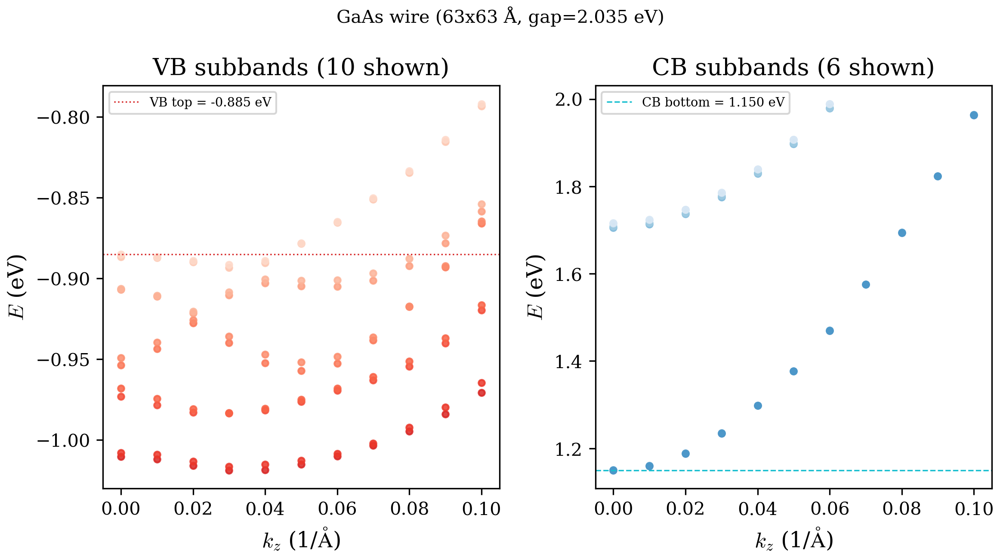
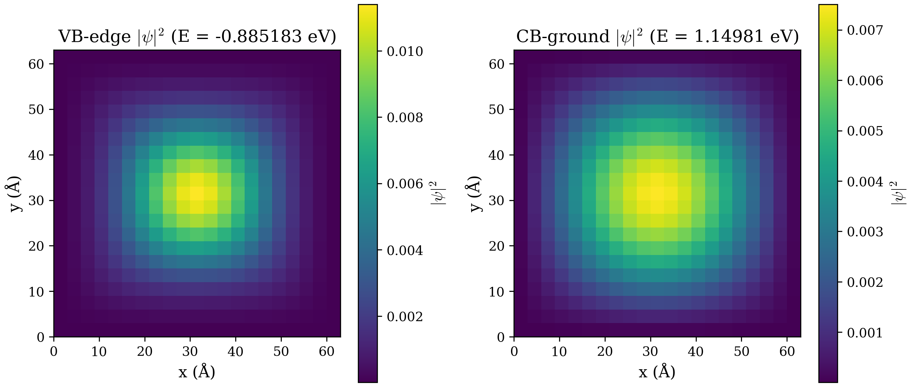
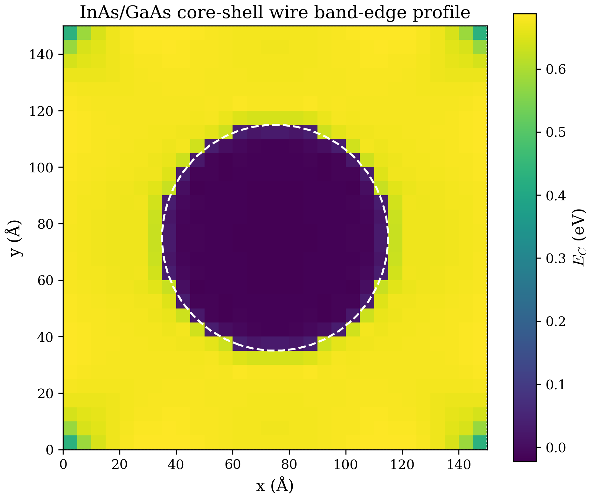
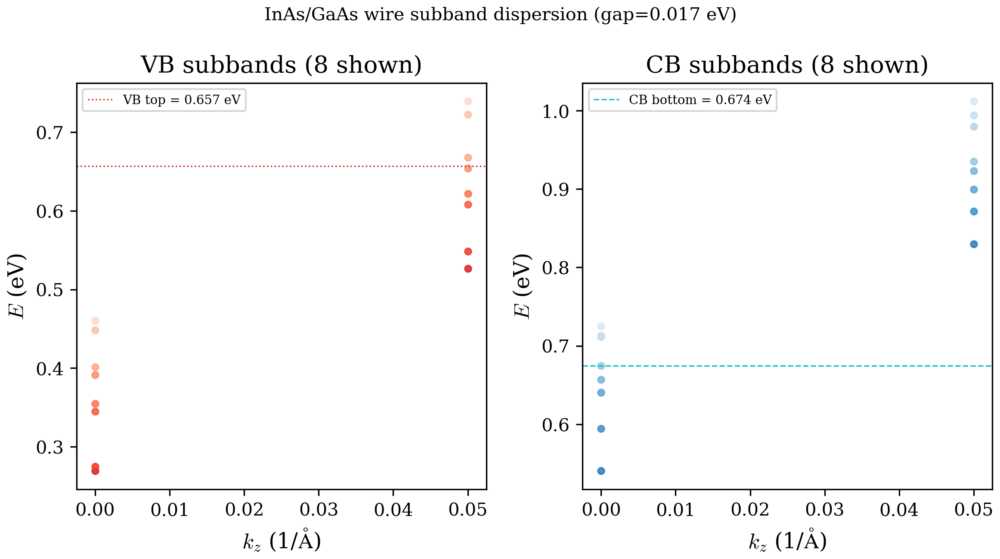
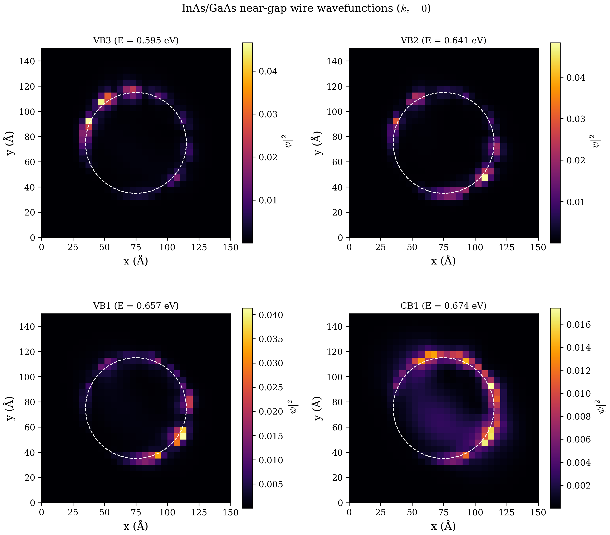

# Chapter 08: Quantum Wire Band Structure (2D Confinement)

## 1. Theory

### 1.1 From quantum well to quantum wire: adding a second confinement direction

In Chapter 02 we studied the quantum well, where confinement along one direction ($z$) produces a 2D electron gas with free propagation in the $x$-$y$ plane. A quantum wire goes one step further: confinement in **two** spatial directions ($x$ and $y$), leaving only the wire axis $z$ as a free propagation direction. The wavevector along $z$, denoted $k_z$, remains a good quantum number.

The envelope function ansatz for the wire is:

$$\Psi(\mathbf{r}) = \sum_{n=1}^{8} F_n(x, y) \, e^{i k_z z} \, |u_n\rangle$$

where $F_n(x, y)$ are 2D envelope functions defined on the wire cross-section. Both $k_x$ and $k_y$ are replaced by spatial derivative operators:

$$k_x \longrightarrow -i \frac{\partial}{\partial x}, \qquad k_y \longrightarrow -i \frac{\partial}{\partial y}$$

while $k_z$ remains a scalar parameter that is swept to obtain the subband dispersion $E_n(k_z)$.

The physical consequences of 2D confinement are profound:
- The continuous 2D subband structure of a quantum well collapses into **1D subbands** (modes), each with its own $E_n(k_z)$ dispersion
- The density of states develops van Hove singularities at subband edges
- Valley degeneracies and symmetry properties depend on the wire cross-section geometry
- Spin-orbit coupling can be strongly enhanced relative to the quantum well case

### 1.2 The 2D finite difference grid

The wire cross-section is discretized on a Cartesian grid of $N_x \times N_y$ points with uniform spacings $\Delta x$ and $\Delta y$. The total number of spatial grid points is:

$$N_{\text{grid}} = N_x \times N_y$$

Grid coordinates are cell-centered:

$$x(i) = \left(i - \tfrac{1}{2}\right) \Delta x, \qquad y(j) = \left(j - \tfrac{1}{2}\right) \Delta y$$

Each grid point is assigned a material index (and hence a set of k.p parameters) based on which region of the wire cross-section it belongs to. For a simple rectangular wire of GaAs embedded in AlGaAs cladding, the interior points receive GaAs parameters while the exterior points receive AlGaAs parameters. For non-rectangular shapes (circles, hexagons, arbitrary polygons), a cut-cell immersed boundary method handles partial cells at the interface.

The 2D grid is stored in a flattened column-major ordering:

$$\text{flat\_idx}(i_x, i_y) = (i_y - 1) \cdot N_x + i_x$$

This convention is used throughout the code for indexing into the sparse matrix data structures.

### 1.3 Kronecker product structure of the 2D Hamiltonian

The key mathematical insight for building the wire Hamiltonian efficiently is that 2D finite difference operators factor into Kronecker products of 1D operators. Consider the 2D Laplacian:

$$\nabla^2_{2D} = \frac{\partial^2}{\partial x^2} + \frac{\partial^2}{\partial y^2}$$

Discretized on the $N_x \times N_y$ grid with column-major flattening, this becomes:

$$\mathbf{L}_{2D} = I_{N_y} \otimes D^{(2)}_x + D^{(2)}_y \otimes I_{N_x}$$

where $D^{(2)}_x$ is the $N_x \times N_x$ second-derivative matrix in the $x$-direction, $D^{(2)}_y$ is the $N_y \times N_y$ second-derivative matrix in the $y$-direction, and $I_{N}$ denotes the $N \times N$ identity matrix. Similarly, the 2D gradient operator:

$$\boldsymbol{\nabla}_{2D} = \frac{\partial}{\partial x} + \frac{\partial}{\partial y}$$

factors as:

$$\mathbf{G}_{2D} = I_{N_y} \otimes D^{(1)}_x + D^{(1)}_y \otimes I_{N_x}$$

and the cross-derivative $\partial^2/\partial x \partial y$ as:

$$\mathbf{X}_{2D} = D^{(1)}_y \otimes D^{(1)}_x$$

These Kronecker products are the building blocks from which all k.p terms in the wire Hamiltonian are constructed.

### 1.4 The kpterms_2d operators: 17 CSR matrices

Analogous to the 1D `kpterms(N, N, 10)` array used for quantum wells (Chapter 02), the wire mode precomputes 17 sparse CSR matrices `kpterms_2d(1:17)`, each of size $N_{\text{grid}} \times N_{\text{grid}}$. The position dependence of material parameters is baked into these operators during initialization.

| Index | Content | Derivative structure |
|-------|---------|---------------------|
| 1 | $\gamma_1(x,y)$ | Diagonal |
| 2 | $\gamma_2(x,y)$ | Diagonal |
| 3 | $\gamma_3(x,y)$ | Diagonal |
| 4 | $P(x,y)$ | Diagonal |
| 5 | $A(x,y) \cdot \nabla^2_{2D}$ | Laplacian |
| 6 | $P(x,y) \cdot \boldsymbol{\nabla}_{2D}$ | Gradient |
| 7 | $(\gamma_1 - 2\gamma_2)(x,y) \cdot \nabla^2_{2D}$ | Laplacian |
| 8 | $(\gamma_1 + 2\gamma_2)(x,y) \cdot \nabla^2_{2D}$ | Laplacian |
| 9 | $\gamma_3(x,y) \cdot \boldsymbol{\nabla}_{2D}$ | Gradient (legacy, unused in assembly) |
| 10 | $A(x,y)$ | Diagonal |
| 11 | $\gamma_3(x,y) \cdot \partial^2/\partial x \partial y$ | Cross-derivative |
| 12 | $P(x,y) \cdot \partial/\partial x$ | x-gradient only |
| 13 | $P(x,y) \cdot \partial/\partial y$ | y-gradient only |
| 14 | $\gamma_3(x,y) \cdot \partial/\partial x$ | x-gradient only |
| 15 | $\gamma_3(x,y) \cdot \partial/\partial y$ | y-gradient only |
| 16 | $\gamma_2(x,y) \cdot (\partial^2/\partial x^2 - \partial^2/\partial y^2)$ | Anisotropic Laplacian |
| 17 | (placeholder, unused) | -- |

Terms 1--4 and 10 are diagonal CSR matrices containing the spatially-varying material parameters. Terms 5--8 use the 2D Laplacian operators. Term 9 is a legacy combined gradient operator, no longer used directly in Hamiltonian assembly (the corrected S/SC terms use the separate directional operators 14--15 instead). Term 11 is the cross-derivative used in the R/RC terms. Terms 12--13 are separate $x$ and $y$ gradient operators for g-factor perturbation calculations. Terms 14--15 provide the separate $x$ and $y$ gradients of $\gamma_3$ used in the S/SC coupling terms and g-factor perturbation. Term 16 is the anisotropic Laplacian $\gamma_2(D^2_x - D^2_y)$ needed for the R term, which mixes second derivatives in $x$ and $y$ with opposite signs.

### 1.5 The wire Hamiltonian: $8 N_{\text{grid}} \times 8 N_{\text{grid}}$ sparse matrix

The full wire Hamiltonian has the same $8 \times 8$ block topology as the bulk and QW Hamiltonians, but now each block is an $N_{\text{grid}} \times N_{\text{grid}}$ sparse matrix:

$$H_{\text{wire}}(k_z) = \begin{pmatrix}
H_{11} & H_{12} & \cdots & H_{18} \\
H_{21} & H_{22} & \cdots & H_{28} \\
\vdots & & \ddots & \vdots \\
H_{81} & H_{82} & \cdots & H_{88}
\end{pmatrix}$$

The k.p blocks are built from the `kpterms_2d` operators combined with $k_z$-dependent scalar multipliers. For example, the Q term becomes:

$$Q = -\bigl[(\gamma_1 + \gamma_2)\, k_z^2\, I + \text{kpterms\_2d}(7)\bigr]$$

where `kpterms_2d(7)` already contains the 2D kinetic operator $-(\gamma_1 - 2\gamma_2) \cdot \nabla^2_{2D}$. The factor $k_z^2$ is a scalar (the free propagation direction), while the spatial derivatives in $x$ and $y$ are encoded in the sparse operator.

The band-offset profile is stored as `profile_2d(Ngrid, 3)`:
- `profile_2d(:, 1)` = $E_V(x,y)$ applied to valence bands 1--4
- `profile_2d(:, 2)` = $E_V(x,y) - \Delta_{\text{SO}}(x,y)$ applied to split-off bands 5--6
- `profile_2d(:, 3)` = $E_C(x,y)$ applied to conduction bands 7--8

These diagonal potentials are added to the appropriate diagonal blocks of the Hamiltonian.

### 1.6 Cut-cell immersed boundary for non-rectangular wires

For wires with curved or non-axis-aligned boundaries (circles, hexagons, arbitrary polygons), the code uses a cut-cell immersed boundary method. Rather than snapping the boundary to the nearest grid point, the method computes fractional cell volumes and face areas for cells that are intersected by the wire boundary:

- **Cell volume** $\alpha_{ij} \in [0, 1]$: fraction of cell $(i_x, i_y)$ inside the wire
- **Face fractions** $\beta_{ij}^{x,\pm}, \beta_{ij}^{y,\pm} \in [0, 1]$: fraction of each cell face inside the wire

These fractions modify the box-integration stencil to correctly weight the kinetic energy operator at boundary cells. For fully interior cells, all fractions are 1 (no modification). For rectangular wires, every active cell has full volume and face fractions, so the cut-cell machinery reduces to the standard FD scheme.

The cut-cell approach is essential for circular and hexagonal wires, where the staircase approximation of a simple boundary snapping would introduce significant errors in the subband energies and wavefunction shapes, particularly for narrow wires.

### 1.7 Sparse storage: COO to CSR conversion

The wire Hamiltonian is extremely sparse. For a grid of $N_x = N_y = 50$ (2500 grid points) with second-order FD, the Hamiltonian dimension is $8 \times 2500 = 20{,}000$, but the number of nonzeros is only $O(8^2 \times N_{\text{grid}} \times \text{stencil width}) \approx 10^6$, giving a sparsity of about 99.75%.

The code builds the Hamiltonian in COO (Coordinate) format by iterating over all nonzero entries in the $8 \times 8$ block structure. Each block insertion adds entries as (row, column, value) triplets with appropriate global offsets:

$$\text{row}_{\text{global}} = (\alpha - 1) \cdot N_{\text{grid}} + \text{row}_{\text{local}}, \qquad \text{col}_{\text{global}} = (\beta - 1) \cdot N_{\text{grid}} + \text{col}_{\text{local}}$$

The COO triplets are then converted to CSR (Compressed Sparse Row) format via merge sort and duplicate merging. This conversion is done once for the first $k_z$ point, and a COO-to-CSR index mapping is cached so that subsequent $k_z$ points can update the values in $O(\text{NNZ})$ time without resorting.

### 1.8 G-factor for wire: Lowdin partitioning in 2D

The Landau g-factor for a wire subband is computed using second-order Lowdin partitioning, extending the formalism from the quantum well case (Chapter 05) to the 2D geometry. The g-factor tensor is:

$$g_{ij} = g_{\text{free}} \, \delta_{ij} - \frac{2}{m_0} \sum_{l \in \text{remote}} \frac{\langle 0 | p_i | l \rangle \langle l | p_j | 0 \rangle + \langle 0 | p_j | l \rangle \langle l | p_i | 0 \rangle}{E_l - E_0}$$

where $|0\rangle$ is the target subband state and the sum runs over remote subbands. For wire mode, the spatial integrals are 2D integrals over the wire cross-section:

$$\langle n | \hat{O} | m \rangle = \sum_{i_x, i_y} F_n^*(i_x, i_y) \, \hat{O}[F_m](i_x, i_y) \, \Delta x \, \Delta y$$

where $\hat{O}$ is the perturbation Hamiltonian in the appropriate direction. The perturbation Hamiltonian $\partial H / \partial k_i$ is built by calling `ZB8bandGeneralized` with the appropriate `g` flag (`g1` for $x$, `g2` for $y$, `g3` for $z$), which uses the separate directional gradient operators `kpterms_2d(12:15)`.

### 1.9 Optical transitions in wire geometry

Inter-subband optical transitions are computed from the momentum matrix elements between conduction and valence band states. For each CB-VB pair, the transition energy is:

$$\Delta E = E_{\text{CB}}^{(i)} - E_{\text{VB}}^{(j)}$$

and the oscillator strength along direction $\hat{d}$ is:

$$f_d = \frac{2}{m_0} \frac{|\langle \psi_{\text{CB}}^{(i)} | p_d | \psi_{\text{VB}}^{(j)} \rangle|^2}{\Delta E}$$

For the wire, the momentum matrix elements are computed using `compute_pele_2d`, which evaluates $\langle \text{state}_a | H_{\text{pert},d} | \text{state}_b \rangle$ over the 2D grid with the appropriate $\Delta x \cdot \Delta y$ integration weight. The three polarization directions ($x$, $y$, $z$) give distinct selection rules determined by the wire symmetry.

---

## 2. In the Code

### 2.1 Wire geometry types: `wire_geometry` and `region_spec`

The wire cross-section is specified by the `wire_geometry` type (defined in `src/core/defs.f90`):

```fortran
type wire_geometry
  character(len=16)  :: shape = 'rectangle'   ! rectangle, circle, hexagon, polygon
  real(kind=dp)      :: radius = 0.0_dp        ! for circle/hexagon
  real(kind=dp)      :: width  = 0.0_dp        ! for rectangle (x-extent)
  real(kind=dp)      :: height = 0.0_dp        ! for rectangle (y-extent)
  integer            :: nverts = 0             ! for polygon
  real(kind=dp), allocatable :: verts(:,:)     ! (2, nverts) vertices
end type wire_geometry
```

Material regions are specified by `region_spec`:

```fortran
type region_spec
  character(len=255) :: material = ''         ! material name
  real(kind=dp)      :: inner   = 0.0_dp      ! inner distance from center (AA)
  real(kind=dp)      :: outer   = 0.0_dp      ! outer distance from center (AA)
end type region_spec
```

Regions are concentric: a core-shell wire has region 1 (core, inner=0 to radius_core) and region 2 (shell, radius_core to radius_shell). The material assignment at each grid point is based on the distance from the grid center.

### 2.2 Spatial grid: `spatial_grid`

The unified `spatial_grid` type handles all confinement modes. For wire mode (`ndim=2`):

```fortran
type spatial_grid
  integer :: ndim = 2           ! 2 for wire
  integer :: nx                 ! grid points in x
  integer :: ny                 ! grid points in y
  real(kind=dp) :: dx, dy       ! grid spacings (AA)
  real(kind=dp), allocatable :: x(:)       ! (nx) cell-centered x-coords
  real(kind=dp), allocatable :: z(:)       ! (ny) cell-centered y-coords
  real(kind=dp), allocatable :: coords(:,:)    ! (2, nx*ny) flattened
  integer, allocatable  :: material_id(:)      ! (nx*ny) per-point material
  real(kind=dp), allocatable :: cell_volume(:)       ! (nx*ny) fractional volume
  real(kind=dp), allocatable :: face_fraction_x(:,:) ! (nx*ny, 2) left/right
  real(kind=dp), allocatable :: face_fraction_y(:,:) ! (nx*ny, 2) bottom/top
  integer, allocatable  :: ghost_map(:,:)            ! (nx*ny, 4) N S W E
end type spatial_grid
```

The function `grid_ngrid(grid)` returns `nx * ny`. The `ghost_map` maps inactive cells (outside the wire) to their nearest active neighbor in each direction, enabling proper boundary treatment.

### 2.3 Geometry initialization: `geometry.f90`

The `geometry` module (`src/math/geometry.f90`) provides the cut-cell initialization routines:

- **`grid_init_rect`** -- rectangular wire, all fractions = 1 (trivial)
- **`grid_init_circle`** -- circular wire, analytical chord intersection for faces, marching-squares sub-sampling for volumes
- **`grid_init_hexagon`** -- regular hexagon, Sutherland-Hodgman polygon clipping
- **`grid_init_polygon`** -- arbitrary polygon, Sutherland-Hodgman clipping
- **`init_wire_from_config`** -- high-level dispatcher that reads the shape from `cfg%wire_geom`, builds the `material_id_2d` array from regions, and calls the appropriate `grid_init_*` routine

The Sutherland-Hodgman algorithm clips each Cartesian cell against the convex polygon boundary, computing the intersection area via the shoelace formula. For circles, an analytical chord-length formula gives the face fractions directly.

### 2.4 2D confinement initialization: `confinementInitialization_2d`

This subroutine in `src/physics/hamiltonianConstructor.f90` builds the 17 `kpterms_2d` CSR matrices. The algorithm proceeds in five stages:

1. **Build 1D FD operators:** `buildFD2ndDerivMatrix` and `buildFD1stDerivMatrix` from `src/math/finitedifferences.f90` produce real dense matrices $D^{(2)}_x$, $D^{(1)}_x$, $D^{(2)}_y$, $D^{(1)}_y$ of sizes $N_x \times N_x$ and $N_y \times N_y$.

2. **Build 2D operators via Kronecker products:** Using routines from `src/math/sparse_matrices.f90`:
   - `kron_eye_dense` computes $I_{N_y} \otimes D_x$ (places $D_x$ at each diagonal block)
   - `kron_dense_dense` computes $D_y \otimes I_{N_x}$ (scales identity by $D_y$)
   - `csr_add` sums the results to form the 2D Laplacian, gradient, and cross-derivative operators

3. **Build material profiles:** For each grid point, the material index `grid%material_id(ij)` selects the k.p parameters from the appropriate region. The profiles `prof_gamma1`, `prof_gamma2`, etc., are 1D arrays of length $N_{\text{grid}}$.

4. **Apply variable coefficients:** `csr_apply_variable_coeff` multiplies each row of the FD operator by the corresponding material parameter value (and optionally the cut-cell volume and face fractions). This produces the position-dependent k.p operators.

5. **Cleanup:** Intermediate Kronecker products are freed, leaving only the 17 `kpterms_2d` matrices.

### 2.5 Hamiltonian assembly: `ZB8bandGeneralized`

This is the central routine for wire mode, producing a sparse CSR Hamiltonian of dimension $8 N_{\text{grid}} \times 8 N_{\text{grid}}$. It accepts the current $k_z$ value, the `profile_2d` and `kpterms_2d` arrays, and an optional `wire_coo_cache` for accelerated $k_z$ sweeps.

The assembly algorithm:

1. **Build k.p term blocks:** Ten helper routines (`build_kp_term_Q`, `build_kp_term_T`, etc.) combine `kpterms_2d` with $k_z$-dependent scalars using `csr_add` and `csr_scale`. For example, `build_kp_term_A` computes $A = \text{kpterms\_2d}(5) + k_z^2 \cdot \text{kpterms\_2d}(10)$. The corrected S and SC terms use separate $x$/$y$ gradients: $S = 2\sqrt{3}\,k_z\,\gamma_3\,(\partial/\partial x - i\,\partial/\partial y)$ built from `kpterms_2d(14)` and `kpterms_2d(15)` with complex coefficients. The R term includes the anisotropic spatial derivative via `kpterms_2d(16)`: $R = -\sqrt{3}\,[\gamma_2(D^2_x - D^2_y) - 2i\gamma_3\,d^2/dx\,dy + \gamma_2 k_z^2]$. The PZ term is a pure diagonal: $PZ = -i\,k_z\,P(x,y)$ rather than a spatial gradient.

2. **Insert into COO arrays:** Each nonzero block in the $8 \times 8$ topology is inserted with the appropriate global row/col offset and complex prefactor. The routine `insert_csr_block_scaled` handles the offset arithmetic. A total of about 50--60 block insertions cover all nonzero entries in the 8-band Hamiltonian topology.

3. **Add band-offset profile:** The diagonal entries receive the band-edge potentials from `profile_2d`.

4. **Convert COO to CSR:** On the first call, `csr_build_from_coo_cached` sorts, merges duplicates, and saves the COO-to-CSR mapping. On subsequent calls, `csr_set_values_from_coo` reuses the cached mapping for $O(\text{NNZ})$ value updates.

The optional `g` parameter enables perturbation mode for g-factor calculations:
- `g='g1'` builds only the $x$-direction perturbation (uses `kpterms_2d(12,14)`)
- `g='g2'` builds only the $y$-direction perturbation (uses `kpterms_2d(13,15)`)
- `g='g3'` builds only the $z$-direction perturbation (uses $k_z$-linear terms)

### 2.6 Eigensolver: `eigensolver.f90`

The sparse eigenvalue problem is dispatched through `solve_sparse_evp` in `src/math/eigensolver.f90`. Two backends are available:

- **FEAST** (MKL `zfeast_hcsrev`): contour-integral eigensolver that finds all eigenvalues within a user-specified energy window $[E_{\min}, E_{\max}]$. This is the preferred solver for large wire Hamiltonians because it avoids computing the full spectrum.
- **Dense LAPACK fallback** (`zheevx`): converts the CSR matrix to dense and solves for the $n$ smallest eigenvalues. Used when FEAST is not available. The `auto_compute_energy_window` routine provides Gershgorin bounds for the energy window.

### 2.7 Sparse matrix infrastructure: `sparse_matrices.f90`

The `csr_matrix` type stores the Hamiltonian in compressed sparse row format:

```fortran
type :: csr_matrix
  integer :: nrows, ncols, nnz
  complex(kind=dp), allocatable :: values(:)   ! (nnz)
  integer, allocatable          :: colind(:)   ! (nnz)
  integer, allocatable          :: rowptr(:)   ! (nrows+1)
end type csr_matrix
```

Key routines in `src/math/sparse_matrices.f90`:
- `csr_build_from_coo` -- merge sort + duplicate merging, $O(\text{NNZ} \log \text{NNZ})$
- `csr_build_from_coo_cached` -- same, but saves the mapping for fast reuse
- `csr_set_values_from_coo` -- $O(\text{NNZ})$ value update using cached mapping
- `csr_add`, `csr_scale` -- CSR arithmetic
- `csr_apply_variable_coeff` -- row-wise scaling with optional cut-cell face fractions
- `kron_dense_dense`, `kron_dense_eye`, `kron_eye_dense` -- Kronecker products producing CSR output
- `csr_spmv` -- sparse matrix-vector multiply with OpenMP parallelization

### 2.8 Wire g-factor: `gfactorCalculation_wire`

Defined in `src/physics/gfactor_functions.f90`, this routine follows the same Lowdin partitioning formalism as the QW g-factor but uses 2D spatial integration:

- `sigmaElem_2d` computes the spin matrix element $\langle \psi_a | \sigma_d | \psi_b \rangle$ over the 2D grid with weight $\Delta x \cdot \Delta y$
- `pMatrixEleCalc_2d` builds the perturbation Hamiltonian for a given direction using `ZB8bandGeneralized` with the appropriate `g` flag, then evaluates $\langle \text{state}_a | H_{\text{pert}} | \text{state}_b \rangle$
- `compute_optical_matrix_wire` computes inter-subband optical transitions (energies, momentum matrix elements, oscillator strengths) for all CB-VB pairs

### 2.9 Input parsing for wire mode

When `confinement = 2`, the input parser (`src/io/input_parser.f90`) reads the following wire-specific fields after the common parameters:

```
wire_nx:       <integer>      ! grid points in x (>= 3)
wire_ny:       <integer>      ! grid points in y (>= 3)
wire_dx:       <real>         ! grid spacing in x (AA)
wire_dy:       <real>         ! grid spacing in y (AA)
wire_shape:    <string>       ! rectangle, circle, hexagon, or polygon
wire_width:    <real>         ! (rectangle) x-extent (AA)
wire_height:   <real>         ! (rectangle) y-extent (AA)
numRegions:    <integer>      ! number of material regions
region:        <material> <inner> <outer>   ! one line per region
```

For circle and hexagon shapes, `wire_radius` replaces `wire_width`/`wire_height`. For polygon, `wire_polygon` specifies the vertex count followed by `wire_vertex` lines with $x, y$ coordinates.

The parser validates that `wire_nx >= FDorder + 1` and `wire_ny >= FDorder + 1`, builds the `regions` array, and sets up backward-compatible fields (`fdStep`, `dz`) for routines shared between QW and wire modes.

---

## 3. Computed Example: Rectangular GaAs Wire

### 3.1 Input configuration

The following example is taken from the regression test config `tests/regression/configs/wire_gaas_rectangle.cfg`:

```
waveVector: kz
waveVectorMax: 0.1
waveVectorStep: 21
confinement:  2
FDstep: 1
FDorder: 2
numLayers:  1
wire_nx: 21
wire_ny: 21
wire_dx: 3.0
wire_dy: 3.0
wire_shape: rectangle
wire_width: 63.0
wire_height: 63.0
numRegions: 1
region: GaAs  0.0  100.0
numcb: 8
numvb: 16
ExternalField: 0  EF
EFParams: 0.0005
whichBand: 0
bandIdx: 1
SC: 0
feast_emin: -1.5
feast_emax: 2.0
feast_m0: -1
```

### 3.2 Structure walkthrough

This input defines a single-material GaAs rectangular wire with cross-section $63 \times 63$ A, discretized on a $21 \times 21$ grid with $\Delta x = \Delta y = 3$ A. The wire axis is along $z$ (set by `waveVector: kz`), and the dispersion is computed for 21 equally spaced $k_z$ points from 0 to 0.1 A$^{-1}$.

The single region `GaAs 0.0 100.0` means all grid points within distance 100 A from the grid center receive GaAs parameters. Since the grid extends only to $(10.5 \times 3) = 31.5$ A from center, all 441 points are GaAs. This is a homogeneous wire: there is no potential confinement from band offsets, only the hard-wall boundary at the grid edges. The confinement energy arises entirely from the Dirichlet boundary conditions at the wire perimeter.

The Hamiltonian dimension is $8 \times 441 = 3528$. The FEAST parameters (`feast_emin: -1.5`, `feast_emax: 2.0`) specify the energy search window, and `feast_m0: -1` triggers automatic subspace dimension estimation. With 8 CB and 16 VB states requested, the code returns 24 eigenvalues per $k_z$ point. The dense LAPACK fallback is used for this small matrix.

### 3.3 Running the example

```bash
cat tests/regression/configs/wire_gaas_rectangle.cfg > input.cfg
./build/src/bandStructure
```

The program initializes the wire grid, builds `profile_2d` and `kpterms_2d`, then sweeps over 21 $k_z$ points. At each point the sparse Hamiltonian is assembled and the eigensolver computes 24 eigenvalues. Output is written to `output/eigenvalues.dat` and `output/eigenfunctions_k_*_ev_*.dat`.

### 3.4 Numerical results at $k_z = 0$

Running the config above produces eigenvalues at $k_z = 0$ within the energy window $[-1.5, 2.0]$ eV. The eigenvalues come in spin-degenerate Kramers pairs (a consequence of time-reversal symmetry at $k_z = 0$). The valence-band edge and conduction-band edge are identified by the largest gap between consecutive eigenvalues.

**Band gap:** approximately 2.035 eV in the current clean figure run, between the highest valence-like state ($E_V \approx -0.885$ eV) and the lowest conduction-like state ($E_C \approx 1.150$ eV) selected from the `parts.dat` band-character weights.

This is the effective wire gap within the solver's internal energy reference for this hard-wall GaAs cross-section. It is not directly comparable to a bulk band gap quoted on an absolute material reference because the zero of energy depends on the Hamiltonian convention used in the code. What matters for the wire physics is the separation between the valence-like and conduction-like manifolds and the ordering of the confined states.

Key observations from the corrected solver:

- Effective wire gap: ~2.035 eV
- Kramers degeneracy at $k_z = 0$: confirmed
- Lowest selected conduction edge: about 1.150 eV
- Highest selected valence edge: about -0.885 eV
- The subband spacing near the band edges is characteristic of a ~6.3 nm GaAs wire
- Near-parabolic dispersion around $k_z = 0$ for the lowest conduction-like branch

The main qualitative conclusion is unchanged: the square cross-section produces a ladder of confined 1D subbands, with a clear band-edge gap and approximately parabolic dispersion close to $k_z = 0$.

### 3.5 Subband classification and gap analysis

In a quantum wire, the band gap is not simply the bulk material gap but the energy difference between the highest occupied valence subband edge and the lowest unoccupied conduction subband edge. The gap depends on the wire geometry through the confinement energies:

$$E_{\text{gap}}^{\text{wire}} = E_{\text{CB,min}} - E_{\text{VB,max}} \approx 2.035 \text{ eV}$$

This is an effective gap defined entirely within the numerical spectrum of the wire calculation. For single-material hard-wall wires, that quantity is the robust observable to track across grids and parameter sweeps. Absolute comparisons to bulk reference energies need extra care because the solver output uses an internal Hamiltonian energy origin rather than a directly plotted vacuum-referenced band diagram.

The confinement reorganizes both valence-like and conduction-like states into a discrete 1D ladder. The GaAs rectangular wire gives an effective near-gap split of about 2.035 eV at $k_z = 0$ in the current figure run. This should be treated as a solver-internal confinement observable rather than a bulk-referenced band diagram. The key robust point is the appearance of a discrete near-gap ladder with Kramers-degenerate states at $k_z = 0$.

### 3.6 Wire vs. quantum well comparison

The following table compares the GaAs rectangular wire with the GaAs/Al$_{0.3}$Ga$_{0.7}$As quantum well studied in Chapter 02 (100 A well, 101 FD points):

| Property | QW (GaAs/Al$_{0.3}$Ga$_{0.7}$As, 100 A) | Wire (GaAs, $63 \times 63$ A) |
|----------|-------------------------------------------|-------------------------------|
| Confinement | 1D ($z$) | 2D ($x$, $y$) |
| Free directions | 2 ($x$, $y$) | 1 ($z$) |
| CB1 energy | 1.021 eV | 1.150 eV |
| VB1 energy | $-0.959$ eV | -0.885 eV |
| Effective gap | 1.980 eV | 2.035 eV |
| CB edge | 1.021 eV | 1.150 eV |
| Subband degeneracy | 2 (Kramers) | 2 (Kramers) |
| Dispersion | 2D sheets $E(k_\parallel)$ | 1D modes $E(k_z)$ |
| Matrix size | $808 \times 808$ | $3528 \times 3528$ |
| Storage | Dense | Sparse CSR |

The energy references differ because the QW uses the heterostructure band offset profile (GaAs well + AlGaAs barriers) while the wire is a single-material system with only hard-wall confinement. The wire's effective split of 2.035 eV is therefore best read as a confinement observable from the current sparse wire solve, not as a directly comparable heterostructure band gap.

### 3.7 Band structure and density plots

The wire figures below are computed from the current solver path. For the GaAs hard-wall wire, the gap scale and Kramers degeneracy are already on reasonably firm ground; for the core-shell example, the figures are best read as qualitative until the external wire benchmark suite is completed.



*Figure 1: Subband dispersion $E(k_z)$ for the GaAs rectangular wire ($63 \times 63$ A cross-section, $21 \times 21$ grid). The corrected wire Hamiltonian produces a discrete near-gap ladder with an effective split of about 2.035 eV at $k_z = 0$. Points are plotted as sorted near-gap eigenvalues at each $k_z$ with zero-padding removed, so the figure does not imply branch continuity that the current output writer does not track robustly.*



*Figure 2: Probability density $|F_n(x,y)|^2$ of selected wire subbands at $k_z = 0$, plotted over the wire cross-section. The lowest conduction-like state is center-peaked and $s$-like, while higher states develop nodal structure consistent with 2D box-like confinement in the square cross-section.*

---

## 4. The 2D Poisson Solver

### 4.1 Self-consistent Schrodinger-Poisson for wires

When the wire is doped or placed in an external electric field, the electrostatic potential $\phi(x,y)$ must be determined self-consistently with the quantum mechanical charge density. The wire SC loop follows the same iterative scheme as the QW case (Chapter 07), but the Poisson equation is now two-dimensional:

$$\frac{\partial}{\partial x}\left[\varepsilon(x,y)\frac{\partial \phi}{\partial x}\right] + \frac{\partial}{\partial y}\left[\varepsilon(x,y)\frac{\partial \phi}{\partial y}\right] = -\frac{\rho(x,y)}{\varepsilon_0}$$

where $\varepsilon(x,y)$ is the position-dependent dielectric constant and $\rho(x,y)$ is the charge density computed from the k.p eigenstates.

### 4.2 Box-integration discretization

The 2D Poisson equation is discretized using box integration on the $N_x \times N_y$ grid, the same approach as the 1D case (Chapter 07) extended to two dimensions. The divergence theorem converts the continuous equation to a flux balance over each grid cell:

$$\oint_{\partial \Omega_{ij}} \varepsilon \, \nabla\phi \cdot \hat{n} \, dl = -\frac{\rho_{ij} \, \Delta x \, \Delta y}{\varepsilon_0}$$

For interior cells, the line integral becomes a sum over the four cell faces. Each face flux is approximated as the product of the average dielectric constant, the face fraction (from the cut-cell geometry), and the finite difference approximation to $\partial\phi/\partial x$ or $\partial\phi/\partial y$. For cut cells at the wire boundary, the face fractions correctly weight the flux through partial faces.

The resulting sparse linear system is assembled in COO format, converted to CSR, and solved with the **MKL PARDISO** sparse direct solver (real unsymmetric, mtype=11). Dirichlet boundary conditions are imposed on all edges of the simulation domain.

### 4.3 Charge density and SC iteration

The charge density $\rho(x,y)$ is computed from the k.p eigenstates by integrating $|\psi(x,y)|^2$ weighted by the Fermi-Dirac occupation over all occupied subbands and $k_z$ values in the Brillouin zone:

$$\rho(x,y) = -e \sum_n \int \frac{dk_z}{2\pi} \, |\psi_n(x,y)|^2 \, f\!\left(\frac{E_n(k_z) - E_F}{k_B T}\right)$$

where the sum runs over all computed subbands and the integral over $k_z$ is discretized using a uniform grid with `SC_num_kpar` points up to `SC_kpar_max`. The `self_consistent_loop_wire` subroutine in `sc_loop.f90` orchestrates this iteration with optional DIIS (Pulay) acceleration for faster convergence, following the same mixing strategy as the QW case.

---

## 5. Published Example and Discussion

### 5.1 Reference: SOC effects in ZB InSb and WZ InAs nanowires

**P. E. Faria Junior, T. Campos, J. Fabian, G. M. Sipahi**, "Spin-orbit coupling effects in zinc-blende and wurtzite InSb and InAs nanowires," *Phys. Rev. B* **97**, 245402 (2018). [arXiv:1802.06734](https://arxiv.org/abs/1802.06734)

### 5.2 What the paper computes

This study calculates the electronic subband structure, g-factors, and spin-orbit coupling parameters for two families of semiconductor nanowires:

1. **Zinc-blende InSb nanowires** with cylindrical cross-section
2. **Wurtzite InAs nanowires** with cylindrical cross-section

Both are treated within the 8-band k.p framework, but with different Hamiltonian matrices reflecting the respective crystal symmetries. The key results include:

- **Subband dispersions** $E_n(k_z)$ showing the characteristic avoided crossings due to spin-orbit coupling. The zinc-blende [001] axis and wurtzite [0001] axis both align with the wire growth direction, producing quantized transverse modes with distinct spin textures.
- **Lande g-factors** for the lowest conduction subband as a function of wire radius. The paper demonstrates that narrow InSb wires exhibit g-factor values $|g| \gg 2$ (far from the free-electron value), with strong radius dependence. This enhancement arises from the band mixing between conduction and valence bands that is captured by the 8-band model but missed by simpler effective-mass approximations.
- **Rashba and Dresselhaus spin-orbit fields** extracted from the subband structure. In zinc-blende nanowires, the bulk inversion asymmetry (Dresselhaus effect) and structural inversion asymmetry from electric fields (Rashba effect) combine to produce a total spin-orbit field that depends on both the wire radius and the applied field.
- **Comparison between ZB and WZ crystal phases**, showing qualitatively different spin-orbit behavior: the wurtzite phase has an intrinsic Rashba-like spin splitting even without an external field, due to the built-in polar asymmetry along the c-axis.

### 5.3 g-factor vs. radius: qualitative physics

One of the central results of Faria Junior et al. is the radius dependence of the Lande g-factor in ZB InSb nanowires. The qualitative trend can be understood from the Lowdin partitioning formula:

$$g = g_{\text{free}} - \frac{2}{m_0} \sum_{l} \frac{|\langle \text{CB1} | p | l \rangle|^2}{E_l - E_{\text{CB1}}}$$

where the sum runs over remote (valence) subbands. As the wire radius decreases:

1. **The subband spacing increases** (confinement energy scales as $\sim 1/R^2$), pushing the denominator $E_l - E_{\text{CB1}}$ to larger values. This tends to *reduce* the g-factor enhancement, bringing $g$ closer to $g_{\text{free}} = 2$.

2. **The momentum matrix elements** $\langle \text{CB1} | p | l \rangle$ are modified by the stronger confinement. In narrow wires, the wavefunctions are more localized and the overlap integrals can either increase or decrease depending on the symmetry of the subbands involved.

3. **Band mixing is enhanced** in narrow wires because the confinement mixes CB and VB character more strongly. The 8-band k.p model captures this self-consistently: the CB1 state acquires significant valence-band admixture, which amplifies the remote-band contribution to the g-factor.

The net result for InSb is a dramatic g-factor enhancement ($|g| > 50$ for large radii) that decreases monotonically as the radius shrinks, eventually approaching the free-electron value for very thin wires. This radius dependence is a direct fingerprint of the 8-band physics that cannot be captured by single-band effective-mass models.

The anisotropy $g_{\perp} \neq g_{\parallel}$ (transverse vs. axial components) also depends on radius: in a cylindrical wire, $g_{xx} = g_{yy}$ by rotational symmetry, but $g_{zz}$ (along the wire axis) differs because the confinement geometry breaks the cubic symmetry of the bulk crystal. An applied transverse electric field further breaks the rotational symmetry, introducing a Rashba contribution that mixes the g-tensor components.

### 5.4 What this code currently supports

The zinc-blende InSb nanowire portion is supported by the current wire mode (`confinement=2`) with the corrected Hamiltonian:

- **Subband structure:** Rectangular and circular wire geometries, sparse wire assembly, and confined 1D subbands are implemented and regression-tested. The corrected off-diagonal terms (S, SC, R, RC, PZ) produce qualitatively reasonable subband dispersions. The GaAs rectangular-wire gap scale and Kramers degeneracy are already supported by the current validation suite, while the InAs/GaAs core-shell example remains qualitative until the external wire benchmark suite is completed.
- **g-factor machinery:** The `gfactorCalculation_wire` routine computes a wire g-tensor from band-edge states using band-character-aware state selection. For the InSb rectangular wire (55x55 A, 11x11 grid), the corrected regression gives $g_x \approx -49.94$, $g_y \approx -50.05$, $g_z \approx -49.97$. This is close to the bulk InSb scale and remains provisional because the grid is very coarse and no radius sweep has been reproduced against Faria Junior et al.'s Figure 2.
- **Electric field effects:** External fields can be applied through `ExternalField` and `EFParams`, so symmetry-breaking studies are possible in principle. At present these runs should be treated as exploratory until the field-dependent wire trends are benchmarked against the literature.

Example configuration for a circular InSb wire:

```
confinement:  2
wire_nx: 41
wire_ny: 41
wire_dx: 1.0
wire_dy: 1.0
wire_shape: circle
wire_radius: 20.0
numRegions: 1
region: InSb  0.0  100.0
numcb: 2
numvb: 4
waveVector: kz
waveVectorMax: 0.05
waveVectorStep: 11
```

### 5.5 What is missing for full reproduction

| Feature | Status | Notes |
|---------|--------|-------|
| Circular wire geometry | Implemented in `geometry.f90` | `grid_init_circle` with analytical chord intersection |
| InSb material parameters | Available in `parameters.f90` | Zinc-blende parameters from Vurgaftman 2001 |
| Wire g-factor calculation | Implemented | `gfactorCalculation_wire` in `gfactor_functions.f90` |
| Wurtzite 8-band Hamiltonian | **Not implemented** | Requires entirely new $8 \times 8$ Hamiltonian with wurtzite symmetry, different basis functions |
| Wurtzite material parameters | **Not in `parameters.f90`** | Need InAs WZ parameters from DFT/experiment (Winkler 2003) |
| Rashba parameter extraction | Not automated | Can be extracted manually from subband spin splittings at finite $k_z$ |

The current ZB InSb wire path now produces regression-backed subband structure and provisional g-factor outputs with the fixed Hamiltonian. The remaining gap to a full literature reproduction is quantitative: a systematic convergence study and radius-dependent benchmark against published data. The wurtzite InAs portion still requires a major new feature: a dedicated wurtzite Hamiltonian and parameter set.

### 5.6 Quantitative Benchmarks (Corrected Wire Solver)

The wire solver was corrected in two stages: first the off-diagonal 8-band terms were fixed, then the 2D boundary/operator initialization was audited against the regenerated figures. The relevant corrections are:

1. **S/SC terms**: Replaced the incorrect combined gradient $(d/dx + d/dy)$ with the correct complex directional operators $(d/dx \mp i\,d/dy)$, built from separate `kpterms_2d(14)` and `kpterms_2d(15)` with complex coefficients.
2. **PZ term**: Changed from spatial gradient $i\,P\,(d/dx + d/dy)$ to the correct diagonal $-i\,k_z\,P(x,y)$ (since $z$ is the free propagation direction).
3. **R/RC terms**: Added the missing 2D anisotropic spatial derivatives $\gamma_2(d^2/dx^2 - d^2/dy^2)$ and cross-derivative $2i\gamma_3\,d^2/dx\,dy$ alongside the existing $k_z^2$ diagonal term, via the new `kpterms_2d(16)` operator.
4. **2D boundary operators**: Rectangular all-one face fractions are no longer passed through the cut-cell row-sum path, first-derivative boundary signs are preserved, and inactive cells in non-rectangular grids are moved outside the physical eigenvalue window so they cannot appear as zero-energy modes.

**Table 5.1:** Wire benchmark values after Hamiltonian and boundary-operator correction.

| System | Quantity | Value | Notes |
|--------|----------|-------|-------|
| GaAs wire (63x63 A, 21x21) | Effective near-gap split | 2.035 eV | Current clean figure run; character-selected edges |
| GaAs wire (63x63 A, 21x21) | Kramers degeneracy at $k_z=0$ | Confirmed | Most robust near-gap validation point |
| InAs/GaAs core-shell (80 A core, 30x30) | Effective near-edge split | ~0.017 eV | Character-selected mixed states; qualitative |
| InAs/GaAs core-shell (80 A core, 30x30) | CB-like states in current window | 24 | `CB` character $\geq 0.5$ in the subband run |
| InAs/GaAs core-shell (80 A core, 30x30) | Wavefunction localization | Interface-weighted | Coarse strained heterostructure diagnostic, not a nextnano benchmark |
| InSb wire (55x55 A, 11x11) | $g_x$ | $\approx -49.94$ | Band-character-selected CB edge |
| InSb wire (55x55 A, 11x11) | $g_y$ | $\approx -50.05$ | Coarse-grid provisional |
| InSb wire (55x55 A, 11x11) | $g_z$ | $\approx -49.97$ | Close to bulk InSb scale |

The InSb wire g-factors are regression-tested in `tests/regression/configs/wire_insb_gfactor.cfg` and verified against the expected strong enhancement relative to the free-electron value ($g_{\rm free} = 2$). The rectangular cross-section breaks rotational symmetry, producing distinct $g_x$, $g_y$, and $g_z$ components. The GaAs wire band structure is regression-tested in `tests/regression/configs/wire_gaas_rectangle.cfg`.

---

## 6. Discussion

### 6.1 Grid resolution and convergence

The wire mode introduces two independent grid resolution parameters, $N_x$ and $N_y$, with spacings $\Delta x$ and $\Delta y$. Convergence requires both to be fine enough to resolve the envelope function oscillations within the wire. The grid spacing should satisfy $\Delta x, \Delta y \ll \lambda_{\text{envelope}} / 2$, where $\lambda_{\text{envelope}}$ is the shortest characteristic length scale of the confined wavefunction.

For second-order FD, the energy error scales as $O(\Delta x^2 + \Delta y^2)$. Higher-order schemes (`FDorder = 4, 6, ...`) improve convergence but increase the stencil width, which increases the number of nonzeros per row in the sparse matrices. The memory and compute cost scales roughly as $O(N_{\text{grid}} \times \text{FDorder}^2 \times 64)$ for the full 8-band Hamiltonian.

A practical guideline: for typical III-V semiconductor wires with cross-section dimensions of 10--50 nm, $N_x = N_y = 40\text{--}80$ with `FDorder = 2` gives sub-meV convergence for the lowest subbands. For tight confinement or high-accuracy g-factors, `FDorder = 4` with finer grids is recommended.

### 6.2 Memory scaling

The wire Hamiltonian dimension is $8 N_{\text{grid}}$, where $N_{\text{grid}} = N_x \times N_y$. The number of nonzeros scales as $O(8^2 \times N_{\text{grid}} \times w)$ where $w$ is the stencil width (e.g., $w = 5$ for 2nd-order 2D Laplacian). For a $50 \times 50$ grid with second-order FD:

- $N_{\text{grid}} = 2500$, matrix dimension = 20,000
- NNZ per block $\approx 2500 \times 5 = 12{,}500$
- Total NNZ $\approx 64 \times 12{,}500 + \text{profile diagonal} \approx 800{,}000$
- Memory for CSR: about 25 MB (complex*16 values + integer indices)

This fits comfortably in RAM on any modern workstation. For grids up to $200 \times 200$ ($N_{\text{grid}} = 40{,}000$, dimension 320,000), the memory requirement is still manageable (about 4 GB), but the eigenvalue solve becomes the bottleneck. The FEAST solver with an appropriate energy window is essential for such sizes.

### 6.3 COO cache: accelerating $k_z$ sweeps

The COO-to-CSR mapping is cached in the `wire_coo_cache` type. On the first $k_z$ point, the full sort-merge-build pipeline runs once ($O(\text{NNZ} \log \text{NNZ})$). On all subsequent points, only the values are updated in $O(\text{NNZ})$ time, because the sparsity pattern (which entries exist) is independent of $k_z$ -- only the numerical values change.

This optimization reduces the Hamiltonian assembly cost for large $k_z$ sweeps by a factor of roughly $\log(\text{NNZ})$, which is significant for production calculations with hundreds of $k_z$ points.

### 6.4 Boundary conditions and wire shape

The FD discretization imposes hard-wall (Dirichlet) boundary conditions at the grid edges: the envelope function is zero at the boundary. For rectangular wires, this is physically correct when the barrier material has a large band offset. For non-rectangular shapes, the cut-cell immersed boundary handles the smooth boundary correctly, but the outer grid boundary still imposes hard walls. The simulation domain must be large enough that the wavefunction decays to negligible amplitude before reaching the outer boundary.

For core-shell wires (e.g., InAs core with GaAs shell), multiple regions with different band offsets create a more realistic confinement profile. The inner/outer distances in the `region_spec` type define concentric annular regions.

### 6.5 Limitations and tips

**Current limitations:**
- The free propagation direction is fixed to $z$ (`confDir = 'z'`)
- The grid is uniform (no adaptive mesh refinement)
- Self-consistent Schrodinger-Poisson for wires uses the 2D Poisson solver `solve_poisson_2d` with box integration and cut-cell support
- Strain is handled by the strain solver module (`src/physics/strain_solver.f90`) but is not yet fully integrated into the wire pipeline
- FEAST convergence warnings (`info=3`, subspace too small) can appear when the energy window contains many more eigenvalues than the estimated subspace dimension. Narrowing the energy window or increasing `feast_m0` resolves this
- Boundary treatment uses hard-wall (Dirichlet) conditions at the grid edges. For wires where the wavefunction decays slowly (e.g., shallow confinement), the domain must be large enough to prevent artifacts

**Tips for production calculations:**
- Start with a coarse grid ($N_x = N_y = 20$) to verify the geometry and subband ordering, then refine
- Use `FDorder = 2` for initial exploration; switch to `FDorder = 4` for final results
- For the FEAST solver, set the energy window tightly around the expected subband energies to minimize computational cost; `auto_compute_energy_window` provides Gershgorin bounds as a starting point
- For g-factor calculations, use at least `FDorder = 4` and $N_x, N_y \geq 40$ for converged results, since g-factors are sensitive to the wavefunction shape near interfaces
- The COO cache is automatically enabled for $k_z$ sweeps; no user configuration is needed
- When using non-rectangular shapes, verify that `cell_volume` and `face_fraction` arrays are correct by checking that the total active area matches the analytical cross-section area

---

## 7. Computed Example: Strained InAs/GaAs Core-Shell Wire

### 7.1 Motivation

The GaAs rectangular wire studied in Section 3 was a single-material system with hard-wall confinement. A more realistic -- and technologically important -- structure is a heterostructure core-shell wire, where the confinement arises from the band offsets between two lattice-mismatched semiconductors. The InAs/GaAs system is a canonical example: InAs has a lattice constant 7.2% larger than GaAs ($a_{\text{InAs}} = 6.058$ A vs.\ $a_{\text{GaAs}} = 5.653$ A), so an InAs core embedded in a GaAs matrix is under compressive strain. This strain shifts the band edges via the Bir-Pikus Hamiltonian, modifying the confinement potential and subband structure in ways that a simple unstrained calculation cannot capture.

### 7.2 Input configuration

The following config defines a rectangular $150 \times 150$ A simulation domain with a $30 \times 30$ grid ($\Delta x = \Delta y = 5$ A). The inner region (0--40 A from center) is InAs; the outer region (40--150 A) is GaAs. Strain is computed using the continuum elasticity solver with GaAs as the reference substrate:

```
waveVector: kz
waveVectorMax: 0.01
waveVectorStep: 2
confinement:  2
FDstep: 1
FDorder: 2
numLayers:  2
wire_nx: 30
wire_ny: 30
wire_dx: 5.0
wire_dy: 5.0
wire_shape: rectangle
wire_width: 150.0
wire_height: 150.0
numRegions: 2
region: GaAs  40.0  150.0
region: InAs  0.0  40.0
numcb: 4
numvb: 8
strain: T
strain_ref: GaAs
strain_solver: pardiso
```

The `strain: T` flag activates the continuum elasticity solver, which computes the full strain tensor $\varepsilon_{ij}(x,y)$ on the wire cross-section. The Bir-Pikus deformation potentials then shift the band edges at each grid point before the Hamiltonian is assembled.

### 7.3 Band-edge profile: strain-induced confinement



*Figure 3: Conduction band edge $E_C(x,y)$ for the strained InAs/GaAs core-shell wire. The InAs core (interior of the dashed white circle, radius 40 A) forms a deep potential well for electrons due to the large conduction band offset between strained InAs and GaAs.*

The band-edge profile reveals the physics of strained heterostructure confinement. In the current run summary, the InAs core center sits near:

- $E_C \approx -0.173$ eV (InAs conduction band, shifted by strain)
- $E_V \approx -0.590$ eV (InAs valence band, shifted by strain)
- Effective band gap in the core $\approx 0.417$ eV

At the GaAs shell (far from the core), the same run reports approximately:

- $E_C \approx 0.719$ eV
- $E_V \approx -0.800$ eV
- GaAs band gap: 1.519 eV

The resulting band offsets are:

- **Conduction band offset** $\Delta E_C \approx 0.892$ eV (Type I, electrons confined in InAs)
- **Valence band offset** $\Delta E_V \approx 0.210$ eV (Type I, holes confined in InAs)

The strain modifies the band edges through the Bir-Pikus mechanism. Under the compressive biaxial strain in the InAs core (the core is squeezed to match the GaAs lattice in the cross-section plane), the hydrostatic component shifts both $E_C$ and $E_V$, while the shear component splits the heavy-hole and light-hole valence bands. In the current run set this corresponds to a strained-core gap near 0.417 eV, compared with the unstrained InAs value of 0.354 eV (Vurgaftman 2001). That shift is qualitatively consistent with the expected Bir-Pikus response, but the exact offsets should still be treated as run-derived rather than externally benchmarked values.

### 7.4 Subband dispersion



*Figure 4: Subband dispersion $E(k_z)$ for the InAs/GaAs core-shell wire. The plot shows sorted near-edge eigenvalues at each $k_z$ with zero-padding removed; it should not be read as branch-continuous tracking. The $k_z = 0$ edge labels come from band-character weights in `parts.dat`.*

The subband structure differs markedly from the unstrained GaAs wire of Section 3. Key observations:

1. **Band gap**: The near-edge split selected for the current figure is approximately 0.017 eV. This is a run-derived, character-selected split between mixed near-edge states in the strained finite wire, not yet an externally benchmarked nanowire gap.

2. **CB-like manifold**: The current energy window contains multiple CB-like states by character threshold (`CB` weight $\geq 0.5$), but the lowest selected CB-like edge has only about 60% CB character. Treat this figure as a diagnostic of the coarse strained heterostructure calculation rather than a clean one-band electron ladder.

3. **VB subband spacing**: The near-gap valence states span a broad, non-uniform energy range, with pairs of nearly degenerate states reflecting the approximate square symmetry of the wire cross-section (analogous to the unstrained GaAs wire in Section 3).

4. **Non-parabolic dispersion**: Both CB1 and the VB top show significant non-parabolicity in their $E(k_z)$ dispersion. This is a hallmark of the 8-band k.p model, where band mixing between conduction and valence bands introduces $k^3$ and higher-order corrections to the parabolic approximation. The non-parabolicity is particularly strong in InAs due to its small band gap and large spin-orbit coupling.

### 7.5 Wavefunction cross-sections



*Figure 5: Probability density $|\psi(x,y)|^2$ for selected near-edge mixed states at $k_z = 0$. The dashed white circle marks the InAs/GaAs material boundary. These states are interface-weighted on the current coarse strained grid; this panel is a diagnostic output, not yet a validated nextnano-style nanowire reproduction.*

The wavefunction plots show that this coarse strained core-shell configuration is not yet a clean Type-I benchmark:

- **Near-edge VB-like states**: The plotted VB-like states are mixed and interface-weighted rather than simple centered envelope modes. Individual states in near-degenerate manifolds can choose arbitrary orientations, so these panels should be interpreted as representative basis vectors, not unique angular-momentum eigenstates.

- **CB-like state**: The selected CB-like edge state has about 60% CB character and is localized near the core/shell interface on this grid. It should not be described as an $s$-like centered electron ground state.

The single-material GaAs hard-wall wire in Figure 2 is currently the reliable wavefunction sanity check: its VB-edge and CB-ground densities are centered and box-like, matching the qualitative expectation for a square quantum wire. The InAs/GaAs heterostructure figure is intentionally retained as a warning that the strained, mixed-material wire path still needs a dedicated benchmark and convergence study before being used for quantitative nanowire physics.

### 7.6 Strain effects: HH-LH splitting

The strain tensor in the InAs core has a strong biaxial component (compressive in the $x$-$y$ plane) and a tensile component along the wire axis $z$ (via the Poisson effect). The resulting Bir-Pikus shifts split the heavy-hole (HH, $J_z = \pm 3/2$) and light-hole (LH, $J_z = \pm 1/2$) bands:

$$\Delta E_{\text{HH}} = -a_v \,\text{Tr}(\varepsilon) - b \,(\varepsilon_{xx} + \varepsilon_{yy} - 2\varepsilon_{zz})$$

$$\Delta E_{\text{LH}} = -a_v \,\text{Tr}(\varepsilon) + b \,(\varepsilon_{xx} + \varepsilon_{yy} - 2\varepsilon_{zz})$$

where $a_v$ is the hydrostatic valence deformation potential and $b$ is the shear deformation potential. For compressive strain ($\varepsilon_{xx}, \varepsilon_{yy} < 0$, $\varepsilon_{zz} > 0$), the HH band moves up relative to LH, pushing the HH-LH splitting to positive values. This means the top of the valence band in the strained InAs core is predominantly heavy-hole in character, which affects the optical selection rules and polarization dependence of interband transitions in the wire.

### 7.7 Comparison with unstrained GaAs wire

| Property | GaAs wire (Section 3) | InAs/GaAs core-shell wire |
|----------|----------------------|---------------------------|
| Confinement | Hard-wall (Dirichlet) | Band offsets + strain |
| Cross-section | $63 \times 63$ A | 80 A diameter core |
| Grid | $21 \times 21$ | $30 \times 30$ |
| Band gap (wire) | 2.035 eV | 0.017 eV |
| CB-like states in plotted window | 6 | 24 |
| CB1 confinement shift | Character-selected edge at 1.150 eV | Mixed CB-like edge at 0.674 eV |
| CB offset | None (hard wall) | 0.892 eV |
| Strain | None | Compressive in core |
| Matrix size | $3528 \times 3528$ | $7200 \times 7200$ |

The InAs/GaAs wire has a smaller selected near-edge split (~0.017 eV vs.\ ~2.035 eV for the hard-wall GaAs wire in Section 3), but this should not be over-interpreted as a validated nanowire band gap. The current strained heterostructure output contains strongly mixed, interface-weighted states, so the next step is a dedicated nextnano-style circular or core-shell benchmark with grid convergence and a branch-tracking/parts output that remains reliable at every $k_z$ point.
