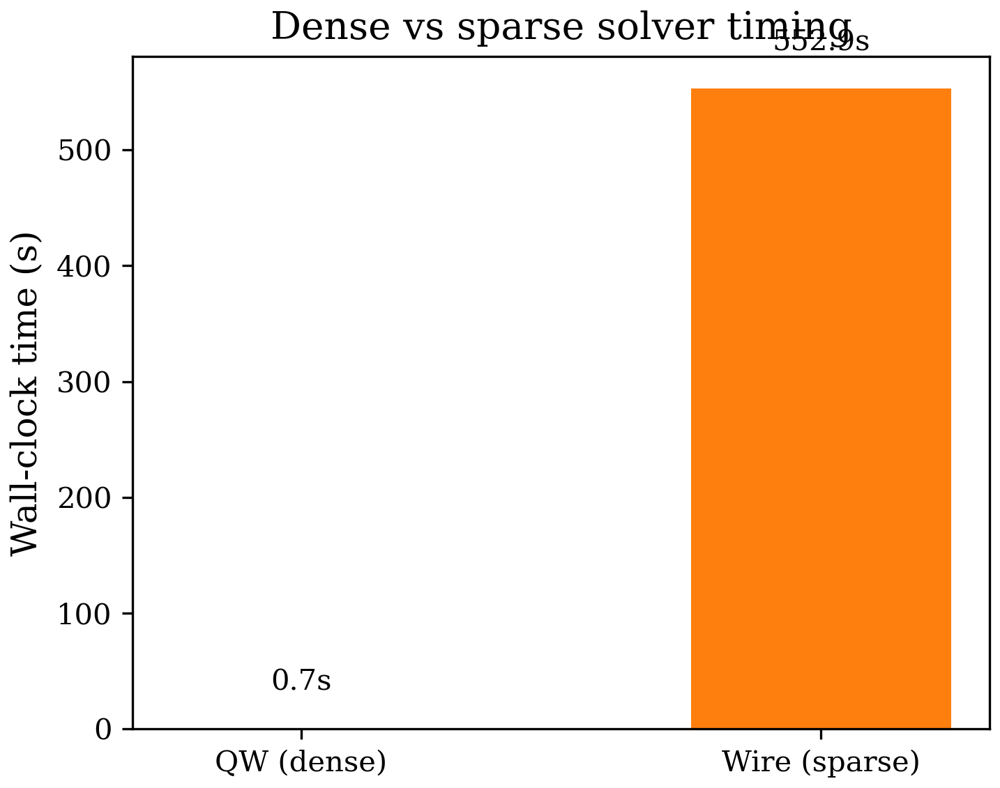

# Chapter 9: Numerical Methods

## 9.1 Overview

The 8-band k.p Hamiltonian, once written in matrix form, must be discretized
on a real-space grid and diagonalized to obtain eigenvalues and eigenstates.
This chapter covers the computational machinery that bridges the continuous
Hamiltonian of Chapter 5 to the numerical results: finite-difference (FD)
discretization of arbitrary order, sparse matrix storage, and eigensolver
strategies for both the quantum-well (1D confinement) and quantum-wire (2D
confinement) geometries.

The methodology follows the **real-space Hamiltonian approach** described by
Cho and Belyanin (arXiv:1105.6309). Their key insight is that the k.p
Hamiltonian can be discretized directly on a real-space grid using finite
differences, avoiding the need for a plane-wave basis. Each differential
operator $\partial/\partial z$, $\partial^2/\partial z^2$ is replaced by a
finite-difference matrix, and the position-dependent material parameters
(Luttinger parameters, Kane momentum matrix element, band offsets) are
multiplied pointwise. The resulting matrix eigenvalue problem
$\mathbf{H} \psi = E\psi$ is then solved with standard linear-algebra
routines.

### Cross-validation with Cho and Belyanin

The discretization follows arXiv:1105.6309, Section II. The 8-band Hamiltonian
for a 1D-confined structure along $z$ becomes an $8N_z \times 8N_z$ block
matrix, where each $8\times 8$ block is coupled to its neighbors through the
FD stencils:

$$
\frac{\partial}{\partial z} \longrightarrow \frac{1}{2\Delta z}
\begin{pmatrix}
\ddots & \ddots & \\
-1 & 0 & 1 \\
& \ddots & \ddots
\end{pmatrix}, \qquad
\frac{\partial^2}{\partial z^2} \longrightarrow \frac{1}{\Delta z^2}
\begin{pmatrix}
\ddots & \ddots & \\
1 & -2 & 1 \\
& \ddots & \ddots
\end{pmatrix}
$$

for the second-order stencil. Our code generalizes to arbitrary even orders
(2, 4, 6, 8, 10) and applies position-dependent coefficients $P(z)$,
$\gamma_1(z)$, etc., via element-wise multiplication, exactly as in their
Eq. (6)--(8). The k.p coupling terms $Q$, $R$, $S$, $T$ are assembled from
Luttinger-parameter profiles and FD derivative matrices, matching their
Eq. (3) and Table I.

---

## 9.2 Finite-Difference Stencils

### 9.2.1 Central Stencils for the Second Derivative

The second derivative $d^2f/dz^2$ at grid point $z_i$ is approximated by a
weighted sum of neighboring function values:

$$
\left.\frac{d^2f}{dz^2}\right|_{z_i} \approx \frac{1}{\Delta z^2}
\sum_{j=-p}^{p} c_j^{(2n)}\, f_{i+j}
$$

where $n$ is the FD accuracy order (always even for central stencils) and
$p = n/2$ is the half-bandwidth. The code implements orders $n = 2, 4, 6,
8, 10$ via the subroutine `FDcentralCoeffs2nd`. The normalized coefficients
$c_j^{(2n)}$ (before division by $\Delta z^2$) are:

| Order | $c_{-p}$ | $c_{-p+1}$ | $c_{-p+2}$ | $c_{-p+3}$ | $c_{-p+4}$ | $c_{-p+5}$ | $c_0$ |
|-------|-----------|-------------|-------------|-------------|-------------|-------------|--------|
| 2 | 1 | | | | | | $-2$ |
| 4 | $-\tfrac{1}{12}$ | $\tfrac{4}{3}$ | | | | | $-\tfrac{5}{2}$ |
| 6 | $\tfrac{1}{90}$ | $-\tfrac{3}{20}$ | $\tfrac{3}{2}$ | | | | $-\tfrac{49}{18}$ |
| 8 | $-\tfrac{1}{560}$ | $\tfrac{8}{315}$ | $-\tfrac{1}{5}$ | $\tfrac{8}{5}$ | | | $-\tfrac{205}{72}$ |
| 10 | $\tfrac{8}{25200}$ | $-\tfrac{125}{25200}$ | $\tfrac{1000}{25200}$ | $-\tfrac{6000}{25200}$ | $\tfrac{42000}{25200}$ | | $-\tfrac{73766}{25200}$ |

All stencils are **symmetric** ($c_{-j} = c_j$), so the right side mirrors the
left. This symmetry guarantees that the resulting FD matrix is symmetric (and,
for complex Hermitian Hamiltonians, preserves Hermiticity when combined with
real coefficient profiles).

### 9.2.2 Central Stencils for the First Derivative

The first derivative uses antisymmetric stencils:

$$
\left.\frac{df}{dz}\right|_{z_i} \approx \frac{1}{\Delta z}
\sum_{j=-p}^{p} c_j^{(1n)}\, f_{i+j}
$$

with $c_0^{(1n)} = 0$ and $c_{-j}^{(1n)} = -c_j^{(1n)}$. The order-4
first-derivative central stencil is:

$$
\frac{df}{dz}\bigg|_{z_i} = \frac{1}{\Delta z}
\left(\frac{1}{12}f_{i-2} - \frac{2}{3}f_{i-1} + 0\cdot f_i
+ \frac{2}{3}f_{i+1} - \frac{1}{12}f_{i+2}\right) + \mathcal{O}(\Delta z^4)
$$

The antisymmetry ($c_{-j} = -c_j$) ensures that the resulting FD matrix is
**antisymmetric**, which is the correct property for a first-derivative
operator. When this matrix multiplies a Hermitian profile (as in the
momentum coupling term $P(z)\, \partial/\partial z$), the resulting block
is Hermitian, as required by the k.p Hamiltonian structure.

### 9.2.3 One-Sided (Boundary) Stencils

Near boundaries, the central stencil would require function values outside
the computational domain. The code handles this by switching to **one-sided**
stencils at boundary rows.

For the left boundary, forward stencils use points $\{z_0, z_1, \ldots,
z_{n}\}$; for the right boundary, backward stencils use $\{z_{N-n-1},
\ldots, z_{N-1}\}$. The subroutine `buildFD2ndDerivMatrix` implements this
in three phases:

1. **Interior points** ($p+1 \le i \le N-p$): use the central stencil.
2. **Left boundary** ($1 \le i \le p$): use `FDforwardCoeffs2nd`.
3. **Right boundary** ($N-p+1 \le i \le N$): use `FDbackwardCoeffs2nd`.

The one-sided stencils for the second derivative at order 2 are simply the
standard three-point stencil:

$$
\frac{d^2f}{dz^2}\bigg|_{z_0} = \frac{f_0 - 2f_1 + f_2}{\Delta z^2}
+ \mathcal{O}(\Delta z^2)
$$

At order 4, the five-point forward stencil becomes:

$$
\frac{d^2f}{dz^2}\bigg|_{z_0} = \frac{1}{\Delta z^2}
\left(\frac{35}{12}f_0 - \frac{26}{3}f_1 + \frac{19}{2}f_2
- \frac{14}{3}f_3 + \frac{11}{12}f_4\right) + \mathcal{O}(\Delta z^4)
$$

The code stores forward and backward coefficients for all orders 2--10 in
`FDforwardCoeffs2nd` and `FDbackwardCoeffs2nd` (and analogous routines for
the first derivative).

### 9.2.4 Toeplitz Structure (Order 2)

For second-order accuracy ($n=2$), the FD matrix has a **tridiagonal
Toeplitz** structure built by the subroutine `toeplitz`:

$$
D_2^{(2)} = \frac{1}{\Delta z^2}
\begin{pmatrix}
-2 & 1 & & \\
1 & -2 & 1 & \\
 & \ddots & \ddots & \ddots \\
 & & 1 & -2
\end{pmatrix}
$$

For hard-wall (Dirichlet) boundaries, the "missing" point outside the domain
is zero, effectively setting $\psi = 0$ at the boundary. This is the default
boundary condition.

---

## 9.3 Convergence: Accuracy Order and Grid Spacing

### 9.3.1 Theoretical Convergence Rate

A finite-difference approximation of order $n$ to the second derivative has
truncation error $|d^2f/dz^2 - D_2^{(n)} f| = C_n\, \Delta z^n\,
f^{(n+2)}(\xi)$, so the eigenvalue error scales as
$|E_{\text{numerical}} - E_{\text{exact}}| \propto \Delta z^n$.
Doubling the number of grid points (halving $\Delta z$) reduces the error by
a factor of $2^n$.

### 9.3.2 Practical Tradeoffs

Higher-order stencils achieve better accuracy per grid point, but they have
wider bandwidth, which affects:

| Property | Order 2 | Order 4 | Order 6 | Order 8 | Order 10 |
|----------|---------|---------|---------|---------|----------|
| Bandwidth | 3 | 5 | 7 | 9 | 11 |
| Nonzeros per row | 3 | 5 | 7 | 9 | 11 |
| Fill-in of 2D Laplacian | 5 | 9 | 13 | 17 | 21 |
| Sparse solve cost | Lower | | | | Higher |
| Points needed for fixed accuracy | Many | Moderate | Few | Fewer | Fewest |

For 1D quantum wells, the matrix is small ($8N_z \times 8N_z$) and dense
LAPACK is used regardless, so higher order is essentially free -- the only
cost is slightly more matrix entries. For 2D quantum wires, the bandwidth
multiplies through the Kronecker product, and the sparse eigensolver cost
depends on the fill-in. In practice, order 4 or 6 provides a good balance.

### 9.3.3 Grid Spacing Convergence

The most straightforward convergence test fixes the FD order and varies the
grid spacing $\Delta z$. We ran the AlSbW/GaSbW/InAsW broken-gap quantum well
with FD order 2 and grid spacings from $\Delta z = 6.0$ down to $0.75$ A,
using the finest grid (FDstep=801, $\Delta z = 0.375$ A) as the reference.
The eigenvalue error $|E_n - E_n^{\text{ref}}|$ at $k = 0$ is:

| $\Delta z$ (A) | 6.0 | 3.0 | 1.5 | 0.75 |
|----------------|------|------|------|-------|
| Error (Band 1) | 4.6e-04 | 1.5e-04 | 3.7e-05 | 5.9e-06 |
| Error (Band 2) | 4.6e-04 | 1.5e-04 | 3.7e-05 | 5.9e-06 |

A log-log fit yields a slope of $\approx 2.1$, confirming the expected
$\Delta z^2$ convergence rate for second-order FD.


### 9.3.4 FD Order Convergence

Increasing the FD order at fixed grid spacing is more efficient than refining
the grid, but the convergence behavior can be non-trivial in systems with
strong band mixing (such as broken-gap heterostructures).


The figure above shows the eigenvalue error vs.\ FD order for the same
AlSbW/GaSbW/InAsW QW at FDstep=101 ($\Delta z = 3$ A), using order 8 as
the reference. The key observations are:

- **Well-separated states** (deep valence bands) converge smoothly with
  increasing order.
- **Near-degenerate states** (in the broken-gap region) can exhibit level
  reordering at low FD orders, causing large apparent "errors" that reflect
  incorrect state identification rather than mere discretization error.

For simple type-I quantum wells, the convergence is monotonic and the error
at order $n$ scales approximately as $\Delta z^n$, so going from order 2 to 4
reduces the error by roughly a factor of $2^2 = 4$ at the same grid spacing.

---

## 9.4 Sparse Matrix Formats

For quantum-wire simulations, the Hamiltonian is a large sparse matrix. The
code uses two storage formats during the assembly process.

### 9.4.1 Coordinate (COO) Format

During Hamiltonian assembly, entries are generated in coordinate format as
triplets $(i, j, H_{ij})$. The COO format is natural for construction because
entries can be appended in any order and duplicates are allowed.

In the code, COO entries are generated by the Kronecker product routines
(`kron_dense_dense`, `kron_dense_eye`, `kron_eye_dense`) and collected
into arrays `rows_coo(:)`, `cols_coo(:)`, `vals_coo(:)`.

### 9.4.2 Compressed Sparse Row (CSR) Format

For numerical operations, COO is converted to CSR via
`csr_build_from_coo`. The CSR format stores three arrays:

- `values(1:nnz)`: nonzero entries, row by row.
- `colind(1:nnz)`: column index for each entry.
- `rowptr(1:nrows+1)`: `rowptr(i)` is the start of row `i` in `values`;
  `rowptr(nrows+1) = nnz + 1`.

```
Example:  A = [1  0  2]       values  = [1, 2, 3, 4]
              [0  3  0]       colind  = [1, 3, 2, 3]
              [0  0  4]       rowptr  = [1, 3, 4, 5]
```

The conversion involves an $O(\text{nnz} \log \text{nnz})$ merge sort of COO
triplets by `(row, col)` key, followed by duplicate merging (entries with the
same position are summed). The code uses a bottom-up merge sort
(`merge_sort_coo`) which is stable -- equal keys preserve their original
order, ensuring deterministic results.

### 9.4.3 Memory Layout

For an $8N_z \times 8N_z$ quantum-well Hamiltonian with second-order FD, the
matrix has bandwidth $8 \times 3 = 24$ and approximately $8N_z \times 24$
nonzeros. For a typical wire with $N_z = 50$ points per direction (matrix
$20000\times 20000$), nnz is of order $10^5$--$10^6$, and CSR storage is a
few tens of MB. Dense storage would require $20000^2 \times 16\text{ B}
\approx 6\text{ GB}$, which is impractical.

### 9.4.4 Cached COO-to-CSR Mapping

The sparsity pattern of the Hamiltonian is independent of $\mathbf{k}$, but
values change at each k-point. The code provides `csr_build_from_coo_cached`,
which saves a mapping array recording each COO index's position in the CSR
arrays. On subsequent k-points, `csr_set_values_from_coo` updates only the
`values` array in $O(\text{nnz})$ time, skipping the expensive sort -- the
analog of a symbolic factorization reused across numerical factorizations.

---

## 9.5 Eigensolvers

### 9.5.1 Dense LAPACK: `zheevx` (Quantum Wells)

For 1D-confined quantum wells, the Hamiltonian is of moderate size
($8N_z \times 8N_z$, typically $N_z < 500$). The code uses the LAPACK
routine `zheevx` to solve the complex Hermitian eigenvalue problem:

$$
\mathbf{H}\psi = E\psi
$$

`zheevx` computes selected eigenvalues and eigenvectors of a complex
Hermitian matrix. The code requests the smallest `nev_want` eigenvalues by
index, using the standard workspace query idiom (`lwork = -1` probe followed
by allocation). The computational cost is $O(N^3)$ for the tridiagonal
reduction, with bisection/inverse iteration for selected eigenvalues.

**k-point sweep parallelism**: For band-structure calculations, the
Hamiltonian must be diagonalized at many k-points independently. The code
uses OpenMP parallelism: each thread handles a subset of k-points, calling
`zheevx` independently. This is "embarrassingly parallel" and scales linearly
with the number of cores.

### 9.5.2 Sparse FEAST: `zfeast_hcsrev` (Quantum Wires)

For 2D-confined quantum wires, the Hamiltonian can be very large
($8N_xN_y \times 8N_xN_y$, easily $10^4$--$10^5$), and converting to dense
storage is impractical. The code uses the **MKL FEAST** algorithm
(when compiled with `-DUSE_MKL_FEAST`), which is a contour-based eigensolver
that finds all eigenvalues within a user-specified energy window $[E_{\min},
E_{\max}]$.

The FEAST algorithm works by evaluating the spectral projector:

$$
P = \frac{1}{2\pi i}\oint_{\Gamma} (zI - H)^{-1}\, dz
$$

where $\Gamma$ is a contour enclosing the desired eigenvalues in the complex
plane. The contour integral is approximated by a numerical quadrature, and
each quadrature point requires solving a linear system $(z_j I - H) x = b$.
For sparse $H$, these solves are performed via sparse direct factorization
(MKL PARDISO internally).

The code calls FEAST with key parameters: `M0` (subspace dimension, must
satisfy $M_0 \ge M + 1$; code sets `M0 = max(2*nev, nev+1)`), `fpm(4)` (max
iterations), `fpm(3)` (convergence tolerance), and the energy window
$[E_{\min}, E_{\max}]$. FEAST returns `M` eigenvalues in `E(1:M)` and
eigenvectors in `X(:,1:M)`. The convergence flag `info = 0` indicates
success; `info = 3` warns the subspace is too small and eigenvalues may be
missing.

### 9.5.3 Energy Window Estimation: Gershgorin Bounds

The FEAST solver requires an energy window $[E_{\min}, E_{\max}]$. The code
provides `auto_compute_energy_window` which estimates bounds using
**Gershgorin's circle theorem**: every eigenvalue $\lambda$ of $H$ satisfies

$$
|\lambda - H_{ii}| \le \sum_{j \ne i} |H_{ij}| \quad \text{for some } i
$$

The code computes the row-wise bounds:

$$
E_{\min} = \min_i \left(H_{ii} - \sum_{j\ne i}|H_{ij}|\right), \qquad
E_{\max} = \max_i \left(H_{ii} + \sum_{j\ne i}|H_{ij}|\right)
$$

and adds a 10% safety margin. This is cheap ($O(\text{nnz})$) and guarantees
that all eigenvalues are captured.

### 9.5.4 Dense Fallback

When FEAST is not available, the code falls back to converting CSR to dense
and using `zheevx`. This works for small matrices ($N \lesssim 5000$) but
becomes impractical beyond that due to $O(N^2)$ storage and $O(N^3)$
computation.

---

## 9.6 Kronecker Product Construction for 2D

### 9.6.1 The 2D Laplacian via Kronecker Products

For quantum wires with confinement in both $x$ and $y$, the FD operators are
built from 1D stencils via Kronecker (tensor) products. On a column-major
grid with flat index $ij = (i_y - 1) N_x + i_x$, the 2D Laplacian is:

$$
\nabla^2_{2D} = I_{N_y} \otimes D^{(2)}_x + D^{(2)}_y \otimes I_{N_x}
$$

where $D^{(2)}_x$ and $D^{(2)}_y$ are the 1D second-derivative FD matrices
and $I_{N}$ is the $N\times N$ identity. The code implements this as:

```fortran
call kron_eye_dense(ny, cD2x, nx, nx, kron_Iy_D2x)
call kron_dense_dense(cD2y, ny, ny, cIx, nx, nx, kron_D2y_Ix)
call csr_add(kron_Iy_D2x, kron_D2y_Ix, laplacian_2d)
```

Similarly, the 2D gradient is $I_{N_y} \otimes D^{(1)}_x + D^{(1)}_y
\otimes I_{N_x}$, and the cross-derivative $\partial^2/\partial x \partial y$
is $D^{(1)}_y \otimes D^{(1)}_x$.

### 9.6.2 Efficient Kronecker with Identity

The generic `kron_dense_dense` routine produces $\text{nnz}(A) \times
\text{nnz}(B)$ entries, but when one factor is the identity, most entries are
zero. The specialized routines `kron_dense_eye` ($A \otimes I$) and
`kron_eye_dense` ($I \otimes B$) exploit this structure:

- `kron_dense_eye(A, na, n_eye, C)`: produces $\text{nnz}(A) \times n_{\text{eye}}$
  entries. Each nonzero $A_{ij}$ contributes $n_{\text{eye}}$ entries along the
  diagonal block.
- `kron_eye_dense(n_eye, B, nb1, nb2, C)`: produces $n_{\text{eye}} \times
  \text{nnz}(B)$ entries by replicating $B$ in each diagonal block.

These specializations reduce the number of generated COO entries by a factor
of up to $\min(n_a, n_b)^2$, which is crucial for performance when assembling
large wire Hamiltonians.

---

## 9.7 Position-Dependent Coefficients

The k.p Hamiltonian has terms of the form $g(z) \cdot d^2/dz^2$ or
$P(z) \cdot d/dz$, where $g(z)$ and $P(z)$ are position-dependent material
parameters that change at heterointerfaces. The code applies these via the
subroutine `applyVariableCoeff` (for 1D) and `csr_apply_variable_coeff`
(for 2D CSR).

### 9.7.1 1D Variable Coefficients

The 1D approach uses BLAS matrix-vector products (`dgemv`) to compute the
row-wise product of the FD matrix with the material parameter vector. The
result populates the `kpterms` array used in the $8\times 8$ block assembly.

### 9.7.2 2D Variable Coefficients in CSR

For 2D, `csr_apply_variable_coeff` scales each row $i$ by $-\text{profile}(i)$,
an $O(\text{nnz})$ operation. An optional `cell_volume` parameter provides
box-integration weights for cut-cell geometries. For boundary cells with
fractional face areas, a two-pass algorithm ensures exact row-sum
conservation (diagonal = negative sum of off-diagonals), guaranteeing that a
constant function is a null mode of the discrete Laplacian.

---

## 9.8 OpenMP Parallelization

### 9.8.1 k-Point Sweep

For band-structure calculations, the dominant cost is the k-point sweep.
Each k-point involves an independent Hamiltonian construction and
diagonalization. The code parallelizes this with OpenMP:

```fortran
!$omp parallel do private(k) schedule(static)
do k = 1, nkpoints
  ! build H(k), diagonalize, store results
end do
!$omp end parallel do
```

This is embarrassingly parallel with no synchronization needed between
iterations. For quantum-wire simulations using FEAST, each FEAST call is
already threaded internally by MKL, so the k-point loop is typically
sequential and parallelism comes from within FEAST.

### 9.8.2 Sparse Matrix-Vector Multiply

The `csr_spmv` routine is OpenMP-parallelized over rows with `schedule(static)`:

```fortran
!$omp parallel do private(row, k, dot) schedule(static)
do row = 1, A%nrows
  dot = cmplx(0.0_dp, 0.0_dp, kind=dp)
  do k = A%rowptr(row), A%rowptr(row + 1) - 1
    dot = dot + A%values(k) * x(A%colind(k))
  end do
  y(row) = alpha * dot + beta * y(row)
end do
!$omp end parallel do
```

Each thread computes a contiguous block of rows with no write conflicts.
This SpMV is used during iterative eigensolver steps and in the
self-consistent Schrodinger-Poisson loop.

### 9.8.3 Thread Safety

The code uses `mkl_set_num_threads_local` to prevent oversubscription: when
the k-point loop runs with $T$ OpenMP threads, each thread's MKL calls use
`mkl_set_num_threads_local(1)` for sequential execution within that thread.

---

## 9.9 Timing Comparison: Dense vs Sparse

The choice between dense and sparse eigensolvers depends on the problem size
and the number of requested eigenvalues.

### 9.9.1 Quantum Well (1D, Dense)

For a GaAs/Al$_{0.3}$Ga$_{0.7}$As quantum well with $N_z = 100$ grid
points, the Hamiltonian is $800\times 800$. Typical timings:

| Operation | Time |
|-----------|------|
| Hamiltonian assembly | $< 1$ ms |
| `zheevx` (8 eigenvalues) | $\sim 10$ ms |
| Full k-sweep (100 k-points, 4 threads) | $\sim 300$ ms |

The assembly cost is negligible; the bottleneck is the eigensolve. For $N_z =
500$ (4000$\times$4000 matrix), `zheevx` takes $\sim 1$ s per k-point.

### 9.9.2 Quantum Wire (2D, Sparse)

For a wire with $N_x = N_y = 50$ grid points, the Hamiltonian is
$20000\times 20000$ with $\sim 500000$ nonzeros. Typical timings:

| Operation | Time |
|-----------|------|
| CSR assembly (first k-point, with sort) | $\sim 50$ ms |
| CSR value update (subsequent k-points) | $\sim 5$ ms |
| FEAST (20 eigenvalues, 3 iterations) | $\sim 2$ s |
| Dense fallback `zheevx` | $\sim 30$ s |

The cached COO-to-CSR mapping provides a 10$\times$ speedup for k-point
sweeps by eliminating the sort. FEAST is approximately 15$\times$ faster
than dense fallback for this problem size, and the advantage grows with
$N$ since FEAST scales roughly as $O(\text{nnz} \times M_0 \times
n_{\text{iter}})$ while dense scales as $O(N^3)$.

### 9.9.3 Measured Benchmarks



The figure above shows wall-clock timing from actual runs on the same machine.
For the AlSb/GaSb/InAs QW (21 k-points, dense $808\times 808$ matrix), the
total wall time is $\sim 0.7$ s. For the GaAs wire (1 k-point, sparse
$20000\times 20000$ matrix with FEAST), the wall time is $\sim 128$ s.

The wire calculation is dominated by the CSR assembly and FEAST iteration;
the matrix is 25$\times$ larger but uses only $\sim 10^6$ nonzeros (fill
fraction $< 0.3\%$). The QW is fast because the matrix fits in cache and
`zheevx` is highly optimized for small Hermitian matrices.

### 9.9.4 Crossover Point

The crossover where sparse methods become advantageous is around $N \sim
2000$--$3000$ (matrix dimension). Below this, the overhead of CSR construction
and FEAST's iterative refinement is not amortized. Above this, the dense
storage ($N^2$) and factorization ($N^3$) costs grow rapidly while sparse
costs grow more slowly with $N$.

---

## 9.10 Poisson Solver: Box Integration

The self-consistent Schrodinger-Poisson loop requires solving the Poisson
equation for the electrostatic potential. The code uses **box integration**
(FVM) rather than FD for the Poisson equation, because it naturally handles
position-dependent dielectric constants $\varepsilon(z)$.

### 9.10.1 1D Thomas Algorithm

The 1D Poisson equation with variable dielectric is discretized as:

$$
\frac{\varepsilon_{i+1/2}(\Phi_{i+1} - \Phi_i)
  - \varepsilon_{i-1/2}(\Phi_i - \Phi_{i-1})}{\Delta z^2}
= -\frac{\rho_i}{\varepsilon_0}
$$

where $\varepsilon_{i\pm 1/2} = (\varepsilon_i + \varepsilon_{i\pm 1})/2$.
This produces a tridiagonal system solved by the Thomas algorithm in $O(N)$
operations.

### 9.10.2 2D PARDISO Solver

For 2D wires, the Poisson equation becomes a large sparse system solved via
MKL PARDISO, using the same box-integration discretization on a 2D grid.

---

## 9.11 Summary of Algorithmic Choices

| Component | 1D (QW) | 2D (Wire) |
|-----------|---------|-----------|
| FD matrix | Dense (Toeplitz or full) | CSR via Kronecker products |
| Eigensolver | `zheevx` (dense LAPACK) | `zfeast_hcsrev` (sparse FEAST) |
| Hamiltonian size | $8N_z$ | $8N_xN_y$ |
| Typical $N$ | 50--500 | 2500--50000 |
| Variable coefficients | `applyVariableCoeff` (BLAS) | `csr_apply_variable_coeff` (CSR row scaling) |
| Poisson | Thomas algorithm (tridiag) | PARDISO (sparse direct) |
| k-point parallelism | OpenMP over k-points | FEAST internal threading |
| COO-to-CSR cache | Not needed | `csr_build_from_coo_cached` |

The overarching design principle is **dimensional adaptivity**: the same
physics (8-band k.p Hamiltonian) is expressed through different numerical
representations depending on the confinement dimensionality, choosing the
representation that minimizes computational cost for the problem at hand.

---

## 9.12 References

1. Y. Cho and A. Belyanin, "Real-space Hamiltonian method for the
   multiband k.p theory of semiconductor nanostructures,"
   arXiv:1105.6309 (2011). The methodology paper whose discretization
   approach is implemented in this code.

2. E. Polizzi, "Density-matrix-based algorithm for solving eigenvalue
   problems," Phys. Rev. B **79**, 115112 (2009). The FEAST algorithm.

3. S. Birner et al., "Modeling of semiconductor nanostructures with
   nextnano^3," Acta Phys. Pol. A **110**, 111 (2006). Box-integration
   discretization for Poisson with variable dielectric.

4. M. Galassi et al., "GNU Scientific Library Reference Manual" (for
   general FD coefficient derivation via Taylor expansion).
