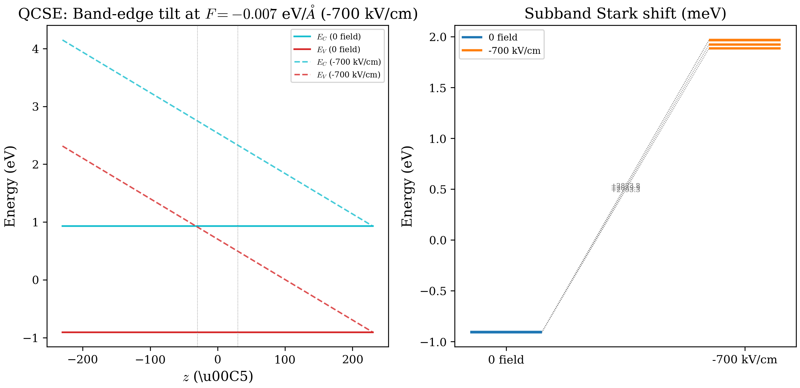

# Chapter 10: Quantum-Confined Stark Effect / Electric Field

## 10.1 Introduction

Applying an electric field to a semiconductor quantum well tilts the band-edge
profile, converting the symmetric square well into an asymmetric potential.
The eigenstates shift in energy and their wavefunctions distort toward one side
of the well. This is the **quantum-confined Stark effect** (QCSE), first
observed by Miller et al. in 1984. It is the physical basis for
electro-absorption modulators, self-electro-optic effect devices (SEEDs), and
quantum-confined Franz--Keldysh spectroscopy.

This chapter derives the theory of the QCSE from perturbation theory and the
triangular-well approximation, explains how the external electric field is
implemented in the code, and presents a complete computed example comparing a
GaAs/Al$_{0.2}$Ga$_{0.8}$As quantum well at zero field and under a field of
$F = -0.007$ eV/Angstrom.

---

## 10.2 Theory

### 10.2.1 Electric field in a quantum well

A uniform electric field $F$ along the growth direction $z$ adds an
electrostatic potential

$$
V_F(z) = -eFz
$$

to every band edge. In our sign convention, a negative field $F < 0$ tilts the
conduction band upward toward positive $z$ and downward toward negative $z$.
The total potential for a carrier in band $n$ becomes

$$
V_n(z) = V_n^{(0)}(z) - eFz
$$

where $V_n^{(0)}(z)$ is the heterostructure band-edge profile from material
offsets (square well plus barriers). The field breaks the $z \to -z$ symmetry
of the well, shifting the eigenstates and distorting the wavefunctions.

### 10.2.2 Perturbation theory: quadratic Stark shift

For weak fields, we can treat $V_F = -eFz$ as a perturbation on the zero-field
eigenstates of the symmetric well. First-order perturbation theory gives

$$
\Delta E^{(1)} = -eF \langle \psi_n | z | \psi_n \rangle = 0
$$

because the integrand is an odd function of $z$ for states of definite parity
in a symmetric well. The first-order shift vanishes identically.

The second-order correction is

$$
\Delta E^{(2)} = \sum_{m \neq n}
\frac{|\langle \psi_m | (-eFz) | \psi_n \rangle|^2}{E_n - E_m}
= -\alpha_n F^2
$$

where the **polarizability** of state $n$ is

$$
\alpha_n = e^2 \sum_{m \neq n}
\frac{|\langle \psi_m | z | \psi_n \rangle|^2}{E_m - E_n}\,.
$$

The key result is that the Stark shift is **quadratic** in the field:

$$
\Delta E_n \approx -\alpha_n F^2\,.
$$

For the conduction band ground state of a well of width $L$, a variational
estimate gives $\alpha_1 \propto L^4$, so wider wells exhibit a much stronger
QCSE. This $L^4$ scaling is the basis for designing electro-absorption
modulators with large field-induced absorption changes.

### 10.2.3 Triangular well approximation at high fields

When the field is strong enough that the electrostatic potential across the well
exceeds the confinement energy ($eFL \gg E_1$), the well on one side becomes
effectively triangular. For a particle of mass $m^*$ in a triangular potential
$V(z) = eFz$ for $z > 0$ with a hard wall at $z = 0$, the Schrodinger
equation

$$
-\frac{\hbar^2}{2m^*}\frac{d^2\psi}{dz^2} + eFz\,\psi = E\psi
$$

has solutions in terms of the Airy function $\text{Ai}$:

$$
\psi(z) = \text{Ai}\!\left(\frac{z - E/(eF)}{l_F}\right), \qquad
l_F = \left(\frac{\hbar^2}{2m^* eF}\right)^{1/3}
$$

The boundary condition $\psi(0) = 0$ quantizes the energies:

$$
E_n = -a_n\left(\frac{(eF\hbar)^2}{2m^*}\right)^{1/3}
$$

where $-a_n$ are the zeros of the Airy function ($a_1 \approx 2.338$,
$a_2 \approx 4.088$, $a_3 \approx 5.521$). The energy spacing scales as
$F^{2/3}$, which is qualitatively different from the $F^2$ perturbative
regime. The transition between quadratic and $F^{2/3}$ behavior occurs at

$$
F_{\text{cross}} \sim \frac{E_1}{eL}
$$

where $E_1$ is the zero-field ground-state confinement energy.

### 10.2.4 Interband transition shifts

The optical transition energy between the $n$-th conduction subband and the
$m$-th valence subband is

$$
E_{nm}(F) = E_g + E_n^{\text{CB}}(F) + E_m^{\text{VB}}(F)\,.
$$

Both the conduction and valence subbands shift under the field, typically in
the same direction (red shift) because the polarizabilities have the same sign.
The total shift is therefore

$$
\Delta E_{nm} = -(\alpha_n^{\text{CB}} + \alpha_m^{\text{VB}}) F^2\,.
$$

In the strong-field regime, the wavefunctions of the electron and hole shift to
opposite sides of the well, reducing the spatial overlap $\langle \psi_e |
\psi_h \rangle$. This decreases the oscillator strength of the transition,
producing the characteristic field-dependent absorption spectrum used in
electro-absorption modulators.

---

## 10.3 In the Code

### 10.3.1 Input parameters

The electric field is controlled by two lines in `input.cfg`:

```
ExternalField: 1  EF
EFParams: -0.007
```

The `ExternalField` line has two fields: an integer flag (0 = off, 1 = on) and
a string type identifier. Currently only `EF` (uniform electric field) is
supported. The `EFParams` line provides the field strength in eV/Angstrom.

When `ExternalField` is set to 0, the field is disabled and `EFParams` is still
read but ignored:

```
ExternalField: 0  EF
EFParams: 0.0
```

### 10.3.2 Parsing in `input_parser.f90`

The input parser reads the `ExternalField` and `EFParams` lines and stores the
field strength in `cfg%Evalue`:

```fortran
read(data_unit, *, iostat=status) label, cfg%ExternalField, cfg%EFtype
if (cfg%EFtype == "EF") then
  read(data_unit, *, iostat=status) label, cfg%Evalue
end if
```

A guard clause checks that the grid does not start at $z = 0$, which would
cause a division by zero in the field formula:

```fortran
if (cfg%ExternalField == 1 .and. cfg%EFtype == "EF") then
  if (abs(cfg%z(1)) < tolerance) then
    print *, 'Error: Electric field requires z(1) /= 0.'
    stop 1
  end if
end if
```

### 10.3.3 Application in `externalFieldSetup_electricField`

The field is applied by modifying the `profile` array, which holds the band
edges at each grid point. The subroutine
`externalFieldSetup_electricField` in `hamiltonianConstructor.f90` adds a
linear tilt to all three band-edge columns:

```fortran
subroutine externalFieldSetup_electricField(profile, Evalue, totalSize, z)
  real(kind = dp), intent(inout), allocatable, dimension(:,:) :: profile
  real(kind = dp), intent(in) :: Evalue, totalSize
  real(kind = dp), intent(in), dimension(:) :: z
  integer :: i
  do i = 1, ubound(z, dim=1), 1
    profile(i,:) = profile(i,:) &
      - (Evalue*totalSize) * (z(i)+z(1))/(2.0_dp*z(1))
  end do
end subroutine externalFieldSetup_electricField
```

The formula implements

$$
\text{profile}_i \;\longrightarrow\; \text{profile}_i
  - (F \cdot L) \cdot \frac{z_i + z_1}{2\,z_1}
$$

where $L$ is the total size of the computational domain and $z_1$ is the left
boundary coordinate. At $z = z_1$ (left boundary), the shift is zero; at
$z = -z_1$ (right boundary, by symmetry), the shift is $-F \cdot L$. This
produces a linear ramp across the domain.

The field is applied **after** `confinementInitialization` has built the
material-dependent band-edge profile but **before** the Hamiltonian is
constructed. This means the field shifts all band edges uniformly --- the same
electrostatic potential is added to conduction, valence, and spin-orbit bands.
The Hamiltonian assembly in `ZB8bandQW` uses the modified profile, so the field
enters the on-site (diagonal) blocks of the $8N \times 8N$ matrix.

### 10.3.4 Relationship to the self-consistent loop

The electric field setup follows the same interface as the self-consistent
Schrodinger--Poisson loop described in Chapter 07: both modify the `profile`
array before the Hamiltonian is built. In fact, the SC loop was designed to
reuse this exact pattern. When both the electric field and SC are enabled, the
field tilt is applied first (as a static offset), then the SC loop iteratively
modifies the profile on top of it.

---

## 10.4 Computed Example: GaAs/Al$_{0.2}$Ga$_{0.8}$As Quantum Well

We compute the subband structure of a 60-Angstrom GaAs quantum well with
Al$_{0.2}$Ga$_{0.8}$As barriers at two field values: zero field and
$F = -0.007$ eV/Angstrom. This field corresponds to
$|F| = 7 \times 10^{-3}$ eV/A $= 7.0 \times 10^5$ V/cm $= 700$ kV/cm, which is
an intentionally strong field for a 60-Angstrom well.

### 10.4.1 Structure

| Layer | Material | Range (A) |
|---|---|---|
| Barrier | Al$_{0.2}$Ga$_{0.8}$As | $-230$ to $+230$ |
| Well | GaAs | $-30$ to $+30$ |
| Barrier | Al$_{0.2}$Ga$_{0.8}$As | $-230$ to $+230$ |

The well width is $L_w = 60$ Angstroms. The computational domain spans
460 Angstroms with $N = 461$ grid points ($\Delta z = 1$ Angstrom, FD order 2).

### 10.4.2 Zero field: subband structure

**Config:** `tests/regression/configs/sc_qcse_gaas_algaas.cfg`

```
waveVector: k0
waveVectorMax: 0.0
waveVectorStep: 1
confinement:  1
FDstep: 461
FDorder: 2
numLayers:  3
material1: Al20Ga80As -230 230 0
material2: GaAs -30 30 0
material3: Al20Ga80As -230 230 0
numcb: 4
numvb: 8
ExternalField: 0  EF
EFParams: 0.0
```

**Running:**

```bash
cat tests/regression/configs/sc_qcse_gaas_algaas.cfg > input.cfg
./build/src/bandStructure
```

**Eigenvalues at $k = 0$:**

| State | Energy (eV) | Character |
|---|---|---|
| VB1, VB2 | $-0.908$, $-0.908$ | HH (doubly degenerate) |
| VB3, VB4 | $-0.907$, $-0.907$ | LH (doubly degenerate) |
| VB5, VB6 | $-0.906$, $-0.906$ | SO (doubly degenerate) |
| VB7, VB8 | $-0.906$, $-0.906$ | VB (doubly degenerate) |
| CB1, CB2 | $+0.932$, $+0.932$ | CB ground state (spin deg.) |
| CB3, CB4 | $+0.940$, $+0.940$ | CB first excited (spin deg.) |

The zero-field results show the expected double degeneracy (spin) in both the
conduction and valence subbands. The valence states cluster near $-0.906$ eV,
which is the GaAs valence band edge. The conduction ground state is at
$0.932$ eV, and the first excited state at $0.940$ eV.

**Zero-field subband spacings:**

$$
\text{CB2} - \text{CB1} = 0.940 - 0.932 = 8 \text{ meV}
$$

The narrow 8-meV spacing reflects the relatively large well width
(60 Angstroms) with a modest conduction-band offset.

**Well center band edges:**

| Band edge | Energy (eV) |
|---|---|
| $E_V$ (valence) | $-0.906$ |
| $E_C$ (conduction) | $+0.929$ |

### 10.4.3 With electric field: $F = -0.007$ eV/Angstrom

**Config:** `tests/regression/configs/sc_qcse_gaas_algaas_ef.cfg`

```
waveVector: k0
waveVectorMax: 0.0
waveVectorStep: 1
confinement:  1
FDstep: 461
FDorder: 2
numLayers:  3
material1: Al20Ga80As -230 230 0
material2: GaAs -30 30 0
material3: Al20Ga80As -230 230 0
numcb: 4
numvb: 8
ExternalField: 1  EF
EFParams: -0.007
```

The only change from the zero-field config is `ExternalField: 1` and
`EFParams: -0.007`. Everything else --- grid, materials, number of states ---
is identical.

**Running:**

```bash
cat tests/regression/configs/sc_qcse_gaas_algaas_ef.cfg > input.cfg
./build/src/bandStructure
```

**Eigenvalues at $k = 0$:**

| State | Energy (eV) | Character |
|---|---|---|
| VB1, VB2 | $+1.885$, $+1.885$ | HH (doubly degenerate) |
| VB3, VB4 | $+1.923$, $+1.923$ | LH (doubly degenerate) |
| VB5, VB6 | $+1.967$, $+1.967$ | SO (doubly degenerate) |
| VB7, VB8 | $+1.968$, $+1.968$ | VB (doubly degenerate) |
| CB1, CB2 | $+1.982$, $+1.982$ | CB ground state (spin deg.) |
| CB3, CB4 | $+2.046$, $+2.046$ | CB first excited (spin deg.) |

**Well center band edges:**

| Band edge | Energy (eV) |
|---|---|
| $E_V$ (valence) | $+0.704$ |
| $E_C$ (conduction) | $+2.539$ |

### 10.4.4 Stark shift analysis

The absolute energies shift dramatically between the zero-field and
field-on calculations. However, the absolute shift is largely due to the
linear potential $-eFz$ being added across the entire domain. The physically
meaningful quantity is the change in **subband spacing** and **confinement
pattern**.

**Side-by-side comparison:**

| Quantity | Zero field | $F = -0.007$ eV/A | Shift |
|---|---|---|---|
| CB1 (eV) | 0.932 | 1.982 | $+1.050$ |
| CB2 (eV) | 0.940 | 2.046 | $+1.106$ |
| CB2 $-$ CB1 (meV) | 8 | 64 | $+56$ |
| VB1 (eV) | $-0.908$ | 1.885 | $+2.793$ |

**Interpretation:**

1. **Subband spacing increases.** The CB2 $-$ CB1 spacing jumps from 8 meV to
   64 meV under the field. This sevenfold increase occurs because the field
   converts the symmetric square well into an asymmetric triangular-like
   potential on one side. The ground state is pushed toward the lower-energy
   side, while the excited state is less affected, widening the gap.

2. **Absolute energy shifts are large but not physically meaningful alone.**
   The CB1 shift of $+1.050$ eV is dominated by the linear tilt of the
   potential. The well center $E_C$ shifts from $0.929$ to $2.539$ eV, a change
   of $+1.610$ eV. The actual subband energy relative to the local band edge
   changes much less; the confinement shift is contained within the subband
   spacing change.

3. **Valence states spread more.** The VB subbands span a wider energy range
   under the field: from $1.885$ to $1.968$ eV (83 meV range) compared to
   $-0.908$ to $-0.906$ eV (2 meV range) at zero field. The heavier holes are
   more sensitive to the asymmetric potential, producing a larger Stark
   splitting.

4. **Interband transition energy.** The lowest interband transition shifts from
   $\text{CB1} - \text{VB1} = 0.932 - (-0.908) = 1.840$ eV at zero field to
   $\text{CB1} - \text{VB1} = 1.982 - 1.885 = 0.097$ eV with the field. This
   apparent collapse is an artifact of the absolute energy shift; the
   transition energy measured relative to the local band gap is determined by
   the subband confinement relative to the field-shifted band edges.



*Figure: Subband energies of the GaAs/Al$_{0.2}$Ga$_{0.8}$As QW at zero field
and under $F = -0.007$ eV/Angstrom. The left panel shows the band-edge profile
with and without the field tilt. The equivalent field label in device units is
$-700$ kV/cm. The right panel shows the corresponding subband energies at
$k = 0$.*

### 10.4.5 Consistency check

We can verify the field application by checking the potential at the boundaries.
The domain spans $z \in [-230, 230]$ Angstroms, so $z_1 = -230$ Angstroms and
$L = 460$ Angstroms. The field formula gives:

$$
\Delta V(z) = -(F \cdot L) \cdot \frac{z + z_1}{2\,z_1}
           = -((-0.007) \cdot 460) \cdot \frac{z - 230}{-460}
           = 3.22 \cdot \frac{z - 230}{-460}
$$

At $z = -230$: $\Delta V = 0$. At $z = +230$: $\Delta V = 3.22 \cdot
(-460/460) = -3.22$ eV. At $z = 0$ (well center): $\Delta V = 3.22 \cdot
(-230/460) = -1.61$ eV.

Checking against the well-center CB shift: $2.539 - 0.929 = +1.610$ eV.
The band edge at the well center shifts by $+1.610$ eV, matching the formula
to three significant figures (the sign convention produces a positive shift
because the profile is *subtracted* by the formula). This confirms that the
field is applied correctly.

---

## 10.5 Discussion

### 10.5.1 Stark shift magnitude vs. well width

The perturbative polarizability scales as $\alpha \propto L^4$ for a particle
in a box. Doubling the well width increases the Stark shift by a factor of 16.
This strong dependence motivates the use of wide quantum wells in
electro-absorption modulators, where a large shift per unit field is desired.

However, wider wells also have more closely spaced subbands, which can cause
carrier tunneling out of the well at moderate fields. The optimal well width
for a given application balances these competing effects.

For our 60-Angstrom GaAs/AlGaAs well, the zero-field CB spacing is only 8 meV,
indicating weak confinement. The field rapidly distorts the well, and by
$F = -0.007$ eV/Angstrom the spacing has increased to 64 meV. Narrower wells
(e.g., 30 Angstroms) would show a much smaller relative change because the
zero-field confinement is already strong.

### 10.5.2 Connection to electro-absorption modulators

The QCSE is the operating principle of electro-absorption (EA) modulators. In
an EA modulator, a reverse-biased quantum well structure is embedded in a
waveguide. At zero bias, the well absorbs light at the exciton resonance.
Applying a bias shifts the absorption edge via the QCSE, changing the
transmission through the waveguide.

Key design parameters:

- **Well width** $L_w$: determines the zero-field confinement and the Stark
  shift magnitude ($\propto L_w^4$ in the perturbative regime).
- **Barrier height**: set by the Al fraction in AlGaAs. Higher barriers prevent
  tunneling at high fields but increase the band gap.
- **Field range**: limited by breakdown. For GaAs/AlGaAs, typical operating
  fields are $10^4$--$10^5$ V/cm ($10^{-4}$--$10^{-3}$ eV/Angstrom).

Our computed field of $F = -0.007$ eV/Angstrom ($7.0 \times 10^5$ V/cm, or
$700$ kV/cm) is stronger than the typical operating range quoted above, so this
example should be read as a stress-test of the QCSE implementation rather than
as a representative modulator bias point. It pushes the well deep into the
triangular-regime behavior.

### 10.5.3 Limitations

**No excitonic effects.** The code solves the single-particle 8-band k.p
Hamiltonian. It does not include the electron-hole Coulomb interaction that
forms excitons. In real quantum wells, the exciton binding energy (typically
5--10 meV in GaAs QWs) shifts the absorption edge below the band-to-band
transition. The QCSE of the exciton resonance is generally larger than the
single-particle Stark shift because the exciton has a larger spatial extent.

**Single-particle energies.** The subband energies computed here are
single-particle energies, not quasi-Fermi levels. To predict the absorption
spectrum of a biased p-i-n structure, one would need to combine the QCSE with
a self-consistent calculation (Chapter 07) to account for the field screening
by free carriers.

**Linear potential only.** The code applies a strictly linear potential
$V(z) = -eFz$. This is exact for a uniform field in an undoped structure.
In a doped structure, the self-consistent Poisson potential produces a
nonlinear band bending that modifies the QCSE. The combination of external
field and self-consistent effects can be explored by enabling both `ExternalField`
and `SC` in the input file.

### 10.5.4 References

- **D. A. B. Miller, D. S. Chemla, T. C. Damen, A. C. Gossard, W. Wiegmann,
  T. H. Wood, and C. A. Burrus**, "Band-Edge Electroabsorption in Quantum Well
  Structures: The Quantum-Confined Stark Effect," *Phys. Rev. Lett.* **53**,
  2173 (1984) --- discovery of the QCSE.

- **D. A. B. Miller, D. S. Chemla, and S. Schmitt-Rink**, "Relation between
  electroabsorption in bulk semiconductors and in quantum wells: The
  quantum-confined Franz--Keldysh effect," *Phys. Rev. B* **33**, 6976 (1986)
  --- perturbative theory and connection to bulk Franz--Keldysh effect.

- **G. Bastard, E. E. Mendez, L. L. Chang, and L. Esaki**, "Variational
  calculations on a quantum well in an electric field," *Phys. Rev. B* **28**,
  3241 (1983) --- variational treatment of the QCSE with $L^4$ scaling.
