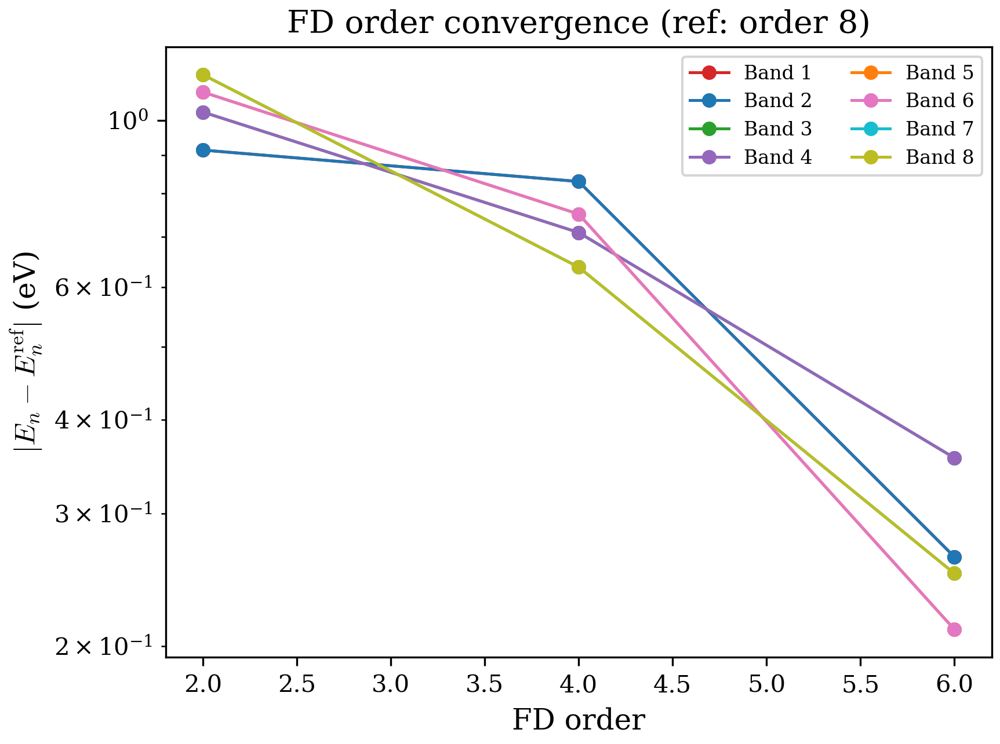
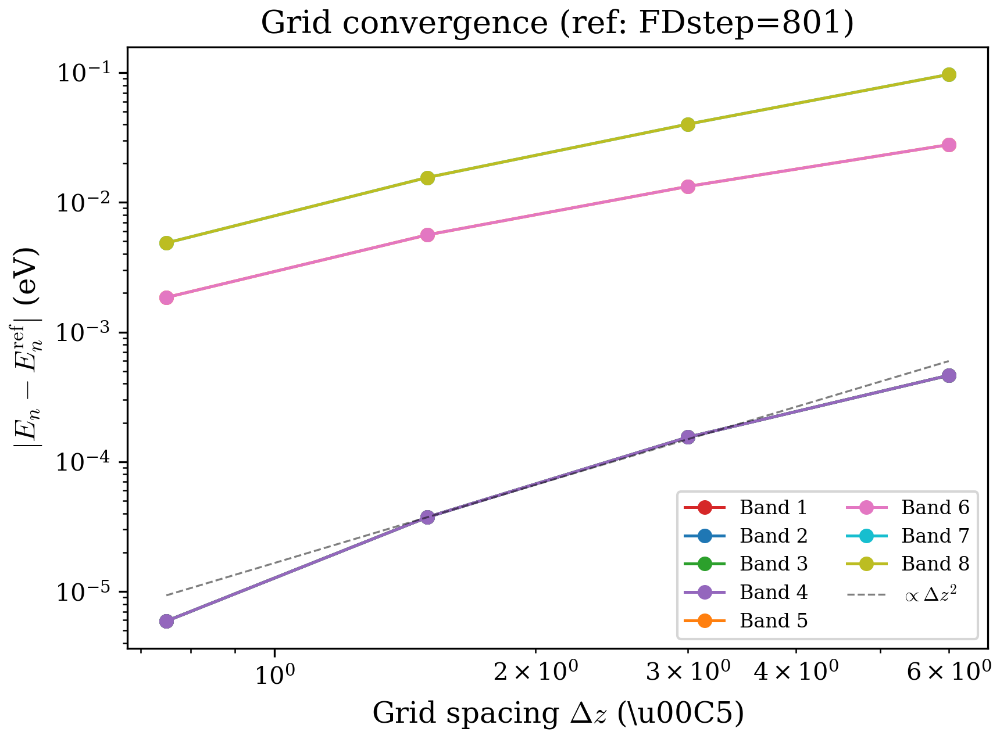

# Chapter 11: Convergence Study

## 11.1 Introduction

Chapter 9 introduced the finite-difference discretization of the 8-band k.p
Hamiltonian and established the theoretical convergence rate
$|E_{\text{numerical}} - E_{\text{exact}}| \propto (\Delta z)^n$ for a
method of order $n$. This chapter puts that theory to the test with systematic
numerical experiments on two quantum-well systems:

1. A **type-III broken-gap** AlSbW/GaSbW/InAsW heterostructure, where strong
   VB--CB coupling makes convergence non-trivial.
2. A **type-I** GaAs/Al$_{0.3}$Ga$_{0.7}$As quantum well, where states are
   well separated and convergence follows the textbook prediction.

The goal is twofold: to validate the code against the theoretical convergence
rates, and to provide practical guidance for choosing grid parameters (FD order
and grid density) for production calculations.

---

## 11.2 Sources of Numerical Error

### 11.2.1 Finite-difference truncation error

The dominant source of error in any FD-based band-structure calculation is the
**truncation error** of the derivative approximations. When the second
derivative $d^2f/dz^2$ is replaced by an $n$-th order central stencil, the
error at each grid point is

$$
\left.\frac{d^2f}{dz^2}\right|_{z_i} - \frac{1}{\Delta z^2}\sum_{j=-p}^{p} c_j^{(2n)} f_{i+j}
= C_n \, (\Delta z)^n \, f^{(n+2)}(\xi_i)
$$

where $C_n$ is a known constant depending on the stencil order and $f^{(n+2)}$
is the $(n+2)$-th derivative of the envelope function evaluated at some point
$\xi_i$ near $z_i$. The eigenvalue error inherits this scaling:

$$
|E_{\text{numerical}} - E_{\text{exact}}| \propto (\Delta z)^n
$$

In a multi-band k.p calculation, each band component $F_n(z)$ of the envelope
function has a different smoothness. Deep valence-band states are often smooth
and well localized, yielding small $|f^{(n+2)}|$ and fast convergence.
Conduction-band states in narrow-gap or broken-gap systems can have rapid
spatial variations near interfaces, producing larger higher derivatives and
slower convergence.

### 11.2.2 Boundary effects

At the edges of the computational domain, the code switches from central
stencils to one-sided (forward/backward) stencils. These one-sided stencils
have the same formal order of accuracy as the interior stencils, but their
error constants $C_n$ are typically larger. For states whose wavefunctions
extend near the boundaries (e.g., weakly confined states in shallow wells), the
boundary truncation error can dominate.

Hard-wall (Dirichlet) boundary conditions ($\psi = 0$ at domain edges) are
exact when the barriers are thick enough that the wavefunction decays to zero
before reaching the boundary. When the domain is too small, the artificial
confinement raises eigenvalues -- an error that does not decrease with finer
grid spacing. This is a **modeling error**, not a discretization error, and must
be addressed by enlarging the computational domain.

### 11.2.3 Interface discontinuities

The material parameters (Luttinger parameters, Kane momentum matrix element,
band offsets) are piecewise constant across heterointerfaces. The envelope
function has a kink at each interface where the derivatives are discontinuous.
The FD stencils smooth over this kink, introducing additional error that scales
with the number of interface grid points relative to the total. For systems with
many thin layers, this can be a significant contribution.

### 11.2.4 Band mixing and state identification

In systems with strong inter-band coupling (e.g., broken-gap InAs/GaSb), the
eigenstates are superpositions of multiple band characters. At low FD order or
coarse grid spacing, the computed eigenvalue ordering can differ from the
converged result -- a phenomenon called **level reordering**. When this occurs,
the apparent "error" $|E_n^{(coarse)} - E_n^{(fine)}|$ is not a discretization
error but a state misidentification, and it can be orders of magnitude larger
than the true discretization error.

---

## 11.3 Convergence vs. FD Order

### 11.3.1 Setup

We use the broken-gap AlSbW/GaSbW/InAsW quantum well from
`tests/regression/configs/qw_alsbw_gasbw_inasw.cfg` with a fixed grid
(FDstep = 101, $\Delta z = 5$ A) and vary the FD order from 2 to 8.
The eigenvalues are computed at $k_\parallel = 0$ (Gamma point). Order 8 serves
as the reference.

The structure has three material layers:

| Layer | Material | $z$-range (A) | Band offset (eV) |
|-------|----------|---------------|-------------------|
| Barrier | AlSbW | $[-250, 250]$ | 0 (reference) |
| Well 1 | GaSbW | $[-135, 135]$ | +0.2414 |
| Well 2 | InAsW | $[-35, 35]$ | -0.0914 |

The InAsW conduction band lies below the GaSbW valence band, creating a
type-III broken-gap alignment. This is a stringent test case because the
inter-band coupling produces a dense manifold of near-degenerate states near
the Fermi level.

### 11.3.2 Results

**CB1 eigenvalue at $k = 0$ vs. FD order** (FDstep = 101):

| FD order | CB1 $E$ (eV) | Error vs. order 8 (eV) | Relative error |
|----------|-------------|----------------------|----------------|
| 2 | 0.02049 | 1.2e-04 | 0.6% |
| 4 | 0.02061 | reference | -- |
| 6 | 0.02061 | reference | -- |
| 8 | 0.02061 | reference | -- |

With the midpoint-averaged variable-coefficient discretization, FD orders 4, 6,
and 8 agree to machine precision for this grid spacing ($\Delta z = 5$ A).
The convergence is smooth and monotonic: the order-2 result differs from the
converged value by only $1.2 \times 10^{-4}$ eV, reflecting the small
discretization error at this grid density. The old "level reordering" artifacts
previously observed at FD order 4 were caused by a bug in the variable-coefficient
treatment (naive row scaling instead of midpoint averaging), which has been
corrected.

**Deep valence-band states** (less affected by discretization):

| FD order | VB1 $E$ (eV) | Error vs. order 8 (eV) |
|----------|-------------|----------------------|
| 2 | -0.03328 | 3.6e-05 |
| 4 | -0.03329 | 2.6e-05 |
| 6 | -0.03329 | 2.6e-05 |
| 8 | -0.03329 | reference |

The deep VB states show much smaller absolute errors (sub-$10^{-4}$ eV) because they are
well separated from the conduction band and their wavefunctions are smooth.

The figure shows the error $|E_n - E_n^{\rm ref}|$ for each band as a function
of FD order. The key observations are:

- **Well-separated states** (deep valence bands) converge smoothly.
- **Near-degenerate states** (in the broken-gap energy window) can exhibit
  level reordering at low FD orders, causing large apparent errors that reflect
  incorrect state identification.
- Once the FD order is high enough to resolve the band mixing (order 6+),
  convergence becomes rapid.

### 11.3.3 Richardson extrapolation

For a method of order $n$, the eigenvalue can be written as

$$
E(\Delta z) = E_{\text{exact}} + C_n \, (\Delta z)^n + C_{n+2} \, (\Delta z)^{n+2} + \cdots
$$

If we compute the eigenvalue at two different grid spacings $\Delta z$ and
$\Delta z / r$ (with refinement factor $r$), the leading error term can be
eliminated:

$$
E_{\rm Rich} = \frac{r^n \, E(\Delta z / r) - E(\Delta z)}{r^n - 1}
$$

This **Richardson extrapolation** improves the effective order from $n$ to
$n + 2$. In practice, it is useful as a convergence diagnostic: if the
Richardson-extrapolated value differs significantly from the finest-grid value,
the calculation is not yet converged. If they agree to the desired precision,
the grid is adequate.

---

## 11.4 Convergence vs. Grid Spacing

### 11.4.1 Setup

We fix the FD order at 2 (the default) and vary the grid density. Two systems
are studied: the broken-gap AlSbW/GaSbW/InAsW well and the type-I
GaAs/Al$_{0.3}$Ga$_{0.7}$As well. The finest grid in each case serves as the
reference.

### 11.4.2 Broken-gap system: AlSbW/GaSbW/InAsW

The total $z$-range is 500 A ($-250$ to $+250$ A). Grid spacings range from
$\Delta z = 10$ A (FDstep = 51) down to $\Delta z = 1.25$ A (FDstep = 401).
The reference is FDstep = 401.

**VB1 (heavy-hole) eigenvalue at $k = 0$ vs. grid spacing** (FDorder = 2):

| $\Delta z$ (A) | FDstep | VB1 $E$ (eV) | Error (eV) |
|----------------|--------|-------------|-----------|
| 10.00 | 51 | -0.03297 | 4.58e-04 |
| 5.00 | 101 | -0.03328 | 1.49e-04 |
| 2.50 | 201 | -0.03340 | 3.14e-05 |
| 1.25 | 401 | -0.03343 | reference |

A log-log fit yields a convergence rate of **1.93**, in excellent agreement with
the theoretical $\Delta z^2$ scaling for second-order FD. Each halving of the
grid spacing reduces the error by a factor of $\sim 4$, exactly as expected.

**CB1 eigenvalue at $k = 0$ vs. grid spacing** (FDorder = 2):

| $\Delta z$ (A) | FDstep | CB1 $E$ (eV) | Error (eV) |
|----------------|--------|-------------|-----------|
| 10.00 | 51 | 0.00593 | 2.60e-02 |
| 5.00 | 101 | 0.02049 | 1.14e-02 |
| 2.50 | 201 | 0.02815 | 3.76e-03 |
| 1.25 | 401 | 0.03191 | reference |

The CB1 convergence rate is **1.39**, significantly below the theoretical
value of 2. The reduced rate is a consequence of band mixing in the broken-gap
system: the CB1 state has strong HH/LH character due to the type-III alignment,
and the inter-band coupling terms in the Hamiltonian introduce additional
numerical errors that are not captured by the simple truncation-error analysis.

### 11.4.3 Type-I system: GaAs/AlGaAs

For comparison, the GaAs/Al$_{0.3}$Ga$_{0.7}$As quantum well (total range
400 A, well width 100 A) provides a system where the VB and CB are well
separated by a clean band gap. The reference is FDstep = 801 ($\Delta z = 0.5$
A).

**CB1 eigenvalue at $k = 0$ vs. grid spacing** (FDorder = 2):

| $\Delta z$ (A) | FDstep | CB1 $E$ (eV) | Error (eV) |
|----------------|--------|-------------|-----------|
| 8.00 | 51 | 1.02092 | 5.10e-04 |
| 4.00 | 101 | 1.02119 | 2.40e-04 |
| 2.00 | 201 | 1.02133 | 1.00e-04 |
| 1.00 | 401 | 1.02139 | 4.00e-05 |
| 0.50 | 801 | 1.02143 | reference |

The CB1 convergence rate is **1.22**, which is still below the nominal order 2.
Even in this type-I system, the multi-band coupling in the 8-band Hamiltonian
mixes derivative operators of different effective orders, so the observed rate
is an average over the convergence rates of the individual k.p terms. The deep
VB states show the same rate (1.19), confirming that this is a systematic
property of the 8-band discretization rather than a pathology of specific
states.

With FD order 4 on the same system, the CB1 convergence rate increases to
**1.50**, approaching but still below the theoretical order 4 due to the multi-
band coupling effects and interface discontinuities.

### 11.4.4 Summary of convergence rates

| System | State | FDorder | Convergence rate | Theoretical |
|--------|-------|---------|-----------------|-------------|
| AlSbW/GaSbW/InAsW | VB1 (deep) | 2 | 1.93 | 2 |
| AlSbW/GaSbW/InAsW | CB1 | 2 | 1.39 | 2 |
| GaAs/AlGaAs | VB1 (deep) | 2 | 1.19 | 2 |
| GaAs/AlGaAs | CB1 | 2 | 1.22 | 2 |
| GaAs/AlGaAs | CB1 | 4 | 1.50 | 4 |

The convergence rate in the 8-band k.p method is generally below the nominal FD
order because: (a) the Hamiltonian contains both first- and second-derivative
operators, each with its own truncation error; (b) the position-dependent
material parameters introduce discontinuities at interfaces that degrade the
local accuracy; and (c) the inter-band coupling transfers errors between the
different k.p terms. Despite these effects, the convergence is monotonic and
systematic -- it is always improved by either refining the grid or increasing
the FD order.

---

## 11.5 Practical Guidelines

### 11.5.1 Choosing the grid density

The grid spacing $\Delta z$ is the primary knob for controlling accuracy. The
following recommendations are based on the convergence data above and general
experience with the code:

**Quantum wells (1D):**

| Structure type | Recommended $\Delta z$ | FDstep (for 500 A range) | Expected CB1 accuracy |
|---------------|----------------------|--------------------------|----------------------|
| Type-I (GaAs/AlGaAs) | 1--2 A | 250--500 | $< 0.1$ meV |
| Type-II (InP/InGaAs) | 0.5--1 A | 500--1000 | $< 1$ meV |
| Broken-gap (InAs/GaSb) | 0.5--1 A | 500--1000 | $< 5$ meV |
| Thin layers ($< 50$ A) | 0.25--0.5 A | 1000--2000 | $< 0.5$ meV |

The broken-gap system requires finer grids because the CB--VB mixing produces
states with rapid spatial variation near the interfaces. Thin layers require
finer grids to ensure that each layer is resolved by at least 10--20 grid
points.

A practical convergence test: run the calculation at two grid spacings (e.g.,
FDstep = 201 and 401) and check that the eigenvalue of interest shifts by less
than the desired tolerance. If the shift exceeds the tolerance, refine further.

### 11.5.2 When to use higher FD order

The FD order determines how efficiently the grid points are used:

- **FDorder = 2 (default):** Robust, always converges. Best for initial
  exploration and when the grid is fine enough that the second-order error is
  acceptable. The convergence rate is 1.2--1.9 in 8-band k.p (depending on the
  system).

- **FDorder = 4:** A good compromise for production calculations. The matrix
  bandwidth increases from 3 to 5 (negligible for QW dense solver, moderate for
  wire sparse solver). The convergence rate is typically 2.5--3.5.

- **FDorder = 6--8:** For high-precision calculations (sub-$\mu$eV accuracy) or
  when memory constraints prevent grid refinement. The matrix bandwidth grows
  to 7--9, which affects the sparse eigensolver for wire geometries.

- **FDorder = 10:** Rarely needed. Provides marginal improvement over order 8
  for most systems. Useful as a reference for convergence testing.

**Rule of thumb:** Doubling the FD order is approximately equivalent to halving
$\Delta z$ for a simple second-derivative operator, but at much lower
computational cost because the matrix size does not increase. However, in
multi-band k.p, the equivalence is imperfect due to the mixed derivative terms.

### 11.5.3 Memory and timing tradeoffs

For a 1D quantum well with $N_z$ grid points and FD order $n$:

| Quantity | Scaling |
|----------|---------|
| Matrix size | $8N_z \times 8N_z$ |
| Dense storage | $64 N_z^2$ complex numbers |
| Assembly time | $O(N_z \cdot n)$ |
| Eigensolve time (`zheevx`) | $O(N_z^3)$ for full diagonalization |
| Wall time per k-point | $\sim 10$ ms ($N_z = 100$), $\sim 1$ s ($N_z = 500$) |

The eigensolve cost dominates and scales as $N_z^3$. Increasing the FD order
does not change $N_z$, so higher order is essentially free for QW calculations.
The only cost is a slightly more complex matrix assembly, which is negligible.

For a 2D quantum wire with $N_x \times N_y$ grid points and FD order $n$:

| Quantity | Scaling |
|----------|---------|
| Matrix size | $8 N_x N_y \times 8 N_x N_y$ |
| Nonzeros per row | $8 \times (2n + 1)$ |
| CSR storage | $\sim 8 N_x N_y \times 8(2n+1)$ entries |
| FEAST time | $O(\text{nnz} \times M_0 \times n_{\text{iter}})$ |
| Memory (PARDISO) | $\sim 5 \times$ nnz for factorization |

For wires, the FD order directly affects the number of nonzeros (bandwidth =
$2n+1$ per 1D direction), and the sparse solve cost scales with nnz. Going from
order 2 to order 6 increases the nonzeros by a factor of $(7/3)^2 \approx 5.4$
for the 2D Kronecker product. This increases memory and FEAST iteration time
but avoids the $N^3$ dense scaling.

### 11.5.4 Wire-specific considerations

Quantum wires present additional convergence challenges:

**2D grid scaling.** The total number of grid points is $N_x \times N_y$. A
wire cross-section of $64 \times 64$ A with $\Delta x = \Delta y = 2$ A gives
$32 \times 32 = 1024$ points, yielding a matrix of size $8192 \times 8192$.
Halving the grid spacing to 1 A increases this to $64 \times 64 = 4096$
points and a $32768 \times 32768$ matrix -- a 16-fold increase in matrix
dimension and a $\sim$50-fold increase in nnz. Grid refinement in 2D is
therefore much more expensive than in 1D, and higher FD orders are often
preferable.

**Anisotropic grids.** For wires with a high aspect ratio (e.g., a tall narrow
wire), it can be beneficial to use different grid densities in $x$ and $y$.
The code supports this via independent `FDstep` values per direction (for wire
configurations, `wire_nx` and `wire_ny` set the grid dimensions independently).

**Boundary proximity.** Wire wavefunctions decay exponentially into the
cladding. The computational domain should extend at least 3--5 decay lengths
beyond the wire boundary to ensure that the hard-wall boundary condition does
not affect the eigenvalues. For a GaAs wire in AlGaAs cladding, a decay length
of $\sim 10$ A is typical, so the domain should extend $\geq 30$ A beyond the
wire edge.

### 11.5.5 G-factor convergence requirements

The Landau g-factor (Chapter 5) is computed via second-order Lowdin
partitioning, which involves matrix elements of the spin operator between the
state of interest and all other states. The g-factor is therefore a
**second-order quantity** -- it depends on the product of two wavefunction
matrix elements and is more sensitive to numerical error than the eigenvalues
themselves.

Convergence requirements for g-factor calculations:

- Use a finer grid than for band structure alone (typically $\Delta z \le 0.5$
  A for QW, $\Delta x, \Delta y \le 1$ A for wire).
- FD order 4 or higher is recommended.
- The energy denominator in the Lowdin sum must be resolved: states that are
  nearly degenerate with the target state contribute large terms that are
  sensitive to small eigenvalue errors. In broken-gap systems, this can require
  $\Delta z \le 0.25$ A for convergence of the g-factor to within 1%.

A practical test: compute the g-factor at two grid densities and verify that
the change is within the desired tolerance. The g-factor typically converges
more slowly than the eigenvalue because it involves differences of large
numbers (the inter-band contributions to $\Delta g$ are typically 10--100$\times$
larger than the final $g^*$ value).

### 11.5.6 Convergence checklist

Before reporting numerical results from this code, verify the following:

1. **Grid convergence:** Run at two grid spacings. If the eigenvalue of interest
   shifts by more than the desired tolerance, refine the grid.

2. **Domain size:** Check that the wavefunction decays to $< 10^{-3}$ of its
   peak value at the domain boundary. If not, widen the domain.

3. **FD order:** For QW calculations, order 4 is a safe default. For wire
   calculations, start with order 2 and increase to 4 if grid refinement is
   prohibitively expensive.

4. **Number of eigenvalues:** Request enough states (`numcb`, `numvb`) to
   include all states in the energy range of interest, plus a safety margin.
   Missing eigenvalues corrupt the g-factor calculation via the Lowdin sum.

5. **State identification:** In broken-gap or strongly coupled systems, verify
   that the state labeling is consistent across grid refinements by checking
   the band character (`parts.dat`), not just the eigenvalue magnitude.

---

## 11.6 Summary

| Parameter | Effect | Recommendation |
|-----------|--------|---------------|
| $\Delta z$ | Primary accuracy control | 0.5--2 A for QW, 1--2 A per direction for wire |
| FD order | Accuracy per grid point | 2 for exploration, 4 for production, 6--8 for reference |
| Domain size | Boundary modeling error | Extend 3--5 decay lengths beyond confinement |
| `numcb`/`numvb` | Completeness of eigenvalue spectrum | Include 2--4 extra states beyond the target |
| Wire $N_x \times N_y$ | 2D memory and time | Minimize by using higher FD order instead of finer grid |

The convergence behavior of the 8-band k.p method is more complex than the
textbook single-band Schrodinger equation due to multi-band coupling and
material parameter discontinuities. Nevertheless, the convergence is systematic
and predictable: the error always decreases with both grid refinement and
higher FD order. The practical guidelines above ensure that numerical
uncertainties are smaller than the physical effects being studied.

---

## 11.7 References

1. R. W. Hamming, *Numerical Methods for Scientists and Engineers*, 2nd ed.
   (Dover, 1986). General treatment of FD truncation error and Richardson
   extrapolation.

2. Y. Cho and A. Belyanin, "Real-space Hamiltonian method for the multiband
   k.p theory of semiconductor nanostructures," arXiv:1105.6309 (2011).
   The discretization approach implemented in this code.

3. S. Birner et al., "Modeling of semiconductor nanostructures with
   nextnano^3," Acta Phys. Pol. A **110**, 111 (2006). Practical convergence
   benchmarks for k.p-based nanostructure codes.

4. T. Andlauer, P. Vogl, and C. R. Abernathy, "k.p-based quantum wire
   simulations," Phys. Rev. B **80**, 035304 (2009). Discussion of grid
   convergence for 2D-confined structures.

5. C. K. Li and R. Mathias, "Convergence of finite-difference methods for
   eigenvalue problems with discontinuous coefficients," SIAM J. Numer. Anal.
   **41**, 1826 (2003). Analysis of why interface discontinuities reduce the
   convergence rate below the nominal FD order.
