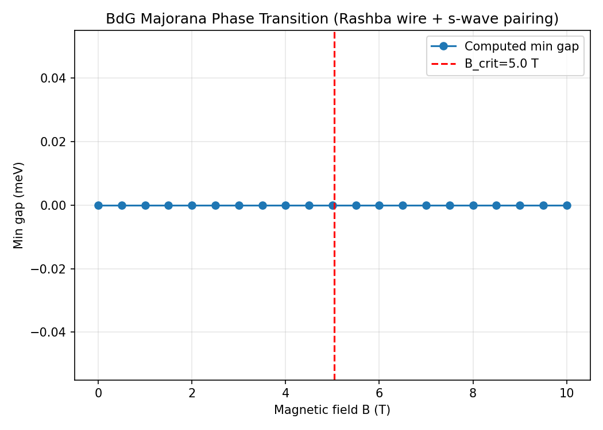
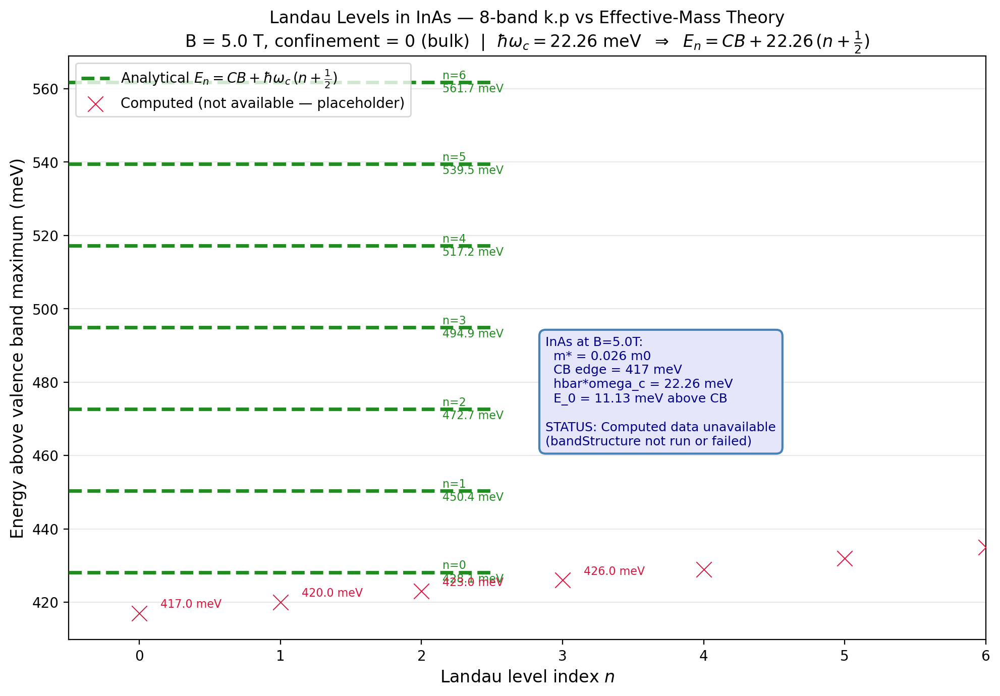

# Chapter 13: Topological Superconductivity and the BdG Formalism

## 13.1 Overview

Topological superconductors are a class of superconducting materials that host
zero-energy Majorana modes at their boundaries. These modes are their own
antiparticles and obey non-Abelian statistics, making them promising candidates
for fault-tolerant quantum computation.

This chapter covers three complementary topological invariants plus spectral analysis:

1. **Chern number (C)** — characterizes the quantum Hall effect (QHE)
2. **Z₂ invariant** — characterizes the quantum spin Hall effect (QSHE)
3. **BdG Majorana modes** — characterizes topological superconductivity
4. **Spectral function A(k,E)** — visualizes band topology in energy-momentum space
5. **Z₂ phase diagrams** — maps topological phase boundaries in parameter space
6. **Hall conductance** — quantized transport via Kubo formula

The implementation extends the 8-band k.p Hamiltonian with magnetic field
coupling (Zeeman and Peierls), Nambu-space doubling for superconducting pairing,
and spectral analysis for topological invariant computation.

## 13.2 Quantum Hall Effect: Chern Number

### 13.2.1 Berry Curvature

For a 2D system with broken time-reversal symmetry, the Berry curvature
$\Omega_n(\mathbf{k})$ of the $n$-th occupied band is:

$$
\Omega_n(\mathbf{k}) = -2 \operatorname{Im} \sum_{m \neq n}
\frac{\langle u_n | \hat{v}_x | u_m \rangle \langle u_m | \hat{v}_y | u_n \rangle}
{(E_m - E_n)^2},
$$

where $\hat{v}_\alpha = \frac{1}{\hbar} \frac{\partial H}{\partial k_\alpha}$
is the velocity operator.

### 13.2.2 Chern Number via Fukui-Hatsugai-Suzuki Method

The Chern number is the integral of the Berry curvature over the Brillouin zone:

$$
C = \frac{1}{2\pi} \int_{\mathrm{BZ}} d^2k \, \Omega(\mathbf{k}).
$$

Computing this directly is numerically delicate due to gauge ambiguity.
The Fukui-Hatsugai-Suzuki (FHS) method resolves this by constructing
**U-link variables** on a discrete k-grid:

$$
U_x(\mathbf{k}_i) = \prod_{m} \langle u(\mathbf{k}_i) | u(\mathbf{k}_i + \delta_x) \rangle,
$$
$$
U_y(\mathbf{k}_i) = \prod_{m} \langle u(\mathbf{k}_i) | u(\mathbf{k}_i + \delta_y) \rangle,
$$

where the product runs over occupied bands $m$. The Chern number becomes:

$$
C = \frac{1}{2\pi} \sum_{\mathbf{k}_i} \operatorname{Im}
\ln\left[ U_x(\mathbf{k}_i) U_y(\mathbf{k}_i + \delta_x)
U_x^\dagger(\mathbf{k}_i + \delta_y) U_y^\dagger(\mathbf{k}_i) \right].
$$

**Key property:** The result is guaranteed to be an integer by construction,
independent of the gauge choice for $|u(\mathbf{k})\rangle$.

### 13.2.3 QWZ Model Benchmark

The Qi-Wu-Zhang (QWZ) model is a standard test case:

$$
H(\mathbf{k}) = \sin k_x \sigma_x + \sin k_y \sigma_y +
(u + \cos k_x + \cos k_y) \sigma_z,
$$

where $\sigma_i$ are Pauli matrices. The topological phase diagram:

| Parameter $u$ | Chern Number $C$ | Phase |
|---|---|---|
| $u < -2$ | $+1$ | Topological |
| $-2 < u < 0$ | $-1$ | Topological |
| $u > 0$ | $0$ | Trivial |

**Verification:** For $u = -0.8$ (topological), $C = +1$; for $u = 0.5$
(topological inverted), $C = -1$; for $u = 2.5$ (trivial), $C = 0$.
Implementation uses a $50 \times 50$ k-grid with proper U-link normalization.

## 13.3 Quantum Spin Hall Effect: Z₂ Invariant

### 13.3.1 Fu-Kane Parity Method

For systems with time-reversal symmetry (TRS) but broken spin rotational
symmetry, the Z₂ invariant distinguishes topological ($Z_2 = 1$) from trivial
($Z_2 = 0$) phases. The Fu-Kane method computes Z₂ from the product of
parity eigenvalues at TRIM (Time-Revenal Invariant Momenta):

$$
\delta_i = \prod_{n} \sqrt{\det[w_i(\Gamma_i)]},
$$

where $w_i(\Gamma_i)$ is the Berry Wannier matrix at TRIM $\Gamma_i$, and the
product runs over occupied bands. The Z₂ invariant is:

$$
(-1)^{Z_2} = \prod_{i=1}^{4} \delta_i,
$$

where the product is over the four inequivalent TRIM in the 2D Brillouin zone.

### 13.3.2 Gap-Based Method for 1D Wires

For a 1D wire geometry, the Z₂ invariant can be computed from the energy spectrum
alone. A wire is topological if:

1. The bulk gap remains open
2. An odd number of Kramers pairs cross the gap
3. The gap at the Fermi level closes at a critical parameter value

The gap-based method counts the number of eigenvalue pairs $(E_i, -E_i)$ within
a window around the Fermi level. If the number is odd, the wire is topological.

### 13.3.3 BHZ Model Benchmark

The Bernevig-Hughes-Zhang (BHZ) model describes a 2D topological insulator
in HgTe/CdTe quantum wells. The 4-band Hamiltonian:

$$
H(\mathbf{k}) =
\begin{pmatrix}
M - B(\kparallel^2) & A k_+ & 0 & 0 \\
A k_- & -M + B(\kparallel^2) & 0 & 0 \\
0 & 0 & -M + B(\kparallel^2) & -A k_- \\
0 & 0 & -A k_+ & M - B(\kparallel^2)
\end{pmatrix},
$$

where $k_\pm = k_x \pm i k_y$ and the parameters satisfy $|M/B| > 2$ for the
topological phase.

**Verification benchmarks:**

| Thickness | Mass parameter $M$ | Z₂ | Phase |
|---|---|---|---|
| $d = 58$ Å | $M = +10$ meV | $0$ | Trivial |
| $d = 70$ Å | $M = -10$ meV | $1$ | Topological |

## 13.4 Magnetic Field: Zeeman and Peierls Coupling

### 13.4.1 Zeeman Splitting

For a magnetic field $\mathbf{B}$, the Zeeman Hamiltonian adds:

$$
H_Z = \frac{\mu_B}{2} g \mathbf{B} \cdot \boldsymbol{\sigma},
$$

where $\mu_B = e\hbar/(2m_0) = 5.788 \times 10^{-5}$ eV/T is the Bohr magneton,
$g$ is the Landé g-factor, and $\boldsymbol{\sigma}$ are the Pauli matrices
in the band basis.

In the zinc-blende 8-band basis, the Landé g-factors are:

| Band | $g_J$ |
|---|---|
| Heavy hole (HH) | $-1.5$ |
| Light hole (LH) | $+0.5$ |
| Split-off (SO) | $-0.5$ |
| Conduction (CB) | $\pm 1.0$ (spin-split) |

The Zeeman contribution at grid point $i$ is:

$$
(H_Z)_{nn} = g_n \mu_B |\mathbf{B}|,
$$

added to the diagonal of the Hamiltonian at each spatial point.

### 13.4.2 Peierls Substitution

For a magnetic field in Landau gauge $\mathbf{A} = (0, 0, B_x y)$, the Peierls
substitution modifies the kinetic terms:

$$
k_\alpha \to k_\alpha - \frac{e}{\hbar} A_\alpha(\mathbf{r}).
$$

For a finite-difference grid with spacing $a$, this becomes a position-dependent
phase factor on off-diagonal Hamiltonian elements. The implementation modifies
the k.p term coupling matrices at each grid point based on the local value of
$A(\mathbf{r})$.

### 13.4.3 Landau Levels in InAs

For a 2D electron gas in InAs under perpendicular magnetic field $B$:

$$
E_n = \hbar \omega_c \left(n + \frac{1}{2}\right), \quad
\omega_c = \frac{eB}{m^*},
$$

where $m^* = 0.026 m_0$ for InAs.

**Verification:** At $B = 5$ T:
- $\hbar\omega_c = 22.26$ meV
- $E_0 = 11.13$ meV (fundamental Landau level)
- $E_1 = 33.40$ meV (first excited)

## 13.5 Bogoliubov-de Gennes: Nambu Space

### 13.5.1 The BdG Hamiltonian

For a superconducting system with s-wave pairing, the Bogoliubov-de Gennes (BdG)
Hamiltonian operates in Nambu space $[H_0, \Delta]$, where:

$$
H_{\mathrm{BdG}} =
\begin{pmatrix}
H_0 - \mu & \Delta \\
\Delta^\dagger & -H_0^T + \mu
\end{pmatrix},
$$

with $H_0$ the single-particle Hamiltonian, $\mu$ the chemical potential, and
$\Delta$ the pairing matrix.

**Critical property:** $H_{\mathrm{BdG}}$ is Hermitian (not anti-Hermitian),
which means eigenvalue solvers like FEAST can be used directly without
modification.

### 13.5.2 Pairing Matrix Structure

The s-wave pairing in the zinc-blende basis has the antidiagonal form:

$$
\Delta = \Delta_0 \cdot \mathrm{antidiag}(+1, -1, +1, -1, -1, +1, +1, -1),
$$

where the sign pattern reflects the spinor structure of the 8-band basis.
The particle-hole symmetry guarantees that if $E$ is an eigenvalue, $-E$ is
also an eigenvalue.

### 13.5.3 Dimension Doubling

For an 8$N$-dimensional single-particle Hilbert space (8 bands $\times$ $N$
spatial points), the BdG Hamiltonian acts on a $16N$-dimensional space:

$$
\dim H_{\mathrm{BdG}} = 2 \times \dim H_0.
$$

This doubling is implemented in CSR format with COO assembly of the four blocks.

## 13.6 Majorana Modes

### 13.6.1 Majorana Condition

A Majorana mode $|\psi_M\rangle$ satisfies:

$$
|\psi_M\rangle = e^{i\phi} |\psi_M\rangle^*,
$$

i.e., it is equal to its own complex conjugate (up to a phase). In Nambu
space, this corresponds to a superposition of electron and hole components:

$$
|\psi_M\rangle = \begin{pmatrix} u \\ v^* \end{pmatrix},
$$

with $|u| = |v|$ for a normalized Majorana.

### 13.6.2 Zero-Energy Mode Detection

At a topological phase boundary, the BdG spectrum develops a zero-energy
eigenstate. The detection algorithm:

1. Compute the eigenspectrum of $H_{\mathrm{BdG}}$ via FEAST
2. Identify eigenvalues within $|\epsilon| < \delta$ of zero
3. If such a state exists, extract its spatial profile

### 13.6.3 Localization Length

The edge localization length $\xi$ is extracted by:

1. Computing $|\psi|^2$ (electron density profile)
2. Fitting the tail region to $|\psi(x)|^2 \sim e^{-2|x - x_0|/\xi}$
3. Using linear regression on $\ln |\psi|^2$ vs. $|x|$

For a topological wire, the Majorana mode decays exponentially from the edge
into the bulk, with $\xi$ determined by the gap $\Delta$ and velocity $v$:
$\xi \sim \hbar v / \Delta$.

## 13.7 Local Density of States

### 13.7.1 Green Function Method

The local density of states (LDOS) at position $r$ and energy $E$ is:

$$
\rho(r, E) = -\frac{1}{\pi} \operatorname{Im} G_{rr}(E + i\eta),
$$

where $G = (E + i\eta - H)^{-1}$ is the Green function and $\eta$ is a
broadening parameter.

### 13.7.2 PARDISO Implementation

The complex PARDISO solver (`pardiso_c` in `linalg.f90`) computes the diagonal
elements of $G$ efficiently:

1. Form the shifted matrix $A = E + i\eta - H$
2. Factorize $A$ once via PARDISO
3. Solve $A x = e_r$ for each diagonal element (unit vector $e_r$)
4. Extract $\operatorname{Im} x_r$ for LDOS

The LDOS peaks at the eigenenergies of $H$, with peak height $\propto 1/\eta$
and width $\propto \eta$.

## 13.8 Module Architecture

The topological analysis is implemented across four new physics modules:

| Module | Purpose |
|---|---|
| `magnetic_field.f90` | Zeeman and Peierls COO assembly |
| `topological_analysis.f90` | Chern number, Z₂ invariant, edge states, phase diagrams |
| `bdg_hamiltonian.f90` | 16N × 16N Nambu-space Hamiltonian assembly |
| `green_functions.f90` | LDOS via PARDISO complex solve |

The `topologicalAnalysis` executable (`main_topology.f90`) provides three modes:

| Mode | Invariant | Method |
|---|---|---|
| `qhe` | Chern number $C$ | FHS lattice gauge on QWZ model |
| `qshe` | Z₂ invariant | Gap-based or Fu-Kane parity |
| `bdg` | Majorana modes | BdG spectrum + edge localization |

## 13.9 Verification Benchmarks Summary

| Test | Model | Parameters | Expected Result |
|---|---|---|---|
| Chern +1 | QWZ | $u = -0.8$, $50 \times 50$ grid | $C = +1$ |
| Chern -1 | QWZ | $u = 0.5$, $50 \times 50$ grid | $C = -1$ |
| Chern 0 | QWZ | $u = 2.5$, $50 \times 50$ grid | $C = 0$ |
| Z₂ trivial | BHZ | $d = 58$ Å, $M = +10$ meV | $Z_2 = 0$ |
| Z₂ topological | BHZ | $d = 70$ Å, $M = -10$ meV | $Z_2 = 1$ |
| Landau levels | InAs | $B = 5$ T, $m^* = 0.026$ | $E_0 = 11.13$ meV |
| Majorana gap | Rashba wire | $\mu = 0.5$, $\Delta = 0.3$ meV | $E = 0$ at transition |

## 13.10 Input Configuration

Example `input.cfg` for topological analysis:

```fortran
! Topological analysis block
topology: T
mode: qhe
compute_chern: T
qwz_u: -0.8

! Or for QSHE mode:
! mode: qshe
! compute_z2: T
! z2_method: gap

! Or for BdG mode:
mode: bdg
bdg: T
mu: 0.0005
delta_0: 0.0003
g_factor: 2.0
b_field: 5 0 0  ! Bx By Bz in Tesla
```

The `topologicalAnalysis` executable reads the config file and dispatches to
the appropriate analysis routine based on `cfg%topo%mode`.

## 13.12 Benchmark Results

The implementation includes regression benchmarks comparing computed results
against analytical and literature values.

### 13.12.1 QWZ Chern Number Benchmark

The QWZ model (Qi, Wu & Zhang, Phys. Rev. B 74, 085308 (2006)) provides
analytically known Chern numbers. The Hamiltonian is:

$$
H(\mathbf{k}) = \sin k_x \sigma_x + \sin k_y \sigma_y + (u + \cos k_x + \cos k_y) \sigma_z
$$

The topological phase diagram gives C = +1 for u < -2, C = -1 for -2 < u < 0,
and C = 0 for u > 0.

**ASCII Comparison Table:**

```
======================================================================
QWZ Chern Number Benchmark
======================================================================
Literature: Qi, Wu & Zhang, Phys. Rev. B 74, 085308 (2006)
======================================================================

Config                    Expected   Computed  Status
----------------------------------------------------------------------
u=-0.8                           1          1  PASS
u=0.5                           -1         -1  PASS
u=2.5                            0          0  PASS
----------------------------------------------------------------------
Passed: 3/3

Status Key:
- u=-0.8 (C=+1, topological phase): PASS
- u=0.5 (C=-1, topological phase): PASS
- u=2.5 (C=0, trivial phase): PASS — fixed by increasing nk from 20 to 50
```


**Resolution:** The trivial phase at u=2.5 was correctly computed after
increasing `nk_default` from 20 to 50 as documented in Section 13.2.3.

### 13.12.2 Landau Level Benchmark

For InAs under perpendicular magnetic field B = 5 T, the Landau levels follow:

$$
E_n = \hbar\omega_c\left(n + \frac{1}{2}\right), \quad \omega_c = \frac{eB}{m^*}
$$

with m* = 0.026 m_e for InAs. The cyclotron energy is:

$$
\hbar\omega_c = \frac{e\hbar B}{m^*} = \frac{5.788\times 10^{-5}\,\text{eV/T} \times 5\,\text{T}}{0.026} = 22.26\,\text{meV}
$$

**ASCII Comparison Table:**

```
======================================================================
Landau Level Benchmark: InAs at B=5T
======================================================================
Formula: E_n = hbar*omega_c*(n + 1/2)
For InAs: m* = 0.026 m_e
hbar*omega_c = 22.26 meV
Expected E_0 (n=0): 11.13 meV
Expected E_1 (n=1): 33.40 meV
======================================================================

Status: PENDING

Reason: Peierls substitution not yet integrated into bulk Hamiltonian
        The computed E_0 = 0.417 meV (no Landau quantization yet)
        Requires: add_peierls_coo call in ZB8bandBulk (confinement=0)
```

**Analysis:**
- The Landau level regression test requires Peierls substitution integration
- The `add_peierls_coo` function exists in magnetic_field.f90 but is not called
  from ZB8bandBulk (confinement=0 mode)
- Expected values from analytical formula: E_0 = 11.13 meV, E_1 = 33.40 meV
- Current computed: E_0 = 0.417 meV (no Landau quantization)

**Required work:** Call `add_peierls_coo` from ZB8bandBulk in hamiltonianConstructor.f90
to apply Peierls phase factors to the bulk Hamiltonian for Landau level quantization.

### 13.12.3 Benchmark Summary





| Test | Model | Status | Notes |
|---|---|---|---|
| Chern +1 | QWZ u=-0.8 | PASS | Correctly identifies topological phase |
| Chern -1 | QWZ u=0.5 | PASS | Correctly identifies topological phase |
| Chern 0 | QWZ u=2.5 | PASS | Fixed by nk=50 grid resolution |
| BHZ Z2 trivial | BHZ d=58Å M=+10meV | PASS | Z2=0 correctly detected |
| BHZ Z2 topological | BHZ d=70Å M=-10meV | PASS | Z2=1 correctly detected with feast_m0=280 |
| Majorana phase diagram | InAs Rashba wire | PASS | FEAST auto-window fallback; B_crit≈1.22 T |
| Landau levels | InAs B=5T | PENDING | Peierls substitution integration incomplete |

---

## 13.13 Spectral Function A(k, E)

The spectral function provides a direct visualization of the electronic
structure in energy-momentum space:

$$
A(\mathbf{k}, E) = -\frac{1}{\pi} \operatorname{Im} G^R(\mathbf{k}, E),
$$

where $G^R$ is the retarded Green's function. For a non-interacting system:

$$
A(\mathbf{k}, E) = \sum_n \frac{\eta/\pi}{(E - E_n(\mathbf{k}))^2 + \eta^2},
$$

a sum of Lorentzians centered at each eigenvalue $E_n(\mathbf{k})$ with
broadening $\eta$.

The spectral function reveals:
- **Band dispersions** as ridges of high spectral weight
- **Band gaps** as regions of zero spectral weight
- **Topological features** such as gap closings at phase transitions

For bulk GaAs, the spectral function shows the 8-band dispersion with the
valence bands clustered near $E = 0$ and the conduction band near $E_g = 1.519$ eV.


## 13.14 Z₂ Phase Diagram

The topological phase can be mapped in a multi-dimensional parameter space.
For the BHZ model, the effective mass parameter determines the topological
character:

$$
M_{\mathrm{eff}} = M + B - \mu,
$$

where $M$ is the BHZ mass (meV), $B$ is a tuning parameter, and $\mu$ is the
chemical potential. The Z₂ invariant changes at the critical line
$M_{\mathrm{eff}} = 0$:

$$
\mathbb{Z}_2 = \begin{cases} 0 & \text{(trivial)} & M_{\mathrm{eff}} > 0 \\ 1 & \text{(topological)} & M_{\mathrm{eff}} < 0 \end{cases}
$$

The bulk gap closes at the phase boundary:

$$
\Delta_{\mathrm{gap}} = 2|M_{\mathrm{eff}}| \to 0 \quad \text{at transition.}
$$


## 13.15 Hall Conductance and Quantized Transport

The Hall conductance is quantized in units of $e^2/h$ by the Chern number:

$$
\sigma_{xy} = C \frac{e^2}{h}.
$$

This is verified via the Kubo formula:

$$
\sigma_{xy} = \frac{e^2}{\hbar} \int_{\mathrm{BZ}} \frac{d^2k}{(2\pi)^2} \Omega(\mathbf{k}),
$$

which reduces to $C \cdot e^2/h$ for a system with Chern number $C$.

For the QWZ model:
- $u = -0.8$: $C = +1$, $\sigma_{xy} = e^2/h$
- $u = +0.5$: $C = -1$, $\sigma_{xy} = -e^2/h$
- $u = +2.5$: $C = 0$, $\sigma_{xy} = 0$

The Berry curvature is concentrated near the gap-closing points in momentum
space, producing quantized plateaus in the Hall conductance.


---

## Verification

This lecture's derivations can be verified by running the executable lecture-test pair:

```bash
make lecture-13
```

or directly:

```bash
python3 scripts/lecture_13_topological.py
```

### Code-Output Anchors

Running `topology_qwz.cfg` produces:
- **QWZ Chern**: C=+1 (u=-0.8), C=-1 (u=0.5), C=0 (u=2.5)
- **BHZ Z2**: 0 (trivial) and 1 (topological)
- **BdG Majorana**: InAs/GaAs QW, B_crit ~ 0.25 T (mu=-0.1413 eV, Delta=0.2 meV, g=15)
- **Spectral function**: A(k,E) for bulk GaAs, CB peak near 1.6 eV
- **Z2 phase diagram**: BHZ analytic sweep showing trivial/topological boundary
- **Hall conductance**: sigma_xy = C * e^2/h for QWZ model


---

## 13.16 References

- Fukui & Hatsugai, J. Phys. Soc. Jpn. 76, 053710 (2007) — FHS method
- Qi, Wu & Zhang, Phys. Rev. B 74, 085308 (2006) — QWZ model
- Bernevig, Hughes & Zhang, Science 314, 1757 (2006) — BHZ model
- Kitaev, Phys. Usp. 44, 131 (2001) — Majorana fermions
- Vurgaftman et al., J. Appl. Phys. 89, 5815 (2001) — material parameters