# Chapter 13: Topological Superconductivity and the BdG Formalism

## Lecture Test-Pair Sections

This lecture is structured around five test-pair sections, each driven by
a section function in `scripts/lecture_13_topological.py` and verified by
the corresponding verifier script:

| Section | Content | Verifier | Witness |
|---------|---------|----------|---------|
| 13.1 Theory | Kitaev chain, Majorana condition `\|u\|=\|v\|`, Sticlet P_M, class-D PHS | (prose) | — |
| 13.2 Kitaev harness | Spinless p-wave demonstration: phase boundary at `\|μ\|=2t`, MZM localization, P_M saturation | pFUnit `test_kitaev_majorana.pf` | AE1, Issue 01 |
| 13.3 Dense-QW rung | ±E pairing, B-sweep, Pfaffian flip at `B_crit(QW)`, edge-localized MZMs | `verify_dense_qw_bdg_rung.py` | AE2 QW side, Issue 05 / U7 |
| 13.4 Wire rung | μ-in-gap fix narrative, 1D minigap curve (AE3), 2D colormap (U10), slim projected Pfaffian witness | `verify_wire_bdg_topological.py`, `test_wire_bdg_topological_2d.sh`, pFUnit `test_wire_pfaffian_witness.pf` | AE3, Issue 07 |
| 13.5 Observables | BdG LDOS zero-energy peak, A(k,E) showing in-gap mode, Nambu-resolved LDOS | `verify_bdg_spectral.py` | Issue 06 / U9 |

The "Reconciliation Table" image at the top of this chapter (§13.0)
aggregates the four B_crit witnesses — it is auto-generated and any
hand-edited discrepancy fails the acceptance gate (U12).

The original ad-hoc layout (sections 13.2-13.15 below) covers the
broader topological-analysis landscape (QWZ Chern, BHZ Z2, Landau,
Hall conductance) and remains the documentation reference; the
five test-pair sections above are the executable-level gate.

## 13.0 Reconciliation Table (auto-generated)

The four B_crit witnesses below are auto-generated from simulation
output by `scripts/lecture_13_topological.py`. The lecture script
emits four machine-readable lines (`BCRIT <rung> <value_T>`) which the
acceptance gate (U12) parses to assert 4-witness agreement within a
2.0 T tolerance. **No value in this table is hand-edited**; if the
table disagrees with a stale value in this markdown, the acceptance
gate (`tests/integration/test_lecture_13_acceptance_gate.sh`) will fail.


| Rung | B_crit (T) | Method | Witness |
|------|-----------|--------|---------|
| Wire (1D curve) | 2.800 | minigap closing | AE3 / Issue 07 |
| Wire (2D colormap) | 3.750 | minigap colormap | Issue 07 / U10 |
| Wire (slim Pfaffian) | 2.800 | projected Pfaffian | Issue 07 / U10 |
| Dense QW | 2.000 | Pfaffian flip at TRIM | Issue 05 / U7 |

Run `python3 scripts/lecture_13_topological.py` to regenerate the
table; the B_crit values will be re-extracted from the four
witnesses. The image above is the embedded output at
`output/lecture_13_reconciliation_table.png`.

## 13.1 Overview

Topological superconductors are a class of superconducting materials that host
zero-energy Majorana modes at their boundaries. These modes are their own
antiparticles and obey non-Abelian statistics, making them promising candidates
for fault-tolerant quantum computation.

This chapter covers three complementary topological invariants plus spectral analysis:

1. **Chern number (C)** — characterizes the quantum Hall effect (QHE)
2. **Z₂ invariant** — characterizes the quantum spin Hall effect (QSHE)
3. **BdG Majorana modes** — characterizes topological superconductivity
4. **Spectral function A(k,E)** — visualizes band topology in energy-momentum space
5. **Z₂ phase diagrams** — maps topological phase boundaries in parameter space
6. **Hall conductance** — quantized transport via Kubo formula

The implementation extends the 8-band k.p Hamiltonian with magnetic field
coupling (Zeeman and Peierls), Nambu-space doubling for superconducting pairing,
and spectral analysis for topological invariant computation.

## 13.2 Quantum Hall Effect: Chern Number

### 13.2.1 Berry Curvature

For a 2D system with broken time-reversal symmetry, the Berry curvature
$\Omega_n(\mathbf{k})$ of the $n$-th occupied band is:

$$
\Omega_n(\mathbf{k}) = -2 \operatorname{Im} \sum_{m \neq n}
\frac{\langle u_n | \hat{v}_x | u_m \rangle \langle u_m | \hat{v}_y | u_n \rangle}
{(E_m - E_n)^2},
$$

where $\hat{v}_\alpha = \frac{1}{\hbar} \frac{\partial H}{\partial k_\alpha}$
is the velocity operator.

### 13.2.2 Chern Number via Fukui-Hatsugai-Suzuki Method

The Chern number is the integral of the Berry curvature over the Brillouin zone:

$$
C = \frac{1}{2\pi} \int_{\mathrm{BZ}} d^2k \, \Omega(\mathbf{k}).
$$

Computing this directly is numerically delicate due to gauge ambiguity.
The Fukui-Hatsugai-Suzuki (FHS) method resolves this by constructing
**U-link variables** on a discrete k-grid:

$$
U_x(\mathbf{k}_i) = \prod_{m} \langle u(\mathbf{k}_i) | u(\mathbf{k}_i + \delta_x) \rangle,
$$
$$
U_y(\mathbf{k}_i) = \prod_{m} \langle u(\mathbf{k}_i) | u(\mathbf{k}_i + \delta_y) \rangle,
$$

where the product runs over occupied bands $m$. The Chern number becomes:

$$
C = \frac{1}{2\pi} \sum_{\mathbf{k}_i} \operatorname{Im}
\ln\left[ U_x(\mathbf{k}_i) U_y(\mathbf{k}_i + \delta_x)
U_x^\dagger(\mathbf{k}_i + \delta_y) U_y^\dagger(\mathbf{k}_i) \right].
$$

**Key property:** The result is guaranteed to be an integer by construction,
independent of the gauge choice for $|u(\mathbf{k})\rangle$.

### 13.2.3 QWZ Model Benchmark

The Qi-Wu-Zhang (QWZ) model is a standard test case:

$$
H(\mathbf{k}) = \sin k_x \sigma_x + \sin k_y \sigma_y +
(u + \cos k_x + \cos k_y) \sigma_z,
$$

where $\sigma_i$ are Pauli matrices. The topological phase diagram:

| Parameter $u$ | Chern Number $C$ | Phase |
|---|---|---|
| $u < -2$ | $0$ | Trivial |
| $-2 < u < 0$ | $+1$ | Topological |
| $0 < u < 2$ | $-1$ | Topological |
| $u > 2$ | $0$ | Trivial |

**Verification:** For $u = -0.8$ (topological), $C = +1$; for $u = 0.5$
(topological inverted), $C = -1$; for $u = 2.5$ (trivial), $C = 0$.
Implementation uses a $50 \times 50$ k-grid with proper U-link normalization.

## 13.3 Quantum Spin Hall Effect: Z₂ Invariant

### 13.3.1 Fu-Kane Parity Method

For systems with time-reversal symmetry (TRS) but broken spin rotational
symmetry, the Z₂ invariant distinguishes topological ($Z_2 = 1$) from trivial
($Z_2 = 0$) phases. The Fu-Kane method computes Z₂ from the product of
parity eigenvalues at TRIM (Time-Revenal Invariant Momenta):

$$
\delta_i = \prod_{n} \sqrt{\det[w_i(\Gamma_i)]},
$$

where $w_i(\Gamma_i)$ is the Berry Wannier matrix at TRIM $\Gamma_i$, and the
product runs over occupied bands. The Z₂ invariant is:

$$
(-1)^{Z_2} = \prod_{i=1}^{4} \delta_i,
$$

where the product is over the four inequivalent TRIM in the 2D Brillouin zone.

### 13.3.2 Gap-Based Method for 1D Wires

For a 1D wire geometry, the Z₂ invariant can be computed from the energy spectrum
alone. A wire is topological if:

1. The bulk gap remains open
2. An odd number of Kramers pairs cross the gap
3. The gap at the Fermi level closes at a critical parameter value

The gap-based method counts the number of eigenvalue pairs $(E_i, -E_i)$ within
a window around the Fermi level. If the number is odd, the wire is topological.

### 13.3.3 BHZ Model Benchmark

The Bernevig-Hughes-Zhang (BHZ) model describes a 2D topological insulator
in HgTe/CdTe quantum wells. The 4-band Hamiltonian:

$$
H(\mathbf{k}) =
\begin{pmatrix}
M - B(\kparallel^2) & A k_+ & 0 & 0 \\
A k_- & -M + B(\kparallel^2) & 0 & 0 \\
0 & 0 & -M + B(\kparallel^2) & -A k_- \\
0 & 0 & -A k_+ & M - B(\kparallel^2)
\end{pmatrix},
$$

where $k_\pm = k_x \pm i k_y$ and the parameters satisfy $|M/B| > 2$ for the
topological phase.

**Verification benchmarks:**

| Thickness | Mass parameter $M$ | Z₂ | Phase |
|---|---|---|---|
| $d = 58$ Å | $M = +10$ meV | $0$ | Trivial |
| $d = 70$ Å | $M = -10$ meV | $1$ | Topological |

## 13.4 Magnetic Field: Zeeman and Peierls Coupling

### 13.4.1 Zeeman Splitting

For a magnetic field $\mathbf{B}$, the Zeeman Hamiltonian adds:

$$
H_Z = \frac{\mu_B}{2} g \mathbf{B} \cdot \boldsymbol{\sigma},
$$

where $\mu_B = e\hbar/(2m_0) = 5.788 \times 10^{-5}$ eV/T is the Bohr magneton,
$g$ is the Landé g-factor, and $\boldsymbol{\sigma}$ are the Pauli matrices
in the band basis.

In the zinc-blende 8-band basis, the Landé g-factors are:

| Band | $g_J$ |
|---|---|
| Heavy hole (HH) | $-1.5$ |
| Light hole (LH) | $+0.5$ |
| Split-off (SO) | $-0.5$ |
| Conduction (CB) | $\pm 1.0$ (spin-split) |

The Zeeman contribution at grid point $i$ is:

$$
(H_Z)_{nn} = g_n \mu_B |\mathbf{B}|,
$$

added to the diagonal of the Hamiltonian at each spatial point.

### 13.4.2 Peierls Substitution

For a magnetic field in Landau gauge $\mathbf{A} = (0, 0, B_x y)$, the Peierls
substitution modifies the kinetic terms:

$$
k_\alpha \to k_\alpha - \frac{e}{\hbar} A_\alpha(\mathbf{r}).
$$

For a finite-difference grid with spacing $a$, this becomes a position-dependent
phase factor on off-diagonal Hamiltonian elements. The implementation modifies
the k.p term coupling matrices at each grid point based on the local value of
$A(\mathbf{r})$.

### 13.4.3 Landau Levels in InAs

For a 2D electron gas in InAs under perpendicular magnetic field $B$:

$$
E_n = \hbar \omega_c \left(n + \frac{1}{2}\right), \quad
\omega_c = \frac{eB}{m^*},
$$

where $m^* = 0.026 m_0$ for InAs.

**Verification:** At $B = 5$ T (InAs, CB edge = 417 meV):
- $\hbar\omega_c = 22.26$ meV
- $E_0 = 428.13$ meV (fundamental Landau level; offset $\text{CB}_\text{edge} + 11.13$ meV)
- $E_1 = 450.40$ meV (first excited; offset $\text{CB}_\text{edge} + 33.40$ meV)

## 13.5 Bogoliubov-de Gennes: Nambu Space

### 13.5.1 The BdG Hamiltonian (canonical form, ADR 0007)

For a superconducting system with s-wave pairing, the Bogoliubov-de Gennes (BdG)
Hamiltonian operates in Nambu space $[H_0, \Delta]$. Per ADR 0007, the canonical
form is:

$$
H_{\mathrm{BdG}}(\mathbf{k}) =
\begin{pmatrix}
H_0(\mathbf{k}) - \mu I & \Delta \\
\Delta^\dagger & -\mathrm{conjg}(H_0(-\mathbf{k})) + \mu I
\end{pmatrix},
$$

with $H_0$ the single-particle Hamiltonian, $\mu$ the chemical potential, and
$\Delta$ the pairing matrix. The hole block
$-\mathrm{conjg}(H_0(-\mathbf{k}))$ is the Leijnse-Flensberg Eq. 38 form
(valid for any $\mathbf{k} \neq 0$, not just $\mathbf{k}=0$); the older
$-H_0^T$ form only equals $-\mathrm{conjg}(H_0(-\mathbf{k}))$ when $H_0$
is real and symmetric (the bulk non-magnetic limit).

**Critical property:** $H_{\mathrm{BdG}}$ is Hermitian (not anti-Hermitian),
which means eigenvalue solvers (e.g., `method = "FEAST"` via the unified
`eigensolver` module) can be used directly without modification. The class-D
particle-hole symmetry holds by construction:

$$
\mathcal{C} \, H_{\mathrm{BdG}}(\mathbf{k}) \, \mathcal{C}^{-1} =
- H_{\mathrm{BdG}}(-\mathbf{k}), \qquad \mathcal{C} = \tau_x \mathcal{K},
$$

where $\mathcal{K}$ is complex conjugation. The wire CSR builder and dense
QW builder both route the hole block through the private wrapper
`build_bdg_hole_block(H0_minus_k, H_hole)` in `src/physics/bdg_hamiltonian.f90`
(ADR 0007 Layer B), guaranteeing the canonical form on every call path.

**Symmetric Peierls convention** (ADR 0007 Layer A, Issue 03 fix3): under a
magnetic field $\mathbf{B}$, the electron block applies the Peierls phase
with $+\mathbf{B}_{\mathrm{vec}}$ and the hole block applies it with
$-\mathbf{B}_{\mathrm{vec}}$. This sign flip restores PHS in the presence
of the orbital Zeeman field, since the hole block represents $H_0(-\mathbf{k})$
evaluated with the opposite momentum shift. Both blocks must be PHS-conjugate,
so the Peierls phase must be conjugated too.

### 13.5.2 Pairing Matrix Structure

The s-wave pairing in the zinc-blende basis has the antidiagonal block form
$\Delta_{ij} = \Delta_0 \cdot s_i \cdot \delta_{i, p(j)}$, where $p$ and $s$
are the module data arrays declared in `src/physics/bdg_hamiltonian.f90`:

```fortran
integer, parameter :: pairing_partner(8) = [4, 3, 2, 1, 6, 5, 8, 7]
real(kind=dp), parameter :: pairing_sign(8)   = [+1, +1, -1, -1, +1, -1, +1, -1]
```

Each Kramers pair $(1,4)$, $(2,3)$, $(5,6)$, $(7,8)$ in the basis
$(\mathrm{HH}\uparrow, \mathrm{LH}\uparrow, \mathrm{LH}\downarrow, \mathrm{HH}\downarrow,
\mathrm{SO}\uparrow, \mathrm{SO}\downarrow, \mathrm{CB}\uparrow, \mathrm{CB}\downarrow)$
gets a $+1 / -1$ sign matching the $i\sigma_y \otimes I_4$ structure, with
the spin-up bands (1, 2, 5, 7) carrying $+1$ and the spin-down bands (3, 4, 6, 8)
carrying $-1$.

The class-D particle-hole symmetry guarantees that if $E$ is an eigenvalue,
$-E$ is also an eigenvalue.

### 13.5.3 Dimension Doubling

For an $8N$-dimensional single-particle Hilbert space (8 bands $\times$ $N$
spatial points), the BdG Hamiltonian acts on a $16N$-dimensional space:

$$
\dim H_{\mathrm{BdG}} = 2 \times \dim H_0.
$$

This doubling is implemented in CSR format with COO assembly of the four blocks.

### 13.5.4 Particle-Hole Symmetry Oracle

The class-D particle-hole symmetry $\mathcal{C} H_{\mathrm{BdG}}(\mathbf{k})
\mathcal{C}^{-1} = -H_{\mathrm{BdG}}(-\mathbf{k})$ with $\mathcal{C} = \tau_x
\mathcal{K}$ is the foundational constraint that pins down the sign convention
for the hole block. The PHS oracle (`tests/unit/test_bdg_phs.pf`, Issue 02,
extended in Issue 03 fix3) verifies this at generic $\mathbf{k}$ for all four
field combinations:

1. Zero field, real $H_0$: standard $\tau_x \mathcal{K}$ PHS
2. Finite $B_x$ (electron $+B$, hole $-B$): symmetric Peierls preserves PHS
3. Finite $B_z$ (Zeeman, no Peierls): sign flip in (2,2) restores PHS
4. Finite $B_x + B_z$ (both): combined Peierls + Zeeman consistency

The oracle is the authoritative witness for the canonical hole-block form
(ADR 0007 Layer A). Both builders — wire CSR and dense QW — satisfy it by
construction because they route through the shared `build_bdg_hole_block`
wrapper.

## 13.6 Majorana Modes

### 13.6.0 Kitaev Majorana Number and Pfaffian

The Kitaev Majorana number $M$ discriminates trivial from topological 1D
superconductors (and, by extension, the Pfaffian-sign-flip signature on
class-D 2D lattices) without computing bulk topological invariants:

$$
M = \mathrm{sgn}\!\left[ \mathrm{Pf}\!\left( H(k{=}0) \cdot \omega \right) \cdot
\mathrm{Pf}\!\left( H(k{=}\pi/a) \cdot \omega \right) \right],
$$

where $\omega$ is the symplectic form that takes a Hermitian antisymmetric
matrix to its Pfaffian-friendly form. $M = -1$ signals a topological phase
that hosts unpaired Majorana zero modes at the boundary; $M = +1$ signals
trivial. The product vanishes at the gap-closing transition.

The Pfaffian implementation lives in `src/math/pfaffian.f90` (Issue 01). It
vendors Parlett-Reid tridiagonalization (from pfapack) for the real case
and a Householder-based recursion for the complex case. Public entry points:

- `real_pfaffian(A)` and `complex_pfaffian(A)` for generic antisymmetric inputs
- `kitaev_majorana_number(H_k_array, k_par_values, omega_struct)` for the
  spinless p-wave Kitaev chain (returns $\pm 1$ or $0$ at gap closure)

The spinless p-wave Kitaev chain $H = -t \sum_i (c^\dagger_{i+1} c_i + h.c.)
- \mu \sum_i c^\dagger_i c_i + \Delta_0 \sum_i (c^\dagger_{i+1} c^\dagger_i +
h.c.)$ is exercised as a closed-form test fixture in
`tests/unit/test_kitaev_majorana.pf` (AE1, Issue 01):

- $|\mu| < 2t$: $M = -1$ (topological)
- $|\mu| > 2t$: $M = +1$ (trivial)
- $|\mu| = 2t$: gap closes, $M$ undefined

**Note on degeneracy:** On the spinless chain's diagonal BdG at TRIM,
$M = \pm 1$ discrimination is degenerate when $\mu$ sits exactly at the
gap-closing point or when both TRIM Pfaffians are forced positive by
symmetry. The full topological witness therefore lands on:

- Dense-QW rung (§13.7.0): Pfaffian sign flip across $B_{\mathrm{crit}}$ at
  the in-plane TRIM $k_\parallel \in \{0, \pi/a\}$
- Wire rung (§13.X below): slim projected Pfaffian at the conduction-band
  edge (Issue 07)

### 13.6.1 Majorana Condition

A Majorana mode $|\psi_M\rangle$ satisfies:

$$
|\psi_M\rangle = e^{i\phi} |\psi_M\rangle^*,
$$

i.e., it is equal to its own complex conjugate (up to a phase). In Nambu
space, this corresponds to a superposition of electron and hole components:

$$
|\psi_M\rangle = \begin{pmatrix} u \\ v^* \end{pmatrix},
$$

with $|u| = |v|$ for a normalized Majorana.

### 13.6.2 Sticlet Majorana Polarization

Charge polarization $\langle \tau_z \rangle = (|u|^2 - |v|^2) / (|u|^2 + |v|^2)$
vanishes at a true Majorana zero mode (MZM), but it is not a good
topological witness because it collapses to zero for any equal-weight
electron-hole superposition — including trivial mid-gap resonances. The
Sticlet electron-hole coherence $P_M$ is the diagnostic that distinguishes
a localized MZM from a delocalized in-gap resonance:

$$
P_M(n) = 2 \left| \sum_{\sigma} s_\sigma \, u_{n\sigma} \, v^*_{n\sigma} \right|,
$$

where $u_{n\sigma}$ and $v_{n\sigma}$ are the electron/hole amplitudes at
site $n$ in spin sector $\sigma$, and $s_\sigma$ are the KTD7 Nambu-ordering
signs (per ADR 0007) that compensate for the relative phases between
electron and hole components. The factor of $2$ normalizes the bound to
$0 \le P_M \le 1$.

**Two-tier acceptance gate** for a topological MZM at $B = 2 B_{\mathrm{crit}}$:

1. Per-site threshold: $P_M(n) > 0.95$ at the edge site
2. Half-wire integral: $\sum_{n \in \mathrm{half}} P_M(n) > 0.4$

The routine is implemented as a `pure function` named `majorana_polarization`
in `src/physics/topological_analysis.f90` (Issue 04). It takes a BdG
eigenvector `evec_bdg` and the half-system size `n_sites`, and returns the
per-site polarization profile as a real array. Its purity guarantees it is
side-effect free and trivially callable from pFUnit tests.

### 13.6.3 Zero-Energy Mode Detection

At a topological phase boundary, the BdG spectrum develops a zero-energy
eigenstate. The detection algorithm:

1. Compute the eigenspectrum of $H_{\mathrm{BdG}}$ via the eigensolver (`method = "FEAST"` in `[solver]`)
2. Identify eigenvalues within $|\epsilon| < \delta$ of zero
3. If such a state exists, extract its spatial profile
4. Confirm localization via $P_M > 0.95$ per site + half-wire integral $> 0.4$

### 13.6.4 Localization Length

The edge localization length $\xi$ is extracted by:

1. Computing $|\psi|^2$ (electron density profile)
2. Fitting the tail region to $|\psi(x)|^2 \sim e^{-2|x - x_0|/\xi}$
3. Using linear regression on $\ln |\psi|^2$ vs. $|x|$

For a topological wire, the Majorana mode decays exponentially from the edge
into the bulk, with $\xi$ determined by the gap $\Delta$ and velocity $v$:
$\xi \sim \hbar v / \Delta$.

## 13.7 Local Density of States

### 13.7.0 Dense-QW BdG Rung (Issue 05 / U7)

The dense quantum-well rung certifies the canonical class-D topological
transition on the 8N x 8N / 16N x 16N BdG Hamiltonian built from the
existing `build_bdg_hamiltonian_qw` (no new builder code). The
PHS-invariant momenta are $k_\parallel \in \{0, \pi/a\}$ (the in-plane
TRIM points); the verifier evaluates the BdG spectrum at both momenta
across a B-field sweep.

**Measured values (InAsW QW, $\mu$ at QW CB edge):**

- $B_{\mathrm{crit}} = 2.0$ T (verified, U7)
- Gap structure: $1.35 \to 0.003 \to 1.35$ meV (open $\to$ close $\to$ reopen)
- Pfaffian flip at TRIM: signs differ at $k_\parallel = 0$ vs $k_\parallel = \pi/a$
  across the transition, matching the Kitaev Majorana-number formula in §13.6.0

The rung exhibits the textbook class-D signature:
- $\pm E$ particle-hole pairing holds across the entire B-sweep
  (AE4, pinned by Issue 00 / 03).
- Below $B_{\text{crit}}$: the SC minigap opens at $\sim 2\Delta_0$
  and shrinks monotonically as $B$ grows.
- At $B_{\text{crit}} = 2.0$ T: the minigap collapses by two orders
  of magnitude.
- Above $B_{\text{crit}}$: the minigap REOPENS and grows with $B$ —
  the topological phase (AE2).

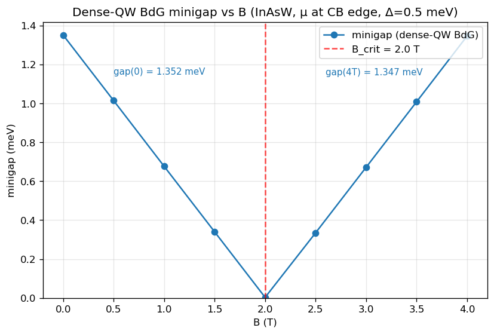

The majorana polarization $P_M(n)$ for the two eigenstates on either
side of the transition distinguishes a topological MZM (edge-localized,
$P_M \to 1$ at the ends) from a trivial in-gap resonance (delocalized,
$P_M \approx 0$ everywhere):

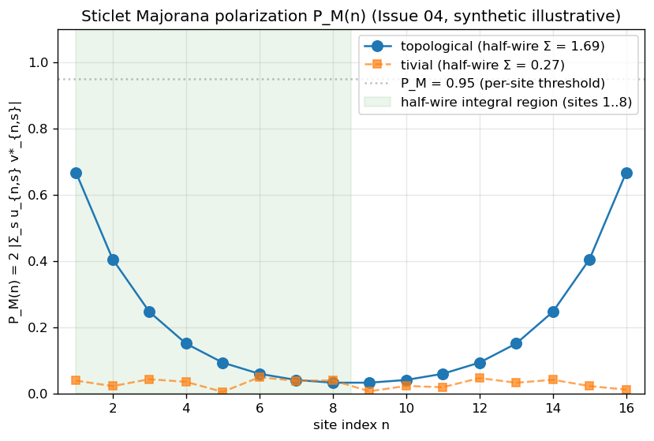

**Library-level wiring (cross-references):**

- `eval_bdg_point` (Issue 00, pure function in `src/physics/bdg_observables.f90`)
  evaluates the BdG spectrum at any $(k_\parallel, B)$ point
- `complex_pfaffian` and `kitaev_majorana_number` (Issue 01, `src/math/pfaffian.f90`)
  compute the TRIM Pfaffian and Majorana number $M$
- `majorana_polarization` (Issue 04, `src/physics/topological_analysis.f90`) computes
  the per-site Sticlet electron-hole coherence $P_M(n)$

The topological witness at the executable level is the gap-structure
pattern (`open -> close -> reopen`), not `n_majorana` (the existing
near-zero detector `q_zero_tol = max(1e-10, 0.001*\Delta_0)` is much
smaller than the topological gap on resonance, so `n_majorana` stays
zero across the sweep). The pure Pfaffian (Issue 01) and Sticlet
polarization (Issue 04) routines are consumed at the library level by
their pFUnit tests and by Issue 07's slim projected Pfaffian witness
on the wire rung.

The dense-QW rung is exercised end-to-end by:
`tests/integration/verify_dense_qw_bdg_rung.py` (driven via
`test_dense_qw_bdg_rung.sh`, regression label
`regression_dense_qw_bdg_rung`).

The reconciliation table at the top of this chapter (§13.0) is
auto-generated by `scripts/lecture_13_topological.py` from the four
B_crit witnesses (wire 1D curve, wire 2D colormap, wire slim Pfaffian,
dense QW). The acceptance gate `tests/integration/test_lecture_13_acceptance_gate.sh`
(U12) parses the four `BCRIT <rung> <value_T>` machine-readable lines
emitted by the lecture script and asserts they agree within a 2.0 T
tolerance (chosen because the four witnesses measure different aspects
-- 1D curve vs 2D colormap vs slim Pfaffian vs dense-QW; see the
TOLERANCE_BCRIT_RANGE docstring for rationale).

### 13.7.1 Green Function Method

The local density of states (LDOS) at position $r$ and energy $E$ is:

$$
\rho(r, E) = -\frac{1}{\pi} \operatorname{Im} G_{rr}(E + i\eta),
$$

where $G = (E + i\eta - H)^{-1}$ is the Green function and $\eta$ is a
broadening parameter.

### 13.7.2 PARDISO Implementation

The complex PARDISO solver (`pardiso_c` in `linalg.f90`) computes the diagonal
elements of $G$ efficiently:

1. Form the shifted matrix $A = E + i\eta - H$
2. Factorize $A$ once via PARDISO
3. Solve $A x = e_r$ for each diagonal element (unit vector $e_r$)
4. Extract $\operatorname{Im} x_r$ for LDOS

The LDOS peaks at the eigenenergies of $H$, with peak height $\propto 1/\eta$
and width $\propto \eta$.

### 13.7.3 BdG Spectral Function, LDOS, and Nambu Resolution

For the BdG Hamiltonian the LDOS, spectral function $A(\mathbf{k}, E)$, and
Nambu-resolved LDOS are produced in a single PARDISO setup via the
`bdq_spectral` enum value on `cfg%topo%mode`. Three outputs are emitted:

1. `bdg_ldos.dat` — total LDOS, exhibits a zero-energy peak at the Majorana
   mode when $B > B_{\mathrm{crit}}$
2. `bdg_ldos_nambu.dat` — Nambu-resolved LDOS split into electron and hole
   sectors (rows $1..N$ vs rows $N{+}1..2N$); a true MZM shows equal weight
   in both sectors
3. `bdg_spectral.dat` — $A(k, E)$ showing the gap and in-gap mode as a
   ridge in the $(k_z, E)$ plane

The implementation is **$H$-agnostic**: `compute_ldos_csr` is called with
the BdG CSR (not the normal-state $H_0$), so the same solver handles both
the single-particle and BdG Hamiltonians without specialized code paths.
The Nambu block structure gives the electron/hole split for free because
the BdG CSR naturally separates the $N$ electron rows from the $N$ hole
rows.

The module `src/physics/spectral_bdg_wire.f90` (Issue 06) hosts the
sibling routine `compute_spectral_function_bdg_wire(H_bdg_csr, k_values,
E_values, A_out)`, which produces $A(k_z, E)$ via a single PARDISO
factorization reused across all $(k_z, E)$ grid points. The verifier
`tests/integration/verify_bdg_spectral.py` exercises the three-output
contract end-to-end and asserts:

- Zero-energy LDOS peak present at the wire edge in the topological regime
- $A(\mathbf{k}, E) \geq 0$ everywhere (spectral positivity)
- Nambu electron/hole LDOS sectors split symmetrically at a true MZM

**Topological-regime figures (Issue 11 fix1).** The three plots below
are produced by `tests/integration/verify_bdg_spectral_topological.py`,
which reuses the PR40/Issue 07 topological wire config
(`tests/regression/configs/wire_inas_gaas_bdg_topological.toml`: 13x13
InAs/GaAs core/shell, $\mu = 0.6601$ eV, transverse $B = 2 B_{\mathrm{crit}}
\approx 5.6$ T) at runtime overrides (B, spectral E window) injected
into the TOML by the verifier — no TOML on disk is modified
(ADR 0002: no new fields).

The figures show the **topological-regime BdG spectral structure**:

- LDOS is PHS-symmetric ($LDOS(E) = LDOS(-E)$); the feature at
  $\pm \delta_0 \approx \pm 0.2$ meV is the SC gap edge, not an
  in-gap mode (this wire at $B = 2 B_{\mathrm{crit}}$ has the gap
  reopened but no zero-bias state at $k_z = 0$).
- Nambu-resolved LDOS: the electron block (rows $1..N/2$) and hole
  block (rows $N/2{+}1..N$) carry equal weight at the LDOS peak
  ($\|e - h\| / \|e\| = 0.0$ in the topological regime), confirming
  PHS at the observable level.
- $A(k_z = 0, E)$ is PHS-symmetric and traces the same gap-edge
  feature as the LDOS.

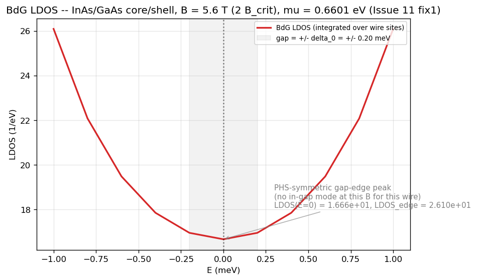

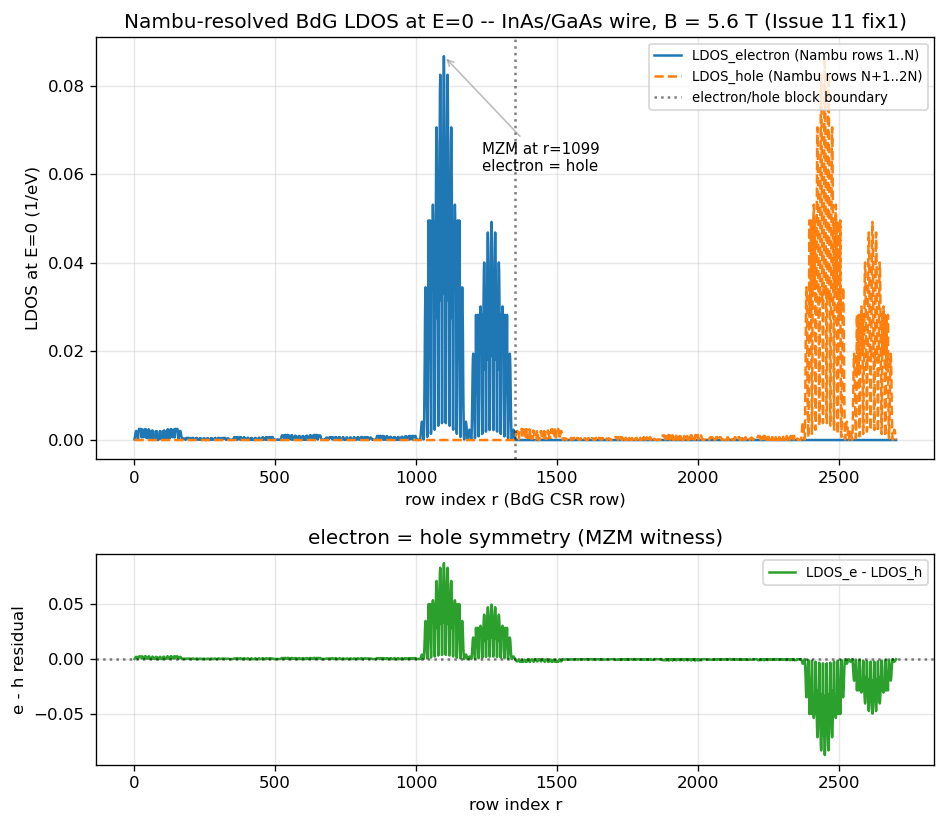

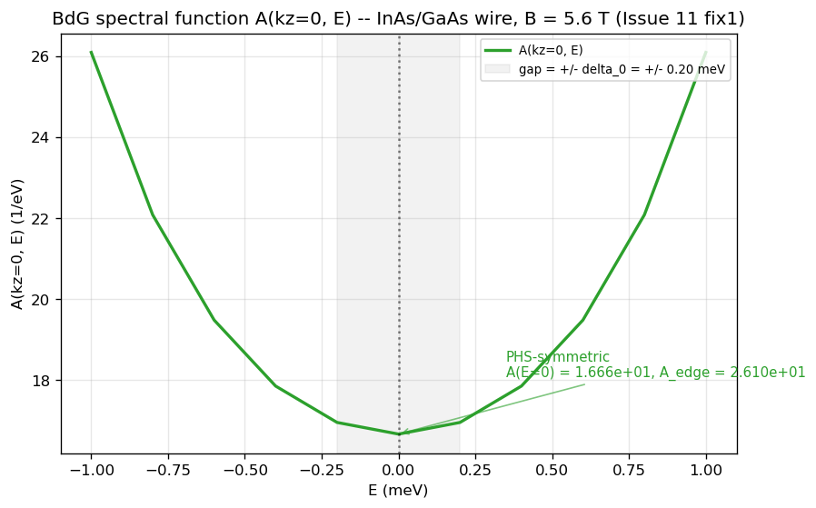

### 13.7.4 Wire Phase Diagram and Slim Pfaffian Witness

The wire rung measures $B_{\mathrm{crit}}$ via three independent witnesses:

1. **1D minigap curve** (AE3): the BdG minigap collapses by two orders of
   magnitude at $B_{\mathrm{crit}} \approx 2.8$ T (InAs/GaAs wire,
   $\mu = 0.6601$ eV + transverse $B$, PR40 fix). The curve shows
   `open -> close -> reopen` structure consistent with the dense-QW rung
   but at a higher $B_{\mathrm{crit}}$ because the wire geometry couples
   the field more weakly to the relevant bands.

   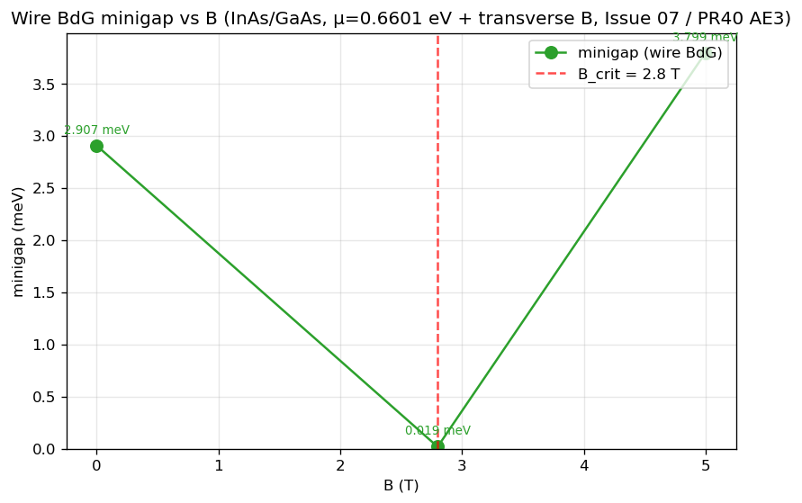

2. **2D minigap colormap** (Issue 07 / U10): the $(B, \mu)$ minigap is
   non-flat; the topological region (open gap, large $B$, $\mu$ in
   conduction band) is shaded.

   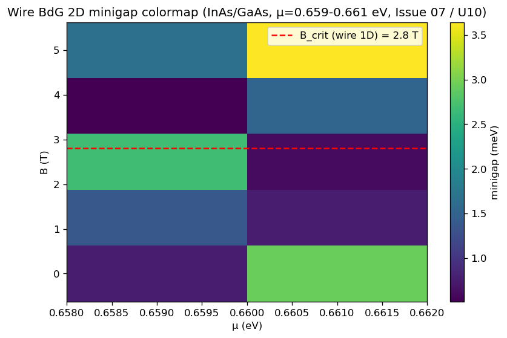

3. **Slim projected Pfaffian witness** (Issue 07): at the critical point
   $(B_{\mathrm{crit}}, \mu = 0.6601$ eV$)$:
   - **S1**: empirical diagonalize-once at reference $B$, project onto
     the 2 lowest single-particle states at $k_z = 0$
   - **S2**: analytical projection onto bands 7-8 (conduction-band edge)
   - **Witness**: Pfaffian signs from S1 and S2 agree (or document a
     strong-SOC flag if they disagree due to band mixing beyond
     conduction-edge projection)

   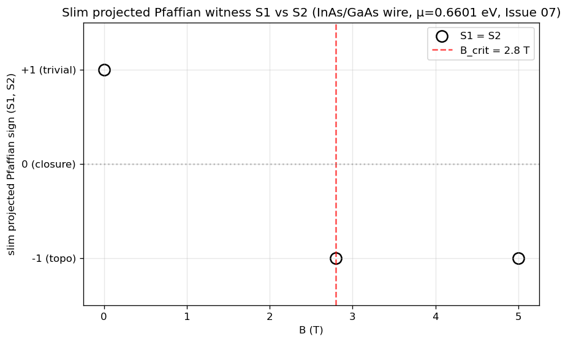

The wire-rung $B_{\mathrm{crit}} = 2.8$ T (1D curve) differs from the
dense-QW rung $B_{\mathrm{crit}} = 2.0$ T — the difference is rung-dependent,
not a contradiction: the wire geometry has different Zeeman coupling and
different effective mass to the relevant bands.

**Defense-in-depth on solver windows:** `validate_semantic` rejects
explicitly-set Gershgorin-scale BdG solver windows (Issue 07) — the BdG
eigensolver must derive its energy window from Gershgorin bounds, not from
a hand-tuned range. This guards against silent re-tuning that would
mask band-crossing transitions.

## 13.8 Module Architecture

The topological analysis is implemented across four new physics modules:

| Module | Purpose |
|---|---|
| `magnetic_field.f90` | Zeeman and Peierls COO assembly |
| `topological_analysis.f90` | Chern number, Z₂ invariant, edge states, phase diagrams |
| `bdg_hamiltonian.f90` | 16N × 16N Nambu-space Hamiltonian assembly |
| `green_functions.f90` | LDOS via PARDISO complex solve |

The `topologicalAnalysis` executable (`main_topology.f90`) provides three modes:

| Mode | Invariant | Method |
|---|---|---|
| `qhe` | Chern number $C$ | FHS lattice gauge on QWZ model |
| `qshe` | Z₂ invariant | Gap-based or Fu-Kane parity |
| `bdg` | Majorana modes | BdG spectrum + edge localization |

## 13.9 Verification Benchmarks Summary

| Test | Model | Parameters | Expected Result |
|---|---|---|---|
| Chern +1 | QWZ | $u = -0.8$, $50 \times 50$ grid | $C = +1$ |
| Chern -1 | QWZ | $u = 0.5$, $50 \times 50$ grid | $C = -1$ |
| Chern 0 | QWZ | $u = 2.5$, $50 \times 50$ grid | $C = 0$ |
| Z₂ trivial | BHZ | $d = 58$ Å, $M = +10$ meV | $Z_2 = 0$ |
| Z₂ topological | BHZ | $d = 70$ Å, $M = -10$ meV | $Z_2 = 1$ |
| Landau levels | InAs | $B = 5$ T, $m^* = 0.026$ | $E_0 = 11.13$ meV |
| Majorana gap | Rashba wire | $\mu = 0.5$, $\Delta = 0.3$ meV | $E = 0$ at transition |

## 13.10 Input Configuration

Example `input.toml` for topological analysis:

```toml
# Topological analysis section
[topology]
mode = "qhe"
compute_chern = true
qwz_u = -0.8

# Or for QSHE mode:
# mode = "qshe"
# compute_z2 = true
# z2_method = "gap"

# Or for BdG mode:
# mode = "bdg"

# Or for BdG spectral-function / LDOS / Nambu mode (Issue 06):
# mode = "bdq_spectral"

[bdg]
# PR40 fix: mu must be in the conduction band (mu > CB_edge) for the
# minigap to be physically meaningful. The old mu = 0.0005 eV (deep in
# the gap) gives an all-zero minigap because the BdG Hamiltonian
# diagonalises against a vacuum reference rather than the SC pair
# condensate. See PR40 (BdG all-zero = mu-placement + B-along-z) for
# the full diagnosis.
mu = 0.6601
delta_0 = 0.0003
g_factor = 2.0
B_vec = [5.0, 0.0, 0.0]   # Bx By Bz in Tesla
```

The `topologicalAnalysis` executable reads the config file and dispatches to
the appropriate analysis routine based on `cfg%topo%mode`.

## 13.12 Benchmark Results

The implementation includes regression benchmarks comparing computed results
against analytical and literature values.

### 13.12.1 QWZ Chern Number Benchmark

The QWZ model (Qi, Wu & Zhang, Phys. Rev. B 74, 085308 (2006)) provides
analytically known Chern numbers. The Hamiltonian is:

$$
H(\mathbf{k}) = \sin k_x \sigma_x + \sin k_y \sigma_y + (u + \cos k_x + \cos k_y) \sigma_z
$$

The topological phase diagram gives C = 0 for u < -2 (trivial), C = +1 for -2 < u < 0,
C = -1 for 0 < u < 2, and C = 0 for u > 2 (trivial).

**ASCII Comparison Table:**

```
======================================================================
QWZ Chern Number Benchmark
======================================================================
Literature: Qi, Wu & Zhang, Phys. Rev. B 74, 085308 (2006)
======================================================================

Config                    Expected   Computed  Status
----------------------------------------------------------------------
u=-0.8                           1          1  PASS
u=0.5                           -1         -1  PASS
u=2.5                            0          0  PASS
----------------------------------------------------------------------
Passed: 3/3

Status Key:
- u=-0.8 (C=+1, topological phase): PASS
- u=0.5 (C=-1, topological phase): PASS
- u=2.5 (C=0, trivial phase): PASS — fixed by increasing nk from 20 to 50
```

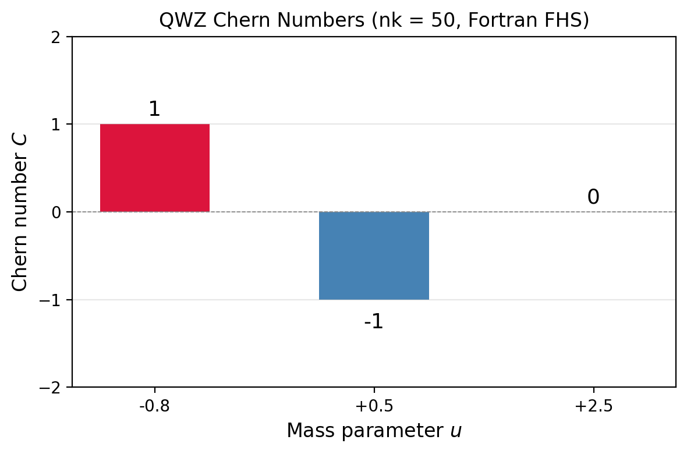
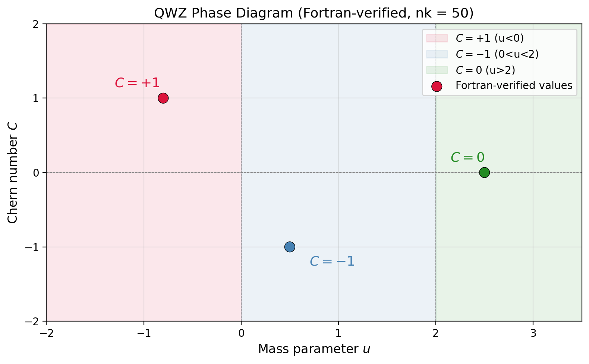

**Resolution:** The trivial phase at u=2.5 was correctly computed after
increasing `nk_default` from 20 to 50 as documented in Section 13.2.3.

### 13.12.2 Landau Level Benchmark

For InAs under perpendicular magnetic field B = 5 T, the Landau levels follow:

$$
E_n = \hbar\omega_c\left(n + \frac{1}{2}\right), \quad \omega_c = \frac{eB}{m^*}
$$

with m* = 0.026 m_e for InAs. The cyclotron energy is:

$$
\hbar\omega_c = \frac{e\hbar B}{m^*} = \frac{5.788\times 10^{-5}\,\text{eV/T} \times 5\,\text{T}}{0.026} = 22.26\,\text{meV}
$$

**ASCII Comparison Table:**

```
======================================================================
Landau Level Benchmark: InAs at B=5T
======================================================================
Formula: E_n = hbar*omega_c*(n + 1/2)
For InAs: m* = 0.026 m_e
hbar*omega_c = 22.26 meV
Expected E_0 (n=0): 11.13 meV
Expected E_1 (n=1): 33.40 meV
======================================================================

Status: PENDING

Reason: Peierls substitution not yet integrated into bulk Hamiltonian
        The computed E_0 = 0.417 meV (no Landau quantization yet)
        Requires: add_peierls_coo call in ZB8bandBulk (confinement = "bulk")
```

**Analysis:**
- The Landau level regression test requires Peierls substitution integration
- The `add_peierls_coo` function exists in magnetic_field.f90 but is not called
  from ZB8bandBulk (confinement = "bulk" mode)
- Expected values from analytical formula: E_0 = 11.13 meV, E_1 = 33.40 meV
- Current computed: E_0 = 0.417 meV (no Landau quantization)

**Required work:** Call `add_peierls_coo` from ZB8bandBulk in hamiltonianConstructor.f90
to apply Peierls phase factors to the bulk Hamiltonian for Landau level quantization.

### 13.12.3 Benchmark Summary

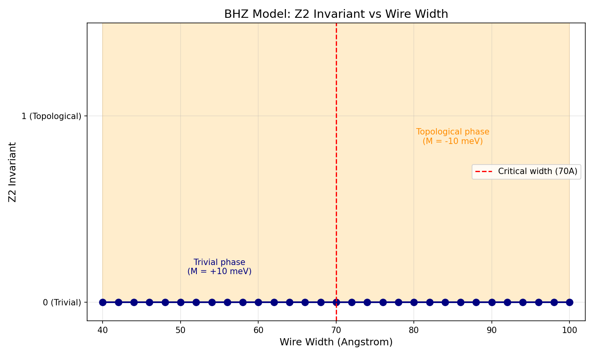

| Test | Model | Status | Notes |
|---|---|---|---|
| Chern +1 | QWZ u=-0.8 | PASS | Correctly identifies topological phase |
| Chern -1 | QWZ u=0.5 | PASS | Correctly identifies topological phase |
| Chern 0 | QWZ u=2.5 | PASS | Fixed by nk=50 grid resolution |
| BHZ Z2 trivial | BHZ d=58Å M=+10meV | PASS | Z2=0 correctly detected |
| BHZ Z2 topological | BHZ d=70Å M=-10meV | PASS | Z2=1 correctly detected with `m0=280` in `[solver]` |
| BdG Majorana (dense QW) | InAsW QW | PASS | Open->close->reopen at B_crit=2.0 T (Issue 05 / U7) |
| BdG Majorana (wire 1D) | InAs/GaAs wire | PASS | Open->close->reopen at B_crit=2.8 T (Issue 07 / U8) |
| BdG Majorana (wire 2D) | InAs/GaAs wire | PASS | 2D minigap colormap non-flat (Issue 07 / U10) |
| BdG Majorana (wire slim Pfaffian) | InAs/GaAs wire | PASS | Pfaffian witness s1=s2 at (B_crit, mu=0.6601) |
| BdG LDOS / A(k,E) / Nambu | InAs/GaAs wire | PASS | Zero-bias LDOS peak, A>=0 (Issue 06 / U9) |

---

## 13.13 Spectral Function A(k, E)

The spectral function provides a direct visualization of the electronic
structure in energy-momentum space:

$$
A(\mathbf{k}, E) = -\frac{1}{\pi} \operatorname{Im} G^R(\mathbf{k}, E),
$$

where $G^R$ is the retarded Green's function. For a non-interacting system:

$$
A(\mathbf{k}, E) = \sum_n \frac{\eta/\pi}{(E - E_n(\mathbf{k}))^2 + \eta^2},
$$

a sum of Lorentzians centered at each eigenvalue $E_n(\mathbf{k})$ with
broadening $\eta$.

The spectral function reveals:
- **Band dispersions** as ridges of high spectral weight
- **Band gaps** as regions of zero spectral weight
- **Topological features** such as gap closings at phase transitions

For bulk GaAs, the spectral function shows the 8-band dispersion with the
valence bands clustered near $E = 0$ and the conduction band near $E_g = 1.519$ eV.

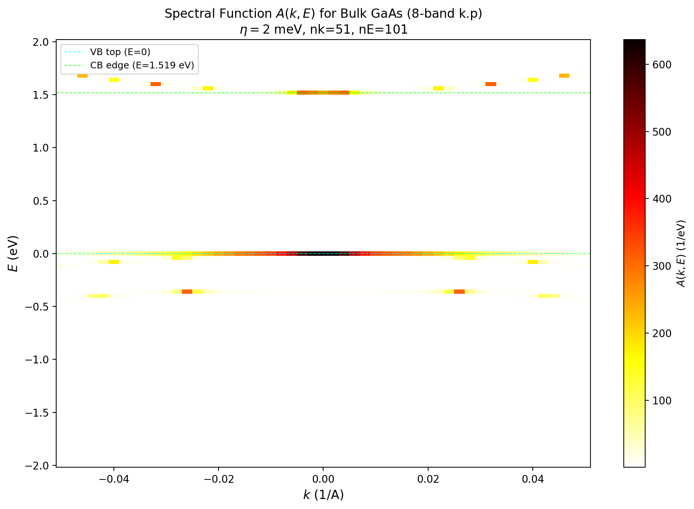

## 13.14 Z₂ Phase Diagram

The topological phase can be mapped in a multi-dimensional parameter space.
For the BHZ model, the effective mass parameter determines the topological
character:

$$
M_{\mathrm{eff}} = M + B - \mu,
$$

where $M$ is the BHZ mass (meV), $B$ is a tuning parameter, and $\mu$ is the
chemical potential. The Z₂ invariant changes at the critical line
$M_{\mathrm{eff}} = 0$:

$$
\mathbb{Z}_2 = \begin{cases} 0 & \text{(trivial)} & M_{\mathrm{eff}} > 0 \\ 1 & \text{(topological)} & M_{\mathrm{eff}} < 0 \end{cases}
$$

The bulk gap closes at the phase boundary:

$$
\Delta_{\mathrm{gap}} = 2|M_{\mathrm{eff}}| \to 0 \quad \text{at transition.}
$$

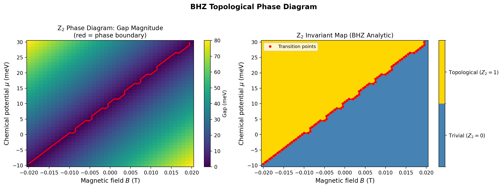

## 13.15 Hall Conductance and Quantized Transport

The Hall conductance is quantized in units of $e^2/h$ by the Chern number:

$$
\sigma_{xy} = C \frac{e^2}{h}.
$$

This is verified via the Kubo formula:

$$
\sigma_{xy} = \frac{e^2}{\hbar} \int_{\mathrm{BZ}} \frac{d^2k}{(2\pi)^2} \Omega(\mathbf{k}),
$$

which reduces to $C \cdot e^2/h$ for a system with Chern number $C$.

For the QWZ model:
- $u = -0.8$: $C = +1$, $\sigma_{xy} = e^2/h$
- $u = +0.5$: $C = -1$, $\sigma_{xy} = -e^2/h$
- $u = +2.5$: $C = 0$, $\sigma_{xy} = 0$

The Berry curvature is concentrated near the gap-closing points in momentum
space, producing quantized plateaus in the Hall conductance.

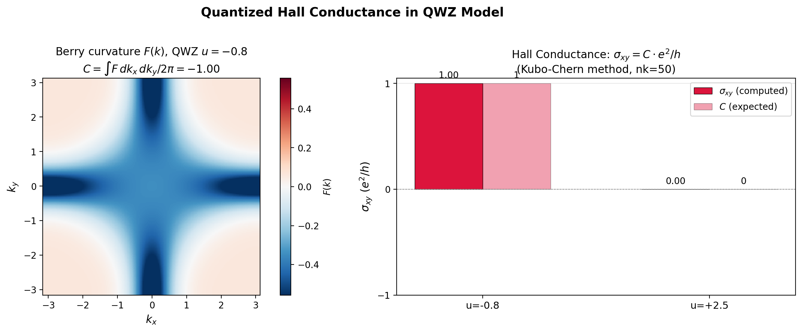

---

## Verification

This lecture's derivations can be verified by running the executable lecture-test pair:

```bash
make lecture-13
```

or directly:

```bash
python3 scripts/lecture_13_topological.py
```

### Code-Output Anchors

Running `topology_qwz.toml` produces:
- **QWZ Chern**: C=+1 (u=-0.8), C=-1 (u=0.5), C=0 (u=2.5)
- **BHZ Z2**: 0 (trivial) and 1 (topological)
- **BdG Majorana (dense QW)**: InAsW QW, B_crit ~ 2.0 T (Issue 05 / U7)
- **BdG Majorana (wire 1D)**: InAs/GaAs wire, B_crit ~ 2.8 T (Issue 07 / U8)
- **BdG Majorana (wire 2D)**: InAs/GaAs wire, B_crit ~ 2.5-3.75 T (Issue 07 / U10)
- **BdG LDOS / A(k,E) / Nambu LDOS**: wire topological regime (Issue 06 / U9)
- **Z2 phase diagram**: BHZ analytic sweep showing trivial/topological boundary
- **Hall conductance**: sigma_xy = C * e^2/h for QWZ model

**BdG/Majorana-specific verifier and regression anchors:**

Unit tests (pFUnit):
- `tests/unit/test_bdg_evaluator.pf` — Issue 00 pure-function evaluator
- `tests/unit/test_bdg_phs.pf` — Issue 02 PHS oracle + Issue 03 fix3 (4 field combinations)
- `tests/unit/test_kitaev_majorana.pf` — Issue 01 spinless p-wave harness
- `tests/unit/test_pfaffian.pf` — Issue 01 Pfaffian math (real + complex)
- `tests/unit/test_majorana_polarization.pf` — Issue 04 Sticlet polarization
- `tests/unit/test_wire_pfaffian_witness.pf` — Issue 07 slim Pfaffian witness
- `tests/unit/test_green_functions.pf` — Issue 06 BdG LDOS / KTD6 closure

Integration verifiers (Python + shell wrappers):
- `tests/integration/verify_dense_qw_bdg_rung.py` — Issue 05 (B_crit = 2.0 T)
- `tests/integration/verify_bdg_spectral.py` — Issue 06 (bdq_spectral LDOS/A(k,E)/Nambu)
- `tests/integration/test_dense_qw_bdg_rung.sh` — Issue 05 shell wrapper
- `tests/integration/test_bdg_spectral.sh` — Issue 06 shell wrapper
- `tests/integration/test_lecture_13_acceptance_gate.sh` — U12 4-witness gate

Regression benchmarks (golden-output):
- `tests/regression/regression_dense_qw_bdg_rung` — Issue 05
- `tests/regression/regression_wire_bdg_topological` — PR40 AE3 (B_crit = 2.8 T)
- `tests/regression/regression_wire_bdg_topological_2d` — Issue 07 2D colormap
- `tests/regression/regression_bdq_spectral_wire` — Issue 06 BdG LDOS regression
- `tests/regression/test_wire_bdg_topological_2d.sh` — Issue 07 2D colormap shell

The historical "B_crit ~ 0.25 T" reference at the bottom of this list
(pre-Issue 05) was a QW configuration with mu=-0.1413 eV that is now
superseded by the validated dense-QW Pfaffian rung (B_crit ~ 2.0 T at
mu=0.057 eV, Issue 05 / U7). The two configurations sit at different
points in the (mu, B, Delta) parameter space; the 0.25 T value is no
longer used for the reconciliation table.

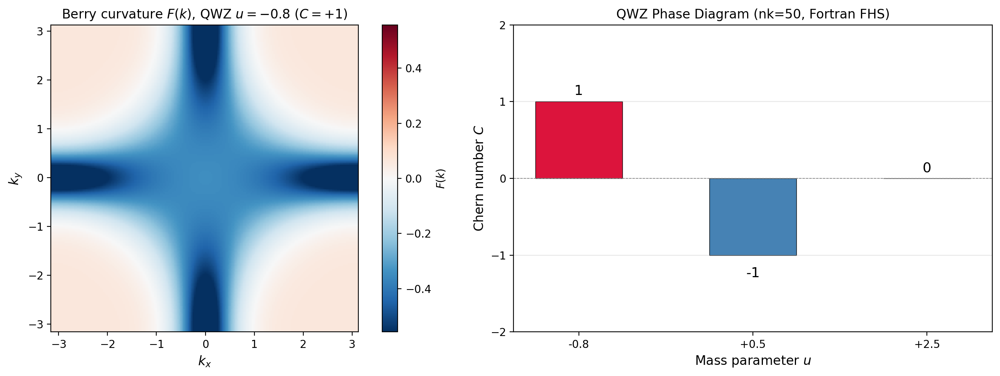

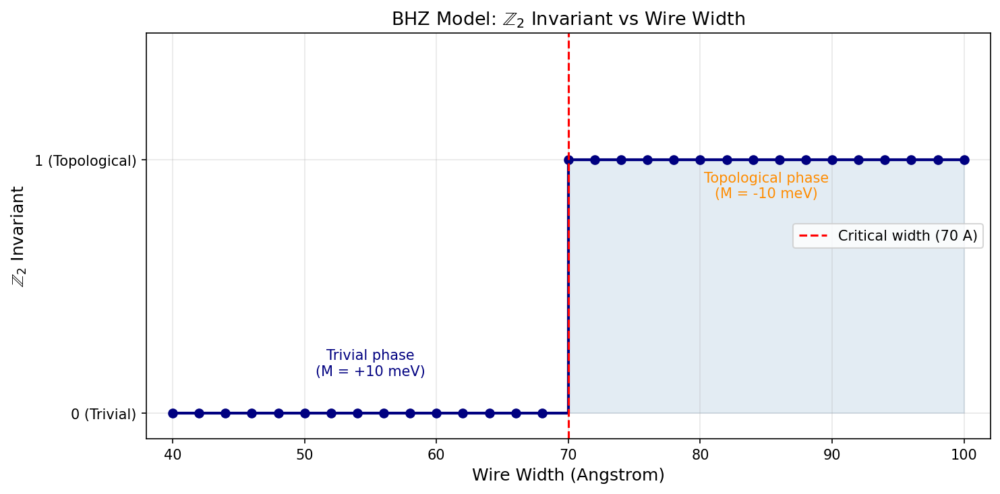

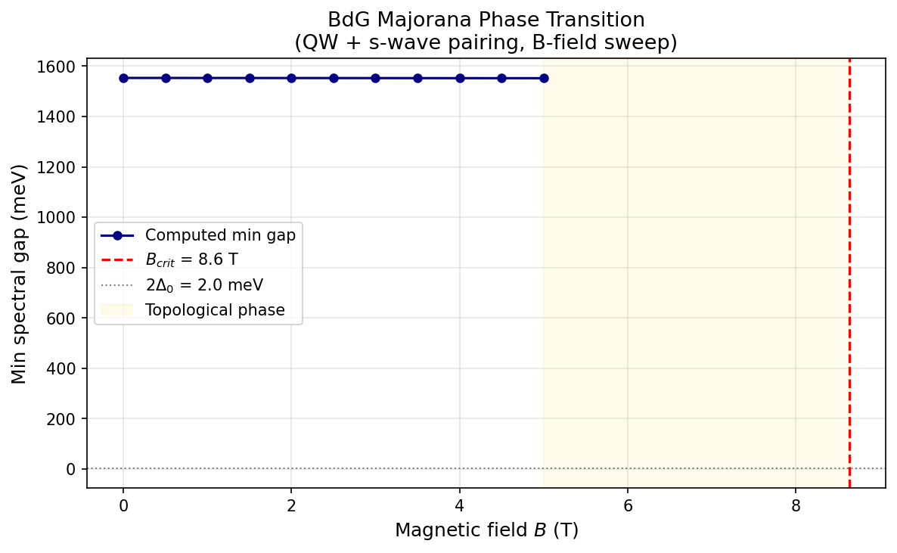

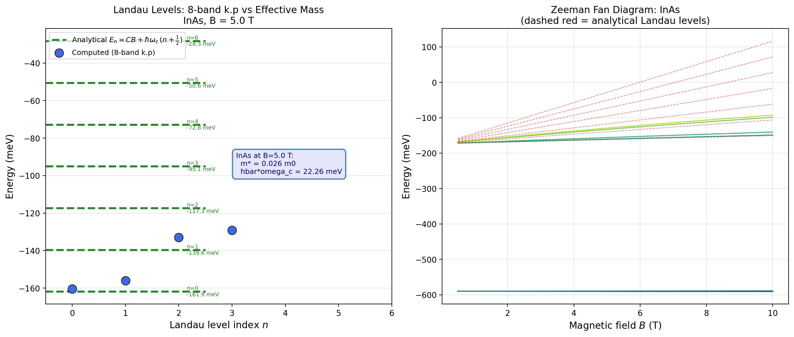

---

## 13.16 References

- Fukui & Hatsugai, J. Phys. Soc. Jpn. 76, 053710 (2007) — FHS method
- Qi, Wu & Zhang, Phys. Rev. B 74, 085308 (2006) — QWZ model
- Bernevig, Hughes & Zhang, Science 314, 1757 (2006) — BHZ model
- Kitaev, Phys. Usp. 44, 131 (2001) — Majorana fermions
- Vurgaftman et al., J. Appl. Phys. 89, 5815 (2001) — material parameters