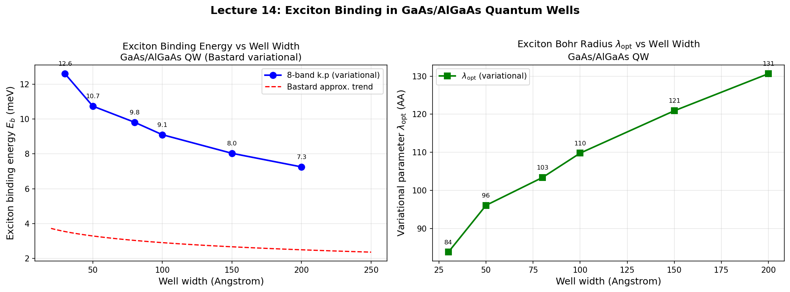
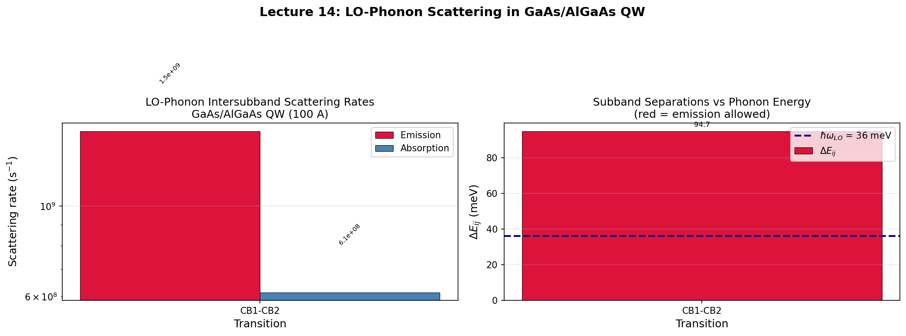

# Chapter 14: Excitons and Phonon Scattering

## 14.1 Introduction

In Chapters 1--6 we treated the optical properties of semiconductors within the
single-particle picture: electrons and holes occupy band states independently,
and optical transitions occur between these independent states. Two important
many-body effects modify this picture:

1. **Excitons** -- Coulomb-bound electron-hole pairs that produce discrete
   hydrogen-like levels below the band gap and enhance absorption near the
   band edge.
2. **Phonon scattering** -- Inelastic scattering of carriers by longitudinal
   optical (LO) phonons via the Froehlich interaction, which determines
   carrier relaxation rates and lifetime broadening.

This chapter derives the theory behind both effects and presents computed
examples for GaAs/AlGaAs quantum wells.

---

## 14.2 Exciton Theory

### 14.2.1 The exciton problem

An electron promoted to the conduction band and the hole left behind in the
valence band attract each other via the Coulomb interaction:

$$
V(r) = -\frac{e^2}{4\pi\varepsilon_0 \varepsilon_r r},
$$

where $\varepsilon_r$ is the static dielectric constant. This creates a
hydrogen-like bound state -- the exciton -- with energy below the free-particle
band gap.

### 14.2.2 2D exciton: Bastard variational method

In a quantum well, the exciton is confined in the growth direction $z$ but
free in the plane. Following Bastard (PRB 1982), we use a variational approach
with a 2D hydrogenic trial function for the in-plane relative coordinate
$\rho$:

$$
\phi(\rho) = \sqrt{\frac{2}{\pi\lambda^2}} \exp\left(-\frac{\rho}{\lambda}\right),
$$

where $\lambda$ is the variational parameter (effective Bohr radius in the
plane).

The total exciton energy is:

$$
E_{\text{tot}}(\lambda) = E_g^{\text{QW}} + \langle T_\parallel \rangle
+ \langle V_{\text{Coulomb}} \rangle,
$$

where:

- $\langle T_\parallel \rangle = \frac{\hbar^2}{2\mu_\parallel \lambda^2}$
  is the in-plane kinetic energy with reduced mass $\mu_\parallel$,

- $\langle V_{\text{Coulomb}} \rangle = -\frac{e^2}{4\pi\varepsilon_0
  \varepsilon_r} \langle 1/r \rangle$ is the Coulomb attraction averaged over
  the electron and hole envelope functions.

The binding energy is:

$$
E_b = -\min_\lambda E_{\text{tot}}(\lambda) + E_g^{\text{QW}}.
$$

For a purely 2D hydrogen atom, the binding energy is $4 \times$ the 3D Rydberg:

$$
E_b^{2D} = \frac{4\mu_\parallel}{m_0 \varepsilon_r^2} \times 13.6 \text{ eV}.
$$

In a real quantum well, the finite well width and penetration of the envelope
functions into the barrier reduce the binding energy below this limit.

### 14.2.3 Well-width dependence

The exciton binding energy depends on the well width $L$:

- **Narrow wells** ($L \ll a_B^*$): The electron and hole are squeezed together,
  enhancing the Coulomb interaction. However, the reduced overlap with barrier
  material changes the effective dielectric screening. The binding energy
  approaches the 3D barrier value.
- **Wide wells** ($L \gg a_B^*$): The exciton behaves like a bulk exciton in
  the well material. The binding energy approaches the 3D well value.
- **Intermediate wells** ($L \sim a_B^*$): The binding energy reaches a maximum
  above both bulk limits due to the quasi-2D confinement enhancement.

For GaAs with $\varepsilon_r = 12.9$ and $\mu \approx 0.06\,m_0$:

$$
R^* = \frac{\mu}{m_0 \varepsilon_r^2} \times 13.6 \text{ eV} \approx 4.9 \text{ meV}, \quad a_B^* \approx 110 \text{ \AA}.
$$

### 14.2.4 Sommerfeld enhancement

Above the band gap, the Coulomb interaction still enhances the absorption
through the Sommerfeld factor:

$$
S(E) = \frac{2}{1 + \exp(-2\pi/\sqrt{E/E_b})},
$$

which diverges as $E \to 0$ and approaches 2 for $E \gg E_b$. This enhances
the continuum absorption by a factor of $\sim 2$ near the band edge.

### 14.2.5 Computed example



The figure shows the variational exciton binding energy for GaAs/Al$_{0.3}$Ga$_{0.7}$As
quantum wells of widths 30--200 A. The binding energy decreases with well width
as the exciton transitions from quasi-2D to quasi-3D behavior.

---

## 14.3 Phonon Scattering

### 14.3.1 Froehlich interaction

In polar semiconductors like GaAs, the longitudinal optical (LO) phonon creates
a macroscopic electric field that couples to electrons via the Froehlich
interaction. The scattering potential is:

$$
V_{\text{Fr}}(\mathbf{q}) = i \left(\frac{2\pi e^2 \hbar\omega_{\text{LO}}}{V}
\left(\frac{1}{\varepsilon_\infty} - \frac{1}{\varepsilon_0}\right)
\right)^{1/2} \frac{1}{q},
$$

where $\omega_{\text{LO}}$ is the LO phonon frequency, $\varepsilon_\infty$ is
the high-frequency dielectric constant, and $\varepsilon_0$ is the static
dielectric constant.

### 14.3.2 Intersubband scattering rates

The scattering rate for an electron in subband $i$ to scatter to subband $j$
via LO phonon emission is (Ferreira & Bastard, PRB 40, 1074, 1989):

$$
\Gamma_{i \to j}^{\text{em}} = \frac{e^2 \omega_{\text{LO}}}{2\hbar}
\left(\frac{1}{\varepsilon_\infty} - \frac{1}{\varepsilon_0}\right)
\frac{(1 + 2N_{\text{ph}})}{2} I_{ij} \, \Theta(\Delta E_{ij} - \hbar\omega_{\text{LO}}),
$$

where:

- $N_{\text{ph}} = [\exp(\hbar\omega_{\text{LO}}/k_BT) - 1]^{-1}$ is the
  Bose-Einstein phonon occupation,
- $I_{ij}$ is the form factor (overlap integral of the envelope functions),
- $\Theta$ is the Heaviside step function (emission only when
  $\Delta E_{ij} > \hbar\omega_{\text{LO}}$).

The absorption rate is:

$$
\Gamma_{i \to j}^{\text{abs}} = \frac{e^2 \omega_{\text{LO}}}{2\hbar}
\left(\frac{1}{\varepsilon_\infty} - \frac{1}{\varepsilon_0}\right)
\frac{N_{\text{ph}}}{2} I_{ij}.
$$

### 14.3.3 GaAs parameters

For GaAs:

| Parameter | Value |
|---|---|
| $\hbar\omega_{\text{LO}}$ | 36 meV |
| $\varepsilon_\infty$ | 10.9 |
| $\varepsilon_0$ | 12.9 |
| $(1/\varepsilon_\infty - 1/\varepsilon_0)$ | 0.0142 |

The Froehlich coupling constant $\alpha \approx 0.068$ for GaAs -- weak
coupling, perturbation theory is valid.

### 14.3.4 Computed example



The figure shows the LO-phonon intersubband scattering rates for a 100 A
GaAs/Al$_{0.3}$Ga$_{0.7}$As QW at $T = 300$ K. Emission rates are larger
than absorption rates at room temperature because spontaneous emission
($N_{\text{ph}} + 1$) exceeds absorption ($N_{\text{ph}}$). Only transitions
with subband separation $\Delta E > \hbar\omega_{\text{LO}} = 36$ meV can
emit phonons.

---

## Verification

This lecture's derivations can be verified by running the executable lecture-test pair:

```bash
python3 scripts/lecture_14_excitons_scattering.py
```

### Code-Output Anchors

Running `lecture_14_excitons_scattering.py` produces:
- **Exciton binding energy**: Eb = 7--13 meV for GaAs QWs (30--200 A widths), decreasing with width
- **Phonon scattering rates**: Emission rates $10^{9}$--$10^{12}$ s$^{-1}$ for transitions with $\Delta E > 36$ meV


---

## 14.4 References

- Bastard, PRB 25, 758 (1982) -- variational exciton in quantum wells
- Ferreira & Bastard, PRB 40, 1074 (1989) -- intersubband scattering rates
- Vurgaftman et al., J. Appl. Phys. 89, 5815 (2001) -- material parameters
- Miller et al., PRL 53, 2173 (1984) -- excitonic absorption in QWs
- Froehlich, Adv. Phys. 3, 325 (1954) -- polaron theory
