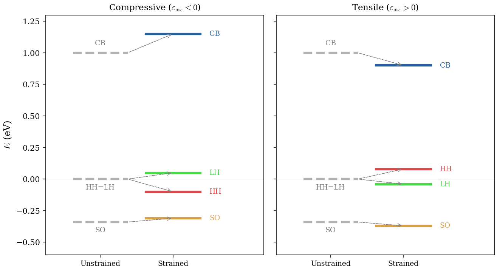
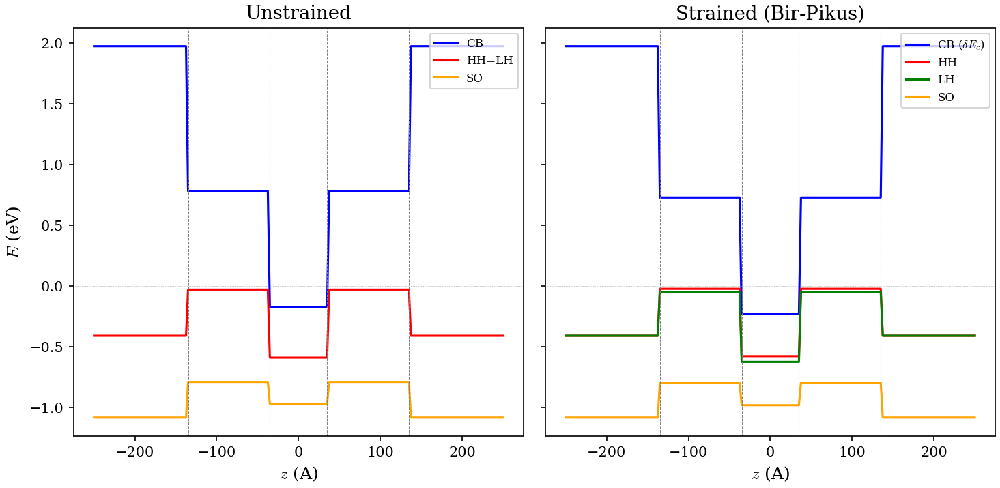
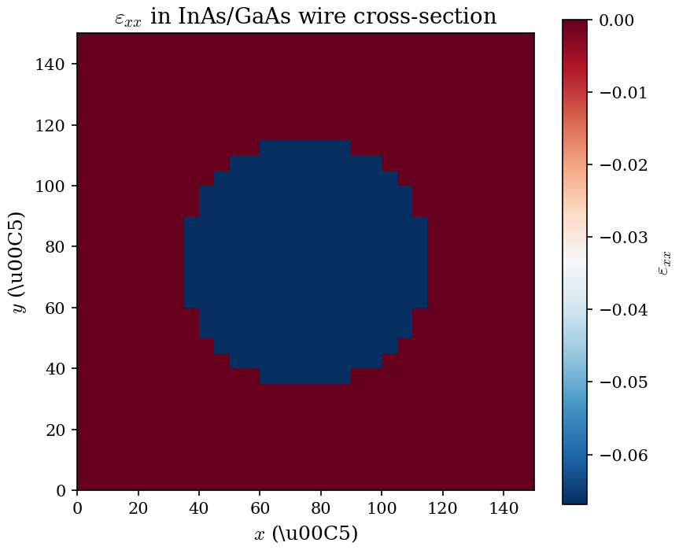

# Ch04 Strain Figures Implementation Plan

> **For Claude:** REQUIRED SUB-SKILL: Use superpowers:executing-plans to implement this plan task-by-task.

**Goal:** Add 7 figures to the strain chapter — 3 schematics (matplotlib drawings), 2 from simulation data, 2 existing figures that just need markdown references.

**Architecture:** Add 5 new figure functions to `scripts/plotting/generate_all_figures.py`. Create 1 new wire config for the 2D strain colormap. Add `![...]` references throughout `docs/lecture/04-strain.md`. Update the code reference table for the renamed API.

**Tech Stack:** Python 3 (matplotlib, numpy), Fortran executables, gnuplot-format data parsing

---

### Task 1: Add figure references for existing strain figures (Figs 1-2)

**Files:**
- Modify: `docs/lecture/04-strain.md`

**Step 1: Add Figure 1 reference in Sec 3.1**

After line 184 (end of Sec 3.1 intro paragraph), add:

```markdown
{ width=70% }
```

**Step 2: Add Figure 2 reference in Sec 3.3**

After line 239 (end of the HH/LH splitting paragraph), add:

```markdown
{ width=90% }
```

**Step 3: Update code reference table (Sec 9)**

At line 758, change `apply_pikus_bir` to `compute_bir_pikus_blocks` and add `bir_pikus_blocks_free`:

```markdown
| `compute_bir_pikus_blocks` | `src/physics/strain_solver.f90` | Bir--Pikus shifts to structured output |
| `bir_pikus_blocks_free` | `src/physics/strain_solver.f90` | Free Bir--Pikus arrays |
| `compute_bp_scalar` | `src/physics/strain_solver.f90` | Pure function: BP shifts for single point |
```

**Step 4: Commit**

```bash
git add docs/lecture/04-strain.md
git commit -m "docs: add strain figure references and update code reference table"
```

---

### Task 2: Lattice mismatch schematic (Fig 5)

**Files:**
- Modify: `scripts/plotting/generate_all_figures.py`
- Modify: `docs/lecture/04-strain.md`

**Step 1: Write figure function**

Add to `generate_all_figures.py` after the existing strain functions (after `fig_bulk_gaas_strain_comparison`):

```python
def fig_strain_lattice_mismatch(output_dir: Path) -> None:
    """strain_lattice_mismatch.png: schematic of pseudomorphic strain."""
    print("[figure] strain_lattice_mismatch")
    fig, (ax_free, ax_pseudo) = plt.subplots(1, 2, figsize=(8, 4))

    # Left: free-standing layers with different lattice constants
    ax_free.set_title("Free-standing", fontsize=11)
    a_sub = 1.0    # substrate lattice constant (reference)
    a_layer = 1.15  # epitaxial layer (larger, e.g. InAs on GaAs)

    # Substrate grid (bottom half)
    for ix in range(6):
        for iy in range(3):
            rect = plt.Rectangle((ix * a_sub, iy * a_sub), a_sub * 0.85, a_sub * 0.85,
                                 facecolor="#4a90d9", edgecolor="white", alpha=0.7)
            ax_free.add_patch(rect)
    ax_free.text(3 * a_sub, -0.5, "Substrate ($a_{sub}$)", ha="center", fontsize=9)

    # Layer grid (top half, larger spacing)
    for ix in range(5):
        for iy in range(3):
            rect = plt.Rectangle((ix * a_layer + 0.3, iy * a_layer + 3.5),
                                 a_layer * 0.85, a_layer * 0.85,
                                 facecolor="#d94a4a", edgecolor="white", alpha=0.7)
            ax_free.add_patch(rect)
    ax_free.text(3 * a_layer, 7.2, "Layer ($a_0 > a_{sub}$)", ha="center", fontsize=9)

    # Dashed line showing interface
    ax_free.axhline(3.3, color="grey", linestyle="--", linewidth=0.8)
    ax_free.set_xlim(-0.3, 6.5)
    ax_free.set_ylim(-1, 8)
    ax_free.set_aspect("equal")
    ax_free.axis("off")

    # Right: pseudomorphic (forced to match)
    ax_pseudo.set_title("Pseudomorphic", fontsize=11)
    a_match = a_sub  # layer forced to match substrate

    # Substrate grid (same as left)
    for ix in range(6):
        for iy in range(3):
            rect = plt.Rectangle((ix * a_sub, iy * a_sub), a_sub * 0.85, a_sub * 0.85,
                                 facecolor="#4a90d9", edgecolor="white", alpha=0.7)
            ax_pseudo.add_patch(rect)
    ax_pseudo.text(3 * a_sub, -0.5, "Substrate", ha="center", fontsize=9)

    # Layer grid (compressed to match substrate)
    for ix in range(6):
        for iy in range(3):
            rect = plt.Rectangle((ix * a_match, iy * a_match + 3.5),
                                 a_match * 0.85, a_match * 0.85,
                                 facecolor="#d94a4a", edgecolor="white", alpha=0.7)
            ax_pseudo.add_patch(rect)

    # Compression arrows
    ax_pseudo.annotate("", xy=(5.5, 5.0), xytext=(6.3, 5.0),
                       arrowprops=dict(arrowstyle="->", color="#d94a4a", lw=1.5))
    ax_pseudo.annotate("", xy=(0.5, 5.0), xytext=(-0.3, 5.0),
                       arrowprops=dict(arrowstyle="->", color="#d94a4a", lw=1.5))
    ax_pseudo.text(3.0, 6.8, "Layer compressed\n$\\varepsilon_{xx} < 0$", ha="center",
                   fontsize=9, color="#d94a4a")

    ax_pseudo.axhline(3.3, color="grey", linestyle="--", linewidth=0.8)
    ax_pseudo.set_xlim(-0.5, 6.5)
    ax_pseudo.set_ylim(-1, 8)
    ax_pseudo.set_aspect("equal")
    ax_pseudo.axis("off")

    fig.tight_layout()
    fig.savefig(FIGURE_DIR / "strain_lattice_mismatch.png", dpi=150)
    plt.close(fig)
    print("  -> docs/figures/strain_lattice_mismatch.png")
```

**Step 2: Add to main() figure list**

In the `main()` function, find the figure dispatch section and add:

```python
    fig_strain_lattice_mismatch(output_dir)
```

**Step 3: Add reference in Ch04 Sec 1.1**

After line 38 (end of Sec 1.1), add:

```markdown
{ width=90% }
```

**Step 4: Run the figure generation**

```bash
python scripts/plotting/generate_all_figures.py --only strain_lattice_mismatch
```

If the script doesn't support `--only`, run the full script or call the function directly:
```bash
python -c "import sys; sys.path.insert(0,'scripts/plotting'); from generate_all_figures import *; init_paths(); fig_strain_lattice_mismatch(Path('output'))"
```

Verify `docs/figures/strain_lattice_mismatch.png` exists and looks correct.

**Step 5: Commit**

```bash
git add scripts/plotting/generate_all_figures.py docs/lecture/04-strain.md docs/figures/strain_lattice_mismatch.png
git commit -m "docs: add lattice mismatch schematic figure to Ch04"
```

---

### Task 3: Biaxial strain tensor schematic (Fig 6)

**Files:**
- Modify: `scripts/plotting/generate_all_figures.py`
- Modify: `docs/lecture/04-strain.md`

**Step 1: Write figure function**

Add to `generate_all_figures.py`:

```python
def fig_strain_biaxial_tensor(output_dir: Path) -> None:
    """strain_biaxial_tensor.png: biaxial strain geometry schematic."""
    print("[figure] strain_biaxial_tensor")
    fig, ax = plt.subplots(figsize=(6, 5))

    # Draw a 3D-ish box using isometric projection
    # Bottom face corners
    ox, oy = 1.5, 1.0  # origin
    dx, dy = 3.0, 2.5  # x and y sizes
    dz = 2.0           # z height

    # Isometric offsets
    iso_x = np.array([1.0, 0.4])
    iso_y = np.array([0.0, 0.7])

    def iso(ix, iy, iz):
        return ox + ix * iso_x[0] * dx + iy * iso_y[0] * dy, \
               oy + ix * iso_x[1] * dx + iy * iso_y[1] * dy + iz * dz

    # Bottom face
    bx = [iso(0,0,0), iso(1,0,0), iso(1,1,0), iso(0,1,0), iso(0,0,0)]
    ax.plot([p[0] for p in bx], [p[1] for p in bx], "k-", linewidth=1.2)

    # Top face
    tx = [iso(0,0,1), iso(1,0,1), iso(1,1,1), iso(0,1,1), iso(0,0,1)]
    ax.plot([p[0] for p in tx], [p[1] for p in tx], "k-", linewidth=1.2)

    # Vertical edges
    for (ix, iy) in [(0,0), (1,0), (1,1), (0,1)]:
        b = iso(ix, iy, 0)
        t = iso(ix, iy, 1)
        ax.plot([b[0], t[0]], [b[1], t[1]], "k-", linewidth=1.2)

    # Fill top face lightly
    from matplotlib.patches import Polygon
    top_poly = Polygon([iso(0,0,1), iso(1,0,1), iso(1,1,1), iso(0,1,1)],
                       facecolor="#e8e8e8", edgecolor="none", alpha=0.5)
    ax.add_patch(top_poly)

    # In-plane strain arrows (x direction) - blue
    mid_y_side = iso(0.5, 0, 0.5)
    ax.annotate("", xy=(mid_y_side[0]-0.8, mid_y_side[1]),
                xytext=(mid_y_side[0]-0.1, mid_y_side[1]),
                arrowprops=dict(arrowstyle="<->", color="#2962a0", lw=2))
    ax.text(mid_y_side[0]-0.5, mid_y_side[1]-0.35,
            r"$\varepsilon_{xx}$", fontsize=12, color="#2962a0", ha="center")

    # In-plane strain arrows (y direction) - blue
    mid_x_side = iso(1, 0.5, 0.5)
    ax.annotate("", xy=(mid_x_side[0]+0.3, mid_x_side[1]+0.5),
                xytext=(mid_x_side[0]+0.05, mid_x_side[1]+0.05),
                arrowprops=dict(arrowstyle="<->", color="#2962a0", lw=2))
    ax.text(mid_x_side[0]+0.5, mid_x_side[1]+0.6,
            r"$\varepsilon_{yy}=\varepsilon_{xx}$", fontsize=10, color="#2962a0")

    # Out-of-plane arrow (z) - red
    top_center = iso(0.5, 0.5, 1)
    ax.annotate("", xy=(top_center[0], top_center[1]+0.8),
                xytext=(top_center[0], top_center[1]+0.15),
                arrowprops=dict(arrowstyle="<->", color="#a02929", lw=2))
    ax.text(top_center[0]+0.3, top_center[1]+0.6,
            r"$\varepsilon_{zz}=-\frac{2C_{12}}{C_{11}}\varepsilon_{xx}$",
            fontsize=11, color="#a02929")

    # Shear zero label
    ax.text(iso(0.5, 0.5, 0.5)[0], iso(0.5, 0.5, 0.5)[1]-0.3,
            r"$\varepsilon_{yz}=0$", fontsize=11, color="grey",
            ha="center", style="italic")

    # Axis labels
    ax.text(iso(1,0,0)[0]+0.3, iso(1,0,0)[1]-0.2, "x", fontsize=12, fontweight="bold")
    ax.text(iso(0,1,0)[0]-0.5, iso(0,1,0)[1]+0.1, "y", fontsize=12, fontweight="bold")
    ax.text(iso(0,0,1)[0]-0.4, iso(0,0,1)[1]+0.2, "z", fontsize=12, fontweight="bold")

    # Growth direction label
    ax.annotate("growth\ndirection", xy=iso(0,0,0.5), xytext=(iso(0,0,0.5)[0]-1.2, iso(0,0,0.5)[1]),
                fontsize=9, ha="center",
                arrowprops=dict(arrowstyle="->", color="grey", lw=1))

    ax.set_xlim(-0.5, 7)
    ax.set_ylim(0, 6.5)
    ax.set_aspect("equal")
    ax.axis("off")
    ax.set_title("Biaxial strain in (001) quantum well", fontsize=12, pad=10)

    fig.tight_layout()
    fig.savefig(FIGURE_DIR / "strain_biaxial_tensor.png", dpi=150)
    plt.close(fig)
    print("  -> docs/figures/strain_biaxial_tensor.png")
```

**Step 2: Add reference in Ch04 Sec 2.4**

After line 132 (end of Sec 2.4), add:

```markdown
{ width=70% }
```

**Step 3: Generate and verify**

```bash
python -c "import sys; sys.path.insert(0,'scripts/plotting'); from generate_all_figures import *; init_paths(); fig_strain_biaxial_tensor(Path('output'))"
```

**Step 4: Commit**

```bash
git add scripts/plotting/generate_all_figures.py docs/lecture/04-strain.md docs/figures/strain_biaxial_tensor.png
git commit -m "docs: add biaxial strain tensor schematic to Ch04"
```

---

### Task 4: Bir-Pikus band edge shift diagram (Fig 7)

**Files:**
- Modify: `scripts/plotting/generate_all_figures.py`
- Modify: `docs/lecture/04-strain.md`

**Step 1: Write figure function**

```python
def fig_bir_pikus_band_shifts(output_dir: Path) -> None:
    """bir_pikus_band_shifts.png: energy level diagram for compressive + tensile strain."""
    print("[figure] bir_pikus_band_shifts")
    fig, (ax_comp, ax_tens) = plt.subplots(1, 2, figsize=(9, 5), sharey=True)

    # Energy positions (arbitrary units, qualitatively correct)
    # Unstrained: CB=1.0, HH=LH=0.0 (degenerate), SO=-0.34
    E_CB_0 = 1.0
    E_HH_0 = 0.0
    E_LH_0 = 0.0
    E_SO_0 = -0.34

    # Compressive (eps_xx < 0): CB moves up, HH moves up, LH moves down
    dEc_comp = 0.15
    dEHH_comp = -0.10   # HH moves toward CB (upward in our convention)
    dELH_comp = 0.05    # LH moves away
    dESO_comp = 0.03

    E_CB_comp = E_CB_0 + dEc_comp
    E_HH_comp = E_HH_0 + dEHH_comp
    E_LH_comp = E_LH_0 + dELH_comp
    E_SO_comp = E_SO_0 + dESO_comp

    # Tensile (eps_xx > 0): opposite shifts
    dEc_tens = -0.10
    dEHH_tens = 0.08
    dELH_tens = -0.04
    dESO_tens = -0.03

    E_CB_tens = E_CB_0 + dEc_tens
    E_HH_tens = E_HH_0 + dEHH_tens
    E_LH_tens = E_LH_0 + dELH_tens
    E_SO_tens = E_SO_0 + dESO_tens

    x_un = 0.3   # unstrained x position
    x_st = 0.7   # strained x position
    lw = 3.0

    for ax, E_CB_s, E_HH_s, E_LH_s, E_SO_s, label in [
        (ax_comp, E_CB_comp, E_HH_comp, E_LH_comp, E_SO_comp,
         r"Compressive ($\varepsilon_{xx} < 0$)"),
        (ax_tens, E_CB_tens, E_HH_tens, E_LH_tens, E_SO_tens,
         r"Tensile ($\varepsilon_{xx} > 0$)")]:

        # Unstrained lines (dashed grey)
        ax.plot([x_un-0.15, x_un+0.15], [E_CB_0, E_CB_0], "k--", linewidth=lw, alpha=0.3)
        ax.plot([x_un-0.15, x_un+0.15], [E_HH_0, E_HH_0], "k--", linewidth=lw, alpha=0.3)
        ax.plot([x_un-0.15, x_un+0.15], [E_SO_0, E_SO_0], "k--", linewidth=lw, alpha=0.3)
        ax.text(x_un, E_CB_0+0.06, "CB", ha="center", fontsize=9, color="grey")
        ax.text(x_un, E_HH_0-0.08, "HH=LH", ha="center", fontsize=9, color="grey")
        ax.text(x_un, E_SO_0-0.08, "SO", ha="center", fontsize=9, color="grey")

        # Strained lines (solid)
        ax.plot([x_st-0.15, x_st+0.15], [E_CB_s, E_CB_s], color="#2962a0", linewidth=lw)
        ax.plot([x_st-0.15, x_st+0.15], [E_HH_s, E_HH_s], color="#d94a4a", linewidth=lw)
        ax.plot([x_st-0.15, x_st+0.15], [E_LH_s, E_LH_s], color="#4ad94a", linewidth=lw)
        ax.plot([x_st-0.15, x_st+0.15], [E_SO_s, E_SO_s], color="#d9a04a", linewidth=lw)

        ax.text(x_st+0.2, E_CB_s, "CB", fontsize=9, color="#2962a0", va="center")
        ax.text(x_st+0.2, E_HH_s, "HH", fontsize=9, color="#d94a4a", va="center")
        ax.text(x_st+0.2, E_LH_s, "LH", fontsize=9, color="#4ad94a", va="center")
        ax.text(x_st+0.2, E_SO_s, "SO", fontsize=9, color="#d9a04a", va="center")

        # Arrows showing shifts
        arrow_kw = dict(arrowstyle="->", lw=1.2, color="black")
        for E0, Es in [(E_CB_0, E_CB_s), (E_HH_0, E_HH_s),
                        (E_LH_0, E_LH_s), (E_SO_0, E_SO_s)]:
            if abs(Es - E0) > 0.01:
                ax.annotate("", xy=(x_st, Es), xytext=(x_un+0.15, E0),
                           arrowprops=dict(arrowstyle="->", lw=0.8, color="grey",
                                          linestyle="--"))

        ax.set_xlim(0, 1.2)
        ax.set_ylim(-0.6, 1.3)
        ax.set_ylabel(r"$E$ (eV)" if ax is ax_comp else "")
        ax.set_title(label, fontsize=11)
        ax.set_xticks([x_un, x_st])
        ax.set_xticklabels(["Unstrained", "Strained"], fontsize=9)
        ax.axhline(0, color="grey", linewidth=0.3, linestyle=":")

    fig.tight_layout()
    fig.savefig(FIGURE_DIR / "bir_pikus_band_shifts.png", dpi=150)
    plt.close(fig)
    print("  -> docs/figures/bir_pikus_band_shifts.png")
```

**Step 2: Add reference in Ch04 Sec 3.2**

After the band edge shift table (around line 216), add:

```markdown
{ width=90% }
```

**Step 3: Generate and verify**

```bash
python -c "import sys; sys.path.insert(0,'scripts/plotting'); from generate_all_figures import *; init_paths(); fig_bir_pikus_band_shifts(Path('output'))"
```

**Step 4: Commit**

```bash
git add scripts/plotting/generate_all_figures.py docs/lecture/04-strain.md docs/figures/bir_pikus_band_shifts.png
git commit -m "docs: add Bir-Pikus band shift diagram to Ch04"
```

---

### Task 5: QW strained band edges figure (Fig 3)

**Files:**
- Modify: `scripts/plotting/generate_all_figures.py`
- Modify: `docs/lecture/04-strain.md`

**Step 1: Create configs for strained and unstrained QW runs**

The AlSb/GaSb/InAs QW config already exists at `tests/regression/configs/qw_alsb_gasb_inas.cfg` but uses `kx` sweep. For the potential profile we need `k0` with just 1 k-point. The function will write temporary configs using `shutil.copy2` and modify them.

**Step 2: Write figure function**

```python
def fig_qw_strained_band_edges(output_dir: Path) -> None:
    """qw_strained_band_edges.png: strained vs unstrained QW potential profile."""
    print("[figure] qw_strained_band_edges")
    import tempfile

    base_cfg = CONFIG_DIR / "qw_alsb_gasb_inas.cfg"

    # Read base config to extract materials, layers, etc.
    with open(base_cfg) as f:
        lines = f.readlines()

    # Build minimal config: k0, single k-point, strain off
    def make_config(strain_on: bool) -> Path:
        cfg_text = (
            "waveVector: k0\n"
            "waveVectorMax: 0.0\n"
            "waveVectorStep: 0\n"
            "confinement:  1\n"
            "FDstep: 201\n"
            "FDorder: 4\n"
            "numLayers:  3\n"
            "material1: AlSb -250 250 0\n"
            "material2: GaSb -135 135 0.2414\n"
            "material3: InAs -35 35 -0.0914\n"
            "numcb: 4\n"
            "numvb: 8\n"
            "ExternalField: 0  EF\n"
            "EFParams: 0.0\n"
            "whichBand: 0\n"
            "bandIdx: 1\n"
            "SC: 0\n"
            f"strain: {'T' if strain_on else 'F'}\n"
        )
        p = output_dir / f"tmp_strain_{'on' if strain_on else 'off'}.cfg"
        p.write_text(cfg_text)
        return p

    # Run unstrained
    cfg_off = make_config(strain_on=False)
    run_executable(EXE_BAND, cfg_off, REPO_ROOT, label="qw_unstrained_profile")
    z, EV, EV_SO, EC = parse_potential_profile(output_dir)

    # Run strained
    cfg_on = make_config(strain_on=True)
    run_executable(EXE_BAND, cfg_on, REPO_ROOT, label="qw_strained_profile")
    z_s, EV_s, EV_SO_s, EC_s = parse_potential_profile(output_dir)

    fig, (ax_left, ax_right) = plt.subplots(1, 2, figsize=(10, 5), sharey=True)

    # Left: unstrained (HH=LH degenerate)
    ax_left.plot(z, EC, "b-", linewidth=1.5, label="CB")
    ax_left.plot(z, EV, "r-", linewidth=1.5, label="HH=LH")
    ax_left.plot(z, EV_SO, color="orange", linewidth=1.5, label="SO")
    ax_left.set_xlabel(r"$z$ (A)")
    ax_left.set_ylabel(r"$E$ (eV)")
    ax_left.set_title("Unstrained")
    ax_left.legend(fontsize=8, loc="upper right")
    ax_left.axhline(0, color="grey", linewidth=0.3, linestyle=":")

    # Right: strained (HH/LH split)
    ax_right.plot(z_s, EC_s, "b-", linewidth=1.5, label=r"CB ($\delta E_c$)")
    # HH and LH are now separate in the potential profile
    # The strained run modifies EV in-place via Bir-Pikus
    # We need to check if the output shows split bands or combined
    # For now, plot what we get (the profile may show the average or HH)
    ax_right.plot(z_s, EV_s, "r-", linewidth=1.5, label="HH")
    ax_right.plot(z_s, EV_SO_s, color="orange", linewidth=1.5, label="SO")
    ax_right.set_xlabel(r"$z$ (A)")
    ax_right.set_title("Strained (Bir-Pikus)")
    ax_right.legend(fontsize=8, loc="upper right")
    ax_right.axhline(0, color="grey", linewidth=0.3, linestyle=":")

    # Add layer boundaries
    for ax in [ax_left, ax_right]:
        for boundary in [-135, 135, -35, 35]:
            ax.axvline(boundary, color="grey", linewidth=0.5, linestyle="--")

    fig.tight_layout()
    fig.savefig(FIGURE_DIR / "qw_strained_band_edges.png", dpi=150)
    plt.close(fig)
    print("  -> docs/figures/qw_strained_band_edges.png")

    # Clean up temp configs
    for p in [cfg_off, cfg_on]:
        if p.exists():
            p.unlink()
```

IMPORTANT NOTE: The `potential_profile.dat` output may only show the average VB (EV) and SO edges, not the split HH/LH separately. If so, this figure needs to be adapted. The Bir-Pikus `compute_bir_pikus_blocks` stores delta_EHH, delta_ELH separately — but the output file may not reflect this. Check the actual output format before finalizing. If the profile doesn't show split bands, compute the shifts analytically and plot them as offsets from the base EV.

**Step 3: Add reference in Ch04 Sec 7.1**

After the summary table (around line 603), add:

```markdown
{ width=90% }
```

**Step 4: Generate and verify**

```bash
python -c "import sys; sys.path.insert(0,'scripts/plotting'); from generate_all_figures import *; init_paths(); fig_qw_strained_band_edges(Path('output'))"
```

**Step 5: Commit**

```bash
git add scripts/plotting/generate_all_figures.py docs/lecture/04-strain.md docs/figures/qw_strained_band_edges.png
git commit -m "docs: add QW strained band edges figure to Ch04"
```

---

### Task 6: Wire 2D strain colormap figure (Fig 4)

**Files:**
- Create: `tests/regression/configs/wire_inas_gaas_strain.cfg`
- Modify: `scripts/plotting/generate_all_figures.py`
- Modify: `docs/lecture/04-strain.md`

**Step 1: Create wire config with strain enabled**

Create `tests/regression/configs/wire_inas_gaas_strain.cfg`:

```
waveVector: kz
waveVectorMax: 0.01
waveVectorStep: 2
confinement:  2
FDstep: 1
FDorder: 2
numLayers:  2
wire_nx: 30
wire_ny: 30
wire_dx: 5.0
wire_dy: 5.0
wire_shape: rectangle
wire_width: 150.0
wire_height: 150.0
numRegions: 2
region: GaAs  0.0  80.0
region: InAs  80.0  100.0
numcb: 4
numvb: 8
ExternalField: 0  EF
EFParams: 0.0
whichBand: 0
bandIdx: 1
SC: 0
feast_emin: -1.5
feast_emax: 2.0
feast_m0: -1
strain: T
substrate
pardiso
F
```

Note: Check the exact region spec format in other wire configs. The wire region spec uses `region: Material fraction1 fraction2` where the first region is the outer matrix and the second is the core. Verify with `tests/regression/configs/wire_gaas_rectangle.cfg`.

**Step 2: Write figure function**

```python
def fig_wire_strain_2d(output_dir: Path) -> None:
    """wire_strain_2d.png: wire cross-section strain colormap."""
    print("[figure] wire_strain_2d")
    cfg = CONFIG_DIR / "wire_inas_gaas_strain.cfg"
    run_executable(EXE_BAND, cfg, REPO_ROOT, label="wire_strain", timeout=600)

    # Parse strain.dat: x y eps_xx eps_yy eps_zz eps_xy eps_xz eps_yz
    strain_path = output_dir / "strain.dat"
    if not strain_path.exists():
        print("  SKIP: output/strain.dat not found")
        return

    data = np.loadtxt(str(strain_path), comments="#")
    # Filter out NaN rows (blank-line separators produce rows with wrong shape)
    data = data[~np.isnan(data[:, 0])]

    x = data[:, 0]
    y = data[:, 1]
    eps_xx = data[:, 2]

    # Get grid dimensions from config
    nx, ny = 30, 30
    X = x.reshape(ny, nx)
    Y = y.reshape(ny, nx)
    Eps = eps_xx.reshape(ny, nx)

    fig, ax = plt.subplots(figsize=(6, 5))
    im = ax.pcolormesh(X, Y, Eps, cmap="RdBu_r", shading="auto")
    ax.set_xlabel(r"$x$ (A)")
    ax.set_ylabel(r"$y$ (A)")
    ax.set_title(r"$\varepsilon_{xx}$ in InAs/GaAs wire cross-section")
    ax.set_aspect("equal")
    cbar = fig.colorbar(im, ax=ax, label=r"$\varepsilon_{xx}$")
    fig.tight_layout()
    fig.savefig(FIGURE_DIR / "wire_strain_2d.png", dpi=150)
    plt.close(fig)
    print("  -> docs/figures/wire_strain_2d.png")
```

**Step 3: Add reference in Ch04 Sec 6.6**

After line 494 (end of Sec 6.6), add:

```markdown
{ width=70% }
```

**Step 4: Generate and verify**

```bash
python -c "import sys; sys.path.insert(0,'scripts/plotting'); from generate_all_figures import *; init_paths(); fig_wire_strain_2d(Path('output'))"
```

NOTE: This runs the wire strain solver with PARDISO which may take 30-60 seconds.

**Step 5: Commit**

```bash
git add tests/regression/configs/wire_inas_gaas_strain.cfg scripts/plotting/generate_all_figures.py docs/lecture/04-strain.md docs/figures/wire_strain_2d.png
git commit -m "docs: add wire 2D strain colormap figure to Ch04"
```

---

## Dependencies

- Tasks 1-4 are independent (can be done in any order)
- Task 5 depends on the strained QW config format being correct
- Task 6 depends on the wire strain solver working with a multi-material config

## Files Modified Summary

| File | Tasks | Changes |
|---|---|---|
| `docs/lecture/04-strain.md` | 1-6 | Add figure references |
| `scripts/plotting/generate_all_figures.py` | 2-6 | Add 5 figure functions |
| `docs/figures/strain_lattice_mismatch.png` | 2 | New schematic |
| `docs/figures/strain_biaxial_tensor.png` | 3 | New schematic |
| `docs/figures/bir_pikus_band_shifts.png` | 4 | New schematic |
| `docs/figures/qw_strained_band_edges.png` | 5 | New sim figure |
| `docs/figures/wire_strain_2d.png` | 6 | New sim figure |
| `tests/regression/configs/wire_inas_gaas_strain.cfg` | 6 | New wire config |
