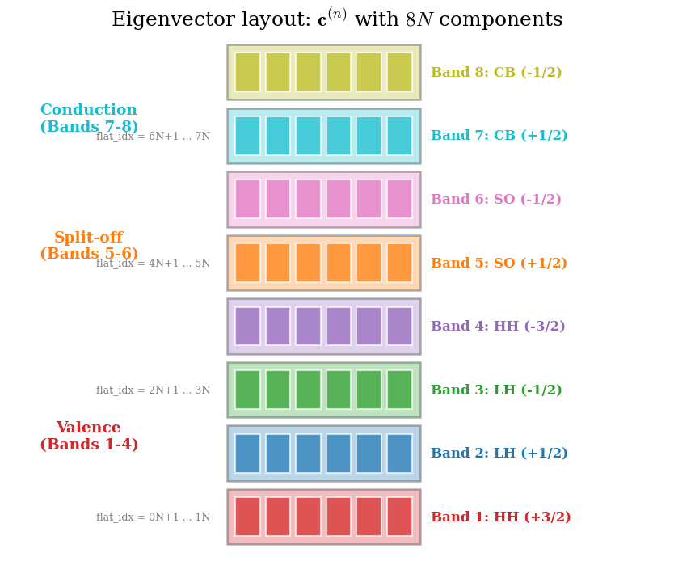
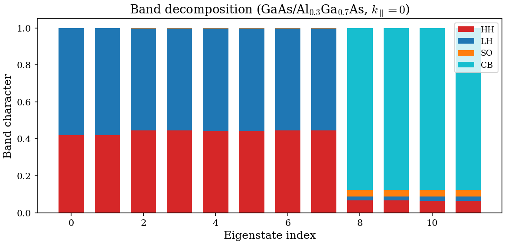
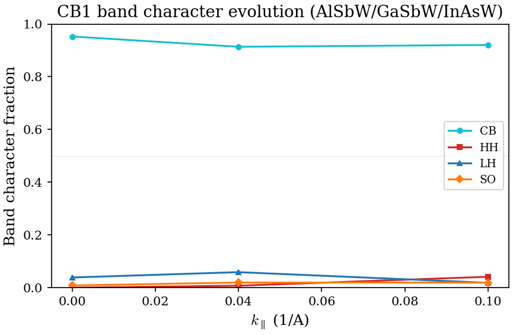
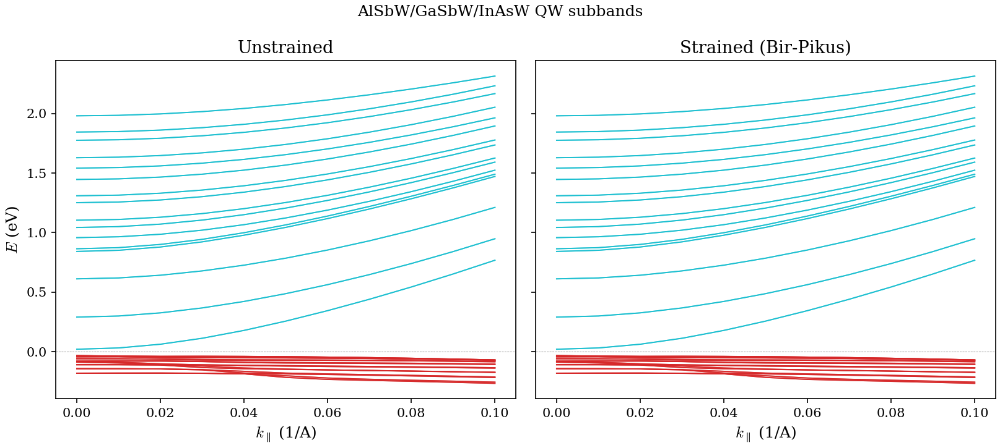
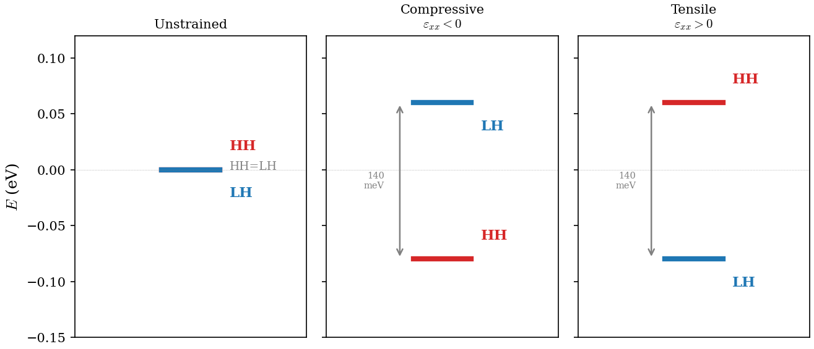
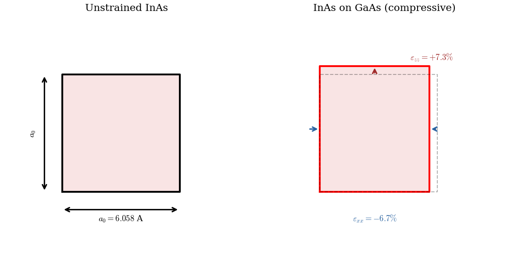

# Ch03-Ch04 Additional Figures Implementation Plan

> **For Claude:** REQUIRED SUB-SKILL: Use superpowers:executing-plans to implement this plan task-by-task.

**Goal:** Add 11 figures across Ch03 (Wavefunctions, 6 figures) and Ch04 (Strain, 5 figures) to fill pedagogical gaps identified in audit.

**Architecture:** Add 11 new figure functions to `scripts/plotting/generate_all_figures.py`. Each function follows the existing pattern: print label, create figure, save to `FIGURE_DIR`, close, print path. Register all in `ALL_FIGURES` dict. Add `![...]` references in the corresponding lecture markdown files.

**Tech Stack:** Python 3 (matplotlib, numpy), Fortran executables for simulation-data figures, pure matplotlib for schematics.

---

## Task Dependency Graph

```
Tasks 1-4, 8-11 are independent (can run in any order)
Task 5 depends on Task 4 (same config run, reuses output)
Task 6 depends on Task 5 (same config run, reuses output)
Task 7 depends on existing wire config (already committed)
```

---

### Task 1: Eigenvector block structure schematic (Ch03 Sec 2.2)

**Files:**
- Modify: `scripts/plotting/generate_all_figures.py`
- Modify: `docs/lecture/03-wavefunctions.md`

**Step 1: Write figure function**

Add to `generate_all_figures.py` after `fig_qw_strained_band_edges` (before `fig_wire_strain_2d`):

```python
def fig_eigenvector_block_structure(output_dir: Path) -> None:
    """eigenvector_block_structure.png: schematic of 8N eigenvector layout."""
    print("[figure] eigenvector_block_structure")
    fig, ax = plt.subplots(figsize=(8, 5))

    band_labels = ["HH (+3/2)", "LH (+1/2)", "LH (-1/2)", "HH (-3/2)",
                   "SO (+1/2)", "SO (-1/2)", "CB (+1/2)", "CB (-1/2)"]
    band_colors = ["#d62728", "#1f77b4", "#2ca02c", "#9467bd",
                   "#ff7f0e", "#e377c2", "#17becf", "#bcbd22"]
    group_labels = ["Valence (HH)", "Valence (LH)", "Valence (LH)",
                    "Valence (HH)", "Split-off", "Split-off",
                    "Conduction", "Conduction"]

    y0 = 0
    block_h = 1.0
    N = 6  # show 6 grid-point boxes per block

    for b in range(8):
        # Draw the block rectangle
        rect = plt.Rectangle((0, y0), 3.5, block_h, facecolor=band_colors[b],
                              edgecolor="black", alpha=0.3, linewidth=1.2)
        ax.add_patch(rect)

        # Draw N small boxes inside to represent spatial points
        for i in range(N):
            small = plt.Rectangle((0.15 + i * 0.55, y0 + 0.15), 0.45, 0.7,
                                  facecolor=band_colors[b], edgecolor="white",
                                  alpha=0.7)
            ax.add_patch(small)

        # Label on the right
        ax.text(3.7, y0 + 0.5, f"Band {b+1}: {band_labels[b]}",
                fontsize=8, va="center", color=band_colors[b], fontweight="bold")

        # Flat index annotation (every other band)
        if b % 2 == 0:
            ax.annotate(f"flat_idx = {b}N+1 ... {b+1}N",
                        xy=(0, y0 + 0.5), xytext=(-0.3, y0 + 0.5),
                        fontsize=6, va="center", ha="right", color="grey")

        y0 += block_h + 0.15

    # Braces / labels for band groups
    mid_hh = 0.5 * block_h
    mid_cb = 6.5 * (block_h + 0.15) + 0.5 * block_h
    ax.annotate("Valence\n(Bands 1-4)", xy=(-2.5, 1.5 * (block_h + 0.15)),
                fontsize=9, ha="center", color="#d62728", fontweight="bold")
    ax.annotate("Split-off\n(Bands 5-6)", xy=(-2.5, 4.5 * (block_h + 0.15)),
                fontsize=9, ha="center", color="#ff7f0e", fontweight="bold")
    ax.annotate("Conduction\n(Bands 7-8)", xy=(-2.5, 6.5 * (block_h + 0.15)),
                fontsize=9, ha="center", color="#17becf", fontweight="bold")

    ax.set_xlim(-4, 8)
    ax.set_ylim(-0.5, y0)
    ax.set_aspect("equal")
    ax.axis("off")
    ax.set_title(r"Eigenvector layout: $\mathbf{c}^{(n)}$ with $8N$ components", fontsize=12)

    fig.tight_layout()
    fig.savefig(FIGURE_DIR / "eigenvector_block_structure.png", dpi=150)
    plt.close(fig)
    print("  -> docs/figures/eigenvector_block_structure.png")
```

**Step 2: Register in ALL_FIGURES**

Add `"eigenvector_block_structure": fig_eigenvector_block_structure,` after the `"bir_pikus_band_shifts"` entry.

**Step 3: Add reference in Ch03 Sec 2.2**

In `docs/lecture/03-wavefunctions.md`, after the block matrix and flat-index formula (after line 46, before "This mapping is implemented..."), add:

```markdown
{ width=85% }
```

**Step 4: Generate and verify**

```bash
python scripts/plotting/generate_all_figures.py --skip-build --only eigenvector_block_structure
```

**Step 5: Commit**

```bash
git add scripts/plotting/generate_all_figures.py docs/lecture/03-wavefunctions.md docs/figures/eigenvector_block_structure.png
git commit -m "docs: add eigenvector block structure schematic to Ch03"
```

---

### Task 2: Per-band probability density decomposition (Ch03 Sec 3)

**Files:**
- Modify: `scripts/plotting/generate_all_figures.py`
- Modify: `docs/lecture/03-wavefunctions.md`

**Step 1: Write figure function**

Add after the eigenvector block structure function:

```python
def fig_perband_density(output_dir: Path) -> None:
    """perband_density.png: |psi_b(z)|^2 for each of 8 bands, CB1 state."""
    print("[figure] perband_density")
    cfg = CONFIG_DIR / "qw_alsbw_gasbw_inasw.cfg"
    run_executable(EXE_BAND, cfg, REPO_ROOT, label="qw_alsbw_gasbw_inasw")
    n_z = 101
    try:
        z, wf = parse_eigenfunctions_qw(output_dir, k_idx=1, n_ev=1, n_z=n_z)
    except FileNotFoundError:
        print("  WARNING: no eigenfunction data, skipping.")
        return

    if z.size == 0:
        print("  WARNING: no wavefunction data, skipping.")
        return

    band_labels = ["HH (+3/2)", "LH (+1/2)", "LH (-1/2)", "HH (-3/2)",
                   "SO (+1/2)", "SO (-1/2)", "CB (+1/2)", "CB (-1/2)"]
    band_colors = ["#d62728", "#1f77b4", "#2ca02c", "#9467bd",
                   "#ff7f0e", "#e377c2", "#17becf", "#bcbd22"]

    psi = wf[0]  # shape (n_z, 8)
    psi2 = psi ** 2

    fig, axes = plt.subplots(2, 4, figsize=(12, 6), sharex=True, sharey=True)
    axes = axes.flatten()

    for b in range(8):
        ax = axes[b]
        ax.plot(z, psi2[:, b], color=band_colors[b], linewidth=1.2)
        ax.fill_between(z, 0, psi2[:, b], alpha=0.2, color=band_colors[b])
        ax.set_title(band_labels[b], fontsize=9, color=band_colors[b])
        # Zoom to non-negligible region
        nz = psi2[:, b] > 0.01 * psi2[:, b].max()
        if np.any(nz):
            ax.set_xlim(z[nz][0] - 20, z[nz][-1] + 20)
        for boundary in [-135, 135, -35, 35]:
            ax.axvline(boundary, color="grey", linewidth=0.3, linestyle="--")

    for ax in axes[4:]:
        ax.set_xlabel(r"$z$ (A)")
    for ax in [axes[0], axes[4]]:
        ax.set_ylabel(r"$|\psi_b(z)|^2$")

    fig.suptitle(r"Per-band probability density for CB1 (state 11, $k_{\parallel}=0$)", fontsize=11)
    fig.tight_layout()
    fig.savefig(FIGURE_DIR / "perband_density.png", dpi=150)
    plt.close(fig)
    print("  -> docs/figures/perband_density.png")
```

**Step 2: Register in ALL_FIGURES**

Add `"perband_density": fig_perband_density,`.

**Step 3: Add reference in Ch03 Sec 3.1**

After the paragraph defining rho_b(z) = |psi_b(z)|^2 and the code snippet (after line 91, before "### 3.2"), add:

```markdown
{ width=95% }
```

**Step 4: Generate and commit**

```bash
python scripts/plotting/generate_all_figures.py --skip-build --only perband_density
git add scripts/plotting/generate_all_figures.py docs/lecture/03-wavefunctions.md docs/figures/perband_density.png
git commit -m "docs: add per-band probability density figure to Ch03"
```

---

### Task 3: Type-I GaAs/AlGaAs wavefunctions (Ch03 Sec 7b)

**Files:**
- Modify: `scripts/plotting/generate_all_figures.py`
- Modify: `docs/lecture/03-wavefunctions.md`

**Step 1: Write figure function**

Modeled on `fig_qw_wavefunctions` but using the GaAs/AlGaAs config at `docs/benchmarks/qw_gaas_algaas.cfg`. Uses `n_z = 401` (FDstep from that config).

```python
def fig_qw_wavefunctions_gaas(output_dir: Path) -> None:
    """qw_wavefunctions_gaas.png: |psi(z)|^2 for GaAs/AlGaAs QW CB states."""
    print("[figure] qw_wavefunctions_gaas")
    cfg = REPO_ROOT / "docs" / "benchmarks" / "qw_gaas_algaas.cfg"
    if not cfg.exists():
        print("  WARNING: docs/benchmarks/qw_gaas_algaas.cfg not found, skipping.")
        return
    result = run_executable(EXE_BAND, cfg, REPO_ROOT, label="qw_gaas_algaas")
    if result.returncode != 0:
        print("  WARNING: GaAs/AlGaAs run failed, skipping.")
        return
    n_z = 401
    try:
        z, wf = parse_eigenfunctions_qw(output_dir, k_idx=1, n_ev=4, n_z=n_z)
    except FileNotFoundError:
        print("  WARNING: no eigenfunction data, skipping.")
        return

    if z.size == 0:
        print("  WARNING: no data, skipping.")
        return

    n_show = min(wf.shape[0], 4)
    fig, axes = plt.subplots(1, n_show, figsize=(3.5 * n_show, 4), sharey=True)
    if n_show == 1:
        axes = [axes]
    for idx in range(n_show):
        ax = axes[idx]
        psi2_total = np.sum(wf[idx] ** 2, axis=1)
        ax.plot(z, psi2_total, color="#17becf", linewidth=1.2)
        ax.fill_between(z, 0, psi2_total, alpha=0.15, color="#17becf")
        ax.axvline(-50, color="grey", linewidth=0.8, linestyle="--")
        ax.axvline(50, color="grey", linewidth=0.8, linestyle="--")
        ax.set_xlabel(r"$z$ (A)")
        ax.set_title(f"State {idx + 1}")
        nonzero = psi2_total > 0.01 * psi2_total.max()
        if np.any(nonzero):
            ax.set_xlim(z[nonzero][0] - 20, z[nonzero][-1] + 20)
    axes[0].set_ylabel(r"$|\psi(z)|^2$")
    fig.suptitle(r"QW probability density (GaAs/Al$_{0.3}$Ga$_{0.7}$As, $k_{\parallel}=0$)", fontsize=11)
    fig.tight_layout()
    fig.savefig(FIGURE_DIR / "qw_wavefunctions_gaas.png", dpi=150)
    plt.close(fig)
    print("  -> docs/figures/qw_wavefunctions_gaas.png")
```

**Step 2: Register in ALL_FIGURES**

Add `"qw_wavefunctions_gaas": fig_qw_wavefunctions_gaas,`.

**Step 3: Add reference in Ch03 Sec 7b.2**

After the wavefunction data table (after line 408, before "### 7b.3"), add:

```markdown
{ width=95% }
```

**Step 4: Generate and commit**

```bash
python scripts/plotting/generate_all_figures.py --skip-build --only qw_wavefunctions_gaas
git add scripts/plotting/generate_all_figures.py docs/lecture/03-wavefunctions.md docs/figures/qw_wavefunctions_gaas.png
git commit -m "docs: add type-I GaAs/AlGaAs wavefunction figure to Ch03"
```

---

### Task 4: Type-I GaAs/AlGaAs parts bar chart (Ch03 Sec 7b)

**Files:**
- Modify: `scripts/plotting/generate_all_figures.py`
- Modify: `docs/lecture/03-wavefunctions.md`

**Step 1: Write figure function**

Modeled on `fig_qw_parts` but for GaAs/AlGaAs. Reuses the same run from Task 3 if output exists.

```python
def fig_qw_parts_gaas(output_dir: Path) -> None:
    """qw_parts_gaas.png: band character bar chart for GaAs/AlGaAs QW."""
    print("[figure] qw_parts_gaas")
    try:
        parts = parse_parts(output_dir)
    except FileNotFoundError:
        cfg = REPO_ROOT / "docs" / "benchmarks" / "qw_gaas_algaas.cfg"
        if not cfg.exists():
            print("  WARNING: config not found, skipping.")
            return
        run_executable(EXE_BAND, cfg, REPO_ROOT, label="qw_gaas_algaas")
        parts = parse_parts(output_dir)

    if parts.size == 0:
        print("  WARNING: no parts data, skipping.")
        return

    row_sums = parts.sum(axis=1, keepdims=True)
    row_sums[row_sums == 0] = 1.0
    parts = parts / row_sums

    n_show = min(parts.shape[0], 12)
    parts = parts[:n_show]

    fig, ax = plt.subplots(figsize=(8, 4))
    x = np.arange(n_show)
    bottom = np.zeros(n_show)
    groups = [
        ("HH", [0, 3], "#d62728"),
        ("LH", [1, 2], "#1f77b4"),
        ("SO", [4, 5], "#ff7f0e"),
        ("CB", [6, 7], "#17becf"),
    ]
    for name, indices, color in groups:
        vals = sum(parts[:, i] for i in indices)
        ax.bar(x, vals, 0.7, bottom=bottom, label=name, color=color, linewidth=0)
        bottom += vals
    ax.set_xlabel("Eigenstate index")
    ax.set_ylabel("Band character")
    ax.set_title(r"Band decomposition (GaAs/Al$_{0.3}$Ga$_{0.7}$As, $k_{\parallel}=0$)")
    ax.set_ylim(0, 1.05)
    ax.legend(loc="best")
    fig.tight_layout()
    fig.savefig(FIGURE_DIR / "qw_parts_gaas.png", dpi=150)
    plt.close(fig)
    print("  -> docs/figures/qw_parts_gaas.png")
```

**Step 2: Register in ALL_FIGURES**

Add `"qw_parts_gaas": fig_qw_parts_gaas,`.

**Step 3: Add reference in Ch03 Sec 7b.3**

After the parts table (after line 426, before "### 7b.4"), add:

```markdown
{ width=90% }
```

**Step 4: Generate and commit**

```bash
python scripts/plotting/generate_all_figures.py --skip-build --only qw_parts_gaas
git add scripts/plotting/generate_all_figures.py docs/lecture/03-wavefunctions.md docs/figures/qw_parts_gaas.png
git commit -m "docs: add type-I GaAs/AlGaAs parts bar chart to Ch03"
```

---

### Task 5: CB parts evolution with k (Ch03 Sec 7c)

**Files:**
- Modify: `scripts/plotting/generate_all_figures.py`
- Modify: `docs/lecture/03-wavefunctions.md`

**Step 1: Write figure function**

Uses `parse_parts_all_k()` to read k-resolved parts. Runs the broken-gap QW config first.

```python
def fig_cb_parts_evolution(output_dir: Path) -> None:
    """cb_parts_evolution.png: CB1 band character vs k_parallel."""
    print("[figure] cb_parts_evolution")
    cfg = CONFIG_DIR / "qw_alsbw_gasbw_inasw.cfg"
    run_executable(EXE_BAND, cfg, REPO_ROOT, label="qw_alsbw_gasbw_inasw_k")
    try:
        all_parts, k_values = parse_parts_all_k(output_dir)
    except FileNotFoundError:
        print("  WARNING: no parts data, skipping.")
        return

    if not k_values:
        print("  WARNING: empty parts data, skipping.")
        return

    # CB1 is the first state with positive energy at k=0
    # Find it at each k-point (index may shift)
    n_k = len(k_values)
    p_cb = np.zeros(n_k)
    p_hh = np.zeros(n_k)
    p_lh = np.zeros(n_k)
    p_so = np.zeros(n_k)

    for ki, parts_k in enumerate(all_parts):
        # Normalize
        row_sums = parts_k.sum(axis=1, keepdims=True)
        row_sums[row_sums == 0] = 1.0
        parts_k = parts_k / row_sums
        # Find first CB state (majority CB character)
        cb_char = parts_k[:, 6] + parts_k[:, 7]
        cb1_idx = np.argmax(cb_char)
        p_cb[ki] = cb_char[cb1_idx]
        p_hh[ki] = parts_k[cb1_idx, 0] + parts_k[cb1_idx, 3]
        p_lh[ki] = parts_k[cb1_idx, 1] + parts_k[cb1_idx, 2]
        p_so[ki] = parts_k[cb1_idx, 4] + parts_k[cb1_idx, 5]

    k_arr = np.array(k_values)
    fig, ax = plt.subplots(figsize=(6, 4))
    ax.plot(k_arr, p_cb, "o-", color="#17becf", linewidth=1.5, markersize=4, label="CB")
    ax.plot(k_arr, p_hh, "s-", color="#d62728", linewidth=1.5, markersize=4, label="HH")
    ax.plot(k_arr, p_lh, "^-", color="#1f77b4", linewidth=1.5, markersize=4, label="LH")
    ax.plot(k_arr, p_so, "D-", color="#ff7f0e", linewidth=1.5, markersize=4, label="SO")
    ax.set_xlabel(r"$k_{\parallel}$ (1/A)")
    ax.set_ylabel("Band character fraction")
    ax.set_title(r"CB1 band character evolution (AlSbW/GaSbW/InAsW)")
    ax.set_ylim(0, 1.0)
    ax.legend(loc="center right")
    ax.axhline(0.5, color="grey", linewidth=0.3, linestyle=":")
    fig.tight_layout()
    fig.savefig(FIGURE_DIR / "cb_parts_evolution.png", dpi=150)
    plt.close(fig)
    print("  -> docs/figures/cb_parts_evolution.png")
```

**Step 2: Register in ALL_FIGURES**

Add `"cb_parts_evolution": fig_cb_parts_evolution,`.

**Step 3: Add reference in Ch03 Sec 7c.1**

After the CB evolution table (after line 490, before "### 7c.2"), add:

```markdown
{ width=80% }
```

**Step 4: Generate and commit**

```bash
python scripts/plotting/generate_all_figures.py --skip-build --only cb_parts_evolution
git add scripts/plotting/generate_all_figures.py docs/lecture/03-wavefunctions.md docs/figures/cb_parts_evolution.png
git commit -m "docs: add CB parts evolution figure to Ch03"
```

---

### Task 6: VB HH/LH crossover with k (Ch03 Sec 7c + Sec 5)

**Files:**
- Modify: `scripts/plotting/generate_all_figures.py`
- Modify: `docs/lecture/03-wavefunctions.md`

**Step 1: Write figure function**

Reuses data from the same QW run. Tracks f_HH and f_LH for VB states 1 and 7.

```python
def fig_vb_hh_lh_mixing(output_dir: Path) -> None:
    """vb_hh_lh_mixing.png: HH/LH fraction vs k for VB states."""
    print("[figure] vb_hh_lh_mixing")
    cfg = CONFIG_DIR / "qw_alsbw_gasbw_inasw.cfg"
    run_executable(EXE_BAND, cfg, REPO_ROOT, label="qw_alsbw_gasbw_inasw_k2")
    try:
        all_parts, k_values = parse_parts_all_k(output_dir)
    except FileNotFoundError:
        print("  WARNING: no parts data, skipping.")
        return

    if not k_values:
        print("  WARNING: empty parts data, skipping.")
        return

    n_k = len(k_values)
    f_hh_s1 = np.zeros(n_k)
    f_lh_s1 = np.zeros(n_k)
    f_hh_s7 = np.zeros(n_k)
    f_lh_s7 = np.zeros(n_k)

    for ki, parts_k in enumerate(all_parts):
        row_sums = parts_k.sum(axis=1, keepdims=True)
        row_sums[row_sums == 0] = 1.0
        parts_k = parts_k / row_sums

        # State 1 and 7 (0-indexed: 0 and 6)
        for state_idx, f_hh_arr, f_lh_arr in [(0, f_hh_s1, f_lh_s1),
                                                (6, f_hh_s7, f_lh_s7)]:
            if state_idx < parts_k.shape[0]:
                f_hh_arr[ki] = parts_k[state_idx, 0] + parts_k[state_idx, 3]
                f_lh_arr[ki] = parts_k[state_idx, 1] + parts_k[state_idx, 2]

    k_arr = np.array(k_values)
    fig, ax = plt.subplots(figsize=(6, 4))
    ax.plot(k_arr, f_hh_s1, "o-", color="#d62728", linewidth=1.5, markersize=4,
            label=r"$f_{\mathrm{HH}}$ state 1")
    ax.plot(k_arr, f_lh_s1, "s--", color="#1f77b4", linewidth=1.5, markersize=4,
            label=r"$f_{\mathrm{LH}}$ state 1")
    ax.plot(k_arr, f_hh_s7, "^-", color="#9467bd", linewidth=1.5, markersize=4,
            label=r"$f_{\mathrm{HH}}$ state 7")
    ax.plot(k_arr, f_lh_s7, "D--", color="#2ca02c", linewidth=1.5, markersize=4,
            label=r"$f_{\mathrm{LH}}$ state 7")
    ax.set_xlabel(r"$k_{\parallel}$ (1/A)")
    ax.set_ylabel("Band character fraction")
    ax.set_title(r"HH/LH mixing in VB states (AlSbW/GaSbW/InAsW)")
    ax.set_ylim(0, 1.05)
    ax.legend(loc="center right", fontsize=8)
    ax.axhline(0.5, color="grey", linewidth=0.3, linestyle=":")
    fig.tight_layout()
    fig.savefig(FIGURE_DIR / "vb_hh_lh_mixing.png", dpi=150)
    plt.close(fig)
    print("  -> docs/figures/vb_hh_lh_mixing.png")
```

**Step 2: Register in ALL_FIGURES**

Add `"vb_hh_lh_mixing": fig_vb_hh_lh_mixing,`.

**Step 3: Add reference in Ch03 Sec 5.2**

After the paragraph defining f_HH and f_LH (after line 180, before "## 6"), add:

```markdown
{ width=80% }
```

**Step 4: Generate and commit**

```bash
python scripts/plotting/generate_all_figures.py --skip-build --only vb_hh_lh_mixing
git add scripts/plotting/generate_all_figures.py docs/lecture/03-wavefunctions.md docs/figures/vb_hh_lh_mixing.png
git commit -m "docs: add VB HH/LH mixing evolution figure to Ch03"
```

---

### Task 7: Strained QW band structure (Ch04 Sec 7.1) [CRITICAL]

**Files:**
- Modify: `scripts/plotting/generate_all_figures.py`
- Modify: `docs/lecture/04-strain.md`

**Step 1: Write figure function**

Runs the AlSbW/GaSbW/InAsW QW twice (unstrained and strained), plots E vs k side-by-side.

```python
def fig_qw_strained_bands(output_dir: Path) -> None:
    """qw_strained_bands.png: side-by-side unstrained vs strained QW subbands."""
    print("[figure] qw_strained_bands")
    import tempfile

    base_cfg = CONFIG_DIR / "qw_alsbw_gasbw_inasw.cfg"
    base_text = base_cfg.read_text()

    # Build unstrained config (strip any strain block)
    def strip_strain(text):
        lines = text.splitlines()
        out = []
        skip = False
        for line in lines:
            s = line.strip().lower()
            if s.startswith("strain:"):
                out.append("strain: F")
                skip = True
                continue
            if skip:
                # Skip strain_ref, strain_solver, piezo lines
                if any(s.startswith(kw) for kw in ["strain_ref", "strain_solver", "piezo"]):
                    continue
                skip = False
            out.append(line)
        return "\n".join(out) + "\n"

    cfg_off_text = strip_strain(base_text)
    cfg_on_text = base_text  # original config has strain enabled if applicable

    # Run unstrained
    cfg_off = output_dir / "tmp_strained_bands_off.cfg"
    cfg_off.write_text(cfg_off_text)
    result = run_executable(EXE_BAND, cfg_off, REPO_ROOT, label="qw_unstrained_bands")
    if result.returncode != 0:
        print("  WARNING: unstrained run failed, skipping.")
        cfg_off.unlink(missing_ok=True)
        return
    k_off, eig_off = parse_eigenvalues(output_dir)

    # Run strained
    cfg_on = output_dir / "tmp_strained_bands_on.cfg"
    # Add strain block if not present
    if "strain:" not in cfg_on_text.lower():
        cfg_on_text += "\nstrain: T\nstrain_ref: AlSbW\nstrain_solver: pardiso\npiezo: F\n"
    cfg_on.write_text(cfg_on_text)
    result = run_executable(EXE_BAND, cfg_on, REPO_ROOT, label="qw_strained_bands")
    if result.returncode != 0:
        print("  WARNING: strained run failed, skipping.")
        for p in [cfg_off, cfg_on]:
            p.unlink(missing_ok=True)
        return
    k_on, eig_on = parse_eigenvalues(output_dir)

    # Clean up
    for p in [cfg_off, cfg_on]:
        p.unlink(missing_ok=True)

    fig, (ax_left, ax_right) = plt.subplots(1, 2, figsize=(11, 5), sharey=True)

    for ax, k_vals, eig, title in [
        (ax_left, k_off, eig_off, "Unstrained"),
        (ax_right, k_on, eig_on, "Strained (Bir-Pikus)")]:
        n_bands = eig.shape[0]
        for i in range(n_bands):
            e_mid = np.mean(eig[i])
            color = "#17becf" if e_mid > 0 else "#d62728"
            ax.plot(k_vals, eig[i], color=color, linewidth=0.9, alpha=0.85)
        ax.set_xlabel(r"$k_{\parallel}$ (1/A)")
        ax.set_title(title)
        ax.axhline(0, color="grey", linewidth=0.4, linestyle="--")

    ax_left.set_ylabel(r"$E$ (eV)")
    fig.suptitle("AlSbW/GaSbW/InAsW QW subbands", fontsize=12)
    fig.tight_layout()
    fig.savefig(FIGURE_DIR / "qw_strained_bands.png", dpi=150)
    plt.close(fig)
    print("  -> docs/figures/qw_strained_bands.png")
```

IMPORTANT: Check whether `qw_alsbw_gasbw_inasw.cfg` already has strain enabled. If not, the function must inject the strain block. The existing config at `tests/regression/configs/qw_alsbw_gasbw_inasw.cfg` likely does NOT have strain — verify and adapt.

**Step 2: Register in ALL_FIGURES**

Add `"qw_strained_bands": fig_qw_strained_bands,`.

**Step 3: Add reference in Ch04 Sec 7.1**

After the existing `qw_strained_band_edges.png` reference (around line 622), add:

```markdown
{ width=95% }
```

**Step 4: Generate and commit**

```bash
python scripts/plotting/generate_all_figures.py --skip-build --only qw_strained_bands
git add scripts/plotting/generate_all_figures.py docs/lecture/04-strain.md docs/figures/qw_strained_bands.png
git commit -m "docs: add strained QW band structure figure to Ch04"
```

---

### Task 8: HH/LH ordering flip schematic (Ch04 Sec 3.4)

**Files:**
- Modify: `scripts/plotting/generate_all_figures.py`
- Modify: `docs/lecture/04-strain.md`

**Step 1: Write figure function**

```python
def fig_hh_lh_ordering(output_dir: Path) -> None:
    """hh_lh_ordering.png: VB ordering under unstrained, compressive, tensile."""
    print("[figure] hh_lh_ordering")
    fig, axes = plt.subplots(1, 3, figsize=(9, 4), sharey=True)

    cases = [
        ("Unstrained", 0.0, 0.0),
        ("Compressive\n" + r"$\varepsilon_{xx}<0$", -0.08, 0.06),
        ("Tensile\n" + r"$\varepsilon_{xx}>0$", 0.06, -0.08),
    ]
    x = 0.5
    lw = 4.0

    for ax, label, dE_hh, dE_lh in cases:
        E_hh = dE_hh
        E_lh = dE_lh

        ax.plot([x - 0.15, x + 0.15], [E_hh, E_hh], color="#d62728", linewidth=lw)
        ax.plot([x - 0.15, x + 0.15], [E_lh, E_lh], color="#1f77b4", linewidth=lw)

        # Labels to the right
        y_off = 0.015
        ax.text(x + 0.2, E_hh + y_off, "HH", fontsize=11, color="#d62728", va="bottom", fontweight="bold")
        ax.text(x + 0.2, E_lh - y_off, "LH", fontsize=11, color="#1f77b4", va="top", fontweight="bold")

        # Degeneracy arrow or gap annotation
        if abs(dE_hh - dE_lh) > 0.01:
            ax.annotate("", xy=(x - 0.22, E_hh), xytext=(x - 0.22, E_lh),
                        arrowprops=dict(arrowstyle="<->", color="grey", lw=1.2))
            mid = (E_hh + E_lh) / 2
            ax.text(x - 0.3, mid, f"{abs(E_hh - E_lh)*1000:.0f}\nmeV",
                    fontsize=7, color="grey", ha="right", va="center")
        else:
            ax.text(x + 0.2, (E_hh + E_lh) / 2, "HH=LH", fontsize=9, color="grey")

        ax.set_xlim(-0.1, 1.1)
        ax.set_ylim(-0.15, 0.12)
        ax.set_title(label, fontsize=10)
        ax.axhline(0, color="grey", linewidth=0.3, linestyle=":")
        ax.set_xticks([])
        ax.set_ylabel(r"$E$ (eV)" if ax is axes[0] else "")

    fig.tight_layout()
    fig.savefig(FIGURE_DIR / "hh_lh_ordering.png", dpi=150)
    plt.close(fig)
    print("  -> docs/figures/hh_lh_ordering.png")
```

**Step 2: Register in ALL_FIGURES**

Add `"hh_lh_ordering": fig_hh_lh_ordering,`.

**Step 3: Add reference in Ch04 Sec 3.4**

After the two consequences discussion (after line 269, before the `---`), add:

```markdown
{ width=90% }
```

**Step 4: Generate and commit**

```bash
python scripts/plotting/generate_all_figures.py --skip-build --only hh_lh_ordering
git add scripts/plotting/generate_all_figures.py docs/lecture/04-strain.md docs/figures/hh_lh_ordering.png
git commit -m "docs: add HH/LH ordering flip schematic to Ch04"
```

---

### Task 9: InAs/GaAs strained unit cell schematic (Ch04 Sec 2.5)

**Files:**
- Modify: `scripts/plotting/generate_all_figures.py`
- Modify: `docs/lecture/04-strain.md`

**Step 1: Write figure function**

```python
def fig_strained_unit_cell(output_dir: Path) -> None:
    """strained_unit_cell.png: InAs unit cell before/after biaxial strain."""
    print("[figure] strained_unit_cell")
    fig, (ax_free, ax_strained) = plt.subplots(1, 2, figsize=(8, 4))

    a_inas = 1.0   # InAs lattice constant (reference)
    eps_xx = -0.067  # compressive
    eps_zz = +0.073  # Poisson expansion

    # Left: unstrained cubic cell
    ax_free.set_title("Unstrained InAs", fontsize=11)
    corners = np.array([[0, 0], [1, 0], [1, 1], [0, 1], [0, 0]]) * a_inas
    ax_free.plot(corners[:, 0], corners[:, 1], "k-", linewidth=2)
    ax_free.fill(corners[:-1, 0], corners[:-1, 1], color="#d94a4a", alpha=0.15)
    # Lattice constant labels
    ax_free.annotate("", xy=(1.0, -0.15), xytext=(0.0, -0.15),
                     arrowprops=dict(arrowstyle="<->", color="black", lw=1.5))
    ax_free.text(0.5, -0.25, r"$a_0 = 6.058$ A", ha="center", fontsize=9)
    ax_free.annotate("", xy=(-0.15, 1.0), xytext=(-0.15, 0.0),
                     arrowprops=dict(arrowstyle="<->", color="black", lw=1.5))
    ax_free.text(-0.25, 0.5, r"$a_0$", ha="center", va="center", fontsize=9, rotation=90)
    ax_free.set_xlim(-0.5, 1.6)
    ax_free.set_ylim(-0.5, 1.5)
    ax_free.set_aspect("equal")
    ax_free.axis("off")

    # Right: strained (biaxial compression in x, expansion in z)
    ax_strained.set_title("InAs on GaAs (compressive)", fontsize=11)
    dx = 1.0 * (1 + eps_xx)  # compressed in x
    dz = 1.0 * (1 + eps_zz)  # expanded in z
    strained = np.array([[0, 0], [dx, 0], [dx, dz], [0, dz], [0, dz]])
    ax_strained.plot(strained[:, 0], strained[:, 1], "r-", linewidth=2)
    ax_strained.fill(strained[:-1, 0], strained[:-1, 1], color="#d94a4a", alpha=0.15)
    # Ghost of original cell
    ax_strained.plot(corners[:, 0], corners[:, 1], "k--", linewidth=1, alpha=0.3)
    # Compression arrows (inward)
    ax_strained.annotate("", xy=(dx, 0.5 * dz), xytext=(1.0, 0.5 * dz),
                         arrowprops=dict(arrowstyle="->", color="#2962a0", lw=1.5))
    ax_strained.annotate("", xy=(0, 0.5 * dz), xytext=(-0.1, 0.5 * dz),
                         arrowprops=dict(arrowstyle="->", color="#2962a0", lw=1.5))
    ax_strained.text(0.5 * dx, -0.25, r"$\varepsilon_{xx}=-6.7\%$", ha="center",
                     fontsize=9, color="#2962a0")
    # Expansion arrows (outward)
    ax_strained.annotate("", xy=(0.5 * dx, dz), xytext=(0.5 * dx, 1.0),
                         arrowprops=dict(arrowstyle="->", color="#a02929", lw=1.5))
    ax_strained.text(0.5 * dx + 0.3, dz + 0.05, r"$\varepsilon_{zz}=+7.3\%$",
                     fontsize=9, color="#a02929")
    ax_strained.set_xlim(-0.5, 1.6)
    ax_strained.set_ylim(-0.5, 1.5)
    ax_strained.set_aspect("equal")
    ax_strained.axis("off")

    fig.tight_layout()
    fig.savefig(FIGURE_DIR / "strained_unit_cell.png", dpi=150)
    plt.close(fig)
    print("  -> docs/figures/strained_unit_cell.png")
```

**Step 2: Register in ALL_FIGURES**

Add `"strained_unit_cell": fig_strained_unit_cell,`.

**Step 3: Add reference in Ch04 Sec 2.5**

After the trace calculation (after line 158, before "The hydrostatic component..."), add:

```markdown
{ width=90% }
```

**Step 4: Generate and commit**

```bash
python scripts/plotting/generate_all_figures.py --skip-build --only strained_unit_cell
git add scripts/plotting/generate_all_figures.py docs/lecture/04-strain.md docs/figures/strained_unit_cell.png
git commit -m "docs: add InAs/GaAs strained unit cell schematic to Ch04"
```

---

### Task 10: HH/LH splitting vs lattice mismatch (Ch04 Sec 7.4)

**Files:**
- Modify: `scripts/plotting/generate_all_figures.py`
- Modify: `docs/lecture/04-strain.md`

**Step 1: Write figure function**

Plots directly from the table data in Sec 7.4 — no Fortran run needed.

```python
def fig_hh_lh_splitting_vs_mismatch(output_dir: Path) -> None:
    """hh_lh_splitting_vs_mismatch.png: linear scaling of HH/LH splitting."""
    print("[figure] hh_lh_splitting_vs_mismatch")

    # Data from Ch04 Sec 7.4 table (InAs under compressive strain)
    eps_xx_pct = np.array([0.5, 1.0, 1.3, 2.0, 3.0, 6.7])
    dE_hh_lh = np.array([19, 38, 49, 75, 113, 252])   # meV
    dE_c = np.array([23, 46, 60, 93, 139, 311])        # meV
    dE_g = np.array([37, 74, 97, 149, 223, 498])        # meV

    fig, ax = plt.subplots(figsize=(6, 4.5))
    ax.plot(eps_xx_pct, dE_hh_lh, "o-", color="#d62728", linewidth=1.5,
            markersize=5, label=r"$\Delta E_{\mathrm{HH-LH}}$")
    ax.plot(eps_xx_pct, dE_c, "s-", color="#17becf", linewidth=1.5,
            markersize=5, label=r"$\Delta E_c$")
    ax.plot(eps_xx_pct, dE_g, "^-", color="#2ca02c", linewidth=1.5,
            markersize=5, label=r"$\Delta E_g$")

    # Linear fit for HH/LH splitting
    coef = np.polyfit(eps_xx_pct, dE_hh_lh, 1)
    x_fit = np.linspace(0, 7, 50)
    ax.plot(x_fit, np.polyval(coef, x_fit), "--", color="#d62728", alpha=0.4,
            linewidth=1)
    ax.text(4, coef[0] * 4 + coef[1] - 15,
            f"slope = {coef[0]:.1f} meV/%", fontsize=8, color="#d62728", alpha=0.7)

    ax.set_xlabel(r"$|\varepsilon_{xx}|$ (%)")
    ax.set_ylabel("Energy shift (meV)")
    ax.set_title("Strain-induced shifts in InAs (compressive)")
    ax.legend(loc="upper left")
    ax.set_xlim(0, 7.5)
    ax.set_ylim(0, 550)
    fig.tight_layout()
    fig.savefig(FIGURE_DIR / "hh_lh_splitting_vs_mismatch.png", dpi=150)
    plt.close(fig)
    print("  -> docs/figures/hh_lh_splitting_vs_mismatch.png")
```

**Step 2: Register in ALL_FIGURES**

Add `"hh_lh_splitting_vs_mismatch": fig_hh_lh_splitting_vs_mismatch,`.

**Step 3: Add reference in Ch04 Sec 7.4**

After the table (after line 719, before "The HH/LH splitting grows..."), add:

```markdown
{ width=75% }
```

**Step 4: Generate and commit**

```bash
python scripts/plotting/generate_all_figures.py --skip-build --only hh_lh_splitting_vs_mismatch
git add scripts/plotting/generate_all_figures.py docs/lecture/04-strain.md docs/figures/hh_lh_splitting_vs_mismatch.png
git commit -m "docs: add HH/LH splitting vs mismatch figure to Ch04"
```

---

### Task 11: Wire strain tensor 4-panel (Ch04 Sec 6.6)

**Files:**
- Modify: `scripts/plotting/generate_all_figures.py`
- Modify: `docs/lecture/04-strain.md`

**Step 1: Write figure function**

Reuses the existing `wire_inas_gaas_strain.cfg` from the previous batch. Shows all 4 non-zero strain components.

```python
def fig_wire_strain_tensor(output_dir: Path) -> None:
    """wire_strain_tensor.png: 4-panel wire strain components eps_xx, eps_yy, eps_zz, eps_yz."""
    print("[figure] wire_strain_tensor")
    cfg = CONFIG_DIR / "wire_inas_gaas_strain.cfg"
    if not cfg.exists():
        print("  SKIP: wire_inas_gaas_strain.cfg not found")
        return
    result = run_executable(EXE_BAND, cfg, REPO_ROOT, label="wire_strain_tensor", timeout=600)
    if result.returncode != 0:
        print("  WARNING: wire strain run failed, skipping.")
        return

    strain_path = output_dir / "strain.dat"
    if not strain_path.exists():
        print("  SKIP: output/strain.dat not found")
        return

    data = np.loadtxt(str(strain_path), comments="#")
    data = data[~np.isnan(data[:, 0])]

    x = data[:, 0]
    y = data[:, 1]
    # columns: x, y, eps_xx, eps_yy, eps_zz, eps_xy, eps_xz, eps_yz
    components = [
        (2, r"$\varepsilon_{xx}$", "Axial (prescribed)"),
        (3, r"$\varepsilon_{yy}$", "In-plane y"),
        (4, r"$\varepsilon_{zz}$", "In-plane z"),
        (7, r"$\varepsilon_{yz}$", "Shear"),
    ]

    nx, ny = 30, 30
    X = x.reshape(ny, nx)
    Y = y.reshape(ny, nx)

    fig, axes = plt.subplots(2, 2, figsize=(10, 8))
    axes = axes.flatten()

    for ax, (col, label, subtitle) in zip(axes, components):
        vals = data[:, col].reshape(ny, nx)
        vmax = max(abs(vals.min()), abs(vals.max()))
        if vmax < 1e-10:
            vmax = 1.0
        im = ax.pcolormesh(X, Y, vals, cmap="RdBu_r", shading="auto",
                           vmin=-vmax, vmax=vmax)
        ax.set_title(f"{label} ({subtitle})", fontsize=10)
        ax.set_xlabel(r"$x$ (A)")
        ax.set_ylabel(r"$y$ (A)")
        ax.set_aspect("equal")
        fig.colorbar(im, ax=ax, label=label, shrink=0.8)

    fig.suptitle("Strain tensor components in InAs/GaAs wire", fontsize=12)
    fig.tight_layout()
    fig.savefig(FIGURE_DIR / "wire_strain_tensor.png", dpi=150)
    plt.close(fig)
    print("  -> docs/figures/wire_strain_tensor.png")
```

**Step 2: Register in ALL_FIGURES**

Add `"wire_strain_tensor": fig_wire_strain_tensor,`.

**Step 3: Add reference in Ch04 Sec 6.6**

After the existing `wire_strain_2d.png` reference (around line 504), add:

```markdown
{ width=95% }
```

**Step 4: Generate and commit**

```bash
python scripts/plotting/generate_all_figures.py --skip-build --only wire_strain_tensor
git add scripts/plotting/generate_all_figures.py docs/lecture/04-strain.md docs/figures/wire_strain_tensor.png
git commit -m "docs: add wire strain tensor 4-panel figure to Ch04"
```

NOTE: This runs the PARDISO wire strain solver, taking several minutes.

---

## Dependencies

- Tasks 1-4, 8-11 are independent
- Task 5 should run after Task 3 (same GaAs/AlGaAs config, can reuse output)
- Task 6 should run after Task 5 (same broken-gap config, can reuse output)
- Task 7 needs the existing `qw_alsbw_gasbw_inasw.cfg` config
- Task 11 needs `wire_inas_gaas_strain.cfg` (committed in previous batch)

## Files Modified Summary

| File | Tasks | Changes |
|---|---|---|
| `scripts/plotting/generate_all_figures.py` | 1-11 | 11 new figure functions + ALL_FIGURES entries |
| `docs/lecture/03-wavefunctions.md` | 1-6 | 6 figure references |
| `docs/lecture/04-strain.md` | 7-11 | 5 figure references |
| `docs/figures/*.png` | 1-11 | 11 new PNG files |
