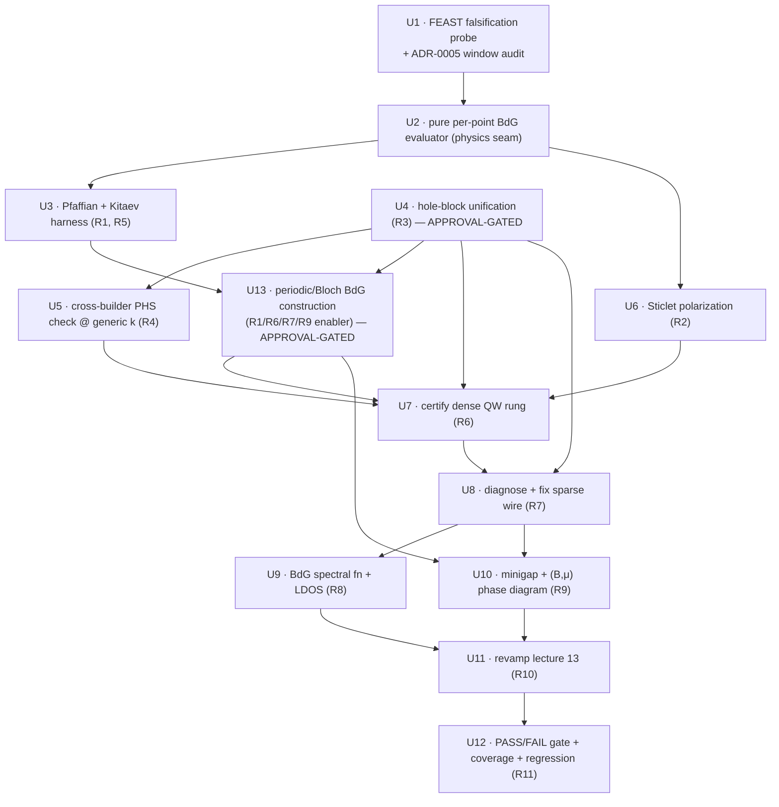

# BdG/Majorana ground-up validation and observable coverage

## Summary

A ground-up validation and observable-coverage pass on the BdG/Majorana subsystem, run as a three-rung ladder — spinless Kitaev chain, dense QW BdG, sparse Rashba wire — each certified by analytical closed-forms plus newly-built internal invariants (Pfaffian Majorana number, Sticlet Majorana polarization). It replaces the silently-broken all-zero Majorana phase diagram, derives the BdG hole block from the class-D particle-hole-symmetry constraint and unifies it across both builders, adds the missing BdG observables, and culminates in a revamped topological-superconductivity lecture whose PASS/FAIL assertions become the acceptance gate.

## Problem Frame

The BdG/Majorana machinery is assembled and unit-tested for matrix structure — dimension doubling, Hermiticity, ±E particle-hole pairing — but the headline Majorana result is silently broken. The figure the lecture marks "PASS, B_crit≈1.22 T" has an identically zero minigap for every field from 0 to 10 T (`docs/lecture/figures/rashba_majorana_phase_diagram.txt`); the gap never opens or closes, and three different B_crit values circulate across the docs. The unit tests pass because they check matrix structure, not physics outcome.

Two structural gaps explain why nothing catches this. The class-D BdG/Majorana path has no real topological invariant — the code's "Z2" is gap-closing-counting heuristics (`compute_z2_gap`), not Kitaev's Majorana number; the class-AII QSHE path already has a proper Fu-Kane parity invariant this effort must not displace. And the two BdG builders construct the hole block differently — the CSR/wire builder uses `-H₀ᵀ(+k)` with no conjugation, the dense/QW builder uses `-conjg(H₀(-k))` — a divergence that is itself a candidate cause of the zero gap and is invisible to k=0-only tests. A second candidate cause has already been partly resolved on this branch: the wire BdG and spectral paths were silently dropping strain (the topology wire subroutines skipped `compute_strain`/`compute_bir_pikus_blocks`), fixed by #04 (`strain-aware wire setup type`); the all-zero phase-diagram artifact (mtime 2026-05-15) predates that fix and is stale, so the headline symptom must be re-characterized against the current tree before the root cause is attributed. (U1 ran 2026-06-15 and found the actual cause is **μ mis-parameterization, primary**: μ=0.5 meV sits at the energy zero, deep in the GaAs gap (EV=−0.8 eV, EC=+0.719 eV — ~700 meV from any band edge), so there is no Fermi surface and no B field creates near-μ states. The ±5δ₀ window is a secondary mis-size; the hole-block divergence is real but tertiary.) Beyond correctness, the canonical Majorana observables a researcher expects — Majorana polarization, a BdG spectral function, a BdG LDOS showing the zero-energy peak, a phase diagram from a true invariant — are absent or run on the normal-state Hamiltonian rather than BdG.

Architecturally, the physics logic that should catch this is buried in app glue: the per-point gap convention `2·min|E|`, the `0.001·δ₀` near-zero threshold, and the FEAST energy-window heuristics all live inline in `main_topology.f90`, un-unit-testable without a built executable, and the manual `±5δ₀` / `±50δ₀` energy windows bypass `apply_solver_window` (an ADR 0005 violation sitting in the exact code path under suspicion). This plan builds the new invariants and observables on a pure-function seam so they are testable from the start, rather than bolting a fourth copy of the pattern onto shallow app glue.

## Key Technical Decisions

- **KTD1 — Pure-function invariant seam.** Every new invariant and observable is a pure function of a BdG matrix or of eigenpairs — it never owns its Hamiltonian-build or diagonalization. Pfaffian takes a matrix; Majorana polarization and Fu-Kane parity take eigenpairs; the BdG evaluator takes eigenpairs plus a small parameter record. The build-and-solve stays in the caller (app or test harness). Rationale: the single highest-leverage testability fix — every existing invariant that owns its solve (`compute_z2_fukane_qw_result`) is un-unit-testable through its interface; pure functions are testable with synthetic inputs and no `simulation_config` fixture. The discipline applies to new code only; the existing Fu-Kane routine keeps its owns-its-solve signature because R1 leaves the QSHE path untouched, and the leak is documented as deferred debt alongside the `topological_analysis` module split (Scope Boundaries).

- **KTD2 — One shared hole-block contract, no polymorphism.** R3 extracts a single PHS-derived hole-block construction plus the pairing-embed (`iσ_y⊗I₄`, Kramers partners 1↔4, 2↔3, 5↔6, 7↔8) as shared procedures behind one documented contract, applied identically in the wire and QW builders. No polymorphic Hamiltonian-builder types. Rationale: the two builders diverge silently today; the Pfaffian invariant is ill-defined until the convention is shared; ADR 0001 rejects polymorphic builder subtypes, so the sharing is procedures + data.

- **KTD3 — Pure per-point evaluator in physics; build-and-solve and sweep loop in app.** The pure evaluator `eval_bdg_point(eigenvalues, params) → (minigap, near-zero count, invariant)` lives in a physics module and takes eigenpairs, not a matrix-build step — so build-and-solve stays in the app (the caller owns it, consistent with KTD1). Sweep orchestration and file I/O stay in `main_topology`. "Co-locate the evaluators" means the pure-evaluator *call sites* in the three `sweep_model` paths call one physics routine; it does not move build-and-solve into physics. Dispatch is by enum, never a polymorphic evaluator type (ADR 0001). Rationale: ADR 0003 (specialized sweeps stay in the app; the generic pipeline lives in physics); lifts the triplicated `2·min|E|` gap convention and the hardcoded `0.001·δ₀` near-zero literals in `main_topology.f90` into one parametrized, unit-testable call; makes dense-QW-as-bisection-control structural rather than accidental.

- **KTD4 — Vendor Wimmer's pfapack for the Pfaffian.** LAPACK and MKL provide no Pfaffian. Vendor pfapack's Fortran routines (Parlett-Reid `LTLᵀ` tridiagonalization for the 8-band Nambu matrices, recursive expansion for the tiny Kitaev rung) into the math layer rather than reimplementing or linking externally. Rationale: pfapack is the field standard (used by KWant), permissively licensed, LAPACK-style, and sign-correct; the Majorana number needs the Pfaffian sign, which `Pf²=det` cannot recover.

- **KTD5 — Majorana polarization is the Sticlet off-diagonal coherence P_M, not the τ_z charge polarization.** Implement P_M = 2·|Σ_σ s_σ u_σ v*_σ| (Sticlet-Bena-Simon 2012), the electron-hole coherence that saturates at a true Majorana zero mode. The reviewed requirements doc's R2 prose describes the *charge* polarization ⟨τ_z⟩ = (|u|²−|v|²)/(|u|²+|v|²), which vanishes at a true MZM and contradicts AE2's "polarization ≈ 1". Rationale: external research confirms only Sticlet P_M is a valid MZM discriminator and matches AE2; the τ_z quantity is computed alongside as a documented contrast, not as the discriminator.

- **KTD6 — Window authority through `apply_solver_window` (ADR 0005).** Route the manual windows — `±5δ₀` sweep (`eval_wire_bdg_gap_app`), `±50δ₀` wire (`run_bdg_wire`), and the spectral-function window (`compute_spectral_function_wire` in `green_functions.f90`) — through `apply_solver_window`. Rationale: ADR 0005 names `apply_solver_window` as the single window authority; the manual windows are violations in the zero-gap code path and a prime suspect — closing them is both compliance and diagnosis. The routed window is one stable envelope over the sweep range (Gershgorin-derived once), not a per-(B,μ) window: ADR 0005 forbids per-point moving windows because phase-diagram branch tracking needs comparable eigenvalue sets across the sweep. For the BdG path the Gershgorin auto-window is far too wide for the ±δ₀ near-zero modes, so the routing's value is centralizing the window authority and closing the bypass — the actual window is the user-override (±Nδ₀) honored verbatim through `apply_solver_window`, not an auto-derived BdG window.

- **KTD7 — Sign, basis, and particle-hole-operator conventions pinned once and shared across U3/U4/U6.** Kitaev convention: M = −1 is topological. Nambu ordering: the code's existing layout (1..8N electron, 8N+1..16N hole) with pairing `δ₀(iσ_y⊗I₄)` and `pairing_partner=[4,3,2,1,6,5,8,7]`. The particle-hole operator C = U_C·K and the Pfaffian structure matrix ω are derived once for this 16N layout; that derivation informs three related objects — U3 derives ω from C, U4 uses C directly, and U6 uses the pairing-embed/Nambu convention (already module data) whose consistency with C is part of what U5 pins. Rationale: the code's `iσ_y⊗I₄`-in-band-space pairing is not the Sticlet (u↑,u↓,v↓,−v↑) hole-spin-flipped basis, so the relative spin-sector sign in P_M and the ω-phase in the Pfaffian both depend on this layout and must be derived, not assumed. U5's operator-equation check `C H_BdG C⁻¹ = −H_BdG` does not pin the ω-phase (C and −C both satisfy it but flip `sgn Pf(H·ω)`), so the Pfaffian sign is additionally witnessed by the closed-form Kitaev certification (AE1); the Lutchyn-Oreg `Vz²=μ²+Δ²` cross-check applies only on the Rashba-wire rung in the single-subband/weak-SOC limit (a 2-band wire formula, not an 8-band QW one), and `B_crit` is itself an output of U10 to be reconciled — not a trusted input oracle. Pinning once prevents the sign errors the external research flags as the common implementation pitfalls.

- **KTD8 — Majorana number is evaluated on the periodic Bloch BdG Hamiltonian, not the open finite-difference chain.** Kitaev's M = sgn[Pf(H_BdG(k=0)·ω)·Pf(H_BdG(k=π/a)·ω)] is defined on the translationally-invariant chain's Bloch Hamiltonian at the two PHS-invariant momenta. The existing wire BdG builder produces an open finite-difference CSR at a single kz, and the QW builder produces a matrix at a single k_par — neither is the Bloch object the Pfaffian invariant requires, and a Pfaffian of the full open chain would be neither the Kitaev invariant nor cheap (it would densify the ~7056-dim CSR per grid point at O(n³)). So the Pfaffian is certified on the periodic Kitaev harness (AE1, small matrix) and, for the 8-band rungs, on the periodic/Bloch BdG construction scoped as **U13**: the dense QW reuses its existing `k_par` Bloch momentum (the QW is already periodic in-plane), and the wire uses a periodic-along-z supercell. Kitaev's formula generalizes to multi-band class D — the Majorana number is the multi-subband Pfaffian product `sgn[Pf(0)·Pf(π/a)]` over the full Nambu-space Bloch matrix (well-defined; large, so the banded Parlett-Reid variant). Rationale: physically correct, and what the invariant needs. Note the invariant is the discrete 2-point Pfaffian product at the PHS-invariant momenta, distinct from the gap's BZ minimum (a continuous kz sweep of `min|E|`) — R9 names both, separately. The periodic-supercell vs projected-subband sub-choice lives in U13 as an execution decision.

## Requirements

### Correctness toolkit

- R1. Implement Kitaev's Majorana number — the Pfaffian-based Z2 invariant evaluated at the particle-hole-invariant momenta — as the real topological invariant for the class-D BdG path, leaving the existing class-AII Fu-Kane parity invariant for QSHE untouched and replacing the gap-closing-counting heuristics labelled "Z2".
- R2. Implement Majorana polarization as the Sticlet off-diagonal electron-hole coherence P_M to distinguish true Majorana zero modes from generic near-zero states (KTD5).
- R3. Derive the BdG hole block from the correct particle-hole-conjugation operator for the 8-band basis, fixed by the constraint C H_BdG C⁻¹ = −H_BdG, and apply it identically in the wire and QW builders via one shared contract (KTD2). [APPROVAL-GATED: touches Hamiltonian-construction code.]
- R4. Add a cross-builder consistency check (CSR and dense hole blocks yield identical spectra for the same input) and verify C H_BdG C⁻¹ = −H_BdG numerically, with and without Zeeman and Peierls, at generic k.

### Validation ladder

- R5. Build a minimal spinless p-wave Kitaev-chain harness, separate from the 8-band s-wave builder, and certify the toolkit against closed-form results (Majorana number, gap, phase boundary |μ|=2t, localization length).
- R6. Certify the dense QW BdG path: ±E particle-hole pairing, minigap opening below B_crit, Pfaffian flip at the transition, and edge-localized MZMs with polarization near unity.
- R7. Diagnose and fix the zero-gap failure on the sparse wire path, using the dense QW rung as the bisection control. This rung presupposes R3 and R6 have landed and passed AE4 on both builders.

### Observable coverage

- R8. Compute the BdG spectral function A(k,E) and BdG LDOS on the BdG Hamiltonian (not the normal-state one), exposing the zero-energy Majorana peak.
- R9. Compute the bulk minigap as a minimum over a kz sweep of `min|E|`, and produce the (B, μ) phase diagram from the discrete 2-point Pfaffian Majorana number (evaluated at the PHS-invariant momenta by U13), driving the existing `wire_bdg`/`qw_fukane` sweep paths with the real invariant. The continuous gap-BZ-minimum and the discrete 2-point invariant are separate quantities.

### Documentation and verification

- R10. Revamp the topological-superconductivity lecture (doc, companion script, figures) to present corrected, validated results and the new observables, replacing the false benchmark claims, and reconcile every B_crit occurrence across the repo against the single validated value.
- R11. Make the companion script's PASS/FAIL assertions the acceptance gate, with the lecture status table regenerated from the script's machine-readable output, and add `# COVERAGE:` annotations, the corresponding `tests/integration/validation_universe.yml` cells, and unit and integration tests for every new observable.

## High-Level Technical Design

The ladder front-loads a diagnostic probe and a foundational evaluator seam, then builds the invariant toolkit and the unified hole block, certifies dense-then-sparse, and lands observables before the lecture revamp. The evaluator seam (KTD1/KTD3) is what makes the rungs share one code path instead of three copy-pasted ones.

The probe outcome (U1) adapts where U8 focuses — eigensolve/window, shared BdG-doubling, wire-specific hole-block convention, or stale data — but does not gate whether U4 lands: the two builders demonstrably diverge today regardless of the headline symptom.

The pure-function seam, in miniature: the caller owns build + solve and hands a matrix (Pfaffian, evaluator, LDOS) or eigenpairs (polarization, Fu-Kane) to a pure invariant. Every rung's test harness builds a small synthetic matrix and asserts the invariant directly — no executable, no config fixture.

## Implementation Units

### U1. FEAST falsification probe + ADR-0005 window audit

**Goal:** Diagnose the all-zero minigap. **Result (2026-06-15 probe, B=0 GaAs wire, μ=0.5 meV, δ₀=0.3 meV):** FEAST finds **0 eigenvalues** in both ±0.2 eV and ±1.5 meV — correctly, because **μ=0.5 meV sits at the energy zero, deep in the GaAs gap** (EV=−0.8 eV, EC=+0.719 eV per `parameters.f90`; the nearest real band edge is ~700 meV away; 6.3 nm wire confinement shifts subbands by ~1 meV). **PRIMARY cause — μ mis-parameterization:** no Fermi surface → no B field creates near-μ states → `min_gap=0` for all B. The ±5δ₀ window mis-size is secondary; the hole-block divergence is real but tertiary. (The ±69 eV auto-window "found" 800 eigenvalues incl. unphysical −29 eV values — a separate wide-window-FEAST reliability bug; see Risks.) **Not the hole block, not #04** (the config is unstrained single-GaAs). The remaining branches (eigensolve/window, BdG-doubling, hole-block, stale-data, strain-shift) still apply to other configs; also catalog the `apply_solver_window` bypasses.

**Requirements:** Advances the diagnostic precondition in the origin `Dependencies`; feeds R7 (U8) and KTD6.

**Dependencies:** none (read-only diagnostic).

**Files:** `src/math/eigensolver.f90` (add a small `compare_solvers` helper — construct two solvers, solve the same matrix both ways, return the eigenpair diff); `tests/unit/test_bdg_dense_feast_parity.pf` (new); `tests/CMakeLists.txt` (wire the test via `add_pfunit_ctest`); the test reuses `setup_minimal_qw_bdg_fixture` for the dense-QW cross-check; the wire BdG CSR fixture is currently inline in `test_bdg_wire_bx_hole_block_negative_transpose` and must be extracted into a reusable helper or copied (it is not a pure-function test — the wire path now initializes via the `wire_setup` type from `src/physics/wire_setup.f90`, post-#04, not a bare `confinementInitialization_2d` call).

**Approach:** Two comparisons, not one. First, solve the *same* wire BdG CSR with the dense-LAPACK backend and the FEAST backend (two backends, one format — the eigensolver-dispatch axes stay independent per CONTEXT.md) at B=0 and a topological B. Second — the cross-check that separates a wrong matrix from a wrong solve — build the dense QW BdG matrix (the *other* hole-block convention) at the same parameters and compare its minigap. If the wire backends disagree, the eigensolve/window is at fault; if they agree-zero but the dense QW is finite, the wire-specific hole-block convention is at fault; if both are zero, the shared BdG-doubling layer is at fault; if both are finite, the data was stale; if a finite minigap appears only post-#04, suspect the strain-shift-vs-window artifact — re-run with a strain-aware window (`±max(5δ₀, 2·|Bir-Pikus shift|)`) and require the open→close→reopen *curve* (AE3), not a single finite point. The wire CSR and dense QW differ in more than the hole block — 2D vs 1D confinement, Peierls phases, boundary conditions, FD order — so the four-branch classification is a hypothesis generator, not a clean attribution; a same-geometry variation (the wire with and without Peierls, or at two B values) isolates the cause further. Separately, audit the three manual-window sites (`eval_wire_bdg_gap_app`, `run_bdg_wire`, `compute_spectral_function_wire`) against `apply_solver_window`. Do not change Hamiltonian construction.

**Execution note:** Characterization-only — first regenerate the wire BdG minigap on the current (post-#04) tree, since #04 (`strain-aware wire setup`) landed after the all-zero artifact was generated and may have resolved part or all of the symptom; the all-zero result is not assumed live. The probe yields a classification, not a pass/fail assertion.

**Patterns to follow:** `make_eigensolver` factory + `solve_sparse`; the dense-vs-FEAST conventions in `tests/integration/verify_dense_sparse_all_geometries.py` and `verify_qw_gfactor_dense_feast.py`; the `setup_minimal_qw_bdg_fixture` pattern in `tests/unit/test_bdg_hamiltonian.pf`.

**Test scenarios:**
- At B=0 and at a topological B, the wire CSR dense-vs-FEAST minigaps agree or diverge — recorded.
- The dense-QW cross-check minigap is recorded alongside, enabling the four-branch classification.
- The `compare_solvers` helper fails loudly on mismatched `nev_found` semantics (the requested-band-window vs solver-internal `nev` distinction from CONTEXT.md).
- The window audit names each of the three manual-window sites and whether it routes through `apply_solver_window`.
- No pass/fail assertion is attached to the root-cause classification itself — it is a characterization artifact (a spurious PASS here would repeat the bug under review).

**Verification:** A four-branch outcome classification committed as the unit's artifact, plus the `compare_solvers` helper and its parity test landing green.

### U2. Pure per-point BdG evaluator (physics seam)

**Goal:** Extract the per-point BdG gap/evaluator out of `main_topology` into a physics module as a pure function of BdG eigenpairs, so the Kitaev harness, dense rung, and wire rung call one evaluator.

**Requirements:** Enables R6, R7, R9 testability; folds `compute_z2_gap` (the heuristic R1 replaces) and the triplicated gap convention.

**Dependencies:** U1 (informed by the probe's view of the current paths).

**Files:** `src/physics/bdg_hamiltonian.f90` or a new `src/physics/bdg_observables.f90` (the evaluator); `src/apps/main_topology.f90` (refactor `eval_wire_bdg_gap_app` and the inline gap logic in `run_bdg_wire`/`run_bdg_qw` to call it); `tests/unit/test_bdg_evaluator.pf` (new); `src/CMakeLists.txt` (if a new module, add it to both `COMMON_SOURCES` and `set_source_files_properties`) and `tests/CMakeLists.txt` (an `add_pfunit_ctest` block).

**Approach:** A pure `eval_bdg_point(eigenvalues, params) → (minigap, near_zero_count, invariant_flag)` where `minigap = 2·min|E|`, `near_zero_count` uses a single named threshold on the params record (defaulted to `0.001·δ₀`, overridable per call — replacing the hardcoded `0.001·δ₀` literals in `main_topology.f90`), and `invariant_flag` is the heuristic for now (the matrix-input Pfaffian of U3 is a separate pure function, not part of this evaluator). The sweep loop, the FEAST solve, and file I/O stay in the app (ADR 0003). The three `sweep_model` per-point call sites in `main_topology` (`compute_qw_fukane_gap_sweep`, `compute_wire_bdg_gap_sweep`, the `bhz_analytic` dispatch) all call this one physics routine, so adding the Pfaffian is one site, not four.

**Execution note:** Characterization-first — the evaluator must reproduce the current inlined `2·min|E|` and near-zero counts bit-for-bit before any new behavior is layered on; existing `test_bdg_hamiltonian.pf` gap tests must still pass.

**Patterns to follow:** `bdg_zero_energy_gap` (already `pure`); the parameter-record pattern used by `eigensolver_config`.

**Test scenarios:**
- A hand-built synthetic ±E-symmetric spectrum returns `minigap = 2·min|E|` exactly.
- The near-zero count matches the current `0.001·δ₀` behavior on the same spectrum.
- The evaluator is callable with a pure array argument and a small params record — no `simulation_config`, no filesystem (the testability proof).
- The heuristic flag matches `compute_z2_gap` on the same input (behavior preserved during extraction).

**Verification:** `main_topology` gap logic delegates to the evaluator; the evaluator unit test is green; no behavior change in existing topology regression tests.

### U3. Pfaffian infrastructure + Kitaev Majorana number + Kitaev harness

**Goal:** Vendor pfapack, implement the Majorana number as a pure function of a BdG matrix, and certify both against a minimal spinless p-wave Kitaev chain with closed-form results.

**Requirements:** R1, R5.

**Dependencies:** U2 (the Kitaev harness certifies via the evaluator; the Majorana number plugs into the evaluator's invariant slot).

**Files:** `src/math/pfaffian.f90` (new — vendored pfapack `dskpfa`/`zskpfa` + a `skew_pfaffian` wrapper with explicit skew-symmetrization and the scaled form); `src/physics/topological_analysis.f90` (a `kitaev_majorana_number` wrapper: M = sgn[Pf(H_BdG(0)·ω)·Pf(H_BdG(π/a)·ω)], Kitaev sign M=−1 topological); a Kitaev-chain builder as a test fixture; `tests/unit/test_pfaffian.pf` and `tests/unit/test_kitaev_majorana.pf` (new); `src/CMakeLists.txt` (add `pfaffian.f90` to both `COMMON_SOURCES` and `set_source_files_properties`) and `tests/CMakeLists.txt` (two new `add_pfunit_ctest` blocks).

**Approach:** Two Pfaffian regimes — recursive expansion for the 2×2/4×4 Kitaev matrices, Parlett-Reid tridiagonalization for the 8-band Bloch unit-cell BdG matrix (per KTD8: the periodic/Bloch matrix, not the full open-chain 16N CSR — the latter would be neither the Kitaev invariant nor affordable). Vendor only the Parlett-Reid `dskpfa`/`zskpfa` routine set (minimal); pfapack ships as legacy fixed-form `.f`, so transcribe to free-form `.f90` with `implicit none` and an explicit interface matching the `linalg.f90` pattern (or add a scoped `set_source_files_properties(Fortran_FORMAT FIXED)` CMake exception) — the build enforces `-std=f2018 -fimplicit-none -ffree-form`. Always skew-symmetrize the input `A ← (A−Aᵀ)/2` before calling (pfapack assumes exact skew-symmetry); use the mantissa-exponent scaled form; treat `|a|/|a_max| < ε` as a gap-closure flag rather than trusting the sign there. The Kitaev harness is a standalone test-only builder (not a config-driven mode and not a new `sweep_model` value) because the 8-band s-wave builder cannot express spinless p-wave and a validation-only model warrants no config plumbing.

**Execution note:** Test-first — write the closed-form Kitaev assertions (AE1) before trusting any numerical Pfaffian output; the analytical MZM spinors (Kitaev Eq. 14) and the Pf²=det identity are the oracles.

**Patterns to follow:** `det_small` (the existing `zgetrf`-based small determinant, the closest local precedent); `compute_chern_qwz` (the FHS plaquette sweep skeleton, minus the plaquette — evaluate at the two PHS-invariant momenta).

**Test scenarios:**
- Pfaffian of a known 2×2 skew matrix `[[0,a],[−a,0]]` returns `+a` (Kitaev convention).
- `Pf(A)² = det(A)` holds to roundoff on random skew matrices up to n=16.
- Skew-symmetrization guard: a near-skew input gives the correct sign after symmetrization.
- Covers AE1 — Kitaev chain with |μ| < 2t: M = −1 (topological), bulk gap = |Δ|, two end-localized MZMs.
- Covers AE1 — |μ| > 2t: M = +1 (trivial), no end modes, gap open.
- At |μ| = 2t the gap closes (transition); the gap-closure flag fires.
- Even site count only (k=π/a exists as a real point only for even N) is asserted.

**Verification:** The Pfaffian unit test and the Kitaev closed-form certification pass; the Majorana-number wrapper reproduces M=±1 across the phase boundary.

### U4. Hole-block unification behind one shared contract (APPROVAL-GATED)

**Goal:** Derive the BdG hole block from the class-D PHS constraint and express it once as shared procedures applied identically in both builders, closing the `-H₀ᵀ(+k)`-vs-`-conjg(H₀(-k))` divergence. **(Urgency note:** U1 found the divergence is real but is *not* the headline cause of the all-zero — that is the window/μ-in-gap. U4 is still required for correctness but drops in urgency relative to the U8 window fix.)

**Requirements:** R3.

**Dependencies:** U1 (the probe's view of the current hole-block construction); this unit needs explicit sign-off before execution (approval-gated Hamiltonian-construction code per `CLAUDE.md` Boundaries).

**Files:** `src/physics/bdg_hamiltonian.f90` (shared hole-block builder + shared pairing-embed, replacing the two divergent inline constructions); `src/physics/AGENTS.md` (the BdG Nambu structure line, currently `-H₀ᵀ`, to the derived form); `tests/unit/test_bdg_hamiltonian.pf` (revise `test_bdg_wire_bx_hole_block_negative_transpose` and `test_bdg_qw_particle_hole_nonzero_k` to the unified convention). Note: `bdg_hamiltonian.f90` carries six deprecated `stop 1` statements — migrate them to `error stop` opportunistically while the file is open, or defer explicitly.

**Approach:** The convention is fixed by the constraint C H_BdG C⁻¹ = −H_BdG with C built from the existing Kramers pairing, then pinned by the U5 symmetry test — not chosen a priori. The two current constructions are the candidates the derivation selects between: the CSR path builds at +k and takes `-H₀ᵀ` with no conjugation; the QW path builds at −k and takes `-conjg(H₀)`. External research (Leijnse-Flensberg Eq. 38) gives the expected unified form `-H₀ᵀ(-k)` with Peierls phases conjugated, which coincides with both current forms only at k=0 — to be confirmed by U5, not assumed. Express the pairing-embed (`pairing_partner`/`pairing_sign`, already module data) and the μ-shift as shared operations. No polymorphic builder types (ADR 0001). U4 and U5 are co-developed: U5's teeth demonstration runs first against the current divergent builders, then U4's derivation and U5's convention-confirmation iterate together.

**Execution note:** Characterize the current divergence first (capture both hole blocks for a fixed H₀ before unifying); U4 and U5 are developed in lockstep as the derive-and-pin pair — the convention is not considered correct until the U5 oracle confirms it at generic k.

**Patterns to follow:** the existing COO→CSR hole-block loop (wire) and the dense hole-block assignment (QW), unified behind one builder; the `Vz_delta = Vz_opt − Vz_cfg` double-counting guard (preserve, do not "fix" — it is correct and a known automated-review false-positive magnet).

**Test scenarios:**
- Both builders produce byte-identical hole blocks for the same normal-state H₀ after the change.
- The two revised convention-pinning tests pass under the unified convention.
- The convention-agnostic `test_bdg_hermiticity_*` tests still pass (Hermiticity preserved with and without Peierls).
- Existing non-BdG regression tests are unaffected (the change is scoped to the BdG builders).

**Verification:** One shared hole-block construction in `bdg_hamiltonian`; AGENTS.md contract updated; both builders agree; U5 (the PHS oracle) passes — the convention is not considered correct until U5 confirms it.

### U5. Cross-builder PHS + consistency check

**Goal:** Numerically verify the PHS constraint and cross-builder spectral identity at generic k, with and without Zeeman and Peierls.

**Requirements:** R4.

**Dependencies:** Co-developed with U4 — the teeth demonstration (fails on the current divergent convention) has no U4 dependency; the convention-confirmation runs with U4.

**Files:** `tests/unit/test_bdg_phs.pf` (new) or extensions to `test_bdg_hamiltonian.pf`; `tests/CMakeLists.txt` (wire the new test).

**Approach:** Two pure checks. PHS: `‖C H_BdG C⁻¹ + H_BdG‖ < tol` over the square intersection, reusing the clamped-loop structure of `csr_hermitian_error` with `conjg → C-conjugation`. Cross-builder: CSR and dense hole blocks yield identical spectra for the same input, with expected and actual spectra derived from independent constructions (not the same constants — the tautology anti-pattern). Both checks run at generic k (e.g. k=π/2a), not just k=0, because the divergence is invisible at k=0.

**Execution note:** The PHS check is the authoritative oracle. Step 1 (no U4 dependency): write it to fail on the current divergent convention at generic k, proving it has teeth. Step 2 (with U4): confirm the unified convention passes. The two steps resolve the apparent chicken-and-egg — teeth-first, then iterate the derivation against the oracle.

**Patterns to follow:** `csr_hermitian_error` clamped-loop; direct `zheev`/`zheevx` in tests (allowed, used in `test_bdg_hamiltonian.pf`); independent-construction discipline from the CSR test-infra learnings.

**Test scenarios:**
- Covers AE4 — PHS constraint holds to numerical precision for both builders at generic k.
- With Zeeman: PHS holds.
- With Peierls: PHS holds.
- Without both: PHS holds (the easy case).
- Cross-builder: identical spectra for the same H₀ (Covers AE4).
- The check fails on the pre-U4 convention at generic k (demonstrating it would have caught the bug).

**Verification:** The PHS and cross-builder checks pass at generic k under all four field combinations.

### U6. Sticlet Majorana polarization

**Goal:** Implement Majorana polarization as the Sticlet off-diagonal coherence P_M, a pure function of a BdG eigenvector, resolving the R2/AE2 convention question (KTD5).

**Requirements:** R2.

**Dependencies:** none for the pure function; consumed by U7 and U8.

**Files:** `src/physics/topological_analysis.f90` (the polarization routine, co-located with `compute_majorana_profile` — they share the `band_major_row` indexing); `tests/unit/test_majorana_polarization.pf` (new); `tests/CMakeLists.txt` (wire the new test).

**Approach:** Site-resolved P_M(n) = 2·Re/Im[Σ_σ s_σ u_{nσ} v*_{nσ}] with the spin-sector signs matched to the code's Nambu ordering (KTD7), plus the half-wire integral scalar (≈0.5 for a true MZM). Compute the τ_z charge polarization alongside as a documented contrast (it vanishes at an MZM; P_M saturates) so the distinction is explicit, not conflated. P_M replaces the hardcoded `0.001·δ₀` threshold as the MZM discriminator (the question "is this near-zero state a true Majorana"); the threshold itself stays in the U2 evaluator's near-zero count.

**Execution note:** Test-first — pin the Nambu-basis sign convention against the Sticlet Eq. 5 analytical MZM spinors before trusting numerical output; the relative minus sign between spin sectors is the common pitfall.

**Patterns to follow:** `compute_majorana_profile` (the existing electron/hole spatial split + exponential fit); `band_major_row` indexing.

**Test scenarios:**
- Sticlet Eq. 5 analytical MZM spinor → P_M saturates (Covers AE2, polarization ≈ 1).
- A pure-electron near-zero state → P_M ≈ 0 (the discriminator works).
- Site-resolved P_M is peaked at the two wire ends with opposite sign for a true MZM.
- Half-wire integral ≈ 0.5 for a true MZM; ≈ 0 for an accidental near-zero mode.
- τ_z charge polarization → 0 at the MZM (documenting that it is not the discriminator).

**Verification:** The polarization unit test passes against analytical spinors; the routine is a pure function of an eigenvector.

### U13. Periodic/Bloch BdG construction for the Majorana number

**Goal:** Provide the periodic/Bloch BdG Hamiltonian at the particle-hole-invariant momenta that the U3 Pfaffian Majorana number requires — closing the gap KTD8 identifies, since the existing builders produce open-chain / single-k matrices, not Bloch objects. [APPROVAL-GATED: new Hamiltonian-construction code.]

**Requirements:** Enables R1, R6, R7, R9 (the Pfaffian invariant is ill-defined without it); resolves the KTD8 load-bearing open question.

**Dependencies:** U3 (Pfaffian consumer), U4 (reuses the shared hole-block contract).

**Files:** `src/physics/bdg_hamiltonian.f90` (a periodic-along-z supercell BdG builder reusing the shared hole-block/pairing-embed from U4); `src/physics/topological_analysis.f90` (evaluation at the PHS-invariant momenta); `src/physics/AGENTS.md` (document the periodic BdG path as a fourth construction path); tests; `tests/CMakeLists.txt`.

**Approach:** One principle — evaluate the BdG Bloch Hamiltonian at the PHS-invariant momenta — two rungs. The dense QW is already Bloch-periodic in-plane (`build_bdg_hamiltonian_qw` takes `k_par`; `compute_z2_fukane_qw_result` already evaluates at TRIM), so the QW Pfaffian uses the existing builder at `k_par ∈ {0, π/a}` with a documented lattice constant — no new QW build. The wire is 2D-transverse hard-wall plus a single kz today (`confinement_init.f90:405`); `build_bdg_hamiltonian_1d` already takes any scalar kz, so the wire Pfaffian **reuses the existing builder at `kz ∈ {0, π/a_z}`** (as the QW rung reuses `build_bdg_hamiltonian_qw` at `k_par`) — no new z-discretization. The Majorana number is the **multi-band class-D Pfaffian product** `sgn[Pf(H_BdG(0)·ω)·Pf(H_BdG(π/a_z)·ω)]` over the full Nambu-space Bloch matrix — Kitaev's formula generalizes to multi-subband class D (the transverse subbands are carried, not projected); the matrix is large, so the Pfaffian uses pfapack's banded Parlett-Reid variant (`SKBTRD`/`SKBPFA`). A projected-effective-subband reduction or a transfer-matrix/scattering formulation is a documented fallback if the Pfaffian proves too costly — an execution-time sub-decision. **Peierls-twist caveat (open):** the Peierls phase `φ = e·Bx·(y_i−y_j)·dz/ℏ` is y-dependent, so periodic-z under Bx≠0 needs a y-dependent twisted boundary condition; the codebase itself flags this (`magnetic_field.f90:86-90`: "the correct approach is a position-dependent kz shift"). Resolving the twist — restrict to Bx=0, build it into the wrap-hop, or document the magnetic-unit-cell handling — is the load-bearing open question for this unit (see Open Questions).

**Execution note:** Confirm the construction is well-defined by cross-checking the wire Pfaffian sign against the Lutchyn-Oreg criterion in the single-subband/weak-SOC limit (where the 2-band wire formula applies) — this is the limit in which the criterion is a valid witness.

**Patterns to follow:** `build_bdg_hamiltonian_qw` (the k_par-aware dense Bloch BdG builder); the TRIM evaluation in `compute_z2_fukane_qw_result`; the shared hole-block contract from U4 (reused, not duplicated).

**Test scenarios:**
- The QW Pfaffian at `k_par ∈ {0, π/a}` reproduces the expected sign on a known-trivial and a known-topological QW.
- The periodic-z wire supercell BdG matrix satisfies `C H_BdG C⁻¹ = −H_BdG` at kz=0 and kz=π/a (reuses the U5 check).
- In the single-subband/weak-SOC limit the wire Majorana number reduces to the Lutchyn-Oreg-predicted flip.
- The periodic-z wire Pfaffian sign is consistent with the open-chain minigap-closing (AE3) at the transition.

**Verification:** The Pfaffian Majorana number is well-defined and computable for both rungs; the QW reproduces the expected transition; the wire Pfaffian agrees with the minigap and the Lutchyn-Oreg limit.

### U7. Certify the dense QW BdG rung

**Goal:** Certify the dense QW BdG path end-to-end: ±E pairing, minigap below B_crit, Pfaffian flip, edge-localized MZMs with P_M near unity.

**Requirements:** R6.

**Dependencies:** U2 (evaluator), U3 (Pfaffian), U4 (hole block), U5 (PHS), U6 (polarization), U13 (periodic/Bloch BdG construction for the Pfaffian).

**Files:** `tests/integration/` verifier script (new, mirroring the standard-star pattern); driven through the U2 evaluator and the dense builder.

**Approach:** The dense QW rung is the bisection control for U8. Assert firmly-trivial and firmly-topological regimes and skip a band around B_crit for the binary-invariant assertions, with a separate tolerance-loosened assertion right at the transition verifying the gap actually closes (the L13 Z2-transition precedent). All assertions go through the pure evaluator and Pfaffian, not through a built executable where avoidable.

**Execution note:** Test-first — the rung assertions are AE2/AE4 on the dense builder; write them before certifying. **Precondition:** `run_bdg_qw` currently computes `min_gap = 2·minval(|E|)` over the *full* 16N spectrum (`EIGEN_MODE_FULL`), dominated by eV-scale valence bands and insensible to the meV SC minigap — U7's open/close assertions are meaningless until `run_bdg_qw` routes through the U2 evaluator (`bdg_zero_energy_gap`, `min|E|` near zero). That routing is part of U2's scope.

**Patterns to follow:** `tests/integration/star_helpers.py` (`run_exe`, parse helpers, physical constants); the verification-ladder rung isolation pattern.

**Test scenarios:**
- ±E particle-hole pairing in the dense QW BdG spectrum (Covers AE4).
- Below B_crit: trivial, M = +1, gap open, no MZMs (Covers AE2).
- At B_crit: minigap closes to zero, M flips sign (Covers AE2).
- Above B_crit: topological, M = −1, gap reopens, edge-localized MZMs with P_M ≈ 1 (Covers AE2).

**Verification:** The dense QW rung verifier passes all four regimes; the dense path is a certified control for U8.

### U8. Diagnose and fix the zero-gap failure on the sparse wire path

**Goal:** Diagnose and fix the all-zero minigap on the sparse wire path using the dense QW rung as the bisection control, then certify the wire BdG spectrum across the transition.

**Requirements:** R7.

**Dependencies:** U2 (evaluator), U4 (hole block), U7 (dense control); the U1 probe outcome decides where the fix focuses.

**Files:** `src/apps/main_topology.f90` (`run_bdg_wire` — window routed through `apply_solver_window` per KTD6, Gershgorin auto-window fallback removed, returning the `min_gap=-1` sentinel on 0-found; the fix itself. `eval_wire_bdg_gap_app` deferred to U10); `src/core/defs.f90` (`validate_semantic` guard rejecting Gershgorin-scale BdG windows); `src/physics/wire_setup.f90` (the strain-aware wire init type); `src/physics/bdg_observables.f90` (or `bdg_hamiltonian.f90`) evaluator wiring; `docs/lecture/figures/rashba_majorana_phase_diagram.txt` (regenerated); a regression test in `tests/`.

**Approach:** U1 (2026-06-15) diagnosed the all-zero as **μ mis-parameterization (primary) + window mis-size (secondary)**, not the hole block. **The headline fix is μ + window:** place μ at the conduction subband edge in the solver's EV=0/EC=Eg convention — located directly via a DENSE-FULL normal solve (`bandStructure`, read `output/eigenvalues.dat`; for the core/shell InAs/GaAs wire the edge is +0.659 eV) — and use transverse `B_vec=[Bx,0,0]` so Peierls orbital coupling activates (B along the wire gives diagonal Zeeman only). Confirmed 2026-06-21: μ=0.6601 eV + g=15 + transverse B gives open→close→reopen at B_crit≈2.8 T (gap closes to 0.019 meV ≈ 0.1·δ₀); μ-shift confirms B_crit tracks μ_eff. With μ in a band, the open→close→reopen curve (AE3) appears without touching the hole block. The hole-block unification (U4) is still required for correctness but is not on the critical path to killing the all-zero (lowest urgency). Do NOT rely on the Gershgorin auto-window fallback (unreliable — see Risks); set the window explicitly. Add the regression test asserting a non-zero minigap below B_crit once μ is in a band. The wire spectrum must match the dense QW control.

**Execution note:** Characterization-first — capture the all-zero `rashba_majorana_phase_diagram.txt` as the regression baseline before the fix.

**Patterns to follow:** the dense-vs-FEAST 11×11/k=0/1e-8 comparison (U1); the per-point recomputation discipline (the flat-phase-diagram bug fix — recompute the invariant at each (B,μ) with a local config copy, do not broadcast one evaluation).

**Test scenarios:**
- Before-fix characterization: min_gap = 0 for all B (the regression baseline).
- Covers AE3 — after-fix: min_gap traces an open → close → reopen curve, nonzero away from B_crit.
- The `apply_solver_window`-routed window gives the same minigap as the manual window on a case where both are valid.
- Regression test `regression_wire_bdg_topological`: asserts the open→close→reopen curve (AE3) at μ=0.6601 eV + transverse B (B_crit≈2.8 T), AND that the removed Gershgorin auto-window fallback is no longer used on the BdG path (the μ-in-gap run warns and returns the `min_gap=-1` sentinel). Defense-in-depth guard `validation_rejects_bad_topology`: `validate_semantic` rejects explicitly-set Gershgorin-scale (>1 eV) BdG solver windows.
- Wire spectrum matches the dense QW control at comparable parameters (the bisection-control property).

**Verification:** The regenerated phase diagram is non-zero and traces the expected curve; `regression_wire_bdg_topological` is green (the curve + the removed auto-window fallback); `validation_rejects_bad_topology` is green (the guard); the wire rung matches the dense control.

**Status (2026-06-27):** DONE. PR40 (`feat/bdg-u8-window-routing`, 22 commits, 126/126 ctest green, pushed) — U8 landed via commits `a4ade9d..6e9e097`. AE3 verified: open→close→reopen at B_crit≈2.8 T for μ=0.6601 eV + transverse B. R3 verification closed by C8 (PHS test `test_bdg_phs_at_finite_bx`). Closes the C9 follow-up spec §4 gap (parent plan U8 status footer was originally committed but lost in the `git mv` archive step — re-added here). Remaining units U1, U2, U9, U10, U11, U12 still open.

### U9. BdG spectral function + BdG LDOS

**Goal:** Compute A(k,E) and LDOS on the BdG Hamiltonian, exposing the zero-energy Majorana peak, deepening the spectral-observable seam as the BdG variant is added.

**Requirements:** R8.

**Dependencies:** U4 (correct BdG matrix — needed for the unit tier); U8 only for the integration scenario, not the unit tier, so U9 can proceed in parallel with U8 once U4 lands.

**Files:** `src/physics/green_functions.f90` (BdG-aware spectral sibling mirroring `compute_spectral_function_wire` but building `H_bdg_csr` per k; BdG-LDOS as a new caller of the H-agnostic `compute_ldos_csr`); `tests/unit/test_green_functions.pf` (extensions); the new BdG outputs go to dedicated files (`bdg_spectral.dat`, `bdg_ldos.dat`) rather than new `topological_result` fields, to avoid an approval-gated `defs.f90` type change.

**Approach:** `compute_ldos_csr` already takes any CSR — BdG-LDOS is a new caller passing the BdG CSR, not a rewrite. The spectral function gets a BdG-aware sibling that shares a CSR-spectral subroutine with `compute_spectral_function_wire` only (the two CSR consumers — not a generic injected-builder framework; the bulk/QW dense variants stay untouched until a separate follow-up). Both the new BdG sibling and the existing `compute_spectral_function_wire` route their energy window through `apply_solver_window`'s `asw_evals` variant (closing the third KTD6 bypass); `compute_spectral_function_wire` is already strain-aware post-#04 (via `wire_setup`). New BdG outputs add new 2D-grid writers (A(k,E), LDOS(E,r)) to the consolidated `outputFunctions.f90` (#07's pattern — only `write_bdg_eigenvalues` exists today, which is 1D), not inline writes. The electron/hole split comes from the Nambu block structure.

**Execution note:** Characterize the existing normal-state spectral/LDOS behavior first; the new BdG routines must not regress the normal-state ones.

**Patterns to follow:** `compute_spectral_function_wire` (build/solve/Lorentzian-broaden skeleton); `compute_ldos_csr` (PARDISO phase 11/22/33/−1, the shift `A = E+iη − H`).

**Test scenarios:**
- BdG LDOS shows a zero-energy peak in the topological phase (via `compute_ldos_csr` on the BdG CSR).
- BdG A(k,E) shows the superconducting gap and the in-gap Majorana mode.
- The shared spectral-observable skeleton produces identical output to the pre-refactor normal-state wire spectral function (no regression).
- Normal-state LDOS (existing) is unchanged.

**Verification:** BdG LDOS and A(k,E) unit tests pass; the spectral-observable seam is shared; normal-state observables regress nothing.

### U10. Bulk minigap + (B, μ) phase diagram from the Pfaffian

**Goal:** Drive the existing `wire_bdg`/`qw_fukane` sweep paths with the real Pfaffian invariant and produce the (B, μ) phase diagram.

**Requirements:** R9.

**Dependencies:** U3 (Pfaffian), U13 (periodic/Bloch BdG construction for the Pfaffian), U2 (co-located evaluator), U8 (working wire path).

**Files:** `src/apps/main_topology.f90` (the per-point evaluators inside `compute_wire_bdg_gap_sweep` and `compute_qw_fukane_gap_sweep` now call the U3 Pfaffian (evaluated on the U13 periodic/Bloch BdG matrix) instead of `compute_z2_gap`); `src/physics/topological_analysis.f90` (`detect_z2_transitions`/`is_z2_transition` stay — the `z2_map`/`gap_map`/`transitions` contract is shape-preserving); the `bhz_analytic`-only `compute_z2_gap_sweep` in `topological_analysis.f90` is NOT touched; tests for the phase diagram.

**Approach:** The sweep contract (`z2_map(nMu,nB)` integer 0/1, `gap_map`, `transitions`) is invariant to the underlying invariant — the Pfaffian plugs in at the per-point evaluator, and `detect_z2_transitions`/`is_z2_transition` work unchanged. No new `sweep_model` enum value (the Kitaev harness is test-only, U3); the existing `wire_bdg`/`qw_fukane` values now drive the real invariant. Recompute the invariant per (B,μ) with a local config copy (the flat-phase-diagram fix). **Gap-vs-invariant caveat:** the existing `wire_bdg` `gap_map` is `2·minval(|E|)` over the ±5δ₀-windowed set at a single kz=0 — it is the *windowed near-zero indicator*, not R9's continuous kz-sweep BZ-minimum (the existing path does no kz sweep). Either add a kz-sweep sub-step for the true bulk minigap, or label the wire `gap_map` as the windowed quantity and defer the BZ-minimum — decided in U10 against cost.

**Execution note:** Test-first — assert the phase diagram is not flat before trusting it (the flat-diagram failure mode is established in this codebase).

**Patterns to follow:** `compute_qw_fukane_gap_sweep` (the per-point-recomputation pattern); `detect_z2_transitions`.

**Test scenarios:**
- The (B, μ) phase diagram shows a non-trivial topological region bounded by the Lutchyn-Oreg criterion.
- The `wire_bdg` sweep path uses the Pfaffian, not the heuristic, at every grid point.
- The phase map is not flat (varies across (B,μ)) — guards the flat-diagram regression.
- Transition detection finds the B_crit boundary within tolerance.

**Verification:** The regenerated phase diagram shows the topological region; the sweep drives the Pfaffian; the map is non-flat.

### U11. Revamp the topological-superconductivity lecture

**Goal:** Replace the false benchmark claims with corrected, validated results and the new observables, and reconcile every B_crit occurrence.

**Requirements:** R10.

**Dependencies:** U7, U8, U9, U10 (corrected results and observables exist).

**Files:** `scripts/lecture_13_topological.py`; `docs/lecture/13-topological-superconductivity.md`; regenerated figures under `docs/lecture/figures/`.

**Approach:** Present the corrected phase diagram (non-zero), the Pfaffian-driven phase boundary, the BdG LDOS zero-energy peak, and the Majorana polarization plots. Reconcile the circulating B_crit values (0.25 T in the QW summary, 1.22 T in the false PASS, the value in the archived verification spec `docs/plans/archive/2026-04-27-bdg-topological-superconductivity-design.md`, and the theory value) against the single validated number from U10. Section functions return `(bool, data)` and `main()` aggregates them (the established lecture-test-pair pattern), with assertions checking meaningful ranges. Use the 11×11 grid starting point for B-sweeps.

**Execution note:** The lecture companion is the integration test — its assertions are the acceptance surface; the revamp is where corrected results land, not a separate docs task.

**Patterns to follow:** the lecture-test-pair structure (`sectionN` → `bool`, `main()` aggregation, `run_exe`/`star_helpers`); the L06 ISBT precedent as the anti-pattern (asserting `min_gap >= 0` is always true — do not repeat).

**Test scenarios:**
- The regenerated phase-diagram figure matches the corrected non-zero data (not all-zero).
- B_crit is a single consistent value across lecture 13, the QW summary, and the archived verification spec.
- New observable plots (P_M, BdG LDOS) render and assert their physics.
- The false "PASS, B_crit≈1.22 T" claim is gone.

**Verification:** `python3 scripts/lecture_13_topological.py` reports PASS with honest, non-vacuous assertions; B_crit is reconciled to one value.

### U12. PASS/FAIL acceptance gate + coverage + regression

**Goal:** Make the companion script's PASS/FAIL the acceptance gate, regenerate the status table from machine-readable output, add coverage cells and tests for every observable, and lock the non-zero-minigap regression into CI.

**Requirements:** R11.

**Dependencies:** U11 (the lecture whose gate this formalizes).

**Files:** `scripts/lecture_13_topological.py` (gate + status-table regeneration from script output); `tests/integration/validation_universe.yml` (new cells `minigap` and `majorana_polarization`, both absent today — `ldos` and `majorana_modes` already exist; add `bdg_spectral_function` only if U9 introduces it; adding an observable to the universe list is an explicit scope decision per that file's header); `# COVERAGE:` annotations in the relevant verifiers; unit + integration tests for each new observable; the regression test from U8 wired into ctest.

**Approach:** The status table is regenerated from the script's machine-readable output, never hand-edited, so the drift that produced the false PASS cannot recur. Every new observable carries a unit test and an integration or lecture assertion with a `# COVERAGE:` annotation and a matching `validation_universe.yml` cell. The non-zero-minigap regression test (U8) runs in CI. pFUnit assertions stay single-line (no `&` continuation).

**Execution note:** The gate is the last thing wired — it asserts the corrected results from U7–U11, so it lands after them.

**Patterns to follow:** the `# COVERAGE:` convention (annotations in the verifier, not the wrapper shell script); `validation_universe.yml` cell schema; the coverage-matrix ctest.

**Test scenarios:**
- The lecture status table is generated from script output (round-trip: edit a result, the table reflects it without manual edits).
- Every new observable has a `# COVERAGE:` annotation and a `validation_universe.yml` cell.
- The coverage-matrix ctest passes with the new cells.
- The non-zero-minigap regression test fails if the all-zero data returns.
- Every new observable has a unit test and an integration or lecture assertion.

**Verification:** The acceptance gate passes; the coverage matrix is green with new cells; the regression test is in CI and red on the all-zero data.

---

## Acceptance Examples

- AE1. Kitaev chain, μ swept across the phase boundary (Covers R1, R5). When |μ| < 2t: M = −1, gap = |Δ|, two end-localized MZMs. When |μ| > 2t: M = +1, no end modes, gap open.
- AE2. QW/wire, B swept across B_crit (Covers R6, R7, R9). Below B_crit: trivial, M = +1, gap open, no MZMs. At B_crit: minigap closes to zero, M flips. Above B_crit: topological, M = −1, gap reopens, end-localized MZMs with Sticlet P_M ≈ 1.
- AE3. The Rashba wire phase-diagram data after the fix (Covers R7). Before: min_gap = 0 for all B. After: min_gap traces open → close → reopen, nonzero away from B_crit.
- AE4. The rebuilt BdG Hamiltonian, both builders, with and without Zeeman and Peierls (Covers R3, R4). PHS constraint C H_BdG C⁻¹ = −H_BdG holds to numerical precision; the wire and QW hole blocks are constructed identically.

## Scope Boundaries

### Deferred for later

- Zero-bias tunneling conductance (dI/dV) and fractional Josephson 4π — canonical experimental Majorana signatures needing transport infrastructure (multi-channel Landauer / BTK; junction geometry).
- kdotpy BdG cross-validation — the existing 12-test pipeline does not cover BdG; deliberately not extended at the Medium bar.

### Deferred to follow-up work (plan-local)

- Splitting `topological_analysis.f90` (1437 lines) into coherent invariant groups (Chern/Berry, Z2 parities, Majorana/profile, BHZ toy model, sweep). High long-term leverage; deferred because the new invariants land as pure functions first and the natural groupings clarify once they exist.
- External/second-code BdG cross-validation as the follow-on that converts these validated results into the published-validation metric STRATEGY.md tracks (kdotpy has no BdG API; a literature anchor or second code is the gap the Medium bar leaves).

### Outside this effort's identity

- Self-consistent gap Δ, p-wave pairing, Floquet, Keldysh, disorder, multi-terminal Josephson, and Landau levels — out of scope in the original design (`docs/plans/archive/2026-04-27-bdg-topological-superconductivity-design.md`); Landau levels remain blocked on Peierls-in-bulk.
- Lectures 1–12 and 14 stay untouched; the revamp is lecture 13 only.

## System-Wide Impact

- **ADR compliance.** All five ADRs bind this work: ADR 0001 (no polymorphic builder types — KTD2 shares procedures, not a hierarchy; the evaluator dispatches by enum, never a `class(evaluator_base)`); ADR 0002 (no new TOML fields are introduced — the evaluator params record, the near-zero threshold, and the Kitaev harness are all internal, not parser-reachable; `sweep_model` keeps its existing enum, now driving the Pfaffian); ADR 0003 (sweep loop in app, pure per-point evaluator in physics — KTD3); ADR 0004 (AUTO method-aware — the probes set explicit method/mode, never hand-resolve AUTO); ADR 0005 (one stable window per sweep via `apply_solver_window` — KTD6 closes three bypasses and preserves the comparable-eigenvalue-set property branch tracking needs).
- **Single-source-of-truth.** R3 updates the BdG Nambu contract in `src/physics/AGENTS.md` and revises two convention-pinning pFUnit tests; the pairing table (`pairing_partner`/`pairing_sign`) becomes a documented shared operation.
- **Approval gate.** U4 (R3) touches approval-gated Hamiltonian-construction code and needs explicit sign-off before execution. The new observables are emitted to dedicated output files rather than new `topological_result` (`defs.f90`) fields wherever possible, to avoid a second approval-gated type change; if any must enter the result type, that is itself approval-gated.
- **CI/test surface.** New pFUnit unit tests (Pfaffian, Kitaev, PHS, polarization, evaluator, BdG green functions), new integration rungs, new `validation_universe.yml` cells, a non-zero-minigap regression test in ctest, and CMake wiring for each new module and test (`src/CMakeLists.txt` lists modules in two places; `tests/CMakeLists.txt` is the centralized pFUnit wiring — `tests/unit/CMakeLists.txt` is empty). The validation universe's observable list itself grows (a scope decision per that file's header), so future tests across the codebase can cite the new observables.

## Risks & Dependencies

- **Approval-gated hole block (U4/R3) — highest risk.** The convention is derived from the PHS constraint and pinned by U5, not guessed; sign-off is required. Mitigation: U5's generic-k PHS test is the oracle and is written to fail on the old convention first.
- **U1 has run (2026-06-15) and diagnosed the all-zero.** **Primary: μ mis-parameterization** — μ=0.5 meV is mid-gap (GaAs EV=−0.8 / EC=+0.719 eV), no Fermi surface. Secondary: the ±5δ₀ window mis-size. The hole-block divergence (U4/R3) is real but tertiary. **The headline is a μ + window config fix, not the full correctness ladder** — the all-zero is not a deep BdG-construction bug. U8 re-prioritizes to μ + window; U4/R3 drops to lowest urgency (still required for correctness/trust, not for killing the all-zero).
- **Wide-window FEAST is unreliable (new finding, U1).** The ±69 eV Gershgorin auto-window solve returned 800 eigenvalues including unphysical −29 eV values (GaAs bands live in [−0.8, +0.719] eV) and missed the ±E PHS partners — the auto-window fallback cannot be trusted for BdG. Mitigation: U8 sets a physics-sized window (near-μ scale) explicitly and never relies on the auto-window; add a test that the returned BdG spectrum satisfies ±E PHS pairing and stays within the physical band range.
- **gfortran −O3 array temporaries on the dense QW rung (U7).** Known but undocumented risk (only in auto-memory): derived-type-component temporaries at −O2/−O3. Mitigation: inline scalar extracts from derived-type components before hot loops.
- **Pfaffian sign instability near gap closure.** Mitigation: skew-symmetrize input, use the scaled form for large n, treat near-zero Pfaffian as a gap-closure flag (KTD4).
- **pfapack vendoring.** License is permissive; integration is LAPACK-style into the math layer. Mitigation: vendor the minimal routine set first, expand only if the 8-band matrices need the banded variant.
- **Automated-review false positives on rebuilt BdG code.** Band-major indexing, the antidiagonal `col = 9 − row` pairing, and the `Vz_delta` guard are established false-positive magnets. Mitigation: the PHS symmetry test is the authoritative oracle; do not "fix" these on review alone.

## Open Questions

- The periodic-supercell-vs-projected-subband-vs-transfer-matrix sub-choice inside U13 (the periodic/Bloch BdG builder is now scoped as U13, resolving the "is it a new sub-step" question): which construction the wire Majorana number uses, decided at execution time against the Pfaffian's cost.
- The Peierls-flux twist under Bx≠0 for the periodic-z wire Bloch matrix (U13): the y-dependent Peierls phase on the z-hop makes naive kz-periodicity gauge-questionable for a multi-transverse-row wire. Resolve via restrict-to-Bx=0 / twisted-boundary wrap-hop / magnetic-unit-cell handling — the decisive physics sub-decision for the wire Majorana number's validity at finite Bx.
- The concrete particle-hole operator C, the Pfaffian structure matrix ω, and the resulting hole-block formula for the code's 16N Nambu layout — derived once and shared across U3/U4/U6 (KTD7), pinned by the U5 operator-equation test plus the closed-form Kitaev and Lutchyn-Oreg B_crit sign witnesses (U5 alone cannot pin the ω-phase). Resolved during U4/U5.
- The (B,μ) sweep energy window (KTD6/U8/U10): ADR 0005's one-stable-window-per-sweep is sized for normal-state kz branch tracking, but the BdG near-zero modes live in a narrow ±δ₀ band that a full-range Gershgorin envelope would wash out or trigger the truncation sentinel. Resolution — honor a user-override window verbatim via `apply_solver_window`, or a per-sweep envelope over only the near-zero band — is decided in U8 against the U1 probe.
- The exact FEAST energy-window routing for the sparse wire path (KTD6) — partly resolved by ADR 0005's authority; the per-(B,μ) variant selection is confirmed in U8.
- The per-rung figure inventory and which new observable plots the lecture renders — resolved during U11.

## Sources and Research

Code, verified against the current tree:

- All-zero headline data: `docs/lecture/figures/rashba_majorana_phase_diagram.txt`; false "PASS, B_crit≈1.22 T": `docs/lecture/13-topological-superconductivity.md`; second B_crit (0.25 T) at the same file's QW summary.
- BdG assembly and hole-block divergence: `src/physics/bdg_hamiltonian.f90` (CSR no-conjugation vs QW `-conjg(H(-k))`); contract in `src/physics/AGENTS.md`.
- Heuristic "Z2" and the `bhz_analytic`-only restriction: `src/physics/topological_analysis.f90`; the implemented `wire_bdg`/`qw_fukane` sweep paths and their per-point evaluators: `src/apps/main_topology.f90`.
- Spectral function and LDOS on the normal-state Hamiltonian: `src/physics/green_functions.f90`; H-agnostic `compute_ldos_csr`.
- Manual energy-window bypasses of `apply_solver_window`: `src/apps/main_topology.f90` (`run_bdg_wire`, `eval_wire_bdg_gap_app`), `src/physics/green_functions.f90`.
- Polymorphic eigensolver dispatch and window authority: `src/math/eigensolver.f90`; `compare_solvers` helper to be added here.
- Design intent, Pfaffian-avoidance rationale (line 360), and out-of-scope list: `docs/plans/archive/2026-04-27-bdg-topological-superconductivity-design.md`.

Decisions that bind this work: `docs/adr/0001-simulation-setup-fat-type.md`, `0002-consolidate-validation.md`, `0003-landau-b-sweep-stays-in-main.md`, `0004-auto-resolves-method-aware.md`, `0005-feast-parity-everywhere-except-bulk.md`. Domain glossary: `CONTEXT.md`.

Institutional learnings (from `docs/solutions/`): the topology/magnetic-field index-logic bugs (gap-convention root cause, flat-phase-diagram per-point fix); the L13 lecture-test-pair review (Gershgorin auto-window, transition-region skipping, vacuous-assertion anti-pattern); the 8-band verification-ladder methodology (dense-vs-FEAST 11×11/k=0/1e-8); the automated-review false-positive catalog (FEAST sentinel, band-major indexing); the CSR test-infra anti-patterns (`stop 1`, tautological assertions, the Hermiticity-check clamped loop).

Physics references:

- Kitaev 2001, "Unpaired Majorana fermions in quantum wires" — Majorana number (Eq. 26), M = −1 topological, the Kitaev-chain closed forms.
- Sticlet, Bena & Simon 2012, PRL 108, 096802 — Majorana polarization P_M (Eq. 8); the MZM self-conjugacy constraint.
- Leijnse & Flensberg 2012, arXiv:1206.1736 — Nambu basis (Eq. 36), the PHS operator, the hole-block construction.
- Wimmer 2012, "Algorithm 923" (pfapack), ACM TOMS 38, 30 — the Pfaffian numerical method and the Fortran routines.
- Budich & Ardonne 2013, PRB 88, 075419 — the class-D Pfaffian = quantized Berry-phase equivalence; the two PHS-invariant momenta.
- Altland & Zirnbauer 1997, PRB 55, 1142 — class-D definition; Alicea 2012, Rep. Prog. Phys. 75, 126501 — the nanowire context.
- Lutchyn–Oreg — the Rashba-wire topological criterion and B_crit.
