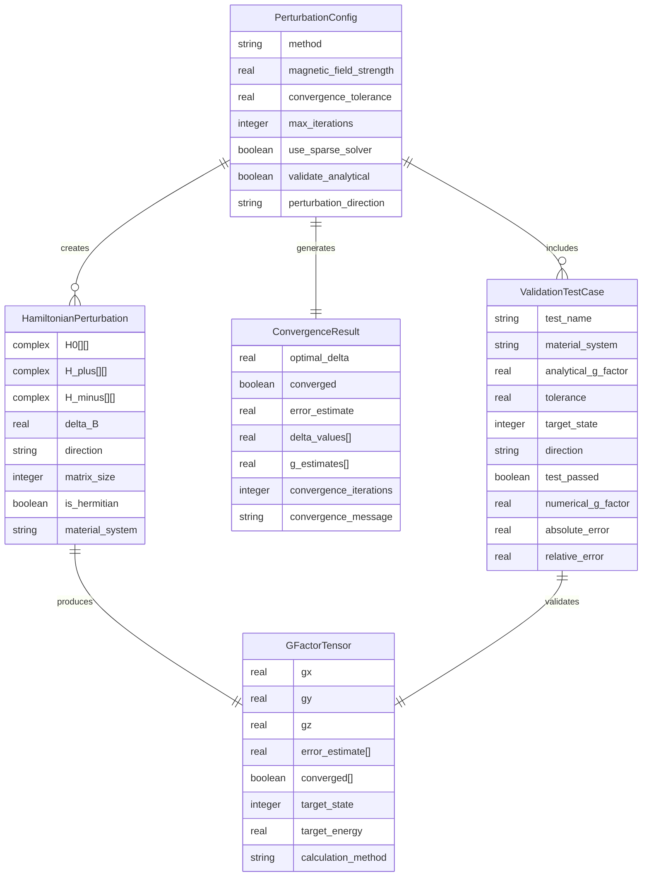

# Data Model: Generic Numerical Perturbation Method

**Date**: 2025-11-02
**Feature**: Generic Numerical Perturbation Method for G-Factor Calculations

## Core Entities

### 1. PerturbationConfig

Configuration object for numerical perturbation calculations.

```fortran
type :: PerturbationConfig
  character(len=32) :: method = 'central_difference'  ! Numerical method
  real(kind=dp) :: magnetic_field_strength = 0.1_dp   ! Base magnetic field (Tesla)
  real(kind=dp) :: convergence_tolerance = 1e-12_dp   ! Convergence criteria
  integer :: max_iterations = 10                       ! Maximum refinement iterations
  logical :: use_sparse_solver = .true.                ! Use ARPACK for large problems
  logical :: validate_analytical = .true.              ! Compare with analytical formulas
  character(len=1) :: perturbation_direction = 'z'     ! x, y, or z
end type
```

**Validation Rules:**
- `magnetic_field_strength` must be between 0.001 and 10.0 Tesla
- `convergence_tolerance` must be between 1e-15 and 1e-6
- `max_iterations` must be between 1 and 100

### 2. GFactorTensor

Result object containing the complete g-tensor for a state.

```fortran
type :: GFactorTensor
  real(kind=dp) :: gx                             ! g-factor in x-direction
  real(kind=dp) :: gy                             ! g-factor in y-direction
  real(kind=dp) :: gz                             ! g-factor in z-direction
  real(kind=dp) :: error_estimate(3)              ! Numerical error bounds
  logical :: converged(3)                         ! Convergence status for each component
  integer :: target_state                         ! Eigenstate index
  real(kind=dp) :: target_energy                  ! Energy of target state (eV)
  character(len=32) :: calculation_method         ! Method used
end type
```

**State Transitions:**
- Initial state: All components set to 0.0, converged = .false.
- Calculation state: Components populated, convergence determined
- Final state: Error bounds calculated, validation performed

### 3. HamiltonianPerturbation

Represents a perturbed Hamiltonian matrix with metadata.

```fortran
type :: HamiltonianPerturbation
  complex(kind=dp), allocatable :: H0(:,:)         ! Base Hamiltonian (B=0)
  complex(kind=dp), allocatable :: H_plus(:,:)     ! Hamiltonian with +δB
  complex(kind=dp), allocatable :: H_minus(:,:)    ! Hamiltonian with -δB
  real(kind=dp) :: delta_B                        ! Perturbation strength
  character(len=1) :: direction                    ! x, y, or z
  integer :: matrix_size                          ! N×N matrix dimension
  logical :: is_hermitian                         ! Hermitian property
  character(len=64) :: material_system             ! Material description
end type
```

**Relationships:**
- Created by `HamiltonianBuilder` from material parameters
- Used by `NumericalPerturbationEngine` for g-factor calculation
- Validated by `ValidationFramework`

### 4. ConvergenceResult

Result of adaptive step size convergence testing.

```fortran
type :: ConvergenceResult
  real(kind=dp) :: optimal_delta                   ! Optimal perturbation step
  logical :: converged                             ! Overall convergence status
  real(kind=dp) :: error_estimate                  ! Richardson extrapolation error
  real(kind=dp) :: delta_values(4)                 ! Tested step sizes
  real(kind=dp) :: g_estimates(4)                  ! Corresponding g-factor estimates
  integer :: convergence_iterations                ! Number of refinement steps
  character(len=128) :: convergence_message        ! Status message
end type
```

**Validation Rules:**
- `optimal_delta` must be positive and within reasonable bounds (1e-6 to 1e-2 Tesla)
- `error_estimate` must be less than specified tolerance for convergence

### 5. ValidationTestCase

Test case for validation against analytical solutions.

```fortran
type :: ValidationTestCase
  character(len=64) :: test_name                    ! Descriptive name
  character(len=32) :: material_system             ! e.g., "GaAs_bulk", "InAs_qw"
  real(kind=dp) :: analytical_g_factor             ! Known analytical value
  real(kind=dp) :: tolerance                       ! Acceptable deviation
  integer :: target_state                          ! State to test
  character(len=1) :: direction                    ! Direction to test
  logical :: test_passed                           ! Test result
  real(kind=dp) :: numerical_g_factor              ! Computed value
  real(kind=dp) :: absolute_error                  ! Difference from analytical
  real(kind=dp) :: relative_error                  ! Percentage error
end type
```

## Entity Relationships



## Data Flow Architecture

### 1. Input Processing
```
Material Parameters → PerturbationConfig → HamiltonianBuilder
```

### 2. Core Calculation
```
HamiltonianBuilder → HamiltonianPerturbation → NumericalPerturbationEngine → GFactorTensor
```

### 3. Convergence Testing
```
PerturbationConfig → ConvergenceResult → (feedback loop) → PerturbationConfig
```

### 4. Validation
```
ValidationTestCase → GFactorTensor → ValidationFramework → ValidationResults
```

## State Management

### Global State
- **Material Database**: Persistent material parameters (read-only)
- **Convergence Cache**: Cached convergence results for similar configurations
- **Validation Registry**: Registry of analytical validation cases

### Session State
- **Active Configuration**: Current perturbation calculation settings
- **Intermediate Results**: Temporary matrices during calculation
- **Performance Metrics**: Timing and memory usage statistics

### Persistent State
- **Calculation History**: Log of previous calculations for reproducibility
- **Validation Results**: History of validation test runs
- **Performance Benchmarks**: Historical performance data

## Data Integrity Constraints

### Type Safety
- All physical quantities use `real(kind=dp)` for double precision
- Complex numbers use `complex(kind=dp)` for Hamiltonian matrices
- Index values use `integer` with bounds checking

### Physical Constraints
- Magnetic field strengths must be physically realistic (0.001T to 10T)
- G-factor values must be within reasonable physical ranges (-50 to +50)
- Energy values must be positive for bound states

### Numerical Constraints
- Matrix sizes must be positive and consistent with band configuration
- Convergence tolerances must be appropriate for double precision
- Step sizes must avoid numerical underflow/overflow

## Error Handling Strategy

### Validation Errors
- Invalid configuration parameters → descriptive error messages
- Out-of-range physical values → automatic correction or abort
- Inconsistent matrix dimensions → runtime error with context

### Numerical Errors
- Non-convergent calculations → automatic step size adjustment
- Singular matrices → fallback to alternative methods
- Memory allocation failures → graceful degradation

### Integration Errors
- Missing dependencies → clear error messages with installation guidance
- Incompatible data formats → automatic conversion or rejection
- Version mismatches → compatibility checking and warnings

## Performance Considerations

### Memory Management
- Sparse matrix storage for large problems (>500×500)
- Workspace pre-allocation for repeated calculations
- Automatic garbage collection for temporary matrices

### Computational Optimization
- Parallel eigenvalue solving for multiple perturbations
- Vectorized matrix operations for finite differences
- Cached intermediate results for repeated calculations

### I/O Optimization
- Binary file formats for large matrices
- Compressed storage for validation test cases
- Streaming output for long-running calculations

## Extension Points

### New Numerical Methods
- Interface for adding alternative differentiation schemes
- Pluggable eigenvalue solvers (different ARPACK modes)
- Custom convergence criteria implementations

### Additional Validation Cases
- Framework for adding new material systems
- Support for user-defined analytical comparisons
- Integration with external validation databases

### Performance Extensions
- GPU acceleration interfaces
- Distributed computing support
- Adaptive precision schemes